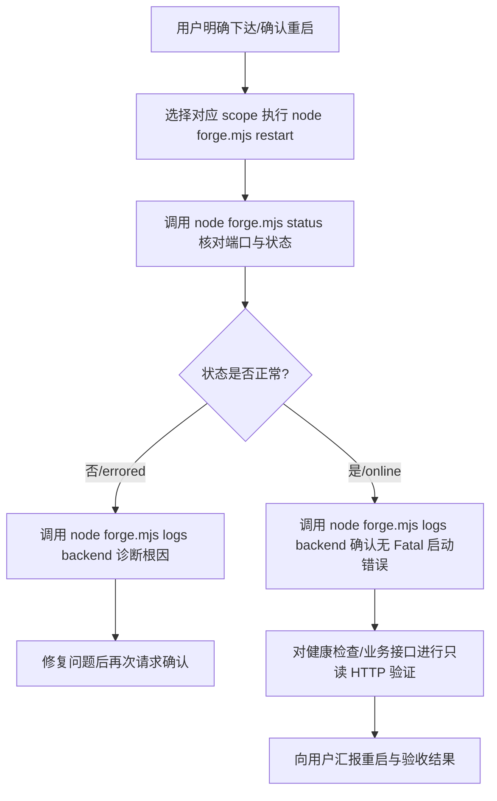

# Forge 运行时管控规范 (forge-runtime)

本规范定义了 `kai-toolbox` 项目中服务启动、停止、重启、状态查看及故障排查的标准边界与操作协议。所有 Agent（Codex、Claude Code、Antigravity 等）在涉及服务起停与运行时排查时，必须严格遵守本技能指导。

---

## 1. 致命红线（严禁自制与私自重启）

<HARD-GATE>
1. **服务重启必须经用户明确确认**：
   - 严禁以“开发完成”、“修复问题”或“执行验收”为由自行重启服务。
   - 每次重启前必须向用户说明：**目标服务范围**、**重启原因**与**预期影响**，并等待用户明确批准（用户明确输入指令如“帮我重启后端”除外）。
2. **严禁自制起停逻辑与暴力杀进程**：
   - **禁止**调用系统原生命令（如 Windows `taskkill`、Linux/macOS `kill`/`pkill`）按 PID 或端口强杀进程，这会破坏 PM2 守护状态并引发不可预期的级联失败或僵尸进程。
   - **禁止**自行在后台或终端执行 `mvn spring-boot:run`、`npm run dev` 或 `java -jar` 抢占已有受管端口。
   - **禁止**生成临时的起停脚本（如 `restart.bat`、`restart.ps1`、`start.sh` 等）。
3. **唯一受管入口**：
   - 本项目运行时栈受 PM2 守护管理，所有启动、停止、重启、状态查询与日志查看**必须且只能使用根目录的统一入口脚本：`node forge.mjs`**。
</HARD-GATE>

---

## 2. 命令矩阵与作用域

所有命令均在项目根目录下执行：

| 操作目标 | 标准命令 | 说明 |
| --- | --- | --- |
| **完整启动** | `node forge.mjs start` | 自动准备依赖、编译并拉起前后端与启用服务，等待 HTTP 就绪 |
| **完整停止** | `node forge.mjs stop` | 优雅停止所有 PM2 受管进程 |
| **完整重启** | `node forge.mjs restart` | 重启后端及所有启用的辅助服务 |
| **仅重启后端** | `node forge.mjs restart --scope backend` | 只重启 Spring Boot 后端及辅助服务，保留前端运行 |
| **仅重启前端** | `node forge.mjs restart --scope frontend` | 只重启 Vite 前端，保留后端运行 |
| **查看运行状态** | `node forge.mjs status` | 检查各服务 PID、真实监听端口、运行状态（online/errored） |
| **排查后端日志** | `node forge.mjs logs backend` | 查看后端最近输出日志，排查启动或运行期异常 |
| **排查控制器日志** | `node forge.mjs logs` | 查看 Forge 运行时控制器日志 |
| **环境体检** | `node forge.mjs doctor` | 检查 Node.js、JDK、Maven、Python 等本地依赖环境 |

---

## 3. 标准重启执行工作流

当用户明确要求重启，或用户已明确批准重启时，AI 必须按以下标准闭环推进：



### 步骤 1：执行正规命令
根据改动影响面选择合适的作用域：
- 仅修改了 Java 后端代码或配置：`node forge.mjs restart --scope backend`
- 仅修改了前端：通常 Vite 具备热更新；若配置发生变化需重启：`node forge.mjs restart --scope frontend`
- 涉及跨端依赖或环境变量配置变更：`node forge.mjs restart`

### 步骤 2：状态与端口核验
重启命令完成后，立即执行：
```shell
node forge.mjs status
```
- 核对目标进程的 PID 是否已刷新，状态是否为 `online`。
- 确认目标端口处于有效监听状态（默认后端 `http://localhost:18080`，前端 `https://localhost:5173`，控制器 `http://127.0.0.1:18081`）。

### 步骤 3：启动日志检查
绝不能仅凭“命令返回 0”或“PM2 显示 online”判定启动成功（可能存在 Spring 容器启动失败但进程未彻底退出的假死现象）：
```shell
node forge.mjs logs backend
```
- 确认当次启动输出包含 `Started ... in ... seconds`。
- 确认没有未捕获的 Fatal 启动异常（如数据库连接失败、端口冲突、Bean 初始化异常）。

### 步骤 4：只读接口冒烟
通过轻量 HTTP 探测确认服务业务响应正常：
- 后端基础接口：`GET http://localhost:18080/api/tools`
- 若响应 200 且返回有效 JSON，确认服务已健康上线。

---

## 4. 故障与排查指引

1. **端口冲突问题**：
   - 若报端口被占用，先执行 `node forge.mjs status` 查看是否已有同名受管进程；
   - 如需重置，使用正规的 `node forge.mjs stop` 后再 `node forge.mjs start`；
   - 严禁使用系统命令盲杀进程。
2. **启动超时（Startup Timeout）**：
   - 首次启动或依赖构建耗时较长时，可通过环境变量调整超时：`FORGE_START_TIMEOUT_SECONDS=900 node forge.mjs start`。
3. **PM2 连续快速失败（errored 状态）**：
   - 连续快速失败达 5 次后 PM2 会将进程标记为 `errored` 并停止自动重启。
   - 此时执行 `node forge.mjs logs backend` 定位真实报错根因，修复代码或配置后，再次执行 `node forge.mjs restart` 恢复。
