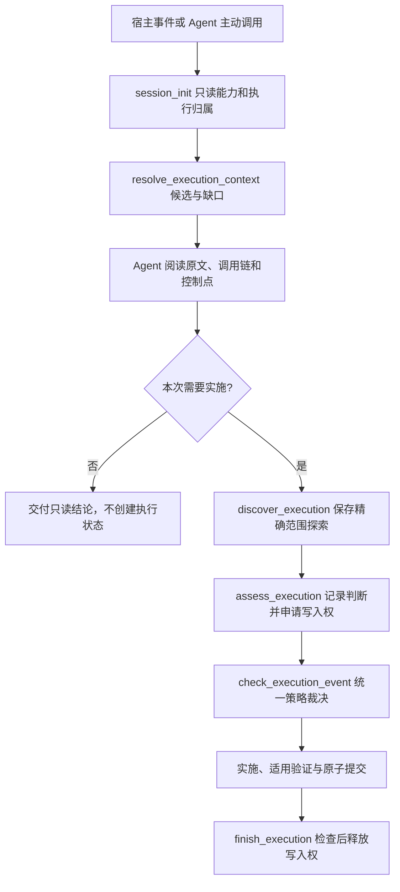
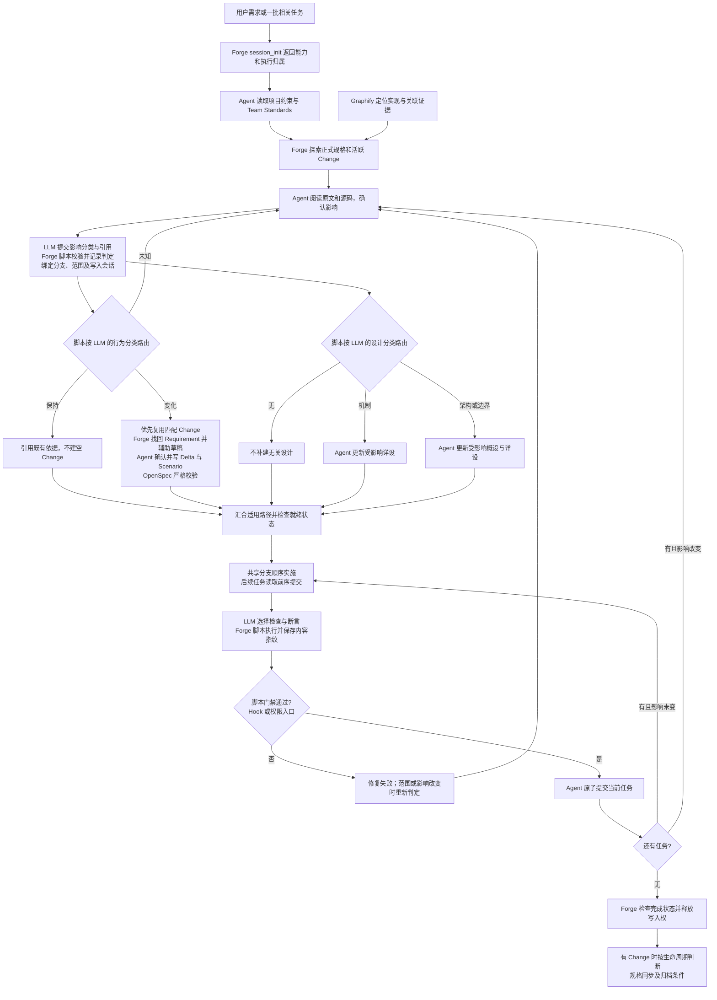
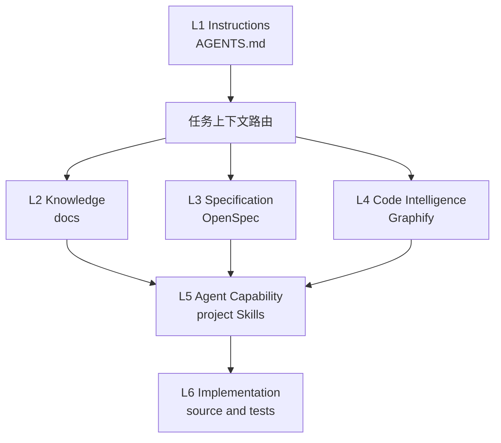
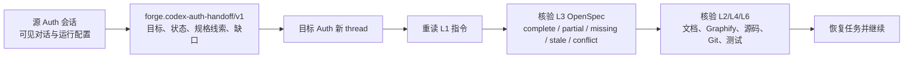
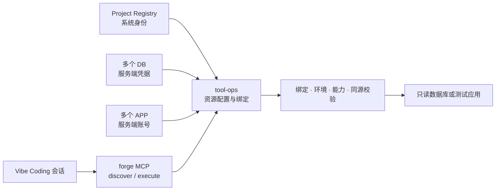

# AI 编程架构套件与协作流程

本文是 Forge、Team Standards、OpenSpec、Graphify 与 Agent 的整体协作架构说明，维护当前流程、职责和边界，也定义工程上下文的六层模型。“架构套件”指这些组件的协作体系，不是另建一个插件或复制各组件的实现文档。

产品与交互决策遵循 [产品哲学](product-philosophy.md)。具体行为以 OpenSpec 为准，调用参数和实现细节回到组件文档；本文维护整体关系，不替代它们。

## 维护契约

**改变架构套件的协作契约，必须在同次作业中更新本文；不改变契约，不为凑流程修改本文。** 责任归本次实施 Agent 和变更负责人，不等待用户再次要求更新说明。

以下任一变化触发同步，不以行数、文件数或版本号判断：

- 组件增删、职责转移、权威事实来源或上下文/证据传递方式改变。
- OpenSpec 创建、复用、更新、校验、同步、归档规则改变，或概设/详设触发与维护规则改变。
- Change、Execution、Task、Branch、Commit 的关系或并发、授权、恢复策略改变。
- MCP/Hook 的关键准入、失败处理、验证证据或交付门禁改变。
- 宿主支持范围、部署方式或实际能力边界改变，使现有流程描述不再准确。

普通 Bug 修复、局部样式/措辞调整、保持契约的内部重构，以及不改变套件协作方式的业务模块迭代，不触发本文更新；在现有任务或提交正文说明无架构影响即可，不新增报告。

实施前阅读本文并定位受影响章节；实施期间更新实际职责、分支条件、异常恢复和流程连线；交付前对照代码与验证证据核对正文、流程图、链接和状态。本文只更新受影响部分，不能只刷新日期、堆叠历史日志或生成 v2/v3 副本。行为规格和设计是否更新仍独立按影响判断，不因维护本文而自动生成全套工件。

跨仓变更分别更新实际组件规则/实现与 Forge 的本文，并关联各仓提交。若关联仓库不可访问或运行验收未完成，明确具体缺口，不把待办写成已实现能力。本文记录当前约定和能力边界，精确测试与部署证据保留在对应 Change/验证记录；原有重启、发布授权边界不变。

这是 Agent 的交付约定；当前没有新增能够自动证明文档语义同步的 CI 检查器。

## 四层工程职责与维护入口

Constitution 管 Agent 如何思考；Skill 管任务如何操作；Forge 管上下文候选、状态、策略和确定性约束；Hook/MCP 连接具体宿主。全局认知原则保持简短，仓库入口仍保留项目命令和约束。Agent 提交语义判断与证据，Forge 不把结构检查当成业务理解或人工批准。

| 层 | 维护内容 | 不承担的内容 |
|---|---|---|
| Constitution | 足够上下文、事实与推断、最小范围、停止探索 | 项目构建命令、OpenSpec 编排、分支与 SQL 策略 |
| Skills | 调查、定位、设计写作、实施和验证方法 | Forge 状态文件、重复策略求值、任务分配器 |
| Forge execution | 会话投影、候选上下文、写入权、分支和验证策略、生命周期决策 | 自动证明控制点正确或业务语义已批准 |
| Hook / MCP | 身份与事件适配、调用、响应校验与宿主阻断格式 | 新增独立治理状态或复制策略算法 |

现有执行核心从 `sidecar/claude-agent/src/specResolution/` 分离至 `execution/`，保持同一进程和部署单元。`execution/contracts.ts` 定义输入，`context.ts` 聚合规格/Graphify 候选，`session.ts` 提供只读能力与执行投影，`policy.ts` 集中影响映射与分支规则，`service.ts` 管绑定和完成，`lifecycle.ts` 是宿主统一裁决入口，`verification.ts` 运行验证，`guard.ts` 适配原生权限。旧 execution 导入文件仅重导出，旧工具名及 `.forge/spec-resolution` 状态继续兼容。

`specResolution/` 继续负责 Requirement 索引、召回、解析确认和 Delta 校验，execution 单向消费该能力。Graphify、OpenSpec 和领域知识保留事实所有权；本轮没有重建图谱或新增任务数据库。`tools.ts` 在注册边界组合两类工具，CLI/SDK/stdio 共用定义。

### 启动、上下文与实施许可



Agent 判断路径、控制点、修改位置和关键未知是否清楚；Forge 另行检查执行范围、分支、写入权和证据，两者不能合并成一个自报 READY。只读查询允许 detached HEAD，不创建 Change、绑定或写入锁。`taskId` 仅作为已有任务的引用，不新建平行 task 清单；OpenSpec/宿主原有任务顺序和生命周期保持权威。当前仍保守串行，没有自动依赖调度、跨会话接管或额外分支分配器。

Session 返回配置、可调用性、授权和宿主覆盖的独立字段；未探测的 OpenSpec CLI 与图谱可用性返回 null，图谱新鲜度由具体查询核验。`BOUND` 不是验证通过，`CURRENT` 仅表示验证输入未变。`HOST_DEPENDENT` 明确表示没有由该查询证明宿主已执行强制检查。

### 适配与迁移边界

Forge 安装器的 runtime protocol v2 由插件 `hooks/forge/client.js` 消费；`SessionStart` 调用 `session_init`，写前/提交前/Stop 由 `check_execution_event` 返回 `allowed/code/enforcement/legacyGovernanceRequired`。Stop 只检查，不结束任务。v2 Hook 不读取 Forge 私有执行 JSON；原生权限适配也调用同一裁决入口。v1 私有文件读取集中保留在 `hooks/forge/legacy-v1.js`，仅支持历史运行时，不扩建策略。

绑定执行的拒绝始终 block；未绑定旧规格流程保留 warn/block 配置。v2 连接失败时绑定未知，默认失败关闭；显式 failure=warn 或 off 不提供故障阻断保证。协议不匹配要求升级，不静默选择另一套治理。Delta 执行暂时继续要求旧设计/审阅证据检查，这属于兼容验证，尚未迁移为 Forge 原生设计内容检查器。历史绑定与 PASS 不自动升级。

以上描述源码协议；插件安装、新会话加载、宿主事件触发和运行服务更新分别验收。无 SessionStart 接线时通过 Agent 主动调用启动入口。任意 Shell 副作用仍需要宿主权限/沙箱覆盖。本轮不新增夜间整合、默认 block 或自动重启。

## 组件职责与权威位置

| 组件 | 职责 | 权威内容与边界 |
|---|---|---|
| Team Standards | 指导影响判定、规格与设计写作、验证和原子提交；提供薄 Hook | 通用方法归套件 Skill；不复制 Forge 检索和门禁算法 |
| Forge | 检索既有规格，记录具名判定，绑定执行范围与分支，运行验证并检查证据 | 具体协议见[执行与规格解析模块](../sidecar/claude-agent/src/specResolution/README.md)；不以机器 PASS 代替业务审阅 |
| OpenSpec | 保存正式行为规格及活动变更，校验、同步和归档 | `openspec/specs` 是已接受行为；活动 Change 保存目标增量 |
| Graphify | 快速定位实现、调用和关联证据，报告新鲜度 | 代码事实不是业务批准，未命中不等于不存在既有能力 |
| Agent | 阅读原文、理解业务、审阅映射，编写规格/设计、实施和提交 | 具名 Agent 判断不能冒充人工批准；实质业务歧义需要解决 |

## LLM、脚本与人工的判定边界

**LLM 负责理解语义并提出具名判断，脚本负责按固定规则执行、核验证据和阻断，人工负责业务歧义与明确要求的授权。** “Forge 判定”不是每一步都调用模型：Forge 同时包含确定性执行器和可选的模型辅助解析。下文“脚本”也包括 MCP 服务代码、Hook、CLI 和测试程序。

LLM 分为两处：宿主 Agent 阅读 Team Standards 后理解需求、审阅源码并写文档；Forge 解析模型辅助拆分需求与映射候选规格。后者的模型输出仍需结构与引用检查，不能代替宿主 Agent 审阅，也不能冒充人工批准。Team Standards 的 Skill 是给 Agent 的方法指导，只有接入的 Hook 才执行程序检查。

| 环节 | LLM 判断或产出 | 脚本判定或执行 | 仍需注意的边界 |
|---|---|---|---|
| 探索既有规格与 Change | Agent 提供检索词、范围，阅读候选并判断是否匹配 | `discover_execution` 索引正式规格、列出活跃 Change、召回候选并保存摘要 | 没有命中不能证明需要新建能力；匹配 Change 由 Agent 审阅 |
| Graphify 探索 | Agent 解释调用关系与业务含义；图谱语义提取在启用时使用 LLM | AST 提取、图遍历、关联召回和选中来源哈希检查由程序执行 | Graphify 不是全部由 LLM 生成；来源新鲜不证明全图完整或业务正确 |
| 需求拆分与规格映射 | 解析模型辅助拆分、分类、推荐目标或草稿；Agent 最终确认 | 校验结构化结果、逐字引用与目标，保存 `confirm_spec_resolution` 记录 | 自动草稿和模型置信度均不是业务批准；模型失败保留候选与告警 |
| 是否更新 OpenSpec | Agent 判定 `behavior` 为 `preserved / changed / unknown` 并给出依据 | `assess_execution` 固定映射为 `NO_SPEC_CHANGE / DELTA_REQUIRED / NEEDS_EVIDENCE`；未知则阻断 | 脚本不独立推断业务是否变化；引用存在不证明推理成立 |
| 是否更新概设、详设 | Agent 判定 `design` 为 `none / detail / architecture`，选择受影响文件 | `detail` 要求绑定详设；`architecture` 要求绑定概设与详设；提交前检查适用文件更新 | 文件变化不证明设计质量；大改动不等于无条件补全全部文档 |
| 验证范围 | Agent 判断影响类别，选择有实际断言的测试及输入文件 | 固定推导必需类别：始终有回归；API/权限加 API，SQL/迁移加 SQL，UI 加 UI，行为变化加规格，设计变化加设计 | 类别来自 Agent 输入；误判或漏报影响，脚本不保证自动发现 |
| 分支与任务顺序 | Agent 理解任务依赖、拆分原子任务；额外分支由宿主明确分配 | 绑定当前分支、限制单写入会话，已接入入口阻断违规分支操作 | 当前没有自动依赖调度或并行分支分配器；不覆盖任意 Shell 绕行 |
| 陈旧写入权恢复 | Agent 不判断其它会话是否存活，也不删除状态文件 | Forge 仅在同分支、验证当前且通过、已有提交、执行与 Change 范围干净时原子回收并保留审计 | 超时、会话不可见或进程消失不构成接管证据；无法证明完成时继续阻断 |
| 编写规格与设计 | Agent 按 Skill 编写、审阅 Requirement、Scenario、概设和详设 | OpenSpec 严格校验结构；Forge 检查确认记录、Delta 绑定与版本 | 格式合法不证明需求完整，需处理真实业务歧义 |
| 测试与提交门禁 | Agent 编写测试断言、解释失败并修复，审阅提交原子性 | 真正运行测试命令，检查退出状态、必需类别、内容指纹、范围及暂存一致性 | PASS 只覆盖实际执行的检查；程序退出成功不证明断言充分或已部署新版 |
| 结束与归档 | Agent 判断交付范围和生命周期条件，按授权调用工具 | `finish_execution` 检查提交与范围状态并释放写入权；OpenSpec 工具执行同步/归档 | `finish_execution` 不自动提交或归档，也不代表人工验收 |
| 架构说明同步 | Agent 判断本次是否改变协作契约，并更新受影响正文与图 | 可检查链接、Markdown 和 Mermaid 语法 | 当前没有自动证明架构说明语义同步的 CI |

业务意图不清、规格与实际业务冲突时由用户或业务负责人澄清；项目要求的重启、发布等授权按适用规则取得。普通分类无需逐次人工审批。记录中的 `AGENT_REVIEWED` 明确表示 Agent 审阅，不能解读为 `HUMAN_APPROVED`。

例如“修复搜索条件”：LLM 对照既有 Scenario 判断是否恢复原行为；若提交 `preserved + none + api`，脚本就不要求 Delta 或设计更新，但要求回归与 API 检查。若实际新增了搜索语义却被误判为 `preserved`，脚本不会仅凭该标签纠正业务判断，仍依赖原文审阅和有效测试。

## 从需求到交付

图中关键判断标明执行主体：LLM 提交语义分类，脚本依据分类路由并执行门禁；混合节点的具体职责见上表。



规格和设计是独立判定路径，汇合表示核对全部适用结果，不表示两份文档必须同时生成，也不表示自动并行写入。Team Standards 指导 Agent 写正文；Forge 校验身份、范围、版本、文件更新和执行证据，不能自动证明正文质量。完整模板与方法留在套件，本文不复制模板。

| 情况 | 规格 | 概设/详设 |
|---|---|---|
| 修复搜索条件，使其恢复已约定行为 | 引用原规则，通常无需 Delta | 机制未变则无需更新 |
| 增加淘汰状态或改变权限规则 | 更新既有能力的相关 Requirement/Scenario | 只更新受影响流程、状态与实现章节 |
| 外部行为不变的内部架构重构 | 有行为保持证据时可以无需 Delta | 更新受影响架构与机制 |

默认执行器保守串行，不自动生成并行分支或推断完整任务依赖。绑定 execution 后，已接入的入口阻断不就绪操作；未绑定的旧规格流程保留兼容模式。Hook 和权限回调仅覆盖宿主实际触发的工具，不能视为任意 Shell 的安全沙箱。代码实现、插件安装、宿主触发与运行版本验收分别成立；具体未完成项见[当前变更任务](../openspec/changes/resolve-existing-specs/tasks.md)，归档时同步这里的证据链接。

## 目录速览

```text
kai-toolbox/
├── AGENTS.md                     项目规则与上下文总入口
├── CLAUDE.md                     Claude 适配器
├── docs/                         人工维护的长期知识
│   ├── README.md                 面向人的阅读入口
│   ├── INDEX.md                  面向 Agent 的权威文档索引
│   └── ai-coding-architecture.md 本规范
├── openspec/                     已接受行为与活动变更
│   ├── AGENTS.md                 OpenSpec 局部规则
│   └── config.yaml               项目上下文与 artifact 规则
├── graphify-out/                 Graphify 生成的当前代码事实
├── .codex/skills/                项目特有能力 按需创建
└── source and tests              最终实现与验证证据
```

不提前创建空的项目 Skill、领域、设计、决策或规格目录。`graphify-out/` 由 Graphify 生成，不由初始化脚本伪造。

---

## 六层职责模型

| 层级 | 权威内容 | 典型落位 | 回答的问题 |
|---|---|---|---|
| L1 Instructions | 强制规则与任务路由 | `AGENTS.md`、适配器 | Agent 必须遵守什么 |
| L2 Knowledge | 人工确认的知识与理由 | `docs/` | 为什么这样设计 |
| L3 Specification | 已接受行为与计划变更 | OpenSpec | 系统应该怎样工作或变化 |
| L4 Code Intelligence | 当前模块、调用、依赖与影响 | Graphify | 代码现在怎样连接 |
| L5 Agent Capability | 可复用执行方法 | 项目内 Skills 和脚本 | Agent 怎样完成任务 |
| L6 Implementation | 源码、测试与运行配置 | 项目工程目录 | 精确实现是什么 |



---

## 默认检索路由

1. 先读根或最近作用域的 `AGENTS.md`。
2. 架构原因、术语、开发约定和 ADR 经 `docs/INDEX.md` 定位。
3. 当前接受行为和活动变更分别查询 `openspec/specs/` 与 `openspec/changes/`。
4. 陌生代码入口、调用链和影响范围先查询新鲜 Graphify。
5. 最后只读取任务相关源码、测试、DDL、数据库或运行证据。

不得把宽泛全仓扫描作为陌生项目的默认第一步。Graphify 查询只用于缩小范围，编辑前仍须核对目标源码。

### 跨 Auth 会话交接

Codex Auth 目录切换会创建目标 Auth 下的新 thread，不把源 Auth 的原生 thread、隐藏模型状态或工具状态视为可迁移资产。Forge 使用版本化结构交接包承接连续性，交接包只陈述来源明确的事实，并保留有界可见对话作为兜底。



交接遵循以下边界：

- OpenSpec 是行为权威，但“存在规格路径”不等于规格完整或已实现；交接时未知的完整度必须标为 `UNKNOWN`，仅从会话识别到路径时标为 `PARTIAL_UNVERIFIED`。
- 目标会话按默认检索路由重新读取同一工作目录，明确记录 `missing / partial / stale / conflict`，不得用旧会话摘要覆盖仓库和运行事实。
- 模型、Skills、Plugins、MCP 与账号权限属于目标 Auth 能力，必须重新加载；工作目录与 Forge 运行配置可以复制。
- 原生同 Auth `thread/fork` 与跨 Auth 结构交接是两种语义；跨 Auth 不声称复制 thread。即使后续使用 App Server 后台注入，仍须保留交接 schema、来源和核验状态。
- 同一逻辑会话链路以持久化 `lineage_id + auth_key` 作为幂等身份：目标 Auth 已有关联会话时直接恢复，仅首次进入该 Auth 时创建 thread 并注入交接包；关联会话确已删除或失效后才允许重建。

---

## 事实冲突处理

- 项目规则冲突时，以作用域最近且明确适用的 `AGENTS.md` 为准。
- OpenSpec 与代码不一致时，先确认 change 状态；不要自动把任一侧覆盖另一侧。
- Graphify 与源码不一致时，以当前源码为实现事实并刷新图谱。
- 文档业务语义与运行证据冲突时，记录候选差异并交由 owner 确认。
- OpenSpec、Graphify、测试和发布制品必须分别验证，不能相互代替。

---

## 目录落位规则

- 项目特有规则和能力归项目仓；团队通用规范只引用，不复制。
- 长期文档必须登记到 `docs/INDEX.md`，临时分析不自动升级为权威文档。
- OpenSpec 只承载可观察行为与变更，不复制代码结构报告。
- Graphify 产物保持可再生；共享文件与本地缓存边界由 `.gitignore` 明确。
- `.codex/skills/`、`.claude/` 和知识子目录只有在出现真实内容时才创建。

## Forge 系统资源工具

数据库连接和测试应用账号属于系统资源，不属于会话专属 Tool。`tool-ops` 持有多数据源、应用站点凭据和系统绑定；凭据仅在服务端执行时使用，目录、浏览器和模型只接收脱敏元信息。项目库系统身份仍由 Project Registry 提供，资源关系不复制系统或凭据。

普通开发会话只装配一个 `forge` MCP，并通过稳定的 `discover_resources`、`execute_resource` 动态发现和调用已绑定资源。新增系统、数据库或应用站点不增加 MCP 名称；服务端在每次执行时重新校验绑定、环境和能力。数据库只允许只读查询，应用调用只允许已配置同源的 LOCAL、DEV、TEST、UAT 目标并保留写操作审批语义。受限业务咨询仍使用自己的只读证据装配，不能借统一执行入口扩大权限。



旧 ERP/SRM/SCM 固定配置和桥接仅作为迁移兼容实现保留，不再默认进入普通开发会话；是否实际移除以对应 OpenSpec 变更和运行验收为准。

## Existing Spec Resolution

实施批次与 OpenSpec Change 分离：Forge execution 总是绑定项目、会话和分配分支，changeId 仅在行为变化时需要。先探索既有规格和 Graphify，再分别判定行为、设计层次及验证范围；风险不自动增加文档。相关任务顺序执行、原子提交，额外分支由宿主分配。执行记录、范围、分支和实际验证输入摘要复用规格解析模块，不增加平行项目配置。完整协议见 [模块说明](../sidecar/claude-agent/src/specResolution/README.md)。

Forge 开发 MCP 提供 Requirement 级召回、具名 Agent 决策、Delta 和新鲜度检查，SDK 与 stdio 共用实现。使用与限制见[解析服务](../sidecar/claude-agent/src/specResolution/README.md)。OpenSpec 仍为行为权威；Graphify VERIFIED_SOURCES 仅证明本次来源文件通过检查，不证明全图完整；readiness 不替代业务审阅或测试。

同一活跃 Change 支持多个按顺序确认的 resolution 批次；readiness 校验当前批次对应的 Delta 子集，而不是要求整个 Change 的历史 Delta 数量等于本批决策数。重复稳定 ID/标题和并行 Change 同目标仍阻断。证据文件必须是项目内不超过 4 MiB 的普通文件，拒绝时返回具体路径与原因，避免 Agent 在不清楚失败对象时重复调用。
