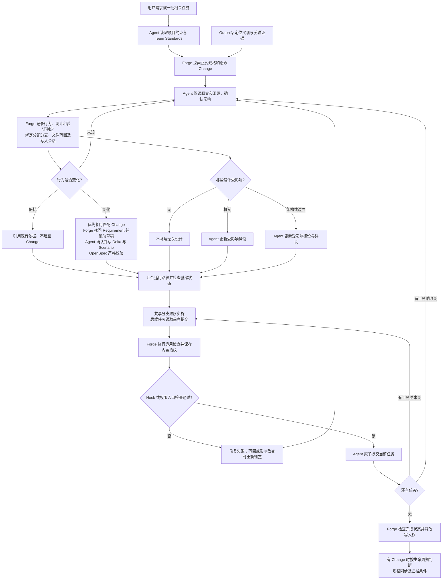
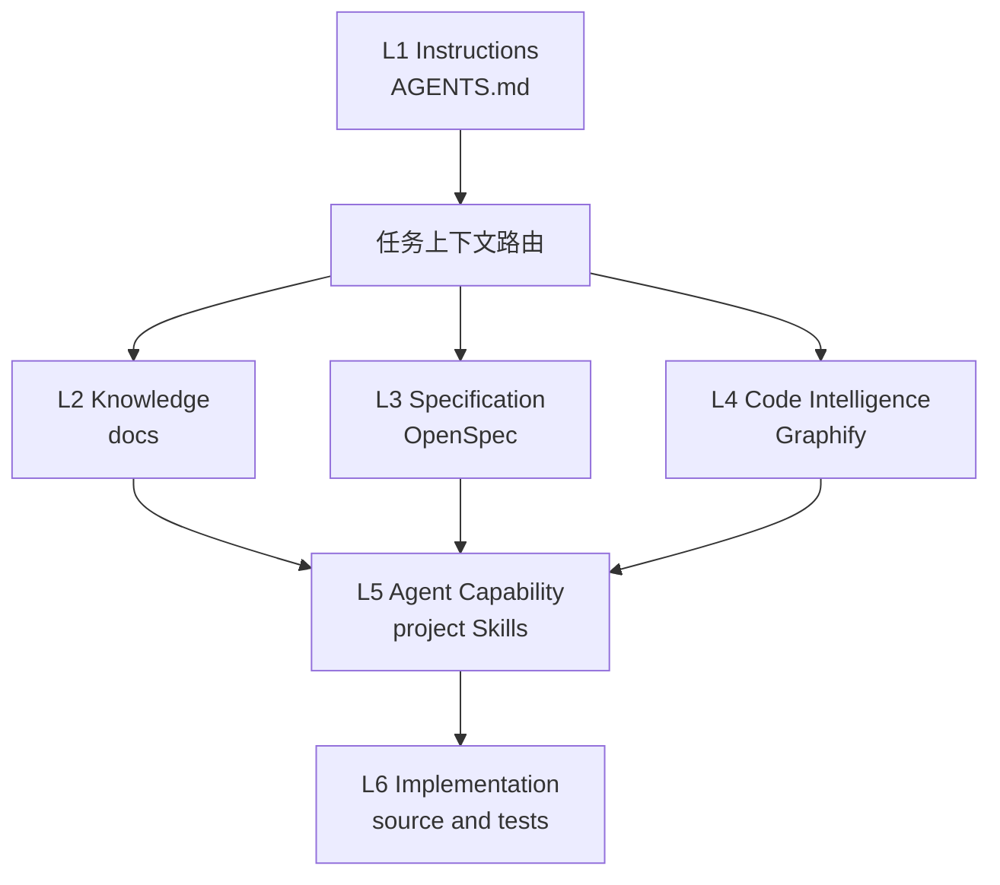

# AI 编程架构套件与协作流程

本文是 Forge、Team Standards、OpenSpec、Graphify 与 Agent 的整体协作架构说明，维护当前流程、职责和边界，也定义工程上下文的六层模型。“架构套件”指这些组件的协作体系，不是另建一个插件或复制各组件的实现文档。

产品与交互决策遵循 [产品哲学](product-philosophy.md)。具体行为以 OpenSpec 为准，调用参数和实现细节回到组件文档；本文维护整体关系，不替代它们。

## 维护契约

**改变架构套件的协作契约，必须在同次作业中更新本文；不改变契约，不为凑流程修改本文。** 责任归本次实施 Agent 和变更负责人，不等待用户再次要求更新说明。

以下任一变化触发同步，不以行数、文件数或版本号判断：

- 组件增删、职责转移、权威事实来源或上下文/证据传递方式改变。
- OpenSpec 创建、复用、更新、校验、同步、归档规则改变，或概设/详设触发与维护规则改变。
- Change、Execution、Task、Branch、Commit 的关系或并发、授权、恢复策略改变。
- MCP/Hook 的关键准入、失败处理、验证证据或交付门禁改变。
- 宿主支持范围、部署方式或实际能力边界改变，使现有流程描述不再准确。

普通 Bug 修复、局部样式/措辞调整、保持契约的内部重构，以及不改变套件协作方式的业务模块迭代，不触发本文更新；在现有任务或提交正文说明无架构影响即可，不新增报告。

实施前阅读本文并定位受影响章节；实施期间更新实际职责、分支条件、异常恢复和流程连线；交付前对照代码与验证证据核对正文、流程图、链接和状态。本文只更新受影响部分，不能只刷新日期、堆叠历史日志或生成 v2/v3 副本。行为规格和设计是否更新仍独立按影响判断，不因维护本文而自动生成全套工件。

跨仓变更分别更新实际组件规则/实现与 Forge 的本文，并关联各仓提交。若关联仓库不可访问或运行验收未完成，明确具体缺口，不把待办写成已实现能力。本文记录当前约定和能力边界，精确测试与部署证据保留在对应 Change/验证记录；原有重启、发布授权边界不变。

这是 Agent 的交付约定；当前没有新增能够自动证明文档语义同步的 CI 检查器。

## 组件职责与权威位置

| 组件 | 职责 | 权威内容与边界 |
|---|---|---|
| Team Standards | 指导影响判定、规格与设计写作、验证和原子提交；提供薄 Hook | 通用方法归套件 Skill；不复制 Forge 检索和门禁算法 |
| Forge | 检索既有规格，记录具名判定，绑定执行范围与分支，运行验证并检查证据 | 具体协议见[执行与规格解析模块](../sidecar/claude-agent/src/specResolution/README.md)；不以机器 PASS 代替业务审阅 |
| OpenSpec | 保存正式行为规格及活动变更，校验、同步和归档 | `openspec/specs` 是已接受行为；活动 Change 保存目标增量 |
| Graphify | 快速定位实现、调用和关联证据，报告新鲜度 | 代码事实不是业务批准，未命中不等于不存在既有能力 |
| Agent | 阅读原文、理解业务、审阅映射，编写规格/设计、实施和提交 | 具名 Agent 判断不能冒充人工批准；实质业务歧义需要解决 |

## 从需求到交付



规格和设计是独立判定路径，汇合表示核对全部适用结果，不表示两份文档必须同时生成，也不表示自动并行写入。Team Standards 指导 Agent 写正文；Forge 校验身份、范围、版本、文件更新和执行证据，不能自动证明正文质量。完整模板与方法留在套件，本文不复制模板。

| 情况 | 规格 | 概设/详设 |
|---|---|---|
| 修复搜索条件，使其恢复已约定行为 | 引用原规则，通常无需 Delta | 机制未变则无需更新 |
| 增加淘汰状态或改变权限规则 | 更新既有能力的相关 Requirement/Scenario | 只更新受影响流程、状态与实现章节 |
| 外部行为不变的内部架构重构 | 有行为保持证据时可以无需 Delta | 更新受影响架构与机制 |

默认执行器保守串行，不自动生成并行分支或推断完整任务依赖。绑定 execution 后，已接入的入口阻断不就绪操作；未绑定的旧规格流程保留兼容模式。Hook 和权限回调仅覆盖宿主实际触发的工具，不能视为任意 Shell 的安全沙箱。代码实现、插件安装、宿主触发与运行版本验收分别成立；具体未完成项见[当前变更任务](../openspec/changes/resolve-existing-specs/tasks.md)，归档时同步这里的证据链接。

## 目录速览

```text
kai-toolbox/
├── AGENTS.md                     项目规则与上下文总入口
├── CLAUDE.md                     Claude 适配器
├── docs/                         人工维护的长期知识
│   ├── README.md                 面向人的阅读入口
│   ├── INDEX.md                  面向 Agent 的权威文档索引
│   └── ai-coding-architecture.md 本规范
├── openspec/                     已接受行为与活动变更
│   ├── AGENTS.md                 OpenSpec 局部规则
│   └── config.yaml               项目上下文与 artifact 规则
├── graphify-out/                 Graphify 生成的当前代码事实
├── .codex/skills/                项目特有能力 按需创建
└── source and tests              最终实现与验证证据
```

不提前创建空的项目 Skill、领域、设计、决策或规格目录。`graphify-out/` 由 Graphify 生成，不由初始化脚本伪造。

---

## 六层职责模型

| 层级 | 权威内容 | 典型落位 | 回答的问题 |
|---|---|---|---|
| L1 Instructions | 强制规则与任务路由 | `AGENTS.md`、适配器 | Agent 必须遵守什么 |
| L2 Knowledge | 人工确认的知识与理由 | `docs/` | 为什么这样设计 |
| L3 Specification | 已接受行为与计划变更 | OpenSpec | 系统应该怎样工作或变化 |
| L4 Code Intelligence | 当前模块、调用、依赖与影响 | Graphify | 代码现在怎样连接 |
| L5 Agent Capability | 可复用执行方法 | 项目内 Skills 和脚本 | Agent 怎样完成任务 |
| L6 Implementation | 源码、测试与运行配置 | 项目工程目录 | 精确实现是什么 |



---

## 默认检索路由

1. 先读根或最近作用域的 `AGENTS.md`。
2. 架构原因、术语、开发约定和 ADR 经 `docs/INDEX.md` 定位。
3. 当前接受行为和活动变更分别查询 `openspec/specs/` 与 `openspec/changes/`。
4. 陌生代码入口、调用链和影响范围先查询新鲜 Graphify。
5. 最后只读取任务相关源码、测试、DDL、数据库或运行证据。

不得把宽泛全仓扫描作为陌生项目的默认第一步。Graphify 查询只用于缩小范围，编辑前仍须核对目标源码。

---

## 事实冲突处理

- 项目规则冲突时，以作用域最近且明确适用的 `AGENTS.md` 为准。
- OpenSpec 与代码不一致时，先确认 change 状态；不要自动把任一侧覆盖另一侧。
- Graphify 与源码不一致时，以当前源码为实现事实并刷新图谱。
- 文档业务语义与运行证据冲突时，记录候选差异并交由 owner 确认。
- OpenSpec、Graphify、测试和发布制品必须分别验证，不能相互代替。

---

## 目录落位规则

- 项目特有规则和能力归项目仓；团队通用规范只引用，不复制。
- 长期文档必须登记到 `docs/INDEX.md`，临时分析不自动升级为权威文档。
- OpenSpec 只承载可观察行为与变更，不复制代码结构报告。
- Graphify 产物保持可再生；共享文件与本地缓存边界由 `.gitignore` 明确。
- `.codex/skills/`、`.claude/` 和知识子目录只有在出现真实内容时才创建。

## Existing Spec Resolution

实施批次与 OpenSpec Change 分离：Forge execution 总是绑定项目、会话和分配分支，changeId 仅在行为变化时需要。先探索既有规格和 Graphify，再分别判定行为、设计层次及验证范围；风险不自动增加文档。相关任务顺序执行、原子提交，额外分支由宿主分配。执行记录、范围、分支和实际验证输入摘要复用规格解析模块，不增加平行项目配置。完整协议见 [模块说明](../sidecar/claude-agent/src/specResolution/README.md)。

Forge 开发 MCP 提供 Requirement 级召回、具名 Agent 决策、Delta 和新鲜度检查，SDK 与 stdio 共用实现。使用与限制见[解析服务](../sidecar/claude-agent/src/specResolution/README.md)。OpenSpec 仍为行为权威；Graphify VERIFIED_SOURCES 仅证明本次来源文件通过检查，不证明全图完整；readiness 不替代业务审阅或测试。
