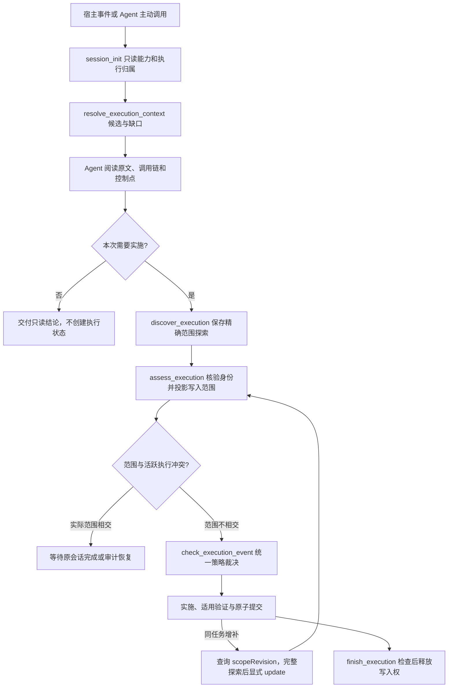
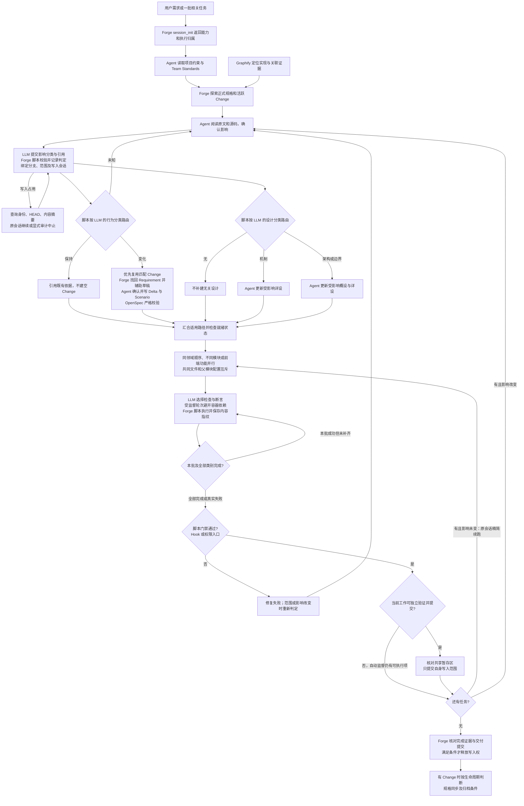
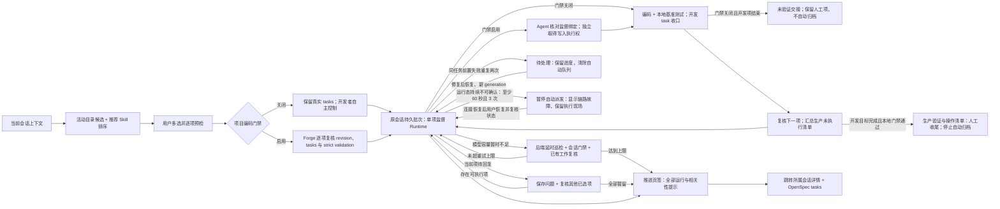
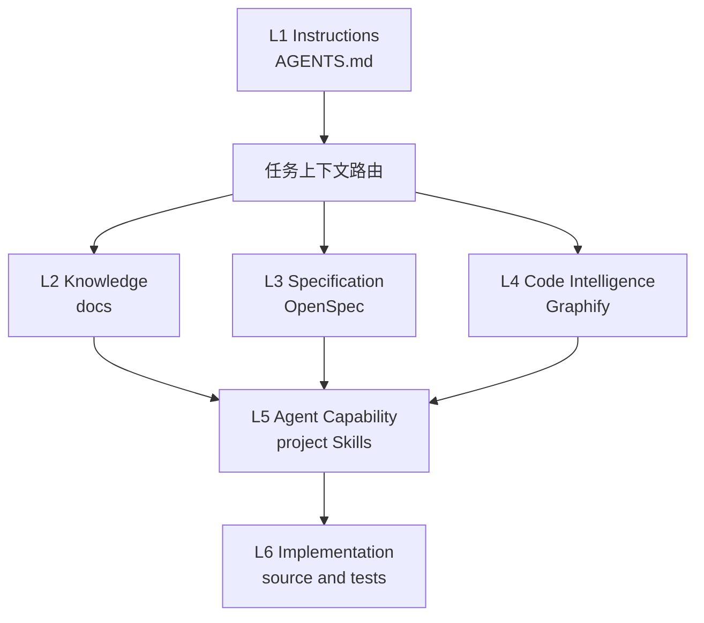
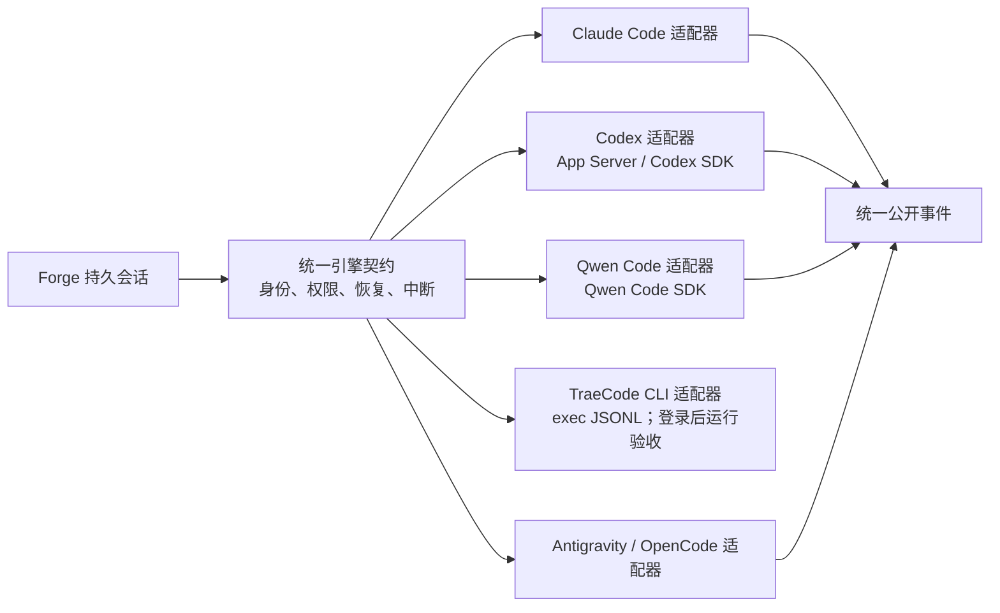
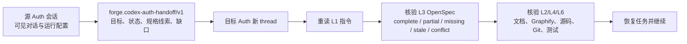
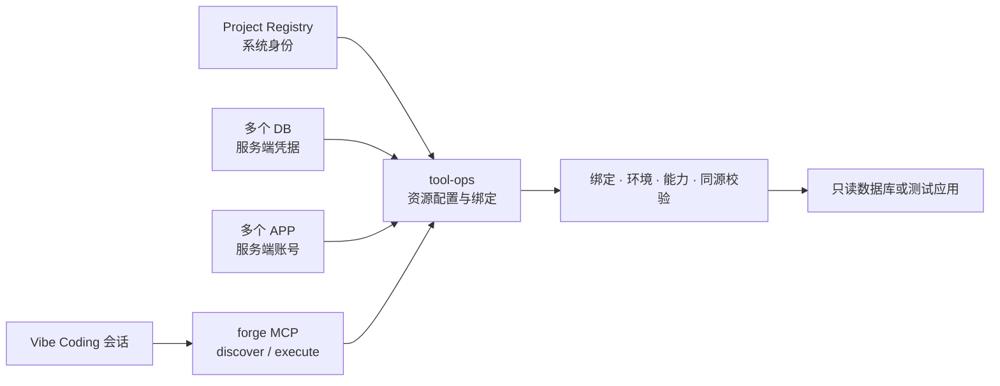
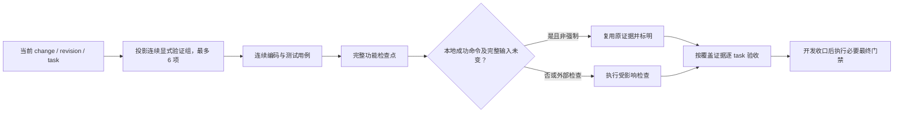

# AI 编程架构套件与协作流程

本文是 Forge、Team Standards、OpenSpec、Graphify 与 Agent 的整体协作架构说明，维护当前流程、职责和边界，也定义工程上下文的六层模型。“架构套件”指这些组件的协作体系，不是另建一个插件或复制各组件的实现文档。

产品与交互决策遵循 [产品哲学](product-philosophy.md)。具体行为以 OpenSpec 为准，调用参数和实现细节回到组件文档；本文维护整体关系，不替代它们。

## 维护契约

**改变架构套件的协作契约，必须在同次作业中更新本文；不改变契约，不为凑流程修改本文。** 责任归本次实施 Agent 和变更负责人，不等待用户再次要求更新说明。

以下任一变化触发同步，不以行数、文件数或版本号判断：

- 组件增删、职责转移、权威事实来源或上下文/证据传递方式改变。
- OpenSpec 创建、复用、更新、校验、同步、归档规则改变，或概设/详设触发与维护规则改变。
- Change、Execution、Task、Branch、Commit 的关系或并发、授权、恢复策略改变。
- MCP/Hook 的关键准入、失败处理、验证证据或交付门禁改变。
- 宿主支持范围、部署方式或实际能力边界改变，使现有流程描述不再准确。

普通 Bug 修复、局部样式/措辞调整、保持契约的内部重构，以及不改变套件协作方式的业务模块迭代，不触发本文更新；在现有任务或提交正文说明无架构影响即可，不新增报告。

实施前阅读本文并定位受影响章节；实施期间更新实际职责、分支条件、异常恢复和流程连线；交付前对照代码与验证证据核对正文、流程图、链接和状态。本文只更新受影响部分，不能只刷新日期、堆叠历史日志或生成 v2/v3 副本。行为规格和设计是否更新仍独立按影响判断，不因维护本文而自动生成全套工件。

跨仓变更分别更新实际组件规则/实现与 Forge 的本文，并关联各仓提交。若关联仓库不可访问或运行验收未完成，明确具体缺口，不把待办写成已实现能力。本文记录当前约定和能力边界，精确测试与部署证据保留在对应 Change/验证记录；原有重启、发布授权边界不变。

这是 Agent 的交付约定；当前没有新增能够自动证明文档语义同步的 CI 检查器。

## 四层工程职责与维护入口

Constitution 管 Agent 如何思考；Skill 管任务如何操作；Forge 管上下文候选、状态、策略和确定性约束；Hook/MCP 连接具体宿主。全局认知原则保持简短，仓库入口仍保留项目命令和约束。Agent 提交语义判断与证据，Forge 不把结构检查当成业务理解或人工批准。

| 层 | 维护内容 | 不承担的内容 |
|---|---|---|
| Constitution | 足够上下文、事实与推断、最小范围、停止探索 | 项目构建命令、OpenSpec 编排、分支与 SQL 策略 |
| Skills | 调查、定位、设计写作、实施和验证方法 | Forge 状态文件、重复策略求值、任务分配器 |
| Forge execution | 会话投影、候选上下文、写入权、分支和验证策略、生命周期决策 | 自动证明控制点正确或业务语义已批准 |
| Hook / MCP | 身份与事件适配、调用、响应校验与宿主阻断格式 | 新增独立治理状态或复制策略算法 |

现有执行核心从 `sidecar/claude-agent/src/specResolution/` 分离至 `execution/`，保持同一进程和部署单元。`execution/contracts.ts` 定义输入，`context.ts` 聚合规格/Graphify 候选，`session.ts` 提供只读能力与执行投影，`policy.ts` 集中影响映射与分支规则，`service.ts` 管绑定和完成，`lifecycle.ts` 是宿主统一裁决入口，`verification.ts` 运行验证，`guard.ts` 适配原生权限。旧 execution 导入文件仅重导出，旧工具名及 `.forge/spec-resolution` 状态继续兼容。

`specResolution/` 继续负责 Requirement 索引、召回、解析确认和 Delta 校验，execution 单向消费该能力。Graphify、OpenSpec 和领域知识保留事实所有权；本轮没有重建图谱或新增任务数据库。`tools.ts` 在注册边界组合两类工具，CLI/SDK/stdio 共用定义。

### 启动、上下文与实施许可


```mermaid
flowchart TD
    HOST["宿主事件或 Agent 主动调用"] --> INIT["session_init 只读能力和执行归属"]
    INIT --> CONTEXT["resolve_execution_context 候选与缺口"]
    CONTEXT --> AGENT["Agent 阅读原文、调用链和控制点"]
    AGENT --> INTENT{"本次需要实施?"}
    INTENT -->|"否"| ANSWER["交付只读结论，不创建执行状态"]
    INTENT -->|"是"| DISCOVER["discover_execution 保存精确范围探索"]
    DISCOVER --> ASSESS["assess_execution 核验身份并投影写入范围"]
    ASSESS --> CLAIM{"范围与活跃执行冲突?"}
    CLAIM -->|"实际范围相交"| WAIT["等待原会话完成或审计恢复"]
    CLAIM -->|"范围不相交"| EVENT["check_execution_event 统一策略裁决"]
    EVENT --> EDIT["实施、适用验证与原子提交"]
    EDIT -->|"同任务增补"| EXPAND["查询 scopeRevision，完整探索后显式 update"]
    EXPAND --> ASSESS
    EDIT --> FINISH["finish_execution 检查后释放写入权"]
```

Agent 判断路径、控制点、修改位置和关键未知是否清楚；Forge 另行检查执行范围、分支、写入权和证据，两者不能合并成一个自报 READY。只读查询允许 detached HEAD，不创建 Change、绑定或写入锁。`taskId` 仅作为已有任务的引用，不新建平行 task 清单；OpenSpec/宿主原有任务顺序和生命周期保持权威。执行器按 Maven/包模块及明确的前端功能目录放行不同领域并行编辑；模块内数据库文件归所属模块，前端公共源码按精确文件互斥。具名功能目录和父模块构建配置仍按层级互斥；Sidecar 普通源码、无模块归属脚本和治理文件按精确路径互斥。只有根构建配置与根数据库目录使用全局范围。发现其它 writer 不等于冲突，必须比较投影后的范围。它不自动推断任务依赖、跨会话接管或分配额外分支。

Session 返回配置、可调用性、授权和宿主覆盖的独立字段；未探测的 OpenSpec CLI 与图谱可用性返回 null，图谱新鲜度由具体查询核验。`BOUND` 不是验证通过，`CURRENT` 仅表示验证输入未变。`HOST_DEPENDENT` 明确表示没有由该查询证明宿主已执行强制检查。

### 适配与迁移边界

Forge 安装器的 runtime protocol v2 由插件 `hooks/forge/client.js` 消费；`SessionStart` 调用 `session_init`，写前/提交前/Stop 由 `check_execution_event` 返回 `allowed/code/enforcement/legacyGovernanceRequired`。Stop 只检查，不结束任务。v2 Hook 不读取 Forge 私有执行 JSON；原生权限适配也调用同一裁决入口。v1 私有文件读取集中保留在 `hooks/forge/legacy-v1.js`，仅支持历史运行时，不扩建策略。

自动监督面板提供开发者控制的**项目编码门禁**，默认启用，同一真实项目目录的全部会话共享。唯一记录 `.forge/execution-control.json` 独立于执行存储锁，由会话访问受控的 HTTP API 原子更新并保存版本、操作者、原因及历史，不提供模型修改门禁的 MCP 工具。关闭后 Sidecar 在读取 writer 前放行编码准入，执行治理工具返回 `GOVERNANCE_DISABLED`/`skipped`；不修改旧执行、不扩大登记范围、不将跳过标记为 PASS。原子保存失败或版本冲突可从面板刷新核对，已启动的命令不因开关自动取消。

Java 自动监督的规格严格预检与后续治理阶段同时服从此开关。关闭时按实际未完成开发 task 继续，开发项结束返回未验证的 `DEVELOPER_HANDOFF`，进入所选下一项或停止待开发者验收，不自动归档或勾选人工事项。已有暂停需手动恢复；任务事实、预算、资源访问、生产与重启授权保持独立。重新开启恢复原检查，关闭期间的改动仍可能需要增补范围和重新验证。以下写入准入与强制验证流程均以门禁启用为前提。新代码本地实现与首次加载验收分别记录于[项目控制任务](../openspec/changes/project-developer-control/tasks.md)。

遗留写入会话无法恢复且不满足自动完成回收时，Forge 提供只读 `inspect_execution_writer` 与显式 `abort_execution`。查询返回全部活跃执行；只有单个执行时保留兼容的 `writer` 字段。中止按 executionId 复核原会话、分支、HEAD 和该执行范围，在原记录留下具名原因及状态，只释放目标模块写入绑定；不把中止当作完成、验证或提交。此入口不改变 Hook 的普通 Stop 语义。

项目编码门禁启用时，绑定执行的拒绝始终 block；未绑定旧规格流程保留 warn/block 配置。v2 连接失败时绑定未知，默认失败关闭；显式 failure=warn 或 off 不提供故障阻断保证。协议不匹配要求升级，不静默选择另一套治理。Delta 执行暂时继续要求旧设计/审阅证据检查，这属于兼容验证，尚未迁移为 Forge 原生设计内容检查器。历史绑定与 PASS 不自动升级。

以上描述源码协议；插件安装、新会话加载、宿主事件触发和运行服务更新分别验收。无 SessionStart 接线时通过 Agent 主动调用启动入口。任意 Shell 副作用仍需要宿主权限/沙箱覆盖。本轮不新增夜间整合、默认 block 或自动重启。

## 组件职责与权威位置

| 组件 | 职责 | 权威内容与边界 |
|---|---|---|
| Team Standards | 指导影响判定、规格与设计写作、验证和原子提交；提供薄 Hook | 通用方法归套件 Skill；不复制 Forge 检索和门禁算法 |
| Forge | 检索既有规格，记录具名判定，绑定执行范围与分支，运行验证并检查证据 | 具体协议见[执行与规格解析模块](../sidecar/claude-agent/src/specResolution/README.md)；不以机器 PASS 代替业务审阅 |
| OpenSpec | 保存正式行为规格及活动变更，校验、同步和归档 | `openspec/specs` 是已接受行为；活动 Change 保存目标增量 |
| Graphify | 快速定位实现、调用和关联证据，报告新鲜度 | 代码事实不是业务批准，未命中不等于不存在既有能力 |
| Agent | 阅读原文、理解业务、审阅映射，编写规格/设计、实施和提交 | 具名 Agent 判断不能冒充人工批准；实质业务歧义需要解决 |

## LLM、脚本与人工的判定边界

**LLM 负责理解语义并提出具名判断，脚本负责按固定规则执行、核验证据和阻断，人工负责业务歧义与明确要求的授权。** “Forge 判定”不是每一步都调用模型：Forge 同时包含确定性执行器和可选的模型辅助解析。下文“脚本”也包括 MCP 服务代码、Hook、CLI 和测试程序。

LLM 分为两处：宿主 Agent 阅读 Team Standards 后理解需求、审阅源码并写文档；Forge 解析模型辅助拆分需求与映射候选规格。后者的模型输出仍需结构与引用检查，不能代替宿主 Agent 审阅，也不能冒充人工批准。Team Standards 的 Skill 是给 Agent 的方法指导，只有接入的 Hook 才执行程序检查。

| 环节 | LLM 判断或产出 | 脚本判定或执行 | 仍需注意的边界 |
|---|---|---|---|
| 探索既有规格与 Change | Agent 提供检索词、范围，阅读候选并判断是否匹配 | `discover_execution` 索引正式规格、列出活跃 Change、召回候选并保存摘要 | 没有命中不能证明需要新建能力；匹配 Change 由 Agent 审阅 |
| Graphify 探索 | Agent 解释调用关系与业务含义；图谱语义提取在启用时使用 LLM | AST 提取、图遍历、关联召回和选中来源哈希检查由程序执行 | Graphify 不是全部由 LLM 生成；来源新鲜不证明全图完整或业务正确 |
| 需求拆分与规格映射 | 解析模型辅助拆分、分类、推荐目标或草稿；Agent 最终确认 | 校验结构化结果、逐字引用与目标，保存 `confirm_spec_resolution` 记录 | 自动草稿和模型置信度均不是业务批准；模型失败保留候选与告警 |
| 是否更新 OpenSpec | Agent 判定 `behavior` 为 `preserved / changed / unknown` 并给出依据 | `assess_execution` 固定映射为 `NO_SPEC_CHANGE / DELTA_REQUIRED / NEEDS_EVIDENCE`；未知则阻断 | 脚本不独立推断业务是否变化；引用存在不证明推理成立 |
| 是否更新概设、详设 | Agent 判定 `design` 为 `none / detail / architecture`，选择受影响文件 | `detail` 要求绑定详设；`architecture` 要求绑定概设与详设；提交前检查适用文件更新 | 文件变化不证明设计质量；大改动不等于无条件补全全部文档 |
| 验证范围 | Agent 判断影响类别，选择有实际断言的测试及输入文件 | 固定推导必需类别：始终有回归；API/权限加 API，SQL/迁移加 SQL，UI 加 UI，行为变化加规格，设计变化加设计 | 类别来自 Agent 输入；误判或漏报影响，脚本不保证自动发现 |
| 分支与任务顺序 | Agent 理解任务依赖、拆分原子任务；额外分支由宿主明确分配 | 绑定当前分支；模块范围互斥、不同模块可并行编辑，已接入入口阻断违规分支操作 | 没有自动依赖调度或并行分支分配器；共享 Git 暂存区须按执行隔离提交，不覆盖任意 Shell 绕行 |
| 陈旧写入权恢复 | Agent 不判断其它会话是否存活，也不删除状态文件 | Forge 仅在同分支、验证当前且通过、已有提交、执行与 Change 范围干净时原子回收并保留审计 | 超时、会话不可见不构成完成证据；无法证明完成时提供核验快照后的显式中止入口，保留原记录和文件 |
| 编写规格与设计 | Agent 按 Skill 编写、审阅 Requirement、Scenario、概设和详设 | OpenSpec 严格校验结构；Forge 检查确认记录、Delta 绑定与版本 | 格式合法不证明需求完整，需处理真实业务歧义 |
| 测试与提交门禁 | Agent 编写测试断言、解释失败并修复，审阅提交原子性 | 真正运行测试命令，检查退出状态、必需类别、内容指纹、范围及暂存一致性 | PASS 只覆盖实际执行的检查；程序退出成功不证明断言充分或已部署新版 |
| 结束与归档 | Agent 判断交付范围和生命周期条件，按授权调用工具 | `finish_execution` 检查提交与范围状态并释放写入权；OpenSpec 工具执行同步/归档 | `finish_execution` 不自动提交或归档，也不代表人工验收 |
| 架构说明同步 | Agent 判断本次是否改变协作契约，并更新受影响正文与图 | 可检查链接、Markdown 和 Mermaid 语法 | 当前没有自动证明架构说明语义同步的 CI |

自动监督轮次由 Runtime 注入无 Docker 标记与无容器验证指引。Sidecar 的 Claude SDK 权限回调拒绝显式 Docker/WSL 命令，Forge `run_execution_verification` 拒绝直接容器命令；Agent 应选择 H2、静态检查或现成独立测试库，并保留未运行的目标库验收项。Codex App Server 在完全访问模式下的命令不都经过审批回调，脚本内间接启动容器也不能仅靠命令文本识别；项目常规测试需将容器用例设为显式启用，不能把提示词或此过滤器声称为系统级进程隔离。

业务意图不清、规格与实际业务冲突时由用户或业务负责人澄清；项目要求的重启、发布等授权按适用规则取得。普通分类无需逐次人工审批。记录中的 `AGENT_REVIEWED` 明确表示 Agent 审阅，不能解读为 `HUMAN_APPROVED`。

例如“修复搜索条件”：LLM 对照既有 Scenario 判断是否恢复原行为；若提交 `preserved + none + api`，脚本就不要求 Delta 或设计更新，但要求回归与 API 检查。若实际新增了搜索语义却被误判为 `preserved`，脚本不会仅凭该标签纠正业务判断，仍依赖原文审阅和有效测试。

## 从需求到交付

图中关键判断标明执行主体：LLM 提交语义分类，脚本依据分类路由并执行门禁；混合节点的具体职责见上表。


```mermaid
flowchart TD
    REQUEST["用户需求或一批相关任务"] --> SESSION["Forge session_init 返回能力和执行归属"]
    SESSION --> READ["Agent 读取项目约束与 Team Standards"]
    READ --> DISCOVER["Forge 探索正式规格和活跃 Change"]
    GRAPHIFY["Graphify 定位实现与关联证据"] --> DISCOVER
    DISCOVER --> REVIEW["Agent 阅读原文和源码，确认影响"]
    REVIEW --> ASSESS["LLM 提交影响分类与引用<br/>Forge 脚本校验并记录判定<br/>绑定分支、范围及写入会话"]
    ASSESS -->|"写入占用"| RECOVERY["查询身份、HEAD、内容摘要<br/>原会话继续或显式审计中止"]
    RECOVERY --> ASSESS
    ASSESS --> SPEC_ROUTE{"脚本按 LLM 的行为分类路由"}
    SPEC_ROUTE -->|"未知"| REVIEW
    SPEC_ROUTE -->|"保持"| NO_DELTA["引用既有依据，不建空 Change"]
    SPEC_ROUTE -->|"变化"| DELTA["优先复用匹配 Change<br/>Forge 找回 Requirement 并辅助草稿<br/>Agent 确认并写 Delta 与 Scenario<br/>OpenSpec 严格校验"]
    ASSESS --> DESIGN_ROUTE{"脚本按 LLM 的设计分类路由"}
    DESIGN_ROUTE -->|"无"| NO_DESIGN["不补建无关设计"]
    DESIGN_ROUTE -->|"机制"| DETAIL["Agent 更新受影响详设"]
    DESIGN_ROUTE -->|"架构或边界"| BOTH["Agent 更新受影响概设与详设"]
    NO_DELTA --> READY["汇合适用路径并检查就绪状态"]
    DELTA --> READY
    NO_DESIGN --> READY
    DETAIL --> READY
    BOTH --> READY
    READY --> IMPLEMENT["同领域顺序、不同模块或前端功能并行<br/>共同文件和父模块配置互斥"]
    IMPLEMENT --> VERIFY["LLM 选择检查与断言<br/>受监督轮次避开容器依赖<br/>Forge 脚本执行并保存内容指纹"]
    VERIFY --> PARTIAL{"本批及全部类别完成?"}
    PARTIAL -->|"本批成功但未补齐"| VERIFY
    PARTIAL -->|"全部完成或真实失败"| GATE{"脚本门禁通过?<br/>Hook 或权限入口"}
    GATE -->|"否"| REPAIR["修复失败；范围或影响改变时重新判定"]
    REPAIR --> REVIEW
    GATE -->|"是"| CHECKPOINT{"当前工作可独立验证并提交?"}
    CHECKPOINT -->|"是"| COMMIT["核对共享暂存区<br/>只提交自身写入范围"]
    CHECKPOINT -->|"否，自动监督仍有可执行项"| MORE
    COMMIT --> MORE{"还有任务?"}
    MORE -->|"有且影响未变：原会话精简续跑"| IMPLEMENT
    MORE -->|"有且影响改变"| REVIEW
    MORE -->|"无"| FINISH["Forge 核对完成证据与交付提交<br/>满足条件才释放写入权"]
    FINISH --> ARCHIVE["有 Change 时按生命周期判断<br/>规格同步及归档条件"]
```

规格和设计是独立判定路径，汇合表示核对全部适用结果，不表示两份文档必须同时生成。并行写入仅在声明范围不冲突时放行；执行中扩大到共同文件须重新探索并绑定范围。会话自动监督先返回当前项目的活动 OpenSpec 目录候选，再由只读推荐 Skill 对最近会话文本与规格摘要做语义排序；用户可选择多个 change。Forge 在启动前逐项复核任务、规格修订与严格校验，以一个持久批次在原会话内按所选顺序推进；当前项完成并归档后才重新检查并进入下一项。推荐只提供候选，不替代 OpenSpec 事实或用户确认。推进仍绑定原开发会话；“推进”页签汇总可访问的运行，点击后进入所属会话详情读取原运行状态和 OpenSpec tasks。自动监督在外部验证环境暂不可用时保留未验证项，继续当前 OpenSpec task 内独立可执行的步骤；只有没有可执行工作或确需用户决策才进入 WAITING_USER。同一活动轮次无待决策时，明确下一步与未完成项的 CONTINUE 可恢复监督；其他冲突返回 409 及版本化 resume 入口。APPLY 阶段同一 task 跨多轮未勾选只计为同任务连续轮次，新的进展证据上报后重新计数，不单凭该指标暂停；总轮次和时间预算仍限制自动执行。Sidecar 写入冲突报告占用会话、执行 ID 与范围，旧绑定须审计后解除，不自动授予写入权；未执行的目标数据库验证不能算通过。Windows 下自动监督不通过启动 Docker、WSL 或 Testcontainers 重试来消耗轮次；可先用 H2 MySQL 模式做兼容性检查，证据必须标明实际引擎，目标库要求仍留待回归。

当前会话已绑定的规格从持久监督运行及批次关系读取；项目目录与文本/AI 推荐只作为绑定候选，不构成会话关联事实。未绑定时应明确显示未绑定，不能将全项目候选标作“当前会话相关”。

自动监督预算耗尽后暂停继续派发；用户通过携带当前版本的“重置预算并继续”操作恢复，清除旧内部续跑消息、重置轮次和时限，并保留任务、批次及重置审计。已完成或停止的运行不能通过此操作复活。源码与本地验证不等于运行服务已加载，运行验收单列。

自动推进复用引擎维护的原会话上下文，不另起模型监督会话。引擎确认加载执行 Skill 后，Runtime 每轮仅交接任务身份、规格修订、阶段、预算和必要执行提示；未确认加载时保留完整规则兜底。Agent 在首次进入、任务切换、修订变化、上下文缺失及报告完成时核对规格，不在每个工具步骤重读全部历史；输入和指纹仍有效的证据可复用，变更后的受影响检查和必要交付门禁仍须执行。可回退且可本地验证的推荐方案先作为默认实现，保留切换点，人工核实与生产任务在整个批次开发后统一交接。本轮实现已通过本地测试后仍须单列部署与运行验收状态。

自动监督绑定与 Sidecar 写入执行绑定各有职责：前者确定 OpenSpec 目标、阶段和预算，Runtime 从持久记录向 Agent 注入 run ID、change、阶段和 task；后者通过 `session_init` 查看写入权，`execution: null` 只表示尚未取得该权，Agent 应对当前绑定的 change 继续完成范围探索和影响评估，取得许可后才写入，无法取得时上报具体阻塞而不是宣称监督任务不存在。Team Standards 指导 Agent 写正文；Forge 校验身份、范围、版本、文件更新和执行证据，不能自动证明正文质量。完整模板与方法留在套件，本文不复制模板。

自动监督的后端定时巡检与前端待发送队列分工不同：巡检只恢复仍为 `ACTIVE` 的持久运行，普通用户消息队列在异常终态保持不发送。App Server 明确报告模型容量不足时，Runtime 保持运行活动状态并按递增延时最多重试三轮；每轮先经会话空闲与写入门禁，并要求 Agent 核对已有工作，再继续目标。达到上限或发生其他异常时仍暂停，保留恢复原因；前端是否打开不影响巡检。

前置工具结果同时进入 Runtime：同一 run/generation/change/revision/phase/task 内，Forge execution/change readiness 两个不同调用连续返回相同失败指纹时，持久转为 `WAITING_USER`（任务投影为 BLOCKED），清除内部续跑队列并展示修复后恢复指引。整轮成功不能覆盖该阻塞；旧调度结果派发前复核状态。成功校验、不同失败、任务上下文变化或用户恢复的新 generation 重新计数，回放不重复计数，暂态容量/限流/网络错误不走此阻塞规则。首个失败仅在有界内存中计数，重启后重新累计，已持久阻塞保持；当前引擎轮次可收口，不强杀工具。原始失败保留在工具记录，未自动修复实际配置；本次后端变更尚待加载与真实会话验收。

多规格批次中，当前规格若有未解决的前置或待决策项，Agent 先完成该规格内独立且获授权的步骤并记录具体问题。成功终态后 Runtime 才在用户已确认的其余规格中复核 revision、待执行任务和 strict validation；有合格项时持久暂留当前问题并调整未完成项顺序，全部暂留时进入待处理，不循环派发。暂留不代表完成，也不扩大 Sidecar 写入范围；原会话推进详情展示问题，收到回复并恢复后重新检查该规格。此规则不自动推断跨规格依赖或代替用户对高风险事项的授权。

自动推进以用户确认的 OpenSpec 目标为完成边界，不把普通开发的“一 task 一提交”当作中断条件。共享前置未提交或单个任务暂不能形成独立验证快照时，Agent 记录依赖、归属与缺失证据，继续已授权且可独立执行的工作；只有确无可执行步骤或需要用户决策才待回复。可验证的交付节点再提交自身范围，Sidecar 的文件归属、共享暂存区和提交证据门禁继续生效，不借自动监督合并别的执行文件或宣称未验证任务完成。用户回复后在原运行复核并继续，不产生第二套目标。

迁移类开发 task 未明确要求目标库实测时，可用 H2 MySQL 模式实际执行、静态清单、定向应用测试及装配证据判定开发完成；MySQL/MariaDB 真实迁移和升级路径仍记录为发布前未执行项。Forge 的每轮指令不把缺少 Docker 或目标库变成开发停止条件，也不把 H2 证据描述成目标库通过。明确写入目标库验收的规格必须由负责人修订或按原条件执行。

自动推进统一按“编码与本地基准测试 → 开发任务收口 → 生产验证清单 → 人工生产操作”执行。生产部署、真实数据库迁移及升级、生产调度启用等不作为普通开发任务的隐含完成条件；本地实现和适用回归通过后可收口开发 task，并将生产项集中记录为最终未执行清单，由人工在开发完成后执行。旧规格若混写两类条件，须先维护任务边界，不能直接勾选缺少本地实现的任务，也不能将开发完成称为生产验收或发布完成。Runtime 仍以 OpenSpec 勾选状态推进，不自动执行生产操作。

OpenSpec 的纯人工生产任务在描述首部标记 `[MANUAL_PRODUCTION]`。Runtime 保留其未完成事实，派发时跳过该项并继续后续开发 task；开发项完成后执行本地质量门禁和严格规格校验。单项返回 `PRODUCTION_HANDOFF_REQUIRED` 时，批次调度先持久暂留人工清单，对其余已绑定规格重新读取和严格预检，包括先前因依赖而暂留的规格；有开发任务则继续，旧阻塞由 Agent 重新核对，写入仍须授权。只有批次已无可执行开发项才统一进入人工交接，不自动勾选或归档。未标记任务仍按原顺序执行；混合任务须先拆分，不能根据自然语言或环境失败自动把本地实现归为人工任务。必要实现采用探索后推荐的可逆默认方案，通过配置或策略接口保留切换点，并将假设、证据、风险与后续确认记录在当前规格；确认前不把来源事实说成已验证。

自动推进遇到待确认的来源事实或业务细节时，Agent 先寻找保守、可回退、可本地测试的实现，在当前 OpenSpec change 的设计或验证记录中登记问题、证据、暂定假设、方案取舍、风险、测试和回访条件，并将人工核实拆为以 `[MANUAL_CONFIRMATION]` 开头的未勾选 task。本地代码与测试满足开发验收后可勾选开发项；Runtime 跳过人工核实项继续派发，并在本地门禁通过后与人工生产任务一并交接，不自动勾选或归档。来源键长期稳定、历史流完整等属性不能由本地测试推定为真实来源事实。没有安全可逆路径、需要不可逆操作或缺少必要授权时才提前待回复。Forge 负责持久监督和任务裁决，Sidecar 仍负责文件写入权；暂定决策既不扩大权限，也不替代 OpenSpec 开发验收或最终生产验收。

自动监督巡检对 Sidecar 不可达或快照过期按运行与 generation 独立计数：连续至少 60 秒、至少三次不可确认才持久化暂停，清除自动续跑消息并展示具体原因和恢复入口；正常忙碌或恢复一致状态清零，不把思考时间作为故障。用户恢复后重新统计并复核运行态，保留原任务、用户消息和引擎进程。内存故障窗口在后端重启后重建，持久暂停状态不丢失。Codex stdin 的同步及异步错误由适配器归入请求/轮次失败并清理 pending，正常收轮后的晚到错误不改变结果，已接收轮次不因传输故障重放。


```mermaid
flowchart LR
    SESSION["当前会话上下文"] --> PREVIEW["活动目录候选 + 推荐 Skill 排序"]
    PREVIEW --> CONFIRM["用户多选并逐项预检"]
    CONFIRM --> CONTROL{"项目编码门禁"}
    CONTROL -->|"启用"| RECHECK["Forge 逐项复核 revision、tasks 与 strict validation"]
    CONTROL -->|"关闭"| DEV["保留真实 tasks；开发者自主控制"]
    DEV --> RUNTIME
    RECHECK --> RUNTIME["原会话持久批次：单项监督 Runtime"]
    RUNTIME -->|"门禁启用"| WRITER["Agent 核对监督绑定；独立取得写入执行权"]
    RUNTIME -->|"门禁关闭"| LOCAL
    LOCAL -->|"门禁关闭且开发项结束"| DEVHANDOFF["未验证交接；保留人工项，不自动归档"]
    RUNTIME -->|"模型容量暂时不足"| RETRY["后端延时巡检 + 会话门禁 + 已有工作复核"]
    RETRY -->|"未超重试上限"| RUNTIME
    RETRY -->|"达到上限"| BOARD
    RUNTIME -->|"同任务前置失败重复两次"| READINESS_BLOCK["待处理：保留进度，清除自动队列"]
    READINESS_BLOCK -->|"修复后恢复，新 generation"| RUNTIME
    RUNTIME -->|"运行态持续不可确认：至少 60 秒且 3 次"| TRANSPORT_PAUSE["暂停自动派发：显示链路故障，保留执行现场"]
    TRANSPORT_PAUSE -->|"连接恢复后用户恢复并复核状态"| RUNTIME
    WRITER --> LOCAL["编码 + 本地基准测试；开发 task 收口"]
    LOCAL --> NEXT["复核下一项；汇总生产未执行清单"]
    NEXT --> RUNTIME
    NEXT -->|"开发目标完成且本地门禁通过"| HANDOFF["生产验证与操作清单：人工收尾；停止自动归档"]
    RUNTIME -->|"当前项待回复"| DEFER["保存问题 + 复核其他已选项"]
    DEFER -->|"存在可执行项"| RUNTIME
    DEFER -->|"全部暂留"| BOARD
    RUNTIME --> BOARD["推进页签：全部运行与相关性提示"]
    BOARD --> DETAIL["跳转所属会话详情 + OpenSpec tasks"]
```

| 情况 | 规格 | 概设/详设 |
|---|---|---|
| 修复搜索条件，使其恢复已约定行为 | 引用原规则，通常无需 Delta | 机制未变则无需更新 |
| 增加淘汰状态或改变权限规则 | 更新既有能力的相关 Requirement/Scenario | 只更新受影响流程、状态与实现章节 |
| 外部行为不变的内部架构重构 | 有行为保持证据时可以无需 Delta | 更新受影响架构与机制 |

执行器以任务声明的源码、设计文件和 Change 路径计算写入范围：源码取最近的模块构建清单目录；设计文档按具体文件、OpenSpec 按 Change 或正式 capability 归属。普通无归属文件、Sidecar 普通源码与治理文件按精确路径；只有根构建配置与根 db/database/migration(s)/schema 目录视为全局共享。不同模块可同时持有写入权；同模块和相同共享目标互斥。共享 Git HEAD 与暂存区不提供物理隔离，Agent 必须按本执行文件暂存，提交前门禁拒绝混入其它执行文件；提交后只以本执行范围内的提交证明完成，不能用其它模块推动的 HEAD 代替。新旧写入索引读取时，先核验项目、执行、会话及存在的会话绑定，再以原 discovery 完整文件、设计路径及 change 重新投影范围；持久化 scopes 仅是缓存。缺失或不一致记录明确拒绝并保留现场，不清锁。旧指针与新索引不重复登记；原验证、历史及精确文件许可保持不变，新增文件仍需重新探索和评估。同任务增补使用 assess_execution.update 指定原执行及 expectedRevision；保留原完整范围、身份和基线，检查新范围冲突，保存原评估与验证审计后使旧验证失效，不能降低门禁。精确重试幂等，过期版本拒绝；更新前启动的验证不得回写新范围。此能力仍由宿主 Hook 覆盖范围约束，不自动生成并行分支或推断完整任务依赖。绑定 execution 后，已接入的入口阻断不就绪操作；未绑定的旧规格流程保留兼容模式。Hook 和权限回调仅覆盖宿主实际触发的工具，不能视为任意 Shell 的安全沙箱。代码实现、插件安装、宿主触发与运行版本验收分别成立；具体未完成项见[本次变更任务](../openspec/changes/parallel-module-execution/tasks.md)。

## 目录速览

```text
kai-toolbox/
├── AGENTS.md                     项目规则与上下文总入口
├── CLAUDE.md                     Claude 适配器
├── docs/                         人工维护的长期知识
│   ├── README.md                 面向人的阅读入口
│   ├── INDEX.md                  面向 Agent 的权威文档索引
│   └── ai-coding-architecture.md 本规范
├── openspec/                     已接受行为与活动变更
│   ├── AGENTS.md                 OpenSpec 局部规则
│   └── config.yaml               项目上下文与 artifact 规则
├── graphify-out/                 Graphify 生成的当前代码事实
├── .codex/skills/                项目特有能力 按需创建
└── source and tests              最终实现与验证证据
```

不提前创建空的项目 Skill、领域、设计、决策或规格目录。`graphify-out/` 由 Graphify 生成，不由初始化脚本伪造。

---

## 六层职责模型

| 层级 | 权威内容 | 典型落位 | 回答的问题 |
|---|---|---|---|
| L1 Instructions | 强制规则与任务路由 | `AGENTS.md`、适配器 | Agent 必须遵守什么 |
| L2 Knowledge | 人工确认的知识与理由 | `docs/` | 为什么这样设计 |
| L3 Specification | 已接受行为与计划变更 | OpenSpec | 系统应该怎样工作或变化 |
| L4 Code Intelligence | 当前模块、调用、依赖与影响 | Graphify | 代码现在怎样连接 |
| L5 Agent Capability | 可复用执行方法 | 项目内 Skills 和脚本 | Agent 怎样完成任务 |
| L6 Implementation | 源码、测试与运行配置 | 项目工程目录 | 精确实现是什么 |


```mermaid
flowchart TD
    RULES["L1 Instructions<br/>AGENTS.md"] --> ROUTER["任务上下文路由"]
    ROUTER --> DOCS["L2 Knowledge<br/>docs"]
    ROUTER --> SPEC["L3 Specification<br/>OpenSpec"]
    ROUTER --> GRAPH["L4 Code Intelligence<br/>Graphify"]
    DOCS --> CAP["L5 Agent Capability<br/>project Skills"]
    SPEC --> CAP
    GRAPH --> CAP
    CAP --> CODE["L6 Implementation<br/>source and tests"]
```

---

## 默认检索路由

1. 先读根或最近作用域的 `AGENTS.md`。
2. 架构原因、术语、开发约定和 ADR 经 `docs/INDEX.md` 定位。
3. 当前接受行为和活动变更分别查询 `openspec/specs/` 与 `openspec/changes/`。
4. 陌生代码入口、调用链和影响范围先查询新鲜 Graphify。
5. 最后只读取任务相关源码、测试、DDL、数据库或运行证据。

不得把宽泛全仓扫描作为陌生项目的默认第一步。Graphify 查询只用于缩小范围，编辑前仍须核对目标源码。

### 多引擎适配边界

Forge 把 Claude Code、Codex、Qwen Code、TraeCode CLI、Antigravity 与 OpenCode 视为独立 Agent 引擎。Sidecar 的统一引擎契约只承载会话、轮次、权限、中断、运行态、模型目录和公开事件；供应商 SDK/CLI 的请求、消息与错误必须停留在各自适配器内，不能泄漏到 Java 或浏览器。Codex 使用官方 `@openai/codex-sdk`，Qwen Code 使用官方 `@qwen-code/sdk` 并从当前认证的 SDK 控制请求读取模型目录；TraeCode CLI 2.0 通过 `exec --json` 适配，不以二进制版本号 `2.x` 判断产品代际（本机官方安装包报告 `0.206.1`），而按 CLI 命令能力和登录状态探测后开放选择；后续轮次仅通过 `exec resume <SESSION_ID>` 显式恢复所属 Forge 会话。CLI 已安装但尚未登录，JSONL 实流和工具事件仍待登录后的运行验收。QwenWork 桌面端不属于 Qwen Code SDK 的可控制范围，其登录与模型列表不能代替 Qwen Code 的认证和可用模型。切换引擎时清理旧引擎模型 ID；DashScope 模型 API 也不能被描述成完整 Agent 引擎。


```mermaid
flowchart LR
    SESSION["Forge 持久会话"] --> CONTRACT["统一引擎契约<br/>身份、权限、恢复、中断"]
    CONTRACT --> CLAUDE["Claude Code 适配器"]
    CONTRACT --> CODEX["Codex 适配器<br/>App Server / Codex SDK"]
    CONTRACT --> QWEN["Qwen Code 适配器<br/>Qwen Code SDK"]
    CONTRACT --> TRAE["TraeCode CLI 适配器<br/>exec JSONL；登录后运行验收"]
    CONTRACT --> OTHER["Antigravity / OpenCode 适配器"]
    CLAUDE --> EVENTS["统一公开事件"]
    CODEX --> EVENTS
    QWEN --> EVENTS
    OTHER --> EVENTS
```

原生会话身份按 Forge 会话持久化并幂等恢复；恢复失败必须显式报出供应商与恢复动作，不得静默换用另一引擎。权限映射采用 Forge 策略下界，供应商默认值不能扩大当前会话权限。SDK 版本发现与升级复用统一管理入口，但源码升级、产物替换、进程重启和运行验收仍是分开的证据与授权阶段。

### 跨 Auth 会话交接

Codex Auth 目录切换会创建目标 Auth 下的新 thread，不把源 Auth 的原生 thread、隐藏模型状态或工具状态视为可迁移资产。Forge 使用版本化结构交接包承接连续性，交接包只陈述来源明确的事实，并保留有界可见对话作为兜底。


```mermaid
flowchart LR
    SOURCE["源 Auth 会话<br/>可见对话与运行配置"] --> PACKAGE["forge.codex-auth-handoff/v1<br/>目标、状态、规格线索、缺口"]
    PACKAGE --> TARGET["目标 Auth 新 thread"]
    TARGET --> RULES["重读 L1 指令"]
    RULES --> SPEC["核验 L3 OpenSpec<br/>complete / partial / missing / stale / conflict"]
    SPEC --> FACTS["核验 L2/L4/L6<br/>文档、Graphify、源码、Git、测试"]
    FACTS --> CONTINUE["恢复任务并继续"]
```

交接遵循以下边界：

- OpenSpec 是行为权威，但“存在规格路径”不等于规格完整或已实现；交接时未知的完整度必须标为 `UNKNOWN`，仅从会话识别到路径时标为 `PARTIAL_UNVERIFIED`。
- 目标会话按默认检索路由重新读取同一工作目录，明确记录 `missing / partial / stale / conflict`，不得用旧会话摘要覆盖仓库和运行事实。
- 模型、Skills、Plugins、MCP 与账号权限属于目标 Auth 能力，必须重新加载；工作目录与 Forge 运行配置可以复制。
- 原生同 Auth `thread/fork` 与跨 Auth 结构交接是两种语义；跨 Auth 不声称复制 thread。即使后续使用 App Server 后台注入，仍须保留交接 schema、来源和核验状态。
- 同一逻辑会话链路以持久化 `lineage_id + auth_key` 作为幂等身份：目标 Auth 已有关联会话时直接恢复，仅首次进入该 Auth 时创建 thread 并注入交接包；关联会话确已删除或失效后才允许重建。

---

## 事实冲突处理

- 项目规则冲突时，以作用域最近且明确适用的 `AGENTS.md` 为准。
- OpenSpec 与代码不一致时，先确认 change 状态；不要自动把任一侧覆盖另一侧。
- Graphify 与源码不一致时，以当前源码为实现事实并刷新图谱。
- 文档业务语义与运行证据冲突时，记录候选差异并交由 owner 确认。
- OpenSpec、Graphify、测试和发布制品必须分别验证，不能相互代替。

---

## 目录落位规则

- 项目特有规则和能力归项目仓；团队通用规范只引用，不复制。
- 长期文档必须登记到 `docs/INDEX.md`，临时分析不自动升级为权威文档。
- OpenSpec 只承载可观察行为与变更，不复制代码结构报告。
- Graphify 产物保持可再生；共享文件与本地缓存边界由 `.gitignore` 明确。
- `.codex/skills/`、`.claude/` 和知识子目录只有在出现真实内容时才创建。

## Forge 系统资源工具

数据库连接和测试应用账号属于系统资源，不属于会话专属 Tool。`tool-ops` 持有多数据源、应用站点凭据和系统绑定；凭据仅在服务端执行时使用，目录、浏览器和模型只接收脱敏元信息。项目库系统身份仍由 Project Registry 提供，资源关系不复制系统或凭据。

普通开发会话只装配一个 `forge` MCP，并通过稳定的 `discover_resources`、`execute_resource` 动态发现和调用已绑定资源。新增系统、数据库或应用站点不增加 MCP 名称；服务端在每次执行时重新校验绑定、环境和能力。数据库只允许只读查询，应用调用只允许已配置同源的 LOCAL、DEV、TEST、UAT 目标并保留写操作审批语义。受限业务咨询仍使用自己的只读证据装配，不能借统一执行入口扩大权限。


```mermaid
flowchart LR
    REGISTRY["Project Registry<br/>系统身份"] --> BINDING["tool-ops<br/>资源配置与绑定"]
    DB["多个 DB<br/>服务端凭据"] --> BINDING
    APP["多个 APP<br/>服务端账号"] --> BINDING
    SESSION["Vibe Coding 会话"] --> FORGE["forge MCP<br/>discover / execute"]
    FORGE --> BINDING
    BINDING --> POLICY["绑定 · 环境 · 能力 · 同源校验"]
    POLICY --> TARGET["只读数据库或测试应用"]
```

旧 ERP/SRM/SCM 固定配置和桥接仅作为迁移兼容实现保留，不再默认进入普通开发会话；是否实际移除以对应 OpenSpec 变更和运行验收为准。

## Existing Spec Resolution

实施批次与 OpenSpec Change 分离：Forge execution 总是绑定项目、会话和分配分支，changeId 仅在行为变化时需要。先探索既有规格和 Graphify，再分别判定行为、设计层次及验证范围；风险不自动增加文档。相关任务顺序执行、原子提交，额外分支由宿主分配。执行记录、范围、分支和实际验证输入摘要复用规格解析模块，不增加平行项目配置。完整协议见 [模块说明](../sidecar/claude-agent/src/specResolution/README.md)。

Forge 开发 MCP 提供 Requirement 级召回、具名 Agent 决策、Delta 和新鲜度检查，SDK 与 stdio 共用实现。使用与限制见[解析服务](../sidecar/claude-agent/src/specResolution/README.md)。OpenSpec 仍为行为权威；Graphify VERIFIED_SOURCES 仅证明本次来源文件通过检查，不证明全图完整；readiness 不替代业务审阅或测试。

执行验证的 MCP 调用按单次预算运行，可逐项报告活动、传递取消并按相同输入摘要累积不同类别的真实检查结果。工具超时或 Agent 取消不得把仍在运行的子进程记作通过；输入变化使旧结果失效。Codex 的 Forge MCP 调用时限与执行验证预算保持一致，运行门禁仍依赖退出码、摘要和适用类别，不以进度通知替代结果。

同一活跃 Change 支持多个按顺序确认的 resolution 批次；readiness 校验当前批次对应的 Delta 子集，而不是要求整个 Change 的历史 Delta 数量等于本批决策数。重复稳定 ID/标题和并行 Change 同目标仍阻断。证据文件必须是项目内不超过 4 MiB 的普通文件，拒绝时返回具体路径与原因，避免 Agent 在不清楚失败对象时重复调用。

### 执行恢复的存储边界

完成校验与释放指针在同一 SQLite 排他事务互斥范围内执行；SQLite 只持有内部互斥，JSON 仍是执行事实来源。内部锁与任务写入权分开：进程退出释放内部锁，不等于任务完成；已记录终态的中断清理可续完。终态执行不可复活，新任务使用新执行身份。

中止需核对原身份、当前分支、HEAD、工作文件和暂存区摘要；分支漂移仍可核验后中止而不改分支。新版内部锁遗留自动恢复；旧版无身份锁通过 inspect_store_lock / recover_store_lock 在操作者确认旧进程全部停止后归档并记录原因。此入口不授予重启权限，也不证明任意 Shell 写入已被隔离。最低 Node 版本为22.13；本次源码修复的部署与运行验收另行记录。

Forge 运行入口同时提供 Cloudflare 本地隧道的 Node 控制（tunnel start/stop/status/check），复用工作区私有 PM2；远端域名、DNS 和凭证仍由 Cloudflare 及本机现有配置负责。隧道不默认随登录启动，不自动重启，不改变工程上下文或交付裁决。status 自动区分进程状态与固定域名首页、API 的公网回源状态；check 在未就绪时返回非零退出码，不以 PM2 online 代替公网可用。全量 Forge 停止或控制器重启后须明确重新启动隧道。固定/临时入口与网络边界见 [启动说明](../scripts/STARTUP.md#cloudflare-固定域名隧道)。

### 分批验证与实现期证据

关联开发任务可在原 tasks.md 的任务 ID 后标注 `[VERIFY_GROUP:name]`，设计中登记共同实现边界和验证范围。Runtime 依据持久 change、revision 和当前 task，从权威快照投影最多 6 个连续同组本地任务，写入本轮持久队列指令；未标注时仍单任务推进。任务 ID 和验收条件保留，共享验证须逐项记录覆盖；人工项、不同组、版本漂移和阶段切换截断批次。Agent 可整理历史规格的关联标记，但必须先报告修订，由 Runtime 重读后下发批次，不自行跨任务或扩大 writer。

项目可在监督面板选择验证节奏，复用 `.forge/execution-control.json` 的项目身份、版本和审计。默认功能检查点：关联实现完成后集中做最小充分验证；逐任务模式收窄为当前一项，不授权跨任务合并。新派发包含权威任务快照的验收描述；关闭门禁也保留任务边界。反复派发且完成数未变时提示核对已有成果、补齐剩余验收，计数用于诊断，不推断没有代码进展或新增暂停条件。设置在下次生成交接时生效，不改写活动轮或已排队消息。关键风险及时验证、最终验收和人工授权保留；直接 Maven/npm 命令不受 Forge 缓存拦截，须核对输入和已有证据。

Runtime 的任务检查点直接投影既有进度报告：当前授权任务、上轮剩余项、证据和下一步均有界交接，报告保持候选性质，异常/截断显式提示，不自动修改任务完成状态。MCP 与生命周期拒绝统一附 recovery 分类和下一工具；恢复必须改变对应输入或状态，不能把原样重试当作推进。

执行交付区分普通提交与范围提交：普通 BEFORE_COMMIT 仍检查整个实际暂存区；commit_execution 核对执行身份、HEAD、范围及验证快照后使用 Git --only，只提交本执行文件并保留其他暂存，保留真实 hooks。提交后对账内容与执行，成功请求可复用；结果未知先核对，不自动释放。STOP/finish/已完成回收只核对本执行成果，不受无关暂存清单阻断。规格可显式登记经审阅的完整 specDependencies（含共享规则），按文件摘要失效；旧记录无清单时仍保守检查，通过正式重评估迁移，不自动推断依赖完整。详见 [可靠规格推进](../openspec/changes/reliable-spec-progression/design.md)。

Sidecar 对相同 execution、完整输入指纹、类别、命令参数和 cwd 的 regression/spec/design 成功结果去重，返回 executedCheckIds 与 reusedCheckIds，旧耗时是原验证记录而非本次运行耗时。force=true 强制重跑；失败、输入变化、API/SQL/UI 外部状态检查不复用。环境或时间敏感的 regression 必须强制执行。本阶段保留完整输入快照失效机制，尚未实现逐测试依赖图或跨执行缓存；减少重复调用不等于降低验证门禁。


```mermaid
flowchart LR
    SNAP["当前 change / revision / task"] --> GROUP["投影连续显式验证组，最多 6 项"]
    GROUP --> CODE["连续编码与测试用例"] --> CHECK["完整功能检查点"]
    CHECK --> MATCH{"本地成功命令及完整输入未变？"}
    MATCH -->|是且非强制| REUSE["复用原证据并标明"]
    MATCH -->|否或外部检查| RUN["执行受影响检查"]
    REUSE --> ACCEPT["按覆盖证据逐 task 验收"]
    RUN --> ACCEPT --> FINAL["开发收口后执行必要最终门禁"]
```

Forge 将工具执行结果和交付许可分开：本批通过但类别或延期检查未补齐时返回 VERIFICATION_PENDING，MCP 不标记工具错误，allowed 仍为 false；真实失败保留 checkId，重跑成功或同类别显式替代通过后才解除阻断。实际调用预算有限，未运行项持久化并阻止提交；调用预算不按每项超时上限简单相加。输入、范围和暂存一致性仍由交付门禁检查。

确认规格时保存范围外图谱证据基线；已确认 implementationFiles 的正常编辑由执行验证内容指纹跟踪，不再要求每次编辑后重复解析。图谱索引、正式规格和范围外证据变化仍需重新审阅。旧记录首次升级需在证据当前时重新确认，证据已变则重新解析后确认一次。Windows 已知 npm CLI 通过已安装的 Node 入口执行，参数作为 argv 传递，不启用通用 Shell。当前源码行为不等于目标服务已部署验收。
