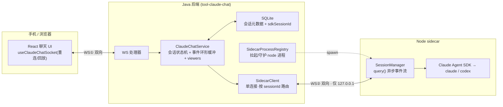
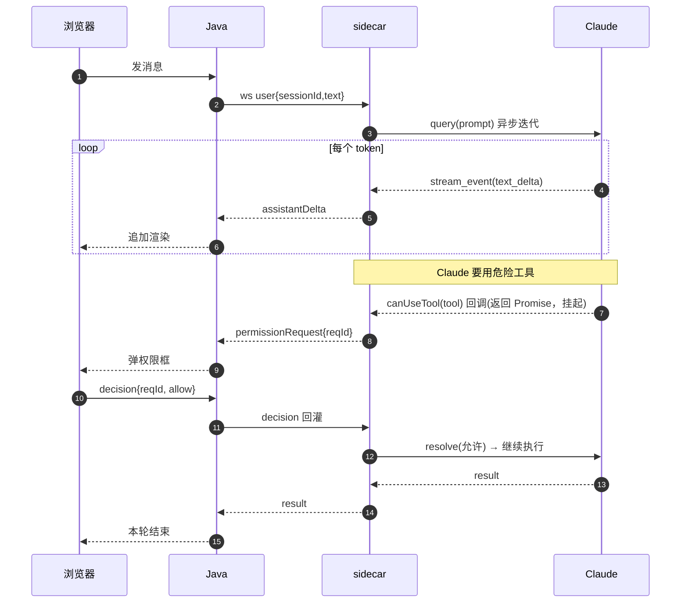
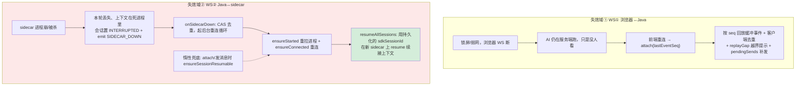
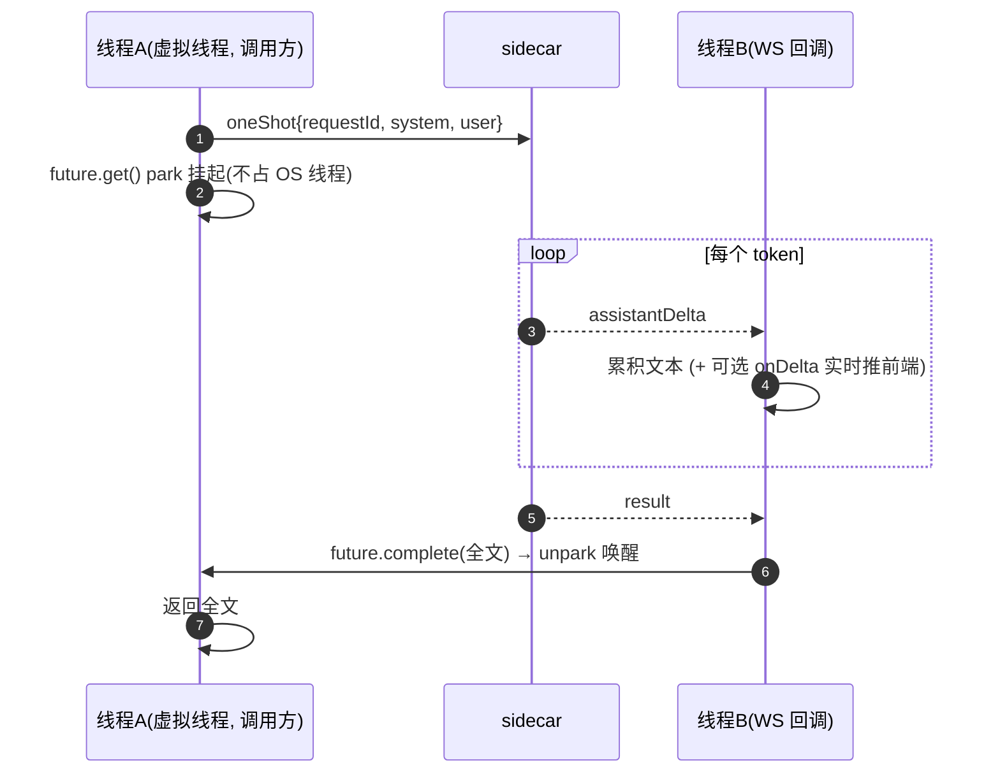
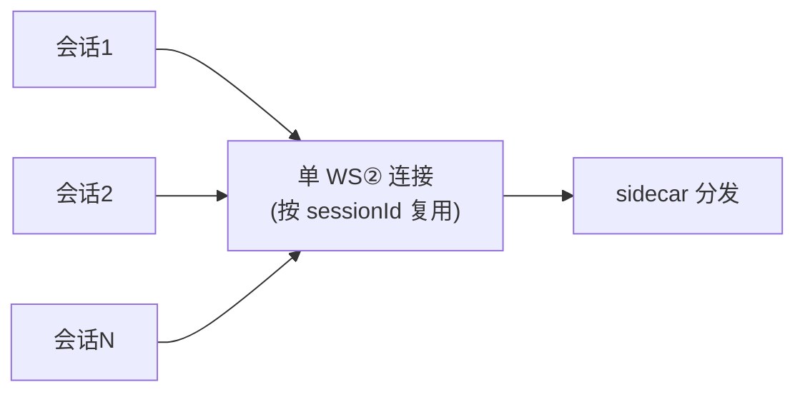

# Vibe Coding（移动端 AI 编码 Agent 平台）· 架构与实现

> kai-toolbox 核心模块。把 Claude Code / Codex 编码 Agent 封装成**移动端可用的实时编码助手**，并把 Agent 能力下沉为产品内 AI 功能（如简历智能优化）。
> 技术栈：Java 21（虚拟线程）· Spring Boot 多模块 · Node sidecar（Claude Agent SDK）· React 19。
> 核心难点：把「**异步 / 长连接 / 有状态 / 含人机交互**」的 Agent 工业级桥接到 Web，并在**弱网 / 进程崩溃**下保证会话不丢、多端一致。

---

## 1. 整体架构（三层 + 两条 WebSocket）

关键：Java 自己不跑 AI——真正调 Claude 的是独立 Node 进程（sidecar，跑官方 Agent SDK），Java 通过 WebSocket 指挥它。

- **WS①** 浏览器↔Java（你点的、你看的）。
- **WS②** Java↔sidecar（内部，仅 loopback）。
- **单 WS② 多路复用所有会话**，靠消息里的 `sessionId` 路由（详见 §5）。

---

## 2. 流式输出 + 工具权限交互（核心路径）

模型每吐一段字 → sidecar 翻译成一条事件 → Java 转发 → 浏览器追加，**三跳全程流式**。工具权限确认是个跨三进程的**阻塞式 Promise**。

> 本质：把"等用户决策"变成一个**跨三进程、靠 reqId 配对的挂起 Promise**——你点同意的那一刻才放行。

---

## 3. 双链路断线恢复（可用性核心）

两条 WS 是**两个独立失效域**，恢复路径互不替代。

- **浏览器断**：服务端权威，重连**重放**补播即可（便宜）。
- **sidecar 崩**：进程级故障（难点）——后台 CAS 去重重连 + `sdkSessionId` resume。
- **命门**：见 §4 的"身份解耦"。

---

## 4. 跨进程不丢上下文 + 异步折叠为同步

### 4.1 两个 ID 解耦（重启不丢对话的关键）

| ID | 是什么 | 作用 |
|----|--------|------|
| `sessionId`（自有 UUID） | 会话主键 | **当前运行**中三方路由 |
| `sdkSessionId`（Claude SDK） | SDK 会话号 | **跨重启续接句柄**；真实对话上下文落在 SDK 磁盘 transcript |

> 记忆下沉磁盘、句柄存 SQLite → **sidecar 进程近乎无状态，可随意重启而对话不丢**。

### 4.2 一次性 headless：把异步事件流"折叠"为同步阻塞调用

产品功能（如简历优化）想像调普通函数一样用 Agent：`String text = agent.runOnce(system, user)`。

- **挂起非自旋**：`CompletableFuture.get()` 用 `LockSupport.park`，线程睡死、不占 CPU；`complete()` 时 `unpark` 唤醒。
- **虚拟线程**：park 时从载体 OS 线程卸载，几十个并发等待也不吃 OS 线程——所以敢"写成同步阻塞"。

---

## 5. 单连接多路复用 + 队头阻塞权衡

WS② 一条连接承载所有会话，按 `sessionId` 路由。

- **取舍**：单连接有队头阻塞——但**被串行的只是 KB 级文本帧**；真正耗时的 **LLM 生成是事件循环上的独立异步流，并发不受影响**。
- 单用户本地场景并发极低 → 用可忽略的代价换**连接生命周期 / 重连恢复的极简**。需要高并发时再上每会话独连或 HTTP/2 多 stream。

---

## 6. 关键技术选型与取舍

| 决策 | 选择 | 理由 |
|------|------|------|
| Web 并发模型 | **MVC + Java 21 虚拟线程**（非 WebFlux） | 阻塞式写法拿到高并发；规避 reactive 全栈改造与心智成本；本场景无强背压/编排需求 |
| 跨语言桥接 | Java ⇄ Node sidecar（WS） | Claude Agent SDK 是 Node 的；进程隔离 + 事件化协议 |
| 流式传输 | SSE（含 SSE-over-POST，自解帧 + 带 JWT） | 单向推送天然契合；EventSource 不支持 POST/自定义头，故 fetch 自解析 |
| 写操作粒度 | 实体级 + 幂等 by id（MCP 工具） | 爆炸半径锁死单实体，防 AI 误操作；非整份覆盖 |
| 上下文持久化 | sdkSessionId + 磁盘 transcript | 跨进程重启续接，sidecar 无状态 |

---

> 备注：本文聚焦"为什么这么设计 + 怎么实现"，是 kai-toolbox 各模块**实现原理合集**的第一篇；后续每个模块一篇同构文档放本目录（`docs/architecture/`），在「Markdown 文档浏览器」里按本地目录源浏览。
