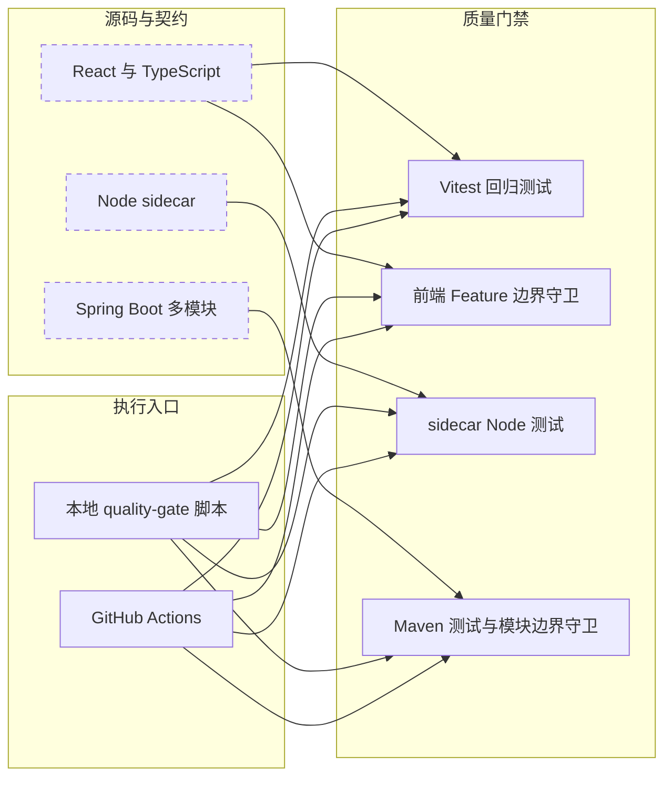
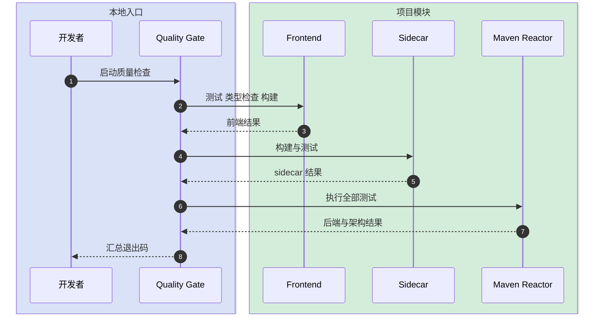
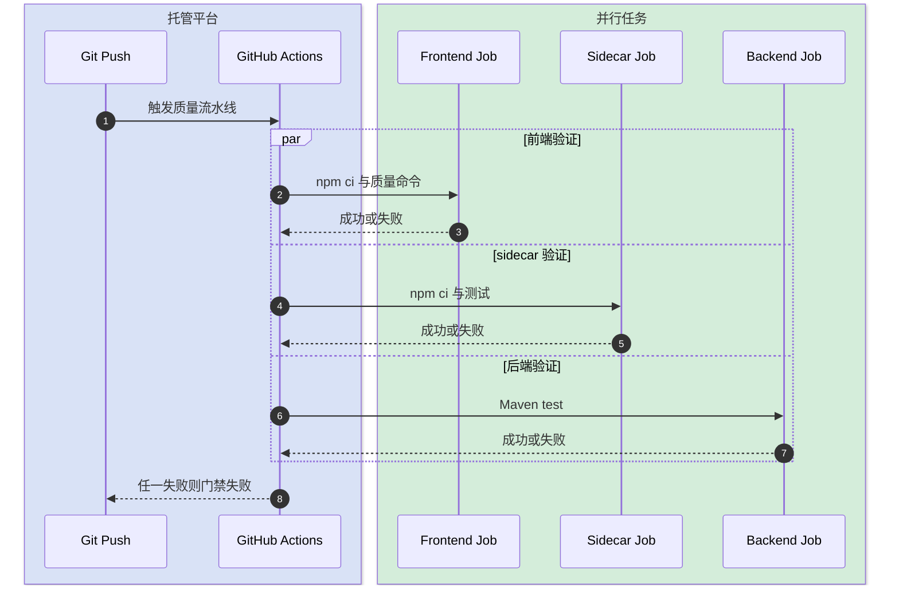

# AI 交付链路质量基线设计

本文档定义 AI 交付链路优化的 P0 安全网：用可重复执行的前端测试、sidecar 测试、Maven 测试和架构守卫固定当前契约。它不改变业务流程、数据库、REST、WebSocket 或 SSE，只为后续咨询归档、PRD 产物账本、Connector 解耦和巨型模块拆分提供回归依据。

## 快速导航

- [目标与边界](#1-目标与边界)
- [整体架构](#2-整体架构)
- [模块拆分与职责](#3-模块拆分与职责)
- [关键交互](#4-关键交互)
- [核心规则](#5-核心规则)
- [编码落点](#6-编码落点)
- [依赖变更](#7-依赖变更)
- [风险与验证](#8-风险与验证)

---

## 1. 目标与边界

- **要解决的问题**：前端没有测试框架和测试文件，现有架构守卫、sidecar 测试与 Maven 测试也缺少统一流水线入口，后续重构无法可靠区分“结构变化”和“行为回归”。
- **本次目标**：建立前端测试基建；为咨询审计和需求事实评分补首批确定性测试；建立本地与 CI 统一质量门禁。
- **不做什么**：不修改咨询归档事实源、不新增数据库表、不改变 Prompt、不改 Agent Engine/Connector、不拆巨型页面和 Service。
- **设计结论**：先固定可确定验证的纯逻辑与现有架构边界，再进入改变状态、数据和协议的可靠性改造。

---

## 2. 整体架构



依赖方向保持为“测试依赖生产代码”，生产代码不得反向依赖测试工具。Vitest 使用独立配置，不复用包含本机证书插件的 Vite 开发配置，避免测试启动触发证书安装或网络下载。

---

## 3. 模块拆分与职责

### 3.1 前端测试基建

- **定位**：前端确定性逻辑和 React 组件的统一测试运行时。
- **职责**：
  - 提供 `test` 与 `test:watch` 命令。
  - 提供 jsdom、Testing Library 和统一断言初始化。
  - 复用 `@` 路径别名，不加载开发服务器插件。
- **上游**：本地开发者、质量门禁脚本、CI。
- **下游**：Vitest、jsdom、Testing Library。
- **关键设计点**：测试文件与源码同目录；首批只测试纯逻辑，不制造脆弱快照。

### 3.2 首批回归样本

- **定位**：固定后续可靠性改造最容易误伤的现有确定性行为。
- **职责**：
  - 固定咨询审计对领域工具、Graphify、BUG 标记和测试库声明的判定。
  - 固定需求事实评分的类型推断、定位、等级和扣分行为。
- **上游**：Vitest。
- **下游**：现有 `consultAudit.ts`、`factQuality.ts`。
- **关键设计点**：只断言业务可观察结果，不断言实现细节和完整对象快照。

### 3.3 统一质量入口

- **定位**：把已有分散命令组合成可重复运行的门禁。
- **职责**：
  - 本地按前端、sidecar、Maven 顺序执行并在首个失败处退出。
  - CI 使用相同的项目命令，按技术栈并行运行。
  - 继续执行现有前后端架构边界检查。
- **上游**：开发者、代码托管平台。
- **下游**：npm、Maven。
- **关键设计点**：不自动修改源码、不生成提交、不依赖运行中的本地服务。

---

## 4. 关键交互

### 4.1 本地质量检查

触发：开发者完成一个纵向切片后运行本地质量门禁。



### 4.2 CI 失败阻断

触发：分支推送或 Pull Request。



---

## 5. 核心规则

| 规则 | 说明 |
|---|---|
| 不改变生产契约 | 本批不修改 REST、WebSocket、SSE、数据库和业务状态机 |
| 不加载本机开发插件 | Vitest 使用独立配置，不加载 mkcert |
| 测试业务结果 | 不使用大对象快照，不绑定私有函数和 DOM 实现细节 |
| 架构守卫继续生效 | 前端 Feature 边界和后端 tool 依赖边界必须进入 CI |
| 失败立即可见 | 本地脚本和 CI 任一步失败均返回非零退出码，不静默吞错 |
| 不触碰并行草案 | 本批不修改当前工作区中的 sidecar Engine 草案和 supervisor 脚本 |

---

## 6. 编码落点

```text
frontend/
├── package.json                                      [修改] 增加测试命令与测试依赖
├── package-lock.json                                 [修改] 锁定测试依赖版本
├── vitest.config.ts                                  [新增] 独立测试运行配置
└── src/
    ├── test/setup.ts                                 [新增] Testing Library 断言初始化
    └── features/
        ├── fore-consult/consultAudit.test.ts         [新增] 咨询审计确定性规则测试
        └── reqpool/factQuality.test.ts               [新增] 需求事实评分确定性规则测试

scripts/
└── quality-gate.ps1                                  [新增] 本地统一质量入口

.github/workflows/
└── quality.yml                                       [新增] 前端 sidecar 后端并行质量门禁
```

调用关系：`quality-gate.ps1` 和 CI 只调用各模块公开的构建、测试命令；它们不绕过或复制模块内部规则。

---

## 7. 依赖变更

| 类型 | 是否变化 | 说明 |
|---|---|---|
| 数据库表、字段、索引 | 无 | 不访问运行数据库 |
| DTO、VO、枚举 | 无 | 测试复用现有公开类型 |
| 前端开发依赖 | 有 | 新增 Vitest、jsdom、Testing Library |
| 外部运行依赖 | 无 | 生产 bundle 不包含测试依赖 |
| 缓存、消息、锁、事务 | 无 | 不涉及 |

---

## 8. 风险与验证

| 风险 | 影响 | 处理方式 |
|---|---|---|
| Vite 开发配置加载 mkcert | CI 或测试意外下载证书工具 | 使用独立 `vitest.config.ts` |
| 全量 Maven 测试耗时 | CI 反馈较慢 | 前端、sidecar、后端拆为并行任务，不跳过后端全量门禁 |
| 测试与当前实现耦合 | 后续合理重构产生噪声 | 只断言可观察业务结果，不断言内部调用 |
| 当前工作树有并行修改 | 覆盖用户未提交工作 | 严格限制修改清单，完成前逐文件核对 diff |

验证要点：

- 正常路径：前端测试、类型检查、构建、sidecar 测试、Maven 测试全部通过。
- 异常路径：任一测试失败，本地脚本和 CI 返回失败。
- 边界条件：测试环境声明、Graphify shell 调用、无定位信息需求、URL 定位需求均有断言。
- 回归范围：Feature 注册目录、前端类型、sidecar TypeScript、全部 Maven 模块与后端模块边界。

