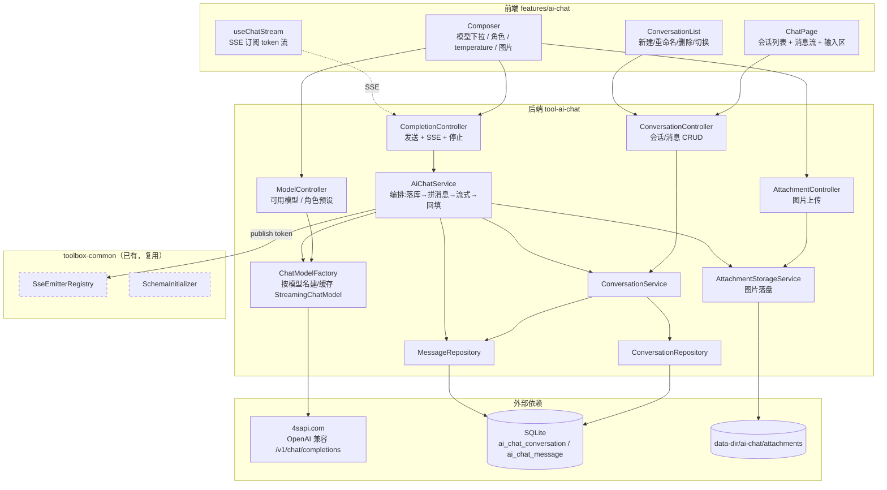
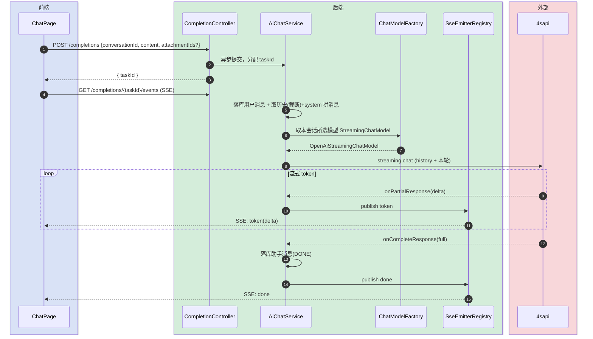
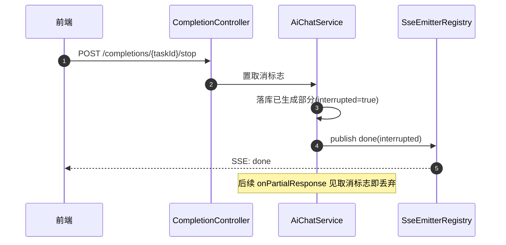
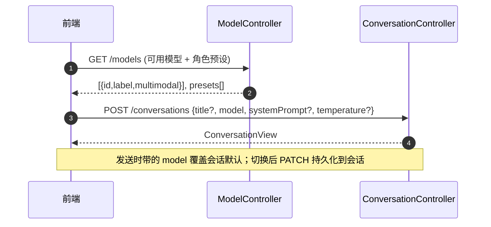

# AI 对话（API 直连聊天）技术方案

> **定位**：技术架构主导。讲清新模块边界、4sapi（OpenAI 兼容中转）流式接入拓扑、多会话持久化与 SSE 交互。
> **与 Vibe coding 的区别**：Vibe coding（`tool-claude-chat`）是 **agent 模式**——WebSocket + sidecar 子进程跑 Claude Agent SDK，有工具调用/文件操作。本模块是 **API 模式**——后端直接以 OpenAI 兼容协议调 4sapi，无 agent、无工具、无子进程，就是一个可切模型的流式聊天框。
> **最后更新**：2026-06-18

## 变更记录

| 版本 | 日期 | 修改人 | 变更内容摘要 |
|------|------|--------|--------------|
| current | 2026-06-18 | AI | 初始版本：4sapi 直连 + 会话级任意切模型 + 多会话 SQLite 持久化 + SSE 流式 + 系统提示词/角色预设 + 多模态图片 + 参数调节 |
| current | 2026-06-18 | AI | 模型清单改为实时调 4sapi `GET /v1/models` 动态获取（带缓存 + 失败回退静态配置）；多模态能力按可配置名称模式推断 |

---

## 1. 目标与边界

- **要解决的问题**：需要一个不依赖 Claude 登录态、不起 agent 子进程的「纯 API 聊天框」，通过 4sapi.com（一个 key 通吃 GPT / Claude / Gemini / DeepSeek 等的 OpenAI 兼容中转站）直接对话，像 ChatGPT 那样按会话管理历史、随时切模型。
- **本次目标（v1）**：
  1. 新增独立模块 `tool-ai-chat`，以 langchain4j `OpenAiStreamingChatModel` 直连 4sapi（base-url + api-key 走配置中心动态可改）。
  2. **会话级任意切模型**：模型清单**实时调 4sapi `GET /v1/models` 动态获取**（带短 TTL 缓存，失败回退静态配置），前端下拉选；每条会话记住所用模型，发送时可换。
  3. **多会话持久化**：会话 + 消息落 SQLite，支持新建 / 重命名 / 删除 / 历史翻页，刷新后仍在。
  4. **SSE 流式输出**：逐 token 推送，复用 `SseEmitterRegistry`；支持中途停止。
  5. **系统提示词 / 角色预设**：每会话可设 system prompt，提供少量内置角色预设（可配置扩展）。
  6. **多模态（图片）**：对标记为视觉能力的模型，允许上传图片随消息发送。
  7. **参数调节**：前端可调 temperature / max_tokens 等采样参数，存在会话上。
- **不做什么（v1）**：
  - 不做 agent / 工具调用 / function calling——那是 Vibe coding 的领域，本模块只做对话补全。
  - 不接 `toolbox-llm` 共享网关的 tier 路由——网关按 tier 权重随机选模型，与「用户任选模型」诉求冲突，本模块自持 4sapi 配置直连（设计取舍见 §8）。
  - 不做 RAG / 向量检索 / 联网搜索——留 v2。
  - 不做用量计费 / token 统计看板——v1 仅可选记录 usage，不做面板。
  - 不做流式工具事件、不做语音输入（Vibe coding 已有）。
- **设计结论（一句话）**：新增独立模块 `tool-ai-chat`，以「会话/消息落库 → 取历史拼 langchain4j 消息 → 按所选模型建/取缓存的 `OpenAiStreamingChatModel` → 流式回调逐 token publish 到 per-task SSE → 完成时落库助手消息」为主链路，4sapi 连接参数走 `@Refreshable` 配置中心。

---

## 2. 整体架构



---

## 3. 模块拆分与职责

### 3.1 ConversationController（api/）

- **定位**：会话与消息的 REST 入口，纯 CRUD + 参数校验，不含模型调用。
- **职责**：列出会话、新建、重命名、删除、读会话详情（含模型/system/参数）、分页拉历史消息。
- **上游**：前端。**下游**：`ConversationService`。

### 3.2 CompletionController（api/）

- **定位**：对话补全入口 + SSE 频道 + 停止。
- **职责**：受理发送消息（返回 taskId）、暴露 per-task SSE 频道（转 `SseEmitterRegistry`）、停止运行中的流。
- **关键设计点**：发送请求只触发异步流式，**立即返回 taskId**；token 流走 SSE，不在同步响应里阻塞。

### 3.3 ModelController + ModelCatalogService（api/、service/）

- **定位**：暴露「可选模型清单」与「角色预设清单」。
- **职责**：`ModelCatalogService` 调 4sapi `GET /v1/models` 拉真实支持的模型 id 列表，按可配置规则推断 `multimodal` 与展示名，结果缓存（短 TTL）；`ModelController` 返回该清单 + 内置角色预设。
- **关键设计点**：
  - **动态获取**：模型以 4sapi 实际支持的为准，新增模型无需改代码/配置。
  - **缓存**：`modelsCacheTtlSeconds`（默认如 300s）内复用，避免每次开下拉都打 4sapi。
  - **失败回退**：`/v1/models` 不可用（鉴权失败/网络）时回退到 `AiChatProperties.fallbackModels` 静态清单，保证 UI 不空。
  - **多模态推断**：OpenAI `/v1/models` 不返回能力位，按 `multimodalPatterns`（可配置的模型名片段，如 `gpt-4o`、`claude`、`gemini`、`vision`）匹配 id 推断 `multimodal`。
  - **展示名**：默认取 id；可选 `modelLabels` 配置做 id→展示名美化映射。

### 3.4 AttachmentController（api/）

- **定位**：图片附件上传入口（仅多模态消息用）。
- **职责**：接收 multipart 图片，落盘并返回 attachmentId；下载/预览。
- **关键设计点**：复用 claude-chat `AttachmentStorageService` 的落盘+越权防护套路（`normalize().startsWith(dir)`），应用层大小校验先于 multipart 上限友好报错。

### 3.5 AiChatService（service/）

- **定位**：对话编排核心。
- **职责**：
  1. 校验会话存在；持久化用户消息（含附件引用）。
  2. 按会话取历史消息（套 `maxHistoryMessages` 截断）+ system prompt + 本轮附件，拼成 langchain4j `List<ChatMessage>`。
  3. 向 `ChatModelFactory` 要本会话所选模型的 `OpenAiStreamingChatModel`，发起流式请求。
  4. 流式回调（`onPartialResponse` / `onCompleteResponse` / `onError`）→ 逐段 `publish` 到 SSE。
  5. 完成时落库助手消息；被停止时把已生成的部分内容落库并标记 `interrupted`。
- **上游**：CompletionController。**下游**：ConversationService / MessageRepository / ChatModelFactory / AttachmentStorageService / SSE。
- **关键设计点**：worker 跑在 virtual thread；流式句柄持有 taskId↔取消标志的映射，停止时置标志并 complete SSE。

### 3.6 ChatModelFactory（service/）

- **定位**：按「模型名」构建并缓存 `OpenAiStreamingChatModel`。
- **职责**：用 `AiChatProperties` 的 base-url / api-key + 请求里的 model + temperature/maxTokens 建模型；按 (model, 参数指纹) 缓存复用。
- **关键设计点**：配置中心改了 base-url/api-key（`@Refreshable` rebind）后**清缓存**，下次按新值重建——监听 `EnvironmentChangeEvent` 或每次校验配置版本。

### 3.7 ConversationService / Repositories（service/、repository/）

- **定位**：会话与消息持久化（Spring JDBC + SQLite）。
- **职责**：CRUD `ai_chat_conversation`、追加/翻页 `ai_chat_message`；附件以 JSON 列存于消息行。
- **关键设计点**：DDL 走 `db/ai-chat-schema.sql`，全部 `CREATE TABLE/INDEX IF NOT EXISTS`。

### 3.8 AiChatProperties（config/）+ AiChatToolDescriptor（config/）

- **定位**：配置块 + 后端工具注册。
- **职责**：`AiChatProperties` 绑定 `toolbox.ai-chat.*`，标 `@Refreshable` 纳入配置中心（base-url / api-key / 模型清单 / 默认参数 / 历史截断 / 超时 在线可改）。`AiChatToolDescriptor` 实现 `ToolDescriptor` 注册到 `/api/tools`。

---

## 4. 关键交互

### 4.1 发送消息与流式回复

> 触发：用户在输入区发消息。参与方：前端、CompletionController、AiChatService、ChatModelFactory、4sapi。



### 4.2 停止生成

> 触发：用户点「停止」。参与方：前端、CompletionController、AiChatService。



### 4.3 新建会话与切模型

> 触发：用户新建会话或在输入区换模型。参与方：前端、ModelController、ConversationController。



---

## 5. 核心业务规则

| 规则 | 说明 |
|------|------|
| 模型清单来源 | 实时调 4sapi `GET /v1/models`（缓存 `modelsCacheTtlSeconds`）；失败回退 `fallbackModels` 静态配置 |
| 多模态推断 | `/v1/models` 不返回能力位，按 `multimodalPatterns` 匹配模型 id 推断；命中即 `multimodal=true` |
| 会话级模型 | 每会话存 `model`；发送可临时换，换后 PATCH 持久化为会话默认 |
| 历史截断 | 发送时取该会话最近 `maxHistoryMessages` 条（默认如 40）拼上下文，超出丢最早，防 token 失控 |
| system prompt | 会话级单条 system；角色预设只是把预设文案填进 systemPrompt，不单独建表 |
| 多模态门控 | 仅当所选模型 `multimodal=true` 才允许带图；否则后端拒绝带附件的请求（400） |
| 参数范围 | temperature ∈ [0,2]、maxTokens>0；越界 400；缺省用配置默认 |
| 流式与停止 | 一次发送 = 一个 taskId 的 SSE 频道；停止置标志，已生成部分落库并标 `interrupted` |
| 助手消息落库时机 | 仅在 `onCompleteResponse` 或停止时落库；流式中途不落库（避免半条脏数据） |
| 错误处理 | 4sapi 报错（鉴权/限流/超时）→ publish error 事件 + 该助手消息标 `error`，不污染会话历史 |
| 附件存储 | 图片落 `data-dir/ai-chat/attachments/{conversationId}/`，消息行 `attachments_json` 记引用；下载 `startsWith` 防穿越 |
| api-key 存储 | 走配置中心（SQLite 覆盖），本地明文（单机单用户，与 claude-chat `auth_token` 一致口径） |
| 配置热更 | base-url/api-key/模型清单 `@Refreshable` 在线改不重启；改后 `ChatModelFactory` 清缓存重建 |
| 幂等 DDL | schema.sql 全部 `CREATE TABLE/INDEX IF NOT EXISTS` |

---

## 6. 编码落点

```text
（父 pom 与 starter）
pom.xml                                          [修改] <modules> 增加 tools/tool-ai-chat
toolbox-starter/pom.xml                          [修改] 增加 tool-ai-chat 依赖

tools/tool-ai-chat/
├── pom.xml                                       [新增] 模块定义，依赖 toolbox-common + langchain4j-open-ai
└── src/main/
    ├── java/com/exceptioncoder/toolbox/aichat/
    │   ├── api/
    │   │   ├── ConversationController.java        [新增] 会话/消息 CRUD
    │   │   ├── CompletionController.java          [新增] 发送 + SSE + 停止
    │   │   ├── ModelController.java               [新增] 可用模型 / 角色预设
    │   │   ├── AttachmentController.java          [新增] 图片上传/下载
    │   │   └── dto/
    │   │       ├── ConversationView.java          [新增]
    │   │       ├── CreateConversationRequest.java [新增]
    │   │       ├── UpdateConversationRequest.java [新增] 改 title/model/system/参数
    │   │       ├── MessageView.java               [新增]
    │   │       ├── MessagePage.java               [新增] 翻页
    │   │       ├── SendMessageRequest.java        [新增] {conversationId,content,attachmentIds?,model?,temperature?,maxTokens?}
    │   │       ├── ModelInfo.java                 [新增] {id,label,multimodal}
    │   │       └── RolePreset.java                [新增] {id,label,systemPrompt}
    │   ├── domain/
    │   │   ├── Conversation.java                  [新增] 会话实体
    │   │   ├── ChatMessage.java                   [新增] 消息实体
    │   │   ├── MessageRole.java                   [新增] USER/ASSISTANT/SYSTEM 枚举
    │   │   └── MessageStatus.java                 [新增] DONE/INTERRUPTED/ERROR 枚举
    │   ├── service/
    │   │   ├── AiChatService.java                 [新增] 编排 + 流式回调 + 落库
    │   │   ├── ModelCatalogService.java           [新增] 调 4sapi /v1/models + 缓存 + 多模态推断 + 失败回退
    │   │   ├── ChatModelFactory.java              [新增] 按模型建/缓存 StreamingChatModel + 配置热更清缓存
    │   │   ├── ConversationService.java           [新增] 会话/消息业务
    │   │   └── AttachmentStorageService.java      [新增] 图片落盘 + 越权防护
    │   ├── repository/
    │   │   ├── ConversationRepository.java        [新增] Spring JDBC
    │   │   └── MessageRepository.java             [新增] Spring JDBC
    │   └── config/
    │       ├── AiChatProperties.java              [新增] @Refreshable，绑定 toolbox.ai-chat.*
    │       └── AiChatToolDescriptor.java          [新增] 后端工具注册
    └── resources/db/
        └── ai-chat-schema.sql                     [新增] ai_chat_conversation / ai_chat_message 表

frontend/src/features/ai-chat/
├── index.tsx                                     [新增] FeatureManifest（layout:'tool'，icon: Bot/MessageSquare，lazy ChatPage）
├── pages/ChatPage.tsx                            [新增] 三栏：会话列表 + 消息流 + 输入区
├── components/
│   ├── ConversationList.tsx                       [新增] 会话增删改切
│   ├── MessageList.tsx                            [新增] 消息流 + Markdown 渲染（可复用 claude-chat 的 Markdown 思路）
│   ├── Composer.tsx                               [新增] 模型下拉 / 角色 / temperature / 图片上传 / 发送停止
│   └── ModelPicker.tsx                            [新增] 模型选择
├── hooks/useChatStream.ts                        [新增] SSE 订阅 token 流
├── api.ts                                         [新增] REST 客户端
└── types.ts                                       [新增] 前端类型
```

### 调用关系说明

- `CompletionController.send` → `AiChatService`（virtual thread）→ 落库用户消息 → `ChatModelFactory` 取模型 → 流式回调 publish SSE → 完成落库助手消息。
- `ConversationController.*` → `ConversationService` → Repository。
- 配置中心改 4sapi 连接 → `EnvironmentChangeEvent` → `ChatModelFactory` 清缓存。

---

## 7. 数据与依赖变更

| 类型 | 是否变化 | 说明 |
|------|----------|------|
| 数据库表 / 字段 / 索引 | 有 | 新增 `ai_chat_conversation`、`ai_chat_message`（见 api 文档数据结构节）；索引 on conversation 时间 / message(conversation_id, created_at) |
| DTO / VO / 枚举 | 有 | 新增 `MessageRole / MessageStatus` 等（见 §6），均模块内自有 |
| 下游接口 / 外部依赖 | 有 | 新增对 4sapi 的出站依赖；新增 maven 依赖 `dev.langchain4j:langchain4j-open-ai`（与 toolbox-llm 同款）；复用 common 的 `SseEmitterRegistry` |
| 配置 | 有 | 新增 `toolbox.ai-chat.*` 配置块（`@Refreshable`）；application.yml 加默认（base-url 占位、api-key 走环境变量、models 示例） |
| 缓存 / 消息 / 锁 / 事务 | 轻微 | `ChatModelFactory` 内存缓存模型实例；无 MQ/分布式锁 |

> 接口字段级契约与建表 DDL 见 `AI对话-api-current.md`。

---

## 8. 风险与待确认

| 风险 / 待确认点 | 影响 | 处理方式 |
|----------------|------|----------|
| 不复用 toolbox-llm 网关 | 失去池化/故障转移 | v1 取舍：用户任选模型与 tier 路由语义冲突；4sapi 自身即聚合多模型，单 key 单 base-url 已够。需要多 key 轮换时 v2 再抽 |
| 4sapi 模型名/能力漂移 | UI 选了实际不支持的模型会报错 | 模型清单实时取自 `/v1/models`；调用错误 publish error 事件友好提示，不崩会话 |
| `/v1/models` 不可用或多模态推断不准 | 下拉空 / 误判图片能力 | 失败回退 `fallbackModels`；多模态按可配置 `multimodalPatterns` 推断，可随时调 |
| 长会话 token 失控 | 上下文超长 / 费用高 | `maxHistoryMessages` 截断；v2 可加按 token 估算截断 |
| 多模态图片体积 | multipart/请求体过大 | 复用 60MB multipart 上限 + 应用层校验；非多模态模型直接拒图 |
| langchain4j 流式与 SseEmitter 线程 | 回调线程 publish 时序 | 严格走项目 SSE 模式，virtual thread 跑 worker，回调内只 publish 不阻塞 |
| api-key 明文落 SQLite | 安全 | 与 claude-chat `auth_token` 同口径，单机单用户、不暴露公网，接受 |
| 模块命名 `ai-chat` 与 `ai-secretary` 相近 | 菜单辨识 | 前端展示名用「AI 对话」，与「AI 秘书」「Vibe coding」区分；如需改名在落地前定 |

---

## 9. 验证要点

- **正常路径**：新建会话 → 选模型 → 发消息 → 看到逐 token 流式 → 助手消息落库 → 刷新页面历史还在。
- **切模型**：同一会话切到另一模型继续问，新消息用新模型，会话默认模型被更新。
- **停止**：流式中途点停止 → 立即停 → 已生成部分作为一条 interrupted 消息保留。
- **多模态**：视觉模型上传图片提问正常；非视觉模型带图被 400 拒绝。
- **异常路径**：错误 api-key / 限流 → error 事件友好提示，会话不被脏数据污染。
- **配置热更**：配置中心改 base-url/api-key → 不重启，下条消息走新连接。
- **回归范围**：仅新增模块 + starter 依赖 + 前端新 feature + application.yml 配置块；不触碰 claude-chat / toolbox-llm 既有逻辑。
