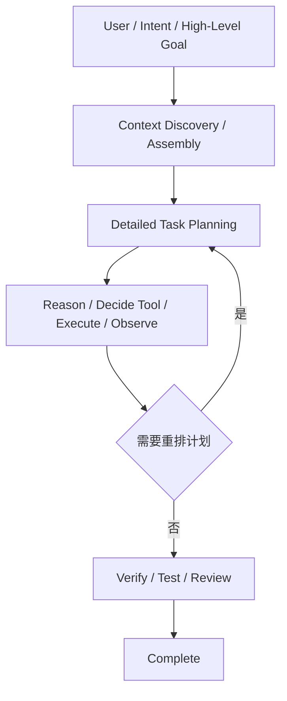
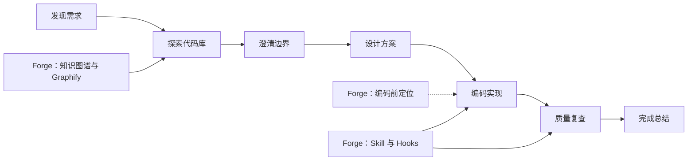
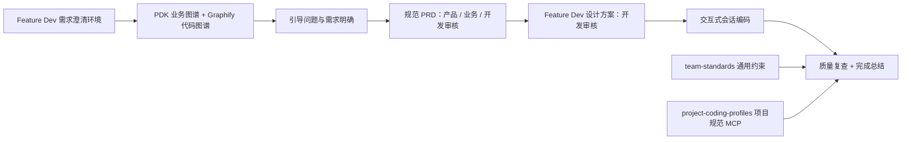

# AI Coding 治理 WebPPT 视觉升级

## 背景与目标

演示稿需要同时回答三个问题：为什么需要治理、治理方法如何成立、Forge 平台如何把方法变成团队每天可用的能力。保留技术选型与量化数据，并增加真实平台截图作为能力证据。

## 设计原则

1. 一页只保留一种主要视觉语法：角色卡、职责接力链、对比矩阵、工作台或数据故事。
2. 比喻不是页首的一段说明，而要进入对象本身：每个工具同时展示“像什么”“管什么”“不管什么”。
3. 技术细节作为第二阅读层级保留，来源说明继续弱化放底部。
4. 保持 1280×720 固定画布、离线可播和 Reveal.js 交互；平台能力页插入方法选型与自举案例之间。
5. Forge Presentation Design System：Hero 页使用超大标题与发光主体；故事页使用“以前 → 转折 → 现在”；流程页使用发光连线和单一路径；对比页使用强 Before/After；收益使用大号文字而非按钮或 KPI 卡。减少白底描边圆角矩形，不复刻后台 Dashboard 组件。
6. 信息密度遵循 80% 视觉、20% 文字：每页只保留一个视觉中心，次要说明降级或隐藏，禁止左卡片、右步骤、底部标签同时争抢焦点。
7. 禁止把制作目的写进可见页面：删除“为了证明/说服/展示”“本页依据”“本次不承诺”等面向制作者的说明；技术来源仅保留必要短脚注。图形已表达的内容不再用长段文字重复解释。

## 页面改造

- 封面：改为深色发布会 Hero。左侧用超大问题标题建立冲突，右侧用“缺少统一团队上下文”的 AI 核心连接 PRD、沟通、AI 对话、任务、代码和文档六类分散载体；底部四列根因带说明知识、Chatbox 模式、输入标准和输出验证同时失控，最终由 Forge 价值主张收口。
- 知识治理：四个工具改为四张角色卡，突出“标准手册 / 变更单 / 线路图 / 维修笔记”的分工。
- OpenSpec：四项职责改成从原职责到 feature-dev 承接物的接力链，右侧给出阶段性裁决。
- 方法论内核不再单独占页：OpenSpec 与 Superpowers 的职责边界已由前面的双流程页说明，避免与 Forge 当前开发闭环重复。
- 工具选型：Feature Dev 与 Superpowers 改为属性对比矩阵，并用“标准套餐 / 完整装修公司”建立直觉。
- 项目工作台、服务启停日志和 PRD 文档版本管理三张截图页已从主汇报删除，平台实现集中由 Forge 当前开发闭环与后续落地案例表达。
- 当前流程口径：需求澄清与后续开发暂由 Claude Code 官方 `feature-dev:feature-dev` 承担；自定义文档编写流程不再作为当前实现描述。
- 第三页架构口径：以 Feature Dev 七阶段作为当前开发主链，`design-doc-required` 不再表述为 PRD 开发入口；Phase 6 只表述为代码质量审查，业务验收仍需对照 PRD 验收标准执行。知识上下文拆分为公司级业务知识图谱（domain-knowledge / cross-topology）与各项目基于自身代码生成的 Graphify 项目图谱。
- Skill 接线边界：`pre-implementation-code-orientation` 不由 Feature Dev 自动加载，当前页面标注为 Forge 需在 Phase 5 前显式追加的治理门禁，未接线前不得表述为已自动执行。
- 第十二页按 PRD 澄清模块的真实调用顺序绘制，不按 Phase 编号机械排序：表单录入（Phase 1 仅在 seed 中声明完成）→ Phase 3 澄清 → PRD 落盘 → Phase 2/4 分支 → 编码前定位 Skill（未调用）→ Phase 5/6。声明但未触发的节点统一置灰。
- 第十二页同时补齐 Feature Dev 官方 7 阶段：Discovery、Codebase Exploration、Clarifying Questions、Architecture Design、Implementation、Quality Review、Summary；蓝色表示明确调用，黄色虚线表示按开发文档条件触发，灰色表示仅声明完成或当前 seed 未显式触发。
- 案例与闭环：用工作台和横向流程表达持续会话、状态以及治理链路。
- 文档与量化：保留所有真实数据，用轨迹、指标卡和结论标签提高可扫读性。
- 未来展望：在最终采纳倡议前增加一页“当前基础 → 未来团队工作方式”。当前基础呈现跨平台启停脚本的治理方向、持续更新的业务/代码知识、统一文档大纲和可视化模块入口；未来规划包括业务问答助手、新员工一键拉项目并进入开发环境、AI 自动评估进度与归类相似需求。尚未完整落地的能力必须标注为规划。
- 展望拆页：保留展望总览，并将 7 个亮点各展开为一页管理价值故事：项目模块总控台、跨平台环境标准化、持续更新的知识系统、统一文档标准、模块业务助手、新员工一键入场、AI 交付组合分析。每页只讲一个核心结果，使用“现状痛点 → 平台能力 → 组织收益”结构；项目模块总控台标为已上线，其余按已具备基础、建设中或未来规划标注。

## 验收

- `npm run typecheck`、`npm run build` 通过。
- 全部页面在 1280×720 虚拟画布内无横向或纵向溢出。
- 后半段不再依赖连续长列表讲清核心关系，原数据和来源声明不丢失。
# 第 3 页：Agent Harness 行业定义

第 3 页承接“研发资产化”的北极星，解释 Forge 为什么必须提供模型之外的执行系统。页面综合 Microsoft Agent Framework、Claude Code、OpenHands 与 Codex 的共同模式，将完整执行链归纳为四层：目标层、上下文层、执行层和质量层；执行层内部突出可反复运行的 Agent Loop。

页面必须保留 User、Intent Understanding、High-Level Goal Planning、Context Discovery、Context Assembly、Detailed Task Planning、Reason、Decide Tool、Execute Tool、Observe、Replan、Verify / Test / Review、Complete 的中英文对应关系。
# 第 4 页：Claude Code Feature Dev

第 4 页延续第 2、3 页的深色发布会视觉，按官方插件当前命令文件展示七阶段流程：Discovery、Codebase Exploration、Clarifying Questions、Architecture Design、Implementation、Quality Review、Summary。页面突出并行子 Agent 与人机确认门，并把 Forge 能力画成沿主流程注入的团队增强层，而非 Feature Dev 内建能力。

# 第 6 页：Forge 当前开发闭环

第 6 页以当前平台已经跑通的一轮代码开发检查为主线：先由 Claude Code Feature Dev 建立需求澄清环境，澄清阶段通过 PDK MCP 查询业务知识图谱、通过 Graphify 查询项目代码知识图谱，以真实业务和代码上下文生成引导问题；澄清完成后输出规范 PRD 供产品、业务和开发审核，再由 Feature Dev 形成设计方案供开发审核。审核通过后拉起对应项目模块的交互式会话完成编码，并由 Feature Dev 承担当前的 Quality Review 与 Summary。

质量复查阶段同时查询两层约束：`team-standards` 提供跨项目通用 Skill 与团队约束，`project-coding-profiles` 通过 MCP 提供当前项目的编码画像和项目级规范。该闭环属于一轮代码检查，不替代产品、业务对照 PRD 的最终验收。

# 第 7 页：Feature Dev 与 Superpowers 选型

第 7 页延续深色发布会视觉，以左右双方案对决代替后台式对比表。保留定位、流程重量、核心能力和本次选择四个维度，并使用 Spring 体系建立直觉：Superpowers 类似 Spring 全家桶 / Spring Ecosystem，能力完整、组合自由，但体系较重；Feature Dev 类似 Spring Boot Starter + Initializr，约定优于配置、上手快，但复杂工程需要外接增强能力。页面明确 Feature Dev 相比 Superpowers 未内建的强制环节：TDD 红绿重构、系统化调试、Git Worktree 隔离、逐任务双重审查和分支收尾；这些能力可由 Forge 团队治理层补齐。结论聚焦当前交付：Feature Dev 更适合本次中小型交付，复杂长线项目仍可组合 Superpowers。

# 第 8 页：多引擎调度入口

第 8 页延续第 7 页深色发布会视觉，用单一发光链路解释 Forge 如何承接不同 AI Coding 引擎：用户先选择项目模块，平台自动绑定工作目录并创建持久会话；会话编排层统一管理任务、上下文和生命周期；引擎路由层适配 Claude Code、Codex、Gemini 与 OpenCode；执行输出和运行状态最终回传到同一界面。

页面同时强调三项平台边界：会话身份不随引擎切换而消失、不同引擎的续跑句柄彼此隔离、被中断的任务可以继续运行。核心价值不是替代引擎，而是把分散的项目入口和执行控制收敛为一个可视化调度台。

原第 9 页“Feature Dev 官方阶段调用状态”从主汇报删除，相关方法流程已由第 4 页官方七阶段和第 6 页 Forge 当前闭环覆盖，避免重复解释。

# 第 9 页：研发记忆闭环

第 9 页不再展示孤立的文档版本数字，而是用闭环说明任何需求如何形成可持续工作的研发记忆：PRD 是需求原点，开发文档是当前实施事实，开发会话关联文档与项目目录承载实际执行；每次重要变更自动归档新版开发文档，把进度、决策和验证结果落成下一次会话可以加载的记忆。

连续记录进一步支撑三类平台分析：结合最新开发文档和代码进度推算剩余工作；对照 PRD 与开发文档更新记录定位需求遗漏、方案偏差和返工原因；归纳业务知识缺口、代码知识缺口、AI 约束不足与审核错漏，形成团队可统一回顾和持续优化的治理资产。

# 第 10–19 页：统一发布会视觉

第 10 页把量化结果改为四个大数字构成的证据舞台，强调数据用于检查澄清质量，而非制作战绩看板。第 11 页改为“当前四项基础能力 → Forge Team AI OS → 三项未来结果”的战略系统图，明确平台从统一入口走向团队智能工作台的演进方向。

第 12–18 页统一使用深色故事 Hero：状态标签与大标题建立第一阅读层，中央 Forge AI Core 连接“以前”和“现在/未来”，下方三节点 Journey 解释能力动作，最后以三项组织收益收口。七页根据项目工作台、环境标准、活知识、文档标准、业务助手、新人入场和交付智能分别使用不同光色，保持同一设计语言但避免机械复制。

第 19 页改为领导决策页：四步采纳路径说明团队如何将工具接成默认流程，中部聚焦“需求不跑偏、文档不缺失、问题可追溯”，底部只保留一个优先动作——显式接通 Feature Dev 与编码前定位 Skill。

章节口径进一步校正：第 11–18 页全部属于“当前平台能力”，第 19 页进入终章“采纳倡议与下一步”。第 11 页删除“下一步”措辞，右侧三项由未来规划改为当前已经形成的统一入口、运行控制和资产关联结果；第 13–18 页统一使用当前能力状态与现在时表述，不再出现“未来规划”“建设中”或“未来能力展开”标签。
