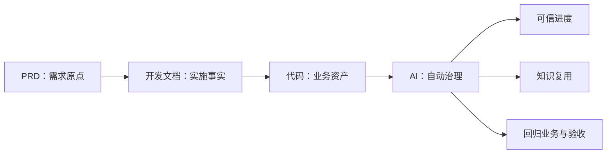

# AI 治理 WebPPT 北极星开篇

## 目标

封面后先回答“Forge 最终要把研发变成什么”，再进入当前问题。核心主张是：让 PRD、开发文档和代码成为可持续更新、可追踪、可复用的团队资产。

## 页面叙事

- PRD：承载需求价值、关联系统、工作量和验收口径；自动评估属于下一阶段能力。
- 开发文档：记录方案、边界和版本变化，使编码有迹可循，并为流程缺口分析提供材料。
- 代码：不只是交付物，还应反哺业务知识与代码知识。
- AI 自动治理：基于三类事实减少上下文整理、信息传递丢失和手工进度汇总。

## 视觉方案

使用一条发光的“资产炼化链”连接四个大型节点，辅以光晕、流动连线和状态标识。下方只展示三个大号组织结果，不使用后台 KPI 卡片。

## 能力边界

- 已有基础：PRD/开发文档版本管理、项目模块入口、业务知识与 Graphify 代码图谱、开发会话与文档留痕。
- 下一阶段：需求价值/工时自动评估、跨系统影响识别、基于 PRD/开发文档/代码的自动进度判断。

## 验收

- 页面位于封面之后、问题页之前。
- 一眼可读出“需求原点 → 实施事实 → 业务资产 → 自动治理”。
- 文字不超过四个节点说明和三个组织结果。
- 1280×720 无溢出，已实现与规划状态不混淆。
