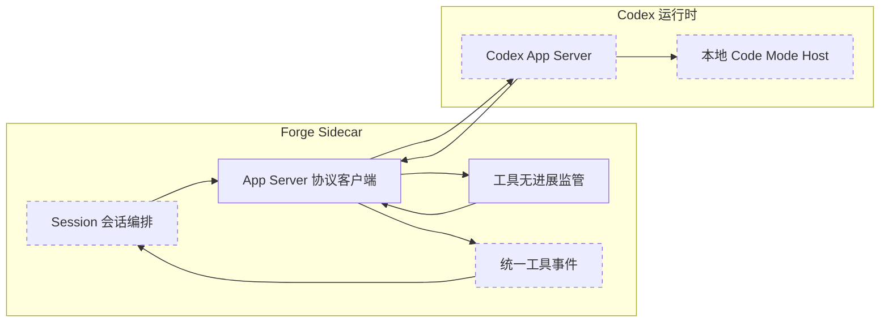
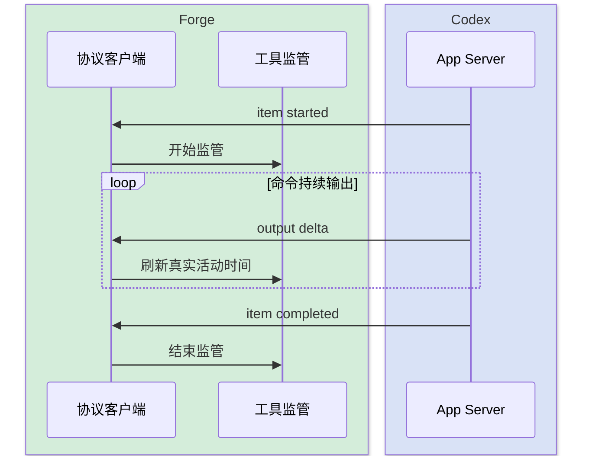
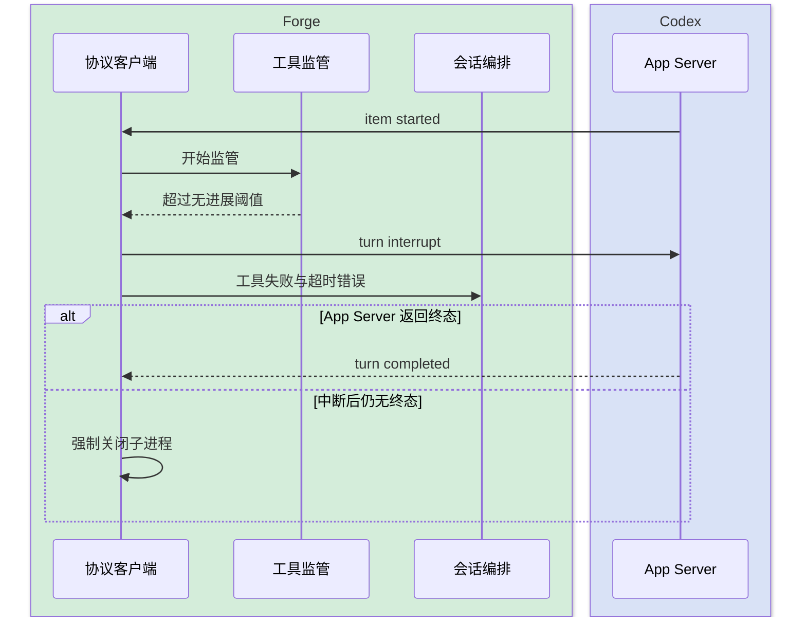
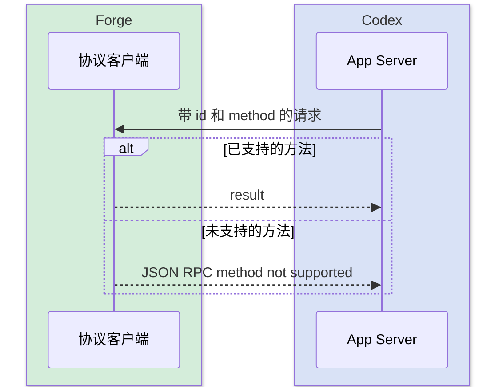

# Codex App Server 接入加固

## 1. 目标与边界

- **问题**：工具缺少完成事件时，Forge 因 Sidecar 存活而长期显示运行中；带 `id` 的服务端请求也可能被误当成客户端响应并丢弃。
- **目标**：建立版本匹配的消息分类、普通工具无进展监管和可控中断，使单个工具异常不能永久占用会话。
- **边界**：不替代 Codex 沙箱，不重放可能有副作用的操作；新增 `steer` 命令但兼容旧客户端与既有队列。
- **结论**：富客户端继续使用 App Server；Sidecar 集中补齐官方留给宿主的协议路由和生命周期监管。

---

## 2. 整体架构



---

## 3. 模块拆分与职责

### 3.1 App Server 协议客户端

- **定位**：Sidecar 内唯一理解 App Server JSON-RPC 的适配层。
- **职责**：区分响应、通知和服务端请求；维护当前轮；中断后缺失终态时强制清理。
- **上下游**：上游为 `codexEngine.ts`，下游为 Codex App Server 子进程。
- **关键设计**：依据当前 CLI 生成的 TypeScript schema 校验方法集合；未知服务端请求返回明确 JSON-RPC 错误，禁止静默丢弃。

### 3.2 工具无进展监管

- **定位**：普通 Shell 与动态工具的单轮生命周期守卫。
- **职责**：记录真实活动、发出可观察心跳、静默或总时长越界时终止当前轮。
- **关键设计**：只有 App Server 上游事件刷新空闲计时；监管心跳不刷新；MCP 继续由专用看门狗负责。

### 3.3 会话编排

- **定位**：保持现有会话状态机和统一事件契约。
- **职责**：将监管失败映射为明确终态，区分用户中断与系统超时。
- **关键设计**：不自动重放 Shell 或写操作，避免重复副作用。

---

## 4. 关键交互

### 4.1 正常长任务持续输出



### 4.2 工具静默卡死



### 4.3 服务端反向请求



---

## 5. 核心规则

| 规则 | 说明 |
|---|---|
| 消息先分类再处理 | 同时含 `id` 和 `method` 的消息是服务端请求，不能当客户端响应 |
| 真实活动才续期 | 开始、输出增量和工具进度可续期；本地 UI 心跳不可续期 |
| 普通工具不自动重放 | 超时只终止并报告失败，防止副作用重复执行 |
| MCP 保持专用策略 | MCP 隔离恢复继续由现有 `McpToolWatchdog` 处理 |
| 失败必须有终态 | 超时、中断或 App Server 退出时关闭未完成工具活动 |
| 阈值可配置 | 默认值保守，允许按机器和任务调整 |
| 回合终态与进程退出解耦 | `turn/completed` 释放业务状态；进程退出只负责资源回收 |
| 运行中补充走 steer | 官方 Codex 的纯文本补充进入当前 turn，不创建新 turn |

---

## 6. 编码落点

```text
sidecar/claude-agent/src/
├── codexAppServer.ts                 [修改] 消息分类、工具监管接线和中断收口
├── codexAppServer.test.ts            [修改] 反向请求分类和卡死收口测试
├── toolExecutionWatchdog.ts          [新增] 非 MCP 工具空闲与总时长监管
├── toolExecutionWatchdog.test.ts     [新增] 进展续期、静默超时和正常完成测试
├── codexEngine.ts                    [修改] 区分系统工具超时与用户中断
└── sessionManager.ts                 [修改] 向 Codex 轮次传递统一权限裁决
```

---

## 7. 数据与依赖变更

| 类型 | 是否变化 | 说明 |
|---|---|---|
| 数据库 | 无 | 不新增持久化状态 |
| 对外事件 | 有 | 浏览器新增 `steer` WS 命令；Sidecar 新增内部 `steer` 命令 |
| 外部依赖 | 无 | 使用现有 `@openai/codex` 0.147.0 |
| 配置 | 有 | 新增普通工具空闲、总时长和心跳环境变量 |

---

## 8. 风险与待确认

| 风险 | 影响 | 处理方式 |
|---|---|---|
| 合法任务长时间无输出 | 可能误判卡死 | 分钟级默认阈值且可配置；持续输出会续期 |
| 中断时外部孙进程存活 | 可能留下孤儿 | 先调用官方中断；异常收口失败时再强制关闭进程树 |
| 协议版本演进 | 手写类型漂移 | 升级时运行 `codex app-server generate-ts` 对照 schema |
| 动态工具有副作用 | 自动重试会重复执行 | 禁止普通工具自动重放 |

---

## 9. 验证要点

- 持续输出的正常命令不触发空闲超时。
- 无完成事件的 Shell 或动态工具产生失败终态并中断轮次。
- 工具完成后释放全部计时器。
- 客户端响应和服务端请求不再混淆，未知服务端请求明确失败。
- 用户中断仍为 `interrupted`，系统超时返回明确错误且不重复终态。

---

## 10. 连续输入与进程生命周期

### 10.1 输入语义

| 场景 | 行为 |
|---|---|
| 官方 Codex 正在运行，发送纯文本 | 调用 App Server `turn/steer`，追加到当前轮 |
| 正在运行时发送附件 | 进入持久待发送队列，下一轮发送 |
| Claude、第三方网关或其它引擎正在运行 | 保持原待发送队列语义 |
| 当前 turn 已结束或尚未取得 turn id | 拒绝 steer，并提示作为下一条消息发送 |

`turn/steer` 必须携带当前 `threadId` 与 `expectedTurnId`，防止迟到消息误写到新轮次。追加输入不重置 token、计时与回合状态，也不触发新的 `turn/start`。

### 10.2 正常完成后的资源回收

1. 收到根线程权威 `turn/completed` 后，立即发布 `result`，允许 Java 状态机回到空闲。
2. Sidecar 关闭 App Server stdin，让本轮隔离进程自然退出。
3. 进程退出检查在后台执行，不阻塞业务终态或待发送队列。
4. 仅当 10 秒内仍未自然退出时，Windows 才调用 `taskkill /T /F` 做资源兜底，并发出非终态 warning。

这一区分确保“Codex 已完成回答”和“操作系统进程树已回收”不再被错误地视为同一个条件。
