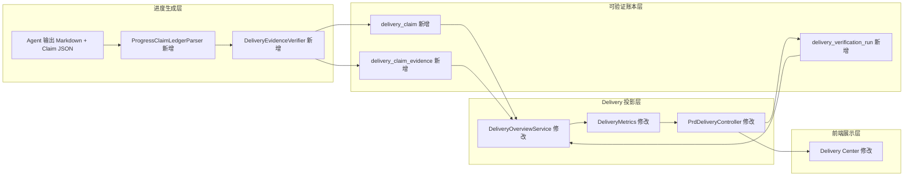
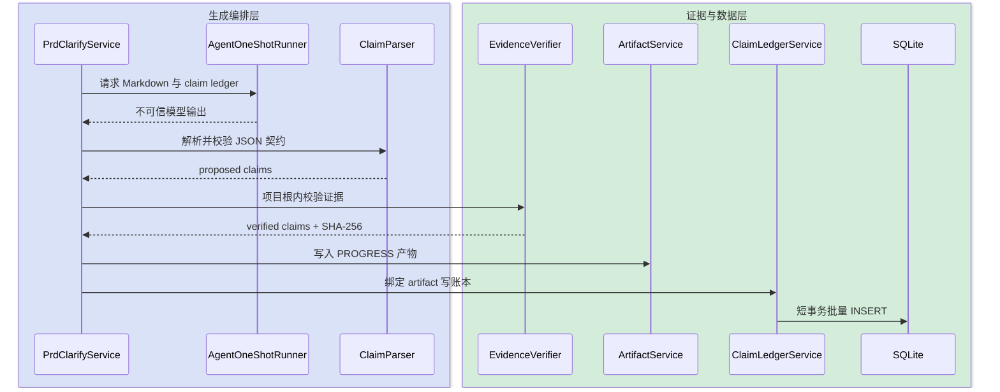
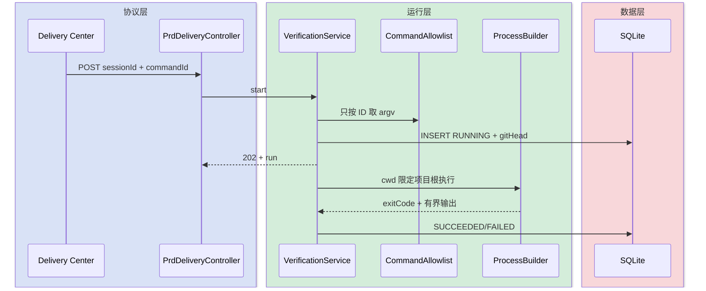
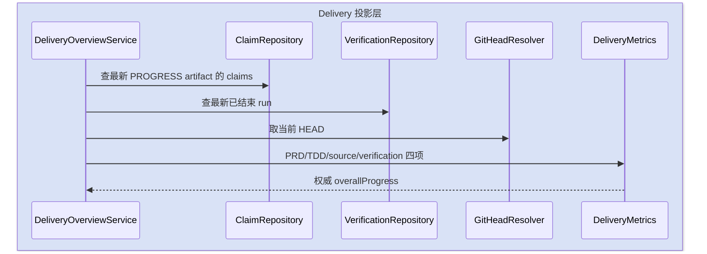
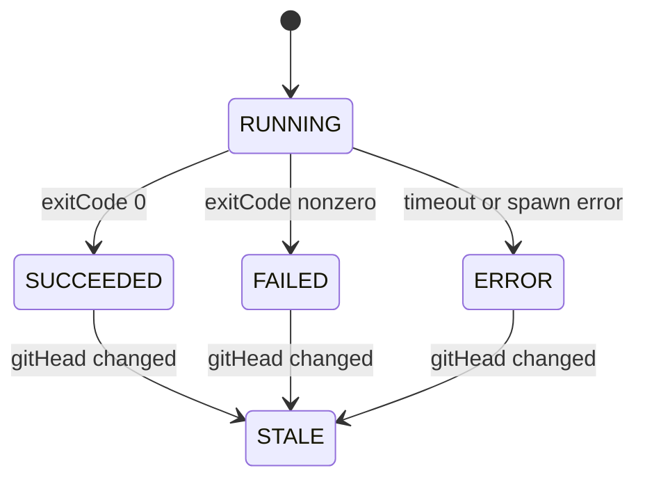

# Delivery 结构化证据与验证运行设计

本设计把 Delivery Center 的权威分数从“模型 Markdown 自述”迁移到“服务端验证的 claim ledger + 白名单构建/测试运行”，同时保留旧报告展示和 SSE 协议。

## 快速导航

- [目标与边界](#1-目标与边界)
- [整体架构](#2-整体架构)
- [模块职责](#3-模块拆分与职责)
- [关键交互](#4-关键交互)
- [核心规则](#5-核心业务规则)
- [编码落点](#6-编码落点)
- [数据变更](#7-数据与依赖变更)
- [验证](#9-验证要点)

## 变更记录

| 版本 | 日期 | 修改人 | 摘要 |
|---|---|---|---|
| v1 | 2026-08-14 | Codex | 结构化 claims、路径/hash 验证、白名单 verification run 与服务端唯一评分 |
| v1.1 | 2026-08-14 | Codex | 首批实现完成；补充服务端两套总进度和前端手动验证入口 |

---

## 1. 目标与边界

- 目标：已完成/部分/缺失结论只在结构化 claim 通过服务端证据校验后计入代码分。
- 目标：人工验证只提交 `commandId`，命令 argv 由受信任服务端配置提供。
- 目标：记录 `gitHead/commandId/exitCode/outputSummary/timestamps`，源码变化后旧 run 自动 stale。
- 兼容：保留进度 Markdown、SSE、旧 progress 产物与 GET overview 的旧字段。
- 不做：不接受前端 shell 字符串；不运行自动部署；不删除 legacy parser；不使用 Docker/MQ/调度器。

---

## 2. 整体架构



依赖方向保持 `api -> application/delivery -> domain/repository`。Agent 只提议 claim 与证据坐标，路径边界、文件存在、行范围和 SHA-256 由 Java 确定性裁决。

---

## 3. 模块拆分与职责

### 3.1 Claim 解析与证据校验

- `ProgressClaimLedgerParser`：只解析固定 marker 内 JSON，校验封闭状态、claimId 唯一、字段上限。
- `DeliveryEvidenceVerifier`：将相对路径解析到已配置项目根，拒绝越界和符号链接逃逸，验证行范围并计算整文件 SHA-256。
- `DeliveryClaimLedgerService`：在产物 READY 后以短事务写入 claim/evidence；读取时按 artifact 身份获取不可变快照。

### 3.2 白名单验证运行

- `DeliveryVerificationProperties`：管理受信任 `commandId -> executable + args + timeout`。
- `DeliveryVerificationService`：解析 session 项目根、取 Git HEAD、先写 RUNNING，再在虚拟线程运行显式 argv。
- 不经 shell；`cwd` 固定为项目根；输出截断并脱敏；同一 session 同时最多一个 RUNNING。

### 3.3 权威投影

- `DeliveryOverviewService` 优先读取 claim ledger；无 ledger 的旧报告仅作 legacy 展示，不计入 verified source score。
- 服务端返回单需求 `overallProgress`、`overallProgressVariants`、`verification`与证据统计，前端删除权重公式。

---

## 4. 关键交互

### 4.1 进度评估写入结构化 ledger



### 4.2 手动运行白名单命令



### 4.3 投影与过期判定



### 4.4 状态机



`STALE` 是读模型派生状态，不覆盖原始运行结果。

---

## 5. 核心业务规则

| 规则 | 裁决 |
|---|---|
| Claim 状态 | 只允许 `COMPLETED/PARTIAL/MISSING` |
| 完成证据 | `COMPLETED` 至少一条 `VERIFIED` 证据，否则降为 `PARTIAL` |
| 证据路径 | 必须是项目根下的规范化相对路径 |
| 行范围 | `1 <= start <= end <= fileLineCount`，不允许空文件伪证据 |
| 文件哈希 | 服务端对实际文件计算 SHA-256，模型不提供权威哈希 |
| Legacy 报告 | 可展示，`evidenceMode=LEGACY_UNVERIFIED`，代码分为未评估 |
| 测试标记 | `TEST_SCORING` 只保留历史展示，不改变权威 claims |
| 整体分 | PRD 10 + TDD 10 + verified source 60 + verification 20 |
| 验证未执行 | `verification=UNASSESSED`，20 分不贡献且降低 confidence |
| 命令安全 | 前端不传 executable/args/cwd，服务端不经 shell |
| 输出隐私 | 只保留有界摘要，不保存环境变量和完整日志 |

---

## 6. 编码落点

```text
tools/tool-prd-clarify/src/main/java/.../prdclarify/
├── api/PrdDeliveryController.java                         [修改] 启动验证运行
├── api/dto/DeliveryOverviewView.java                     [修改] 返回权威分与证据状态
├── api/dto/StartDeliveryVerificationRequest.java         [新增] 只允许 commandId
├── config/DeliveryVerificationProperties.java            [新增] 命令白名单
├── delivery/ProgressClaimLedgerParser.java               [新增] 结构化输出契约
├── delivery/DeliveryEvidenceVerifier.java                [新增] 路径、行号和 hash 裁决
├── delivery/DeliveryClaimLedgerService.java              [新增] ledger 事务与读模型
├── delivery/DeliveryVerificationService.java             [新增] 手动验证编排
├── delivery/DeliveryOverviewService.java                 [修改] 唯一评分事实源
├── delivery/DeliveryMetrics.java                         [修改] 10/10/60/20
├── domain/DeliveryClaim*.java                            [新增] claim/evidence 领域契约
├── domain/DeliveryVerification*.java                     [新增] run 领域契约
├── repository/DeliveryClaimRepository.java              [新增] claim/evidence 持久化
├── repository/DeliveryVerificationRunRepository.java    [新增] run 持久化
└── service/PrdClarifyService.java                        [修改] 产物后写 ledger

frontend/src/features/delivery-center/
├── api.ts                                                [修改] commandId API
├── types.ts                                              [修改] 证据/运行投影
└── viewModel.ts                                          [修改] 删除权重公式
```

---

## 7. 数据与依赖变更

新增三张 additive 表：`delivery_claim`、`delivery_claim_evidence`、`delivery_verification_run`。不删除 `prd_session` 字段，不改动 `prd_artifact`。

- claim 以 `(artifact_id, claim_id)` 唯一，不可变快照不覆盖。
- evidence 作为 claim 子项，记录相对路径、行范围、符号、hash 和验证状态。
- run 使用 `status='RUNNING'` 条件更新保证首个终态胜出。
- 不新增 Maven/npm 依赖；仅使用 JDK `ProcessBuilder`、NIO 和已有 Jackson/JdbcTemplate。

---

## 8. 风险与兼容

| 风险 | 处理 |
|---|---|
| Agent 不输出合法 JSON | 本次评估失败，保留上一版产物 |
| 产物 READY 后 ledger 写失败 | 产物可展示但标为 unverified，不计分；不伪装成成功 |
| 构建输出过大 | 持续排空进程输出，只保留最新 32 KiB 脱敏摘要 |
| 进程超时 | 强制终止并记 `ERROR`，不影响当前服务 |
| 项目目录被替换为符号链接 | 使用 real path 再次校验必须位于 real project root |
| 旧前端不识别新字段 | 新字段全部 additive，旧字段继续返回 |

---

## 9. 验证要点

- 成功：合法路径/行号生成 VERIFIED evidence，hash 与文件一致。
- 失败：`../`、绝对路径、符号链接越界、文件缺失、行号越界均不可计分。
- 事务：claim 批量中任一 INSERT 失败时整个 ledger 回滚。
- 安全：API 传入任意 executable/args 不能进入运行链；未配置 commandId 立即拒绝。
- 并发：同 session 已有 RUNNING 时第二次启动失败且不新增进程。
- 过期：同一 Git HEAD 的 SUCCEEDED 可重用；HEAD 变化后投影为 STALE。
- 评分：Markdown 加入 `TEST_SCORING` marker 不能改变 claim 或 overallProgress。
- 回归：旧报告仍可展示，但 evidence mode 明确为 legacy/unverified。
