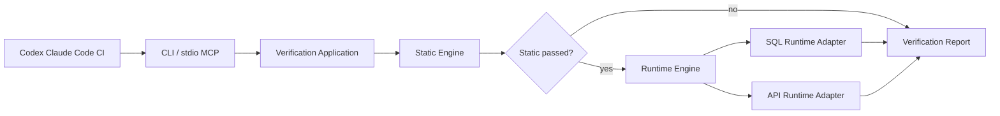

# Forge Verification 设计

Forge Verification 是供 Codex、Claude Code 与 CI 共同调用的引擎无关验证平台，由低成本静态门禁和项目事实驱动的运行验证两层组成。

## 1. 目标与边界

- 提供 CLI 分阶段命令，以及供 Coding Agent 调用的统一 MCP 工具 `forge_verify`。
- 支持同一项目同时启用多个持久化框架。
- 首批交付 Java 技术栈探测与 MyBatis 参数绑定检查，验证插件边界。
- 不在 Core 中引用 MyBatis、JPA、Spring 或具体数据库概念。
- Runtime SQL 首批只允许只读语句，不执行数据库变更，不调用 LLM，不自动修改被检查项目。

---

## 2. 架构



依赖方向为 `cli/mcp -> application -> core/runtime`、`plugin-java -> core`。CLI 与 MCP 都是薄适配器，编排只存在于 Application 层。静态规则来自通用插件，Runtime 场景来自项目 `.forge/verify.yml`，两类资产不互相复制。

---

## 3. 核心模型

| 模型 | 职责 |
|---|---|
| `ChangeSet` | 项目根、候选文件和执行上下文 |
| `QualityChecker` | 声明 Gate ID、领域、适用条件并返回发现项 |
| `StackDetector` | 从构建文件和目录证据识别技术栈 |
| `QualityPlugin` | 聚合一个可独立装卸的探测器与检查器集合 |
| `GateRouter` | 只运行适用于当前 Stack 与 ChangeSet 的 Checker |
| `QualityReport` | 汇总状态、发现项、证据、已加载插件和耗时 |
| `RuntimeScenario` | 项目业务验证用例及其类型化配置 |
| `RuntimeVerifier` | 真实执行一类场景的 Adapter SPI |
| `RuntimeVerificationReport` | 汇总真实执行结果、耗时与脱敏错误 |
| `VerificationReport` | 聚合 Static 与 Runtime 两段结果及短路原因 |

发现项严重级别固定为 `INFO`、`WARNING`、`ERROR`；状态固定为 `PASSED`、`FAILED`。命令退出码为 0 表示通过，1 表示发现阻断问题，2 表示调用或配置错误。

---

## 4. 插件契约

插件通过 `META-INF/services` 注册。插件 ID、Checker ID 和 Stack capability 都是稳定字符串，新增 Adapter 不修改 Core。

首批 Java 插件提供：

- Maven、Java、Spring Boot、JPA、MyBatis、MyBatis-Plus、Flyway、Liquibase 探测。
- `MYBATIS-001`：Mapper XML 中 `#{...}` 参数必须能在对应 Mapper 方法参数、`@Param` 名或单对象属性中解析。
- MyBatis 未被探测到时不运行该 Checker。

后续 JPA、SQL、OpenAPI、前端插件沿用同一 SPI，不把专属规则登记为通用 SQL Gate。

Runtime 首批提供：

- `SQL-RUNTIME-001`：通过 JDBC 真实 prepare、bind、executeQuery，仅允许 `SELECT`、`WITH`、`EXPLAIN`。
- `API-RUNTIME-001`：通过 JDK HTTP Client 真实请求服务，验证预期状态码与必要 JSON 字段。
- Runtime Verifier 通过独立 `ServiceLoader` SPI 加载，不注册为静态 Checker。

---

## 5. 引擎调用契约

```text
forge verify static --project <path> --format json
forge verify runtime --project <path> --format json
forge verify --project <path> --format json
```

无阶段参数时先执行 Static；Static 失败时 Runtime 状态为 `SKIPPED`。Agent 必须以退出码和 JSON `status` 为裁决依据，不从人类文本猜测结果。

MCP 只暴露一个工具：

```json
{
  "name": "forge_verify",
  "arguments": {
    "project": "D:/workspace/project",
    "phase": "all"
  }
}
```

`phase` 支持 `static`、`runtime`、`all`，缺省为 `all`。验证结论 `FAILED` 是一次成功的 MCP 调用结果；仅参数、路径或配置错误返回 `isError=true`。stdio 的标准输出只承载 MCP 协议帧，诊断信息只能进入标准错误。

项目运行场景示例：

```yaml
runtime:
  scenarios:
    - id: select-supplier-quote
      type: sql
      jdbcUrl: jdbc:postgresql://localhost:5432/srm_test
      usernameEnv: FORGE_DB_USERNAME
      passwordEnv: FORGE_DB_PASSWORD
      sql: SELECT quote_price FROM supplier_quote WHERE supplier_id = ?
      params:
        - 10001
      timeoutSeconds: 10

    - id: submit-supplier-quote
      type: api
      url: http://localhost:8080/api/supplier/quote
      method: POST
      headers:
        Authorization: ${FORGE_API_AUTHORIZATION}
      body:
        supplierId: 10001
        price: 12.5
      expectStatus: 200
      requiredJsonPaths:
        - data.id
```

场景文件是项目业务事实，应该使用专用测试数据和测试/开发环境；通用插件不得内置业务 ID、URL 或请求体。

---

## 6. 安全与失败行为

- 项目路径必须存在且为目录。
- XML 使用禁用外部实体的安全解析配置。
- 单个 Checker 异常转为带 Checker ID 的错误发现，不能让其他检查结果丢失。
- SQL 只接受只读语句，参数使用 `PreparedStatement`，连接凭据只通过环境变量名引用。
- HTTP Header 中的敏感值只通过环境变量占位符引用，报告不回显 Header、请求体或凭据。
- Runtime 超时必须有显式上限，单个场景失败不能丢失其他场景结果。
- 首批 Runtime 不负责启动服务；API 场景要求目标服务已由开发脚本或 CI Fixture 启动。
- `init` 仅在目标不存在时创建 `.forge/quality.yml` 和 `.forge/verify.yml` 示例。
- 自动探测以证据列表说明为何启用 capability，不把推断宣称为运行时事实。

---

## 7. 验证

- Core 单测覆盖插件发现、路由、异常隔离和报告状态。
- Java 插件单测覆盖技术栈探测、合法绑定、缺失绑定及动态 SQL节点。
- Runtime 单测使用隔离测试数据库和本地 HTTP Server，覆盖成功、真实 SQL 错误、500、状态不匹配和安全拒绝。
- CLI 集成测试覆盖双层短路、分阶段执行、JSON 与退出码。
- MCP 测试覆盖统一工具 Schema、结构化结果和调用错误语义。
- Maven reactor 构建六个 Forge 模块，证明两类 SPI 可被 CLI 与 MCP 跨 Jar 复用。
