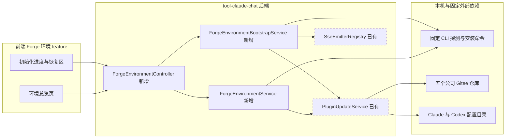
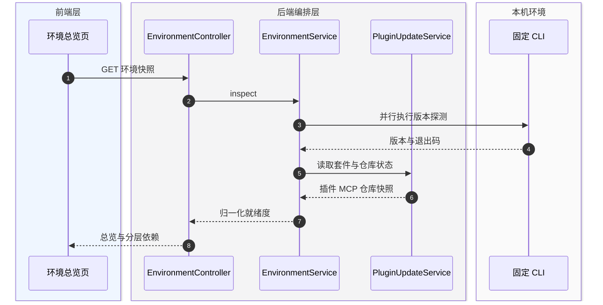
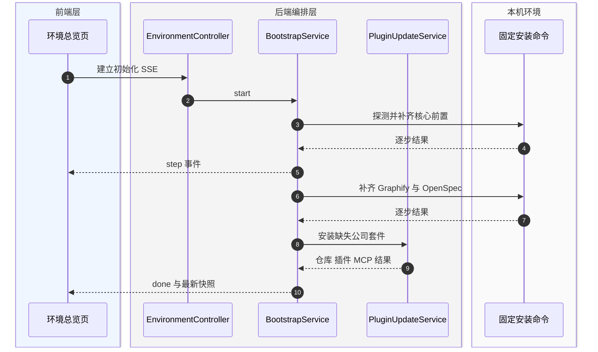
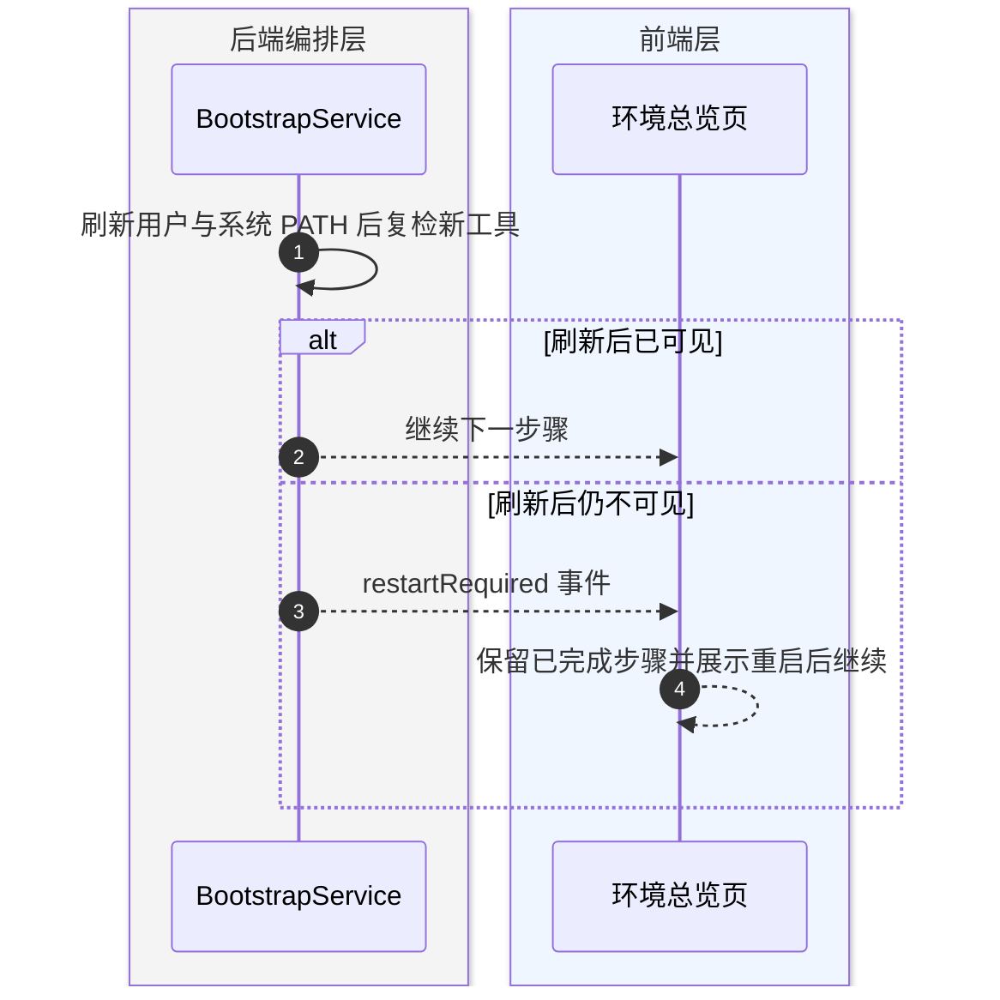
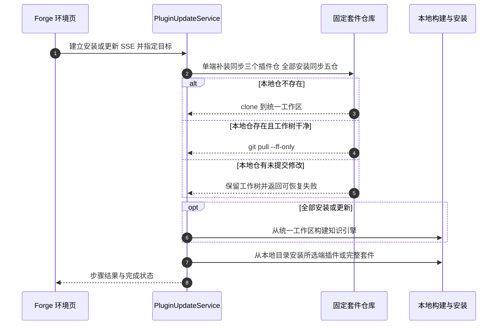

# Forge 研发环境看板技术方案

Forge 研发环境看板把本机基础运行时、AI 研发工具和公司套件收敛成一个可检测、可补齐、可恢复的初始化入口，避免用户在聊天设置、终端命令和多个仓库之间来回确认。

## 变更记录

| 版本 | 日期 | 修改人 | 变更内容摘要 |
|---|---|---|---|
| v1 | 2026-08-26 | Codex | 建立 Forge 环境检测、一键初始化与公司套件聚合方案 |
| v2 | 2026-08-26 | Codex | 增加公司套件一键安装与一键更新，统一本地工作区和本地安装链路 |

---

## 1. 目标与边界

- **要解决的问题**：Forge 当前把基础 CLI 检测和公司套件安装藏在 Vibe Coding 插件面板内；Graphify、OpenSpec、Python 与本地构建链没有统一可见状态，新机器无法快速判断“能否完整工作”。
- **本次目标**：新增独立 Forge 环境看板，聚合本机工具、公司插件、MCP 与依赖仓库状态；提供固定白名单命令驱动的一键初始化；失败后保留步骤、诊断和恢复动作。
- **不做什么**：不允许前端提交任意 shell 命令；不自动填写账号凭据；不在看板中初始化某个业务项目的 OpenSpec 目录；不新增数据库表、调度器或消息中间件。
- **设计结论**：在 `tool-claude-chat` 复用现有 `PluginUpdateService`，新增 Forge 环境聚合与初始化编排；前端以独立 `forge-environment` feature 呈现分层就绪度。

依赖分层如下：

| 层级 | 依赖 | 就绪口径 |
|---|---|---|
| 核心前置 | Git、Node.js/npm、Python、uv、Claude Code、Codex CLI | 命令可执行且满足最低版本；缺失会阻断相关后续步骤 |
| 研发方法工具 | Graphify、OpenSpec | CLI 可执行；Graphify 使用 `graphifyy` 包，OpenSpec 要求 Node.js 20.19+ |
| 公司套件 | `project-coding-profiles`、`team-standards`、`yoooni-daily-plugin` | Claude Code 与 Codex 两端安装状态可见 |
| 公司知识能力 | `domain-knowledge`、`cross-topology` | MCP 已注册，知识仓存在且引擎已构建 |
| 公司依赖仓 | 五个固定 Gitee 仓库 | 本地仓存在、origin 匹配、提交状态可读 |
| 本地源码构建 | Java 21、Maven 使用 Java 21 | 作为完整开发链告警；不阻断已打包 Forge 的环境初始化 |

---

## 2. 整体架构



依赖方向保持 `presentation -> application -> infrastructure`：Controller 只适配 HTTP/SSE；聚合和步骤编排位于 Service；进程执行只接受代码内固定 argv。

---

## 3. 模块拆分与职责

### 3.1 ForgeEnvironmentService

- **定位**：环境就绪度的只读聚合服务。
- **职责**：
  - 探测固定 CLI、最低版本和 Maven 实际使用的 Java 版本。
  - 聚合现有公司套件与依赖仓库状态。
  - 归一化总览状态、阻断项、告警项和下一步动作。
- **上游**：`ForgeEnvironmentController`。
- **下游**：固定命令探测器、`PluginUpdateService`。
- **关键设计点**：单项失败不拖垮全量快照；输出有界诊断；不读取或返回凭据。

### 3.2 ForgeEnvironmentBootstrapService

- **定位**：用户点击后的一键初始化用例编排。
- **职责**：
  - 按依赖拓扑安装缺失工具，而非简单并行执行。
  - 在基础工具就绪后委托现有公司套件安装能力。
  - 通过 SSE 推送步骤状态并给出重启后继续、重试或手工命令。
- **上游**：`ForgeEnvironmentController`。
- **下游**：固定进程执行器、`PluginUpdateService`、`SseEmitterRegistry`。
- **关键设计点**：同一时间只允许一个初始化任务；已就绪步骤幂等跳过；安装后刷新子进程 PATH，只有复检仍不可见时才要求重启 Forge。

### 3.3 forge-environment 前端 feature

- **定位**：Forge 环境初始化和持续检测的独立系统页面。
- **职责**：
  - 展示总览结论、阻断项和最近检测时间。
  - 按“核心前置、研发工具、公司套件、构建链”分区展示状态。
  - 执行一键初始化、实时展示步骤，并在结束后刷新快照。
  - 独立展示三个团队插件在 Claude Code、Codex 双端的版本，并提供单端补装、全部安装与一键更新；所有操作共享进度区和本地优先执行规则。
- **上游**：系统菜单与路由。
- **下游**：Forge 环境 API 与 SSE。
- **关键设计点**：采用 `Page -> Section -> Content`，以分割线和排版建立层级；失败态保留 Context、Explanation、Recovery Action。

---

## 4. 关键交互

### 4.1 读取环境快照

> 触发：进入页面或手动点击重新检测。
> 参与方：页面、聚合服务、现有公司套件服务、本机命令。



### 4.2 一键初始化

> 触发：用户点击“一键初始化”。
> 参与方：页面、初始化编排、固定安装命令、公司套件安装服务。



### 4.3 PATH 变化后的恢复

> 触发：包管理器报告安装成功，但当前 Forge 进程仍解析不到新命令。
> 参与方：初始化编排与页面。



### 4.4 公司套件一键安装与更新

> 触发：用户在公司套件操作区点击“补装 Claude 插件”“补装 Codex 插件”“一键安装全部套件”或“一键更新套件”。
> 参与方：页面、套件更新服务、固定 Git 仓库、本地构建与安装命令。



### 4.5 业务系统源码一键拉取

Forge 环境页复用固定业务仓库目录与只拉取同步能力，展示 ERP、ERP 小程序、SRM、SCM 四个系统及其六个 Git 仓库。默认源码根目录固定为 `${user.home}/.kai-toolbox/sources`，首次拉取时自动创建，无需配置；显式 `toolbox.claude-chat.business-workspace.root` 仅用于需要放到其他磁盘的覆盖场景。

目录结构固定为 `yoooni`、`frontend`、`srm-system/{srm,srm-admin-front-end}`、`scm-system/{SCM,scm-front-end}`。目标不存在时执行 clone；已存在且干净、远端匹配时仅 fetch 与 `pull --ff-only`；未提交修改、本地领先、分叉、远端不匹配或非 Git 占位目录一律跳过并保留现场。

### 4.6 业务仓库 OpenSpec 双端初始化

业务源码状态按六个 Git 仓库分别检查 OpenSpec 根、Claude Code Skill 与 Codex Skill。完整就绪必须同时存在 `openspec/config.yaml`、`.claude/skills/openspec-*/SKILL.md` 和 `.agents/skills/openspec-*/SKILL.md`；SRM、SCM 的系统父目录只承担聚合，不作为 OpenSpec 根。

用户显式点击“一键初始化 OpenSpec”后，Forge 只对已拉取、远端匹配且工作树干净的缺失仓库执行 `openspec init . --tools claude,codex --no-animation`。未拉取、非 Git、远端不匹配或存在本地修改的仓库跳过并返回逐仓库原因，不使用 `--force`，不清理用户自定义文件。

---

## 5. 核心业务规则

| 规则 | 说明 |
|---|---|
| 固定命令白名单 | API 不接收命令、包名或脚本路径；所有探测与安装 argv 在后端代码中声明 |
| 分层阻断 | Git、Node、Python/uv 与 AI CLI 按下游关系决定阻断；Java/Maven 构建链只告警，不阻断已部署应用 |
| 版本门禁 | OpenSpec 要求 Node.js 20.19+；Graphify 要求 Python 3.10+；Forge 源码构建要求 Java 21 |
| 幂等补齐 | 已安装工具与已配置套件跳过，不在“初始化”动作中强制升级 |
| 安装顺序 | Git、Node 就绪后先安装 uv，再由 uv 补齐 Python，随后安装 Claude Code、Codex CLI、Graphify、OpenSpec 和公司套件 |
| 凭据边界 | 不采集、不展示、不代填 Git、Claude 或 Codex 凭据；鉴权失败提供官方登录动作 |
| 可恢复状态 | 失败必须携带步骤、简短诊断、可复制命令或重试动作；不得只显示“初始化失败” |
| 单任务约束 | 同一 Forge 进程只运行一个环境初始化任务，避免多个包管理器并发修改全局目录 |
| 来源约束 | 公司依赖默认使用 Gitee；固定仓库和目录沿用 `PluginUpdateService` 的白名单 |
| 统一工作区 | 公司套件源码固定落在 `${user.home}/.kai-toolbox/team-tools`，安装和更新不得从临时目录或远端包地址直接执行 |
| 业务源码根 | 业务源码默认落在 `${user.home}/.kai-toolbox/sources` 并自动纳入工作区；显式业务根配置优先 |
| 固定目录 | SRM 与 SCM 以系统父目录聚合前后端仓库；ERP 与 ERP 小程序保持单仓一级目录 |
| 安全同步 | 仅允许固定 wyoooni Gitee 地址；只 clone、fetch、`pull --ff-only`，不得自动提交、重置、删除或改写 origin |
| OpenSpec 仓库边界 | 六个 Git 仓库分别检查和初始化；系统父目录不得生成混合规格根 |
| OpenSpec 双端就绪 | 同时存在配置根、Claude Skill 与 Codex 共享 Skill 才标记就绪；旧 `.codex/skills` 不作为当前 Codex 就绪证据 |
| OpenSpec 写入保护 | 仅由用户显式触发，工作树非干净状态一律跳过；禁止传递 `--force` |
| 本地优先链路 | 一键安装和一键更新都必须先同步五个固定 Git 仓库，再从统一工作区完成构建、插件安装或更新和 MCP 安装 |
| Git 安全 | 已存在仓库仅在工作树干净时执行 `git pull --ff-only`；不删除本地仓、不覆盖未提交修改；已有非默认 origin 可沿用并明确展示，新克隆默认 Gitee |

---

## 6. 编码落点

```text
tools/tool-claude-chat/src/main/java/com/exceptioncoder/toolbox/claudechat/
├── api/
│   ├── ForgeEnvironmentController.java                 [新增] 暴露快照与初始化 SSE
│   └── dto/ForgeEnvironmentView.java                   [新增] 定义总览、分组和步骤视图
└── service/
    ├── ForgeEnvironmentService.java                    [新增] 聚合 CLI、套件和仓库就绪度
    ├── ForgeEnvironmentBootstrapService.java           [新增] 编排固定安装步骤与恢复状态
    └── PluginUpdateService.java                        [修改] 提取可复用的同步安装执行入口

tools/tool-claude-chat/src/test/java/com/exceptioncoder/toolbox/claudechat/service/
├── ForgeEnvironmentServiceTest.java                    [新增] 覆盖状态归一化和版本门禁
└── ForgeEnvironmentBootstrapServiceTest.java           [新增] 覆盖跳过、阻断、恢复与完成路径

frontend/src/features/forge-environment/
├── index.tsx                                           [新增] 注册系统菜单与路由
├── api.ts                                              [新增] 封装快照与初始化 SSE 地址
├── types.ts                                            [新增] 前端环境契约
├── components/
│   ├── ReadinessSummary.tsx                            [新增] 总览结论与主操作
│   ├── DependencySection.tsx                           [新增] 分组依赖状态清单
│   ├── SuiteOperations.tsx                             [新增] 公司套件安装与更新操作区
│   └── BootstrapProgress.tsx                           [新增] 初始化步骤与恢复动作
└── pages/ForgeEnvironmentPage.tsx                      [新增] 页面级查询与交互编排
```

调用关系：`ForgeEnvironmentPage` → `ForgeEnvironmentController` → `ForgeEnvironmentService` / `ForgeEnvironmentBootstrapService` → 固定 CLI 与 `PluginUpdateService`。

---

## 7. 数据与依赖变更

| 类型 | 是否变化 | 说明 |
|---|---|---|
| 数据库表 / 字段 / 索引 | 无 | 环境状态实时探测，不持久化 |
| DTO / VO / 枚举 | 有 | 新增 Forge 环境快照、依赖状态和 SSE 步骤契约 |
| 下游接口 / 外部依赖 | 有 | 固定调用 Git、Node/npm、Python/uv、Claude、Codex、Graphify、OpenSpec 与 Gitee |
| 缓存 / 消息 / 锁 / 事务 | 无 | 仅使用进程内单任务互斥和现有 SSE，不引入新基础设施 |

当前外部基线：OpenSpec 官方安装为 `npm install -g @fission-ai/openspec@latest`，最低 Node.js 20.19；Graphify 官方包名为 `graphifyy`，推荐 `uv tool install graphifyy`，最低 Python 3.10。安装命令必须集中配置并由测试锁定。

---

## 8. 风险与待确认

| 风险 / 待确认点 | 影响 | 处理方式 |
|---|---|---|
| 包管理器安装后当前 Java 进程 PATH 未刷新 | 新安装 CLI 在后续步骤中不可见 | 重新读取 Windows 用户与系统 PATH 并复检；仍不可见才返回 `restartRequired` |
| Git 私有仓鉴权需要交互 | 后台 SSE 无法完成登录 | 不采集凭据；展示对应 origin 的登录/凭据恢复说明后重试 |
| OpenSpec 初始化会写入业务仓库 | 可能与用户在途修改混合 | 独立操作、逐仓执行、脏工作树跳过且不使用 `--force` |
| 本地套件仓存在未提交修改 | 拉取可能覆盖或混入用户工作 | 阻止拉取和安装，保留本地内容并提示用户先提交或暂存 |
| 全局 npm 或 uv 目录权限不足 | CLI 安装失败 | 保留原始退出码和有界输出，提供可复制官方命令；Windows 的 npm 命令固定使用 `npm.cmd`，绕开 PowerShell 脚本执行策略 |
| Maven 实际使用 Java 8 | Forge 源码构建可能失败 | 单独检测 `mvn --version` 的 Java 行并标为构建链告警 |
| 用户只使用 Codex 或只使用 Claude | 另一端缺失导致总览长期不完整 | 核心完整模式默认双端必需；后续可增加显式运行模式，不在首版自动降级 |
| 现有工作树有大量并行修改 | 容易误改用户变更 | 新 feature 与新增类优先；修改 `PluginUpdateService` 时只做最小可复用提取 |

---

## 9. 验证要点

- **正常路径**：所有工具已就绪时快照为 `READY`；初始化幂等跳过工具并补齐公司套件；套件安装和更新均先同步五仓再从本地安装；结束后自动刷新。
- **异常路径**：缺少包管理器、版本过低、命令超时、Gitee 鉴权失败、npm/uv 安装失败、SSE 中断均能定位到具体步骤并给恢复动作。
- **边界条件**：Node 已装但 npm 缺失；Python 版本过低；Maven 使用非 Java 21；插件只装一端；MCP 已配置但知识仓缺失；仓库 origin 不匹配。
- **前端验证**：桌面与移动视口；加载、全就绪、部分缺失、执行中、失败、需要重启六类状态；键盘焦点与 reduced motion。
- **回归范围**：现有 Vibe Coding 插件面板的检测、安装、更新、仓库差异查看不变；`npm run typecheck`、相关 Vitest、`mvn -pl tools/tool-claude-chat -am test` 和真实浏览器检查通过。
