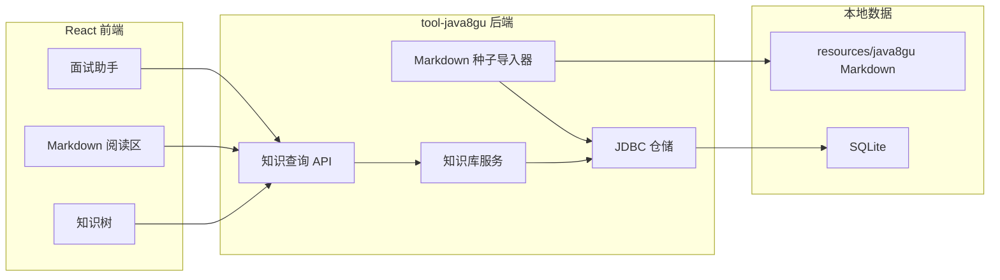

# Java8 股模块重构技术方案

## 1. 目标与边界

- 将 `/tools/java8gu` 从远程文章题库入口升级为本地知识节点阅读系统。
- 保留现有问答、知识补全及旧题目路由，避免破坏已有使用方式。
- 本轮交付知识树、Markdown 阅读、代码前后对比、面试卡片、ERP 场景及关联跳转。
- 图谱可视化、在线编辑和 AI 自动改码不在本轮范围。

---

## 2. 整体架构



---

## 3. 核心规则

- Markdown 是版本化种子，SQLite 是运行时查询投影；只在稳定键不存在时导入，不覆盖已有数据。
- 分类和知识节点共用 `java8_node`，通过 `parent_id` 形成树。
- 示例、面试卡片和关系独立存储，通过节点 ID 聚合为详情。
- 所有 DDL 使用 `IF NOT EXISTS`，符合启动期重复执行约束。
- UI 菜单仍由 `FeatureManifest` 管理，后端不参与菜单生成。

---

## 4. 编码落点

```text
tools/tool-java8gu/
├── src/main/resources/db/java8gu-schema.sql                 [修改] 新增知识库四张表与索引
├── src/main/resources/java8gu/nodes/                        [新增] 本地 Markdown 知识种子
└── src/main/java/com/exceptioncoder/toolbox/java8gu/
    ├── api/Java8guKnowledgeController.java                  [新增] 查询接口
    ├── domain/Java8Knowledge.java                            [新增] 聚合与枚举
    ├── repository/Java8KnowledgeRepository.java             [新增] JDBC 查询和幂等写入
    └── service/Java8KnowledgeService.java                    [新增] 初始化与查询编排

frontend/src/features/java8gu/
├── api/knowledgeApi.ts                                      [新增] 类型化 API 客户端
├── components/KnowledgeTree.tsx                             [新增] 左侧知识树
├── components/InterviewAssistant.tsx                        [新增] 右侧面试卡片
└── pages/Java8guHubPage.tsx                                 [修改] 三栏知识库首页
```

---

## 5. 数据与依赖变更

| 类型 | 变化 | 说明 |
|---|---|---|
| SQLite | 有 | 新增 `java8_node`、`java8_relation`、`java8_example`、`java8_interview` |
| HTTP API | 有 | 新增 `/api/java8/*` 只读接口 |
| 外部依赖 | 无 | 复用 Spring JDBC 与现有 Markdown 渲染能力 |
| 既有契约 | 无破坏 | `/api/java8gu/*` 与旧前端路由继续保留 |

---

## 6. 验证要点

- 后端模块测试验证种子幂等导入、树查询、详情聚合和不存在节点。
- 前端执行 typecheck 与 build。
- 页面验证树选择、代码对比、面试卡片和关联节点跳转。
