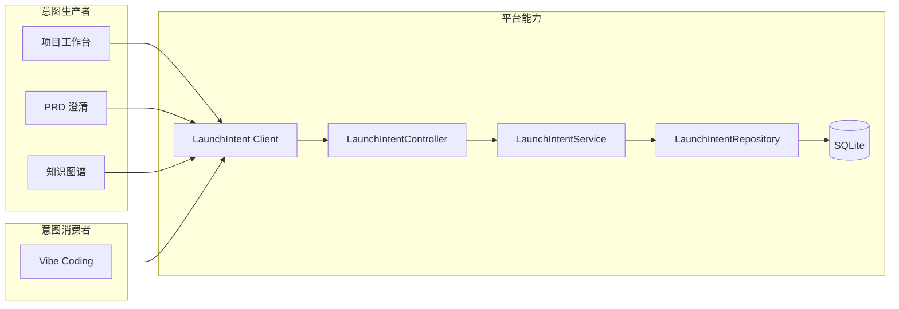
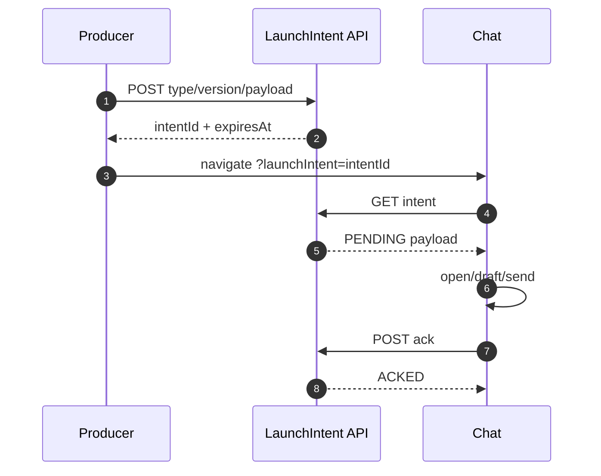
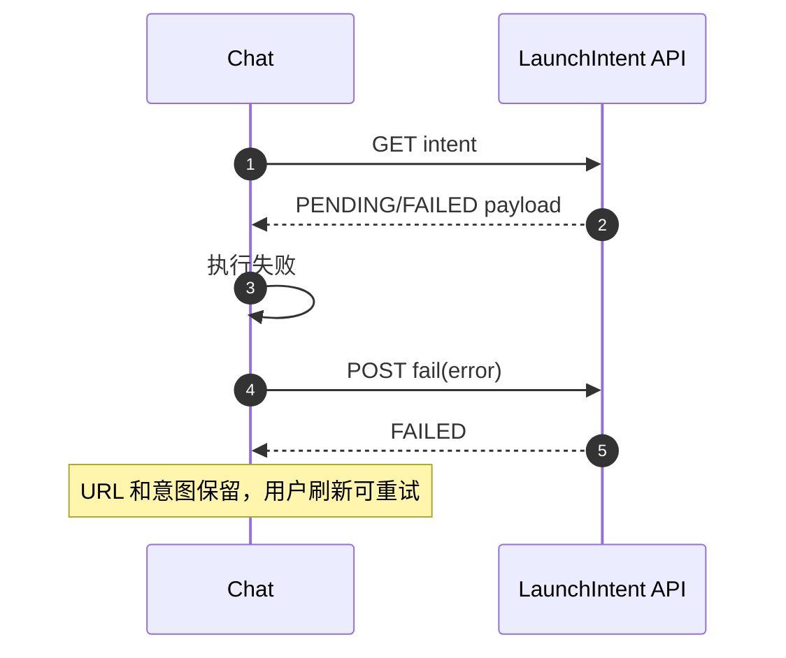
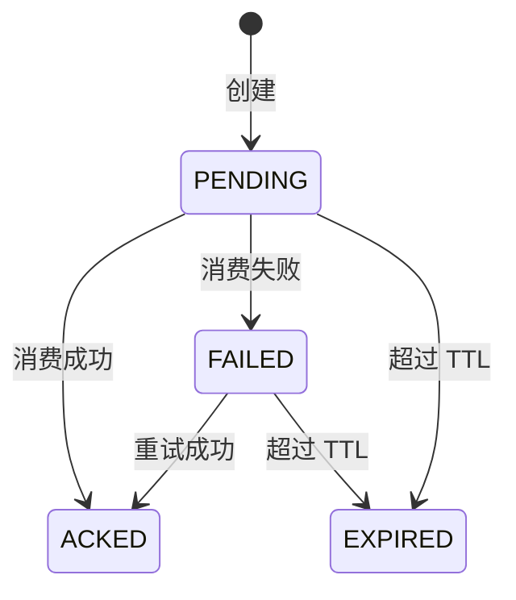

# LaunchIntent 交接协议设计

## 1. 目标与边界

- 解决跨页面交接依赖裸 `sessionStorage` key、先删除后解析、失败静默且无法重试的问题。
- 本阶段建立平台级、带版本、持久化、成功后确认的 LaunchIntent；先迁移项目工作台、知识图谱、PRD 和新模块入口。
- 保留旧 key 消费一个兼容周期，不删除其它模块的浏览器偏好数据。
- 设计结论：SQLite 保存交接事实，URL 只传意图 ID，Vibe Coding 成功打开会话、发送消息或写入草稿后才 ACK。

## 2. 整体架构



## 3. 模块职责

### 3.1 后端 LaunchIntent 能力

- 接收带版本的类型化 payload，限制大小和有效期。
- 持久化 `PENDING/ACKED/FAILED/EXPIRED` 状态并提供 ACK、失败记录和重试读取。
- 不理解具体 feature 业务，只维护平台交接生命周期。

### 3.2 前端 LaunchIntent Client

- 暴露类型化创建、读取、ACK 和失败上报。
- 运行时校验版本、类型、payload 和过期时间，禁止强制类型转换后直接执行。
- 生产者只创建意图并携 ID 导航；消费者只有执行成功才确认。

### 3.3 Vibe Coding 消费器

- 将 `OPEN_DRAFT`、`OPEN_AND_SEND`、`OPEN_PANEL` 分流为聚焦执行函数。
- 失败时保留意图并显示可诊断错误，刷新同一 URL 可重试。
- 兼容读取旧 key，但不再让新生产者写旧 key。

## 4. 关键交互

### 4.1 创建和成功消费



### 4.2 失败和重试



## 5. 状态规则



- ACK 幂等；重复 ACK 保持 `ACKED`。
- `FAILED` 可读取和重试；`ACKED/EXPIRED` 不再执行。
- payload 最大 64 KiB，默认 TTL 30 分钟。
- 错误信息截断保存，不保存堆栈或凭据。

## 6. 编码落点

```text
toolbox-common/
└── src/main/
    ├── java/com/exceptioncoder/toolbox/common/launchintent/
    │   ├── api/LaunchIntentController.java       [新增] HTTP 协议适配
    │   ├── domain/LaunchIntent.java               [新增] 生命周期模型
    │   ├── repository/LaunchIntentRepository.java [新增] 唯一 SQL 容器
    │   └── service/LaunchIntentService.java       [新增] 创建、读取、确认和失败用例
    └── resources/db/launch-intent-schema.sql      [新增] 幂等 DDL

frontend/src/
├── shell/launch-intent/
│   ├── types.ts                                   [新增] 稳定公共契约与运行时校验
│   ├── api.ts                                     [新增] HTTP client 与导航助手
│   └── types.test.ts                              [新增] 契约测试
└── features/
    ├── claude-chat/pages/ChatPage.tsx             [修改] 聚焦执行与兼容回退
    ├── project-workspace/                         [修改] 创建类型化意图
    └── prd-clarify/                               [修改] 创建类型化意图
```

## 7. 数据与依赖变更

| 类型 | 是否变化 | 说明 |
|---|---|---|
| 数据库 | 有 | 新增 `platform_launch_intent` 和状态/过期索引 |
| API | 有 | 新增创建、读取、ACK、失败四类接口 |
| 前端契约 | 有 | 新增三种带版本 discriminated union |
| 外部依赖 | 无 | 沿用 Spring JDBC、SQLite 和现有前端 HTTP client |

## 8. 风险与验证

- 浏览器关闭或刷新：意图仍在 SQLite，可用原 URL 重试。
- 重复打开 URL：ACK 后阻止再次执行；并发双开不是本阶段的强一致领取协议。
- 后端暂不可用：生产者显示创建失败，不再静默导航并丢失上下文。
- 验证覆盖契约校验、失败重试、幂等 ACK、非法 payload、SQLite 映射、旧 key 兼容和全仓架构守卫。
