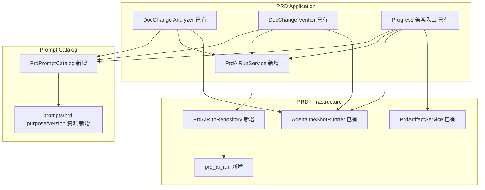
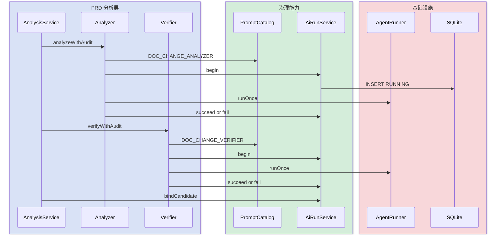
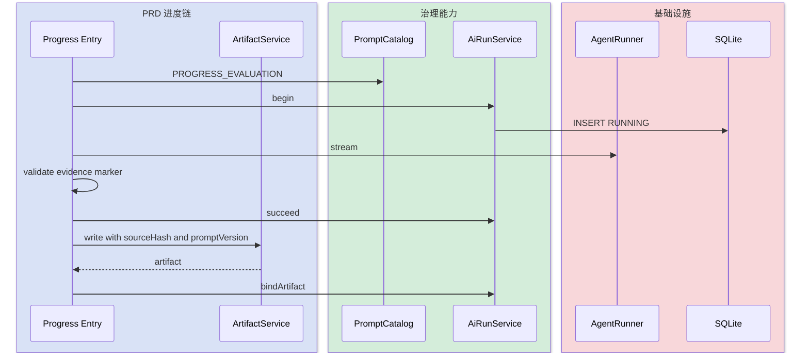
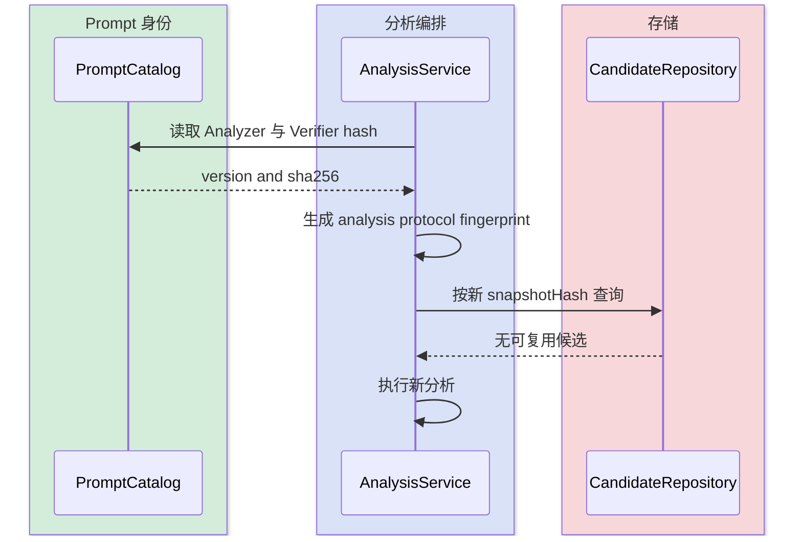

# PRD Prompt Catalog 与 AI Run 审计设计

本设计把 PRD 文档变更分析、独立复核和进度评估的系统 Prompt 迁移为不可变类路径资源，并为每次真实模型调用建立可关联、可校验、可失败追踪的运行账本。

## 快速导航

- [目标与边界](#1-目标与边界)
- [整体架构](#2-整体架构)
- [模块拆分与职责](#3-模块拆分与职责)
- [关键交互](#4-关键交互)
- [核心业务规则](#5-核心业务规则)
- [编码落点](#6-编码落点)
- [数据与依赖变更](#7-数据与依赖变更)
- [风险与待确认](#8-风险与待确认)
- [验证要点](#9-验证要点)

## 变更记录

| 版本 | 日期 | 修改人 | 变更摘要 |
|---|---|---|---|
| v1 | 2026-08-14 | Codex | Analyzer、Verifier、Progress 首批资源化与运行审计 |

---

## 1. 目标与边界

- 要解决的问题：Prompt 散落在 Java 常量中，Verifier/Progress 无独立版本，候选和进度产物无法回查阶段 Prompt 哈希与运行状态。
- 本次目标：建立不可变 Prompt Catalog、`prd_ai_run` 追加式账本，并接入 Analyzer、Verifier、Progress 三条高价值链路。
- 不做什么：不开放 Prompt 在线编辑；不保存原始 Prompt、用户输入、模型全文或鉴权信息；不改变 HTTP/SSE 契约；不一次性迁移所有 PRD Prompt。
- 设计结论：资源版本决定 Prompt 身份，数据库只保存哈希和执行元数据；任何模型调用必须先取得运行身份，结束后明确落为成功或失败。

---

## 2. 整体架构



`PrdPromptCatalog` 是资源身份唯一入口；业务服务不得直接读取资源路径或复制版本字符串。`PrdAiRunService` 是运行状态唯一写入口，Repository 不向调用者暴露 SQL。

---

## 3. 模块拆分与职责

### 3.1 PrdPromptCatalog

- 定位：Prompt 版本、路径、内容和 SHA-256 的只读目录。
- 职责：按 purpose 返回当前不可变定义；统一 UTF-8 读取并计算内容哈希；资源缺失时快速失败。
- 上游：Analyzer、Verifier、Progress、快照协议计算。
- 下游：类路径资源。
- 关键设计点：版本目录只追加，升级 Prompt 必须新增 `vN-system.md` 并修改 catalog 注册，不覆盖历史文件。

### 3.2 PrdAiRunService

- 定位：一次 PRD AI 调用的生命周期边界。
- 职责：调用前登记 `RUNNING`；调用后登记 `SUCCEEDED/FAILED` 与输出哈希；绑定候选或产物身份。
- 上游：三条 PRD AI 调用链。
- 下游：`PrdAiRunRepository`。
- 关键设计点：不保存敏感正文；审计登记失败时禁止无痕调用模型；错误文本截断并脱敏。

### 3.3 PrdAiRunRepository

- 定位：`prd_ai_run` 的唯一 SQL 容器。
- 职责：显式插入所有列；原子完成状态；追加候选/产物关联。
- 上游：`PrdAiRunService`。
- 下游：SQLite。
- 关键设计点：状态更新只允许 `RUNNING` 结束一次，重复结束不覆盖首个结果。

---

## 4. 关键交互

### 4.1 Analyzer 与 Verifier 双阶段审计



Analyzer 结果不可解析时，Verifier 仍按现有规则跳过；只产生 Analyzer 的失败运行记录。候选保存后再绑定两个 run ID，避免在 LLM 长调用期间开启数据库事务。

### 4.2 Progress 生成与产物关联



若运行时或输出校验失败，run 记为 `FAILED`；若模型输出有效但后续文件写入失败，run 保持 `SUCCEEDED` 且 artifact 为空，产物账本按自身错误语义记录失败。

### 4.3 Prompt 升版触发候选重算



---

## 5. 核心业务规则

| 规则 | 说明 |
|---|---|
| Prompt 不可覆盖 | 已发布版本资源不允许原地修改；修改内容必须升版本 |
| 内容哈希可信 | `prompt_sha256` 由实际 UTF-8 资源内容计算，不接受调用方传入 |
| 输入指纹最小化 | `input_fingerprint` 对最终 user prompt 计算 SHA-256，不保存原文 |
| 先登记后调用 | `RUNNING` 插入失败时不调用 LLM，避免无审计执行 |
| 状态终结一次 | 仅 `RUNNING` 可转 `SUCCEEDED/FAILED` |
| 失败可诊断 | 运行异常和结构校验失败均记录截断错误，不静默吞掉 |
| 快照包含 Prompt | Analyzer 或 Verifier 的版本/哈希变化必须形成新的候选快照 |
| 兼容优先 | 对外 API、SSE 事件、模型输出契约和旧表读取逻辑保持不变 |

---

## 6. 编码落点

```text
tools/tool-prd-clarify/src/main/
├── java/com/exceptioncoder/toolbox/prdclarify/
│   ├── domain/
│   │   ├── PrdAiRun.java                         [新增] AI 运行审计实体
│   │   ├── PrdAiRunStatus.java                   [新增] RUNNING/SUCCEEDED/FAILED
│   │   ├── PrdPromptDefinition.java              [新增] Prompt 不可变定义
│   │   └── PrdPromptPurpose.java                 [新增] 三类稳定 purpose
│   ├── repository/
│   │   └── PrdAiRunRepository.java               [新增] AI Run 唯一 SQL 容器
│   └── service/
│       ├── PrdPromptCatalog.java                  [新增] 资源加载、版本与哈希
│       ├── PrdAiRunService.java                   [新增] 运行生命周期与关联
│       ├── PrdDocChangeAgentAnalyzer.java         [修改] 使用 catalog 并返回 runId
│       ├── PrdDocChangeAgentVerifier.java         [修改] 使用 catalog 并返回 runId
│       ├── PrdDocChangeAnalysisService.java       [修改] 快照纳入 Prompt 身份并绑定候选
│       └── PrdClarifyService.java                 [修改] Progress 使用 catalog、审计和产物元数据
├── resources/
│   ├── db/prd-schema.sql                          [修改] 新增 prd_ai_run
│   └── prompts/prd/
│       ├── doc-change-analyzer/v3-system.md       [新增] Analyzer Prompt
│       ├── doc-change-verifier/v1-system.md       [新增] Verifier Prompt
│       └── progress-evaluation/v1-system.md       [新增] Progress Prompt
└── test/java/com/exceptioncoder/toolbox/prdclarify/
    ├── repository/PrdAiRunRepositoryTest.java     [新增] DDL 和状态更新
    └── service/
        ├── PrdPromptCatalogTest.java              [新增] 版本、内容、哈希与缺失资源
        └── PrdAiRunServiceTest.java               [新增] 生命周期、错误与关联
```

调用关系：`Analyzer/Verifier/Progress -> PrdPromptCatalog + PrdAiRunService -> PrdAiRunRepository -> SQLite`。

---

## 7. 数据与依赖变更

| 类型 | 是否变化 | 说明 |
|---|---|---|
| 数据库 | 有 | 新增 `prd_ai_run` 与三个查询索引；不修改旧列 |
| DTO/VO/枚举 | 有 | 新增模块内部 domain 类型，不改变 HTTP DTO |
| 外部依赖 | 无 | 复用 Spring Resource、JDK SHA-256、现有 JDBC |
| 事务 | 无长事务 | LLM 调用在事务外；每个账本状态更新是短 SQL |

`prd_ai_run` 字段：`id, session_id, purpose, prompt_version, prompt_sha256, input_fingerprint, engine, model, candidate_id, artifact_id, status, output_sha256, last_error, started_at, finished_at, created_at, updated_at`。

---

## 8. 风险与待确认

| 风险 | 影响 | 处理方式 |
|---|---|---|
| 资源文本迁移出现空格差异 | 模型行为变化 | 原样搬迁并用哨兵/哈希测试锁定 |
| 审计表写失败 | 阻断一次调用 | 明确失败，禁止无痕执行；不降级为无审计模式 |
| 候选保存失败 | run 暂无 candidateId | run 仍保留，可按 session/time 排查，不回滚模型调用 |
| 旧构造测试受新增依赖影响 | 编译失败 | 统一更新 fixture，新增 focused 单测 |

---

## 9. 验证要点

- 正常路径：三类 purpose 产生正确版本、Prompt 哈希、输入指纹、引擎/模型和成功状态。
- 异常路径：运行时异常与非法输出均结束为失败，错误不含鉴权信息。
- 边界条件：Analyzer 失败时无 Verifier run；重复结束不覆盖；候选/产物关联可补写。
- 回归范围：文档变更分析测试、进度评估测试、产物账本测试及 PRD 模块全量测试。
