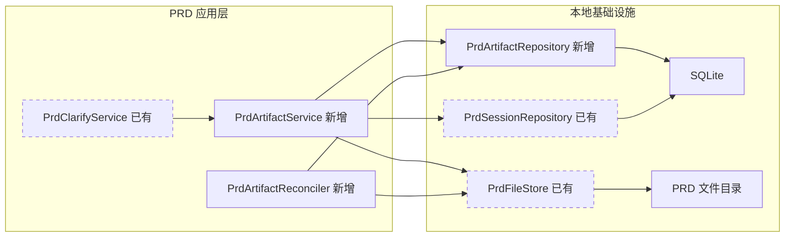
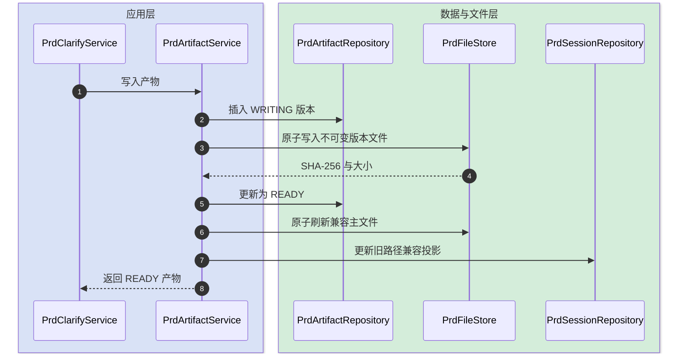
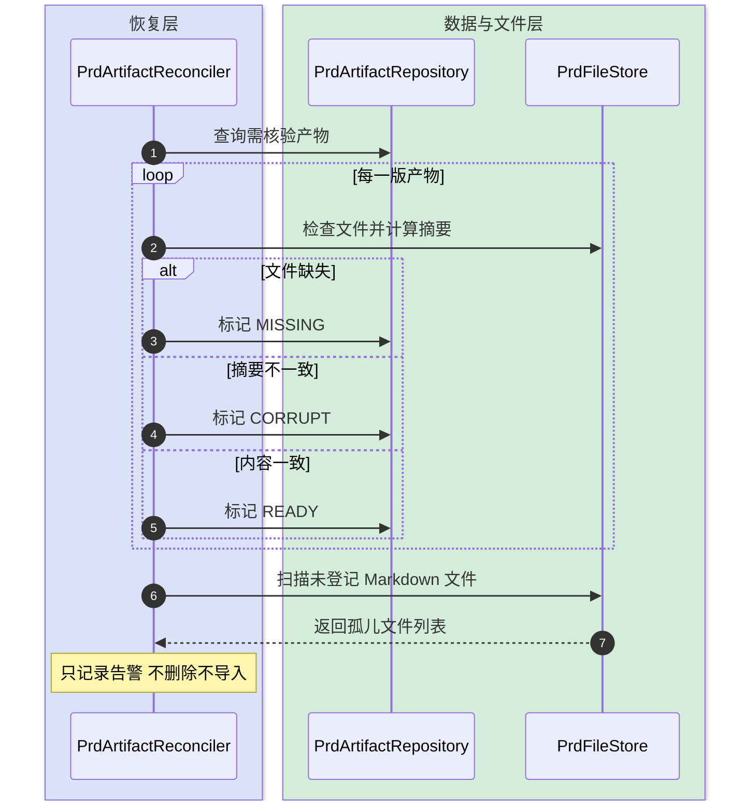
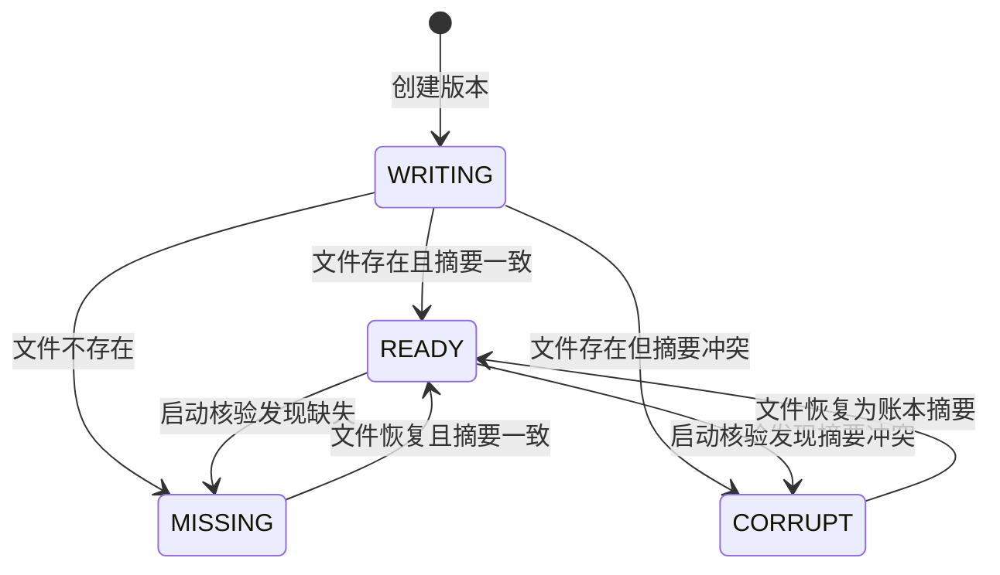

# PRD 产物账本设计

本文档定义 PRD、开发文档和进度报告的渐进式产物账本。目标是把“数据库路径非空”和“磁盘文件真实可读”从松散约定升级为可核验状态，同时保留现有 API、文件名和 `prd_session` 旧字段作为兼容投影。

## 快速导航

- [目标与边界](#1-目标与边界)
- [整体架构](#2-整体架构)
- [模块拆分与职责](#3-模块拆分与职责)
- [关键交互](#4-关键交互)
- [产物状态与规则](#5-产物状态与规则)
- [编码落点](#6-编码落点)
- [数据与依赖变更](#7-数据与依赖变更)
- [风险与验证](#8-风险与验证)

---

## 1. 目标与边界

- **要解决的问题**：当前文件先覆盖、数据库路径和历史再分步更新，进程在任意一步失败都可能形成悬空指针、孤儿文件或版本错位；文件缺失又会被读取为空字符串。
- **本次目标**：新增产物账本；通过同目录临时文件和原子替换写入；启动时核验账本与磁盘并收敛 `WRITING`、`READY`、`MISSING`、`CORRUPT` 状态；三类主产物写入后继续更新旧字段。
- **不做什么**：不删除 `md_path`、`dev_doc_path`、`progress_path`；不改变 REST/SSE DTO；不迁移 Prompt；不自动删除或导入孤儿文件；不在本批重写版本历史 UI。
- **设计结论**：`prd_artifact` 成为新增写入的可靠事实账本，`prd_session` 路径字段在兼容期继续双写，读取切换和旧列清理留到后续发布周期。

### 1.1 领域闭环合同

| 项目 | 合同 |
|---|---|
| 对象 | 以 `session_id + artifact_type + version` 标识一版产物 |
| 操作前 | 旧版可以是 `READY`，新版本不存在 |
| 操作后 | 新版必须是 `READY`，且账本 SHA-256、大小和磁盘内容一致 |
| 关联 | 新版关联同一 PRD 会话；旧版记录保留，不覆盖账本历史 |
| 失败与幂等 | 写入失败保留 `WRITING`；重启核验后按磁盘事实转为 `READY`、`MISSING` 或 `CORRUPT` |
| 数据库终态 | 每次成功写入有唯一递增版本；旧路径字段仅作为兼容投影 |
| 下一业务动作 | 现有读取、编辑、生成和进度评估仍通过原 API 工作 |

上述规则来自当前 DDL、写文件调用链和专家改造建议，属于待代码与故障测试持续验证的技术规格，不宣称为外部业务真理。

---

## 2. 整体架构



依赖方向保持为应用编排依赖基础设施能力。`PrdClarifyService` 不再新增文件一致性逻辑，只把既有落盘点替换成一次 `PrdArtifactService.write` 调用。

---

## 3. 模块拆分与职责

### 3.1 PrdArtifactService

- **定位**：一版 PRD 产物的写入用例。
- **职责**：分配版本并登记 `WRITING`；把不可变版本写入 `.artifacts`；校验摘要后登记 `READY`；最后刷新兼容主文件与旧字段。
- **上游**：`PrdClarifyService` 的 PRD、开发文档、进度报告和手工保存路径。
- **下游**：`PrdArtifactRepository`、`PrdFileStore`、兼容字段更新回调。
- **关键设计点**：同一 `session + type` 在进程内串行；数据库失败不伪装成功；旧字段只在 `READY` 后更新。

### 3.2 PrdArtifactRepository

- **定位**：`prd_artifact` 唯一 SQL 容器。
- **职责**：创建写入记录、推进状态、查询最新版本和启动核验集合。
- **上游**：产物写入服务与启动核验器。
- **下游**：SQLite。
- **关键设计点**：唯一键阻止重复版本；SQL 显式列名；状态推进保留错误上下文。

### 3.3 PrdArtifactReconciler

- **定位**：启动后的只读磁盘核验和状态收敛器。
- **职责**：核验账本文件存在性、大小与摘要；恢复“文件已替换但 READY 未提交”的 `WRITING`；报告孤儿文件。
- **上游**：Spring 启动生命周期。
- **下游**：产物仓储与文件存储。
- **关键设计点**：不删除、不覆盖、不自动导入孤儿；核验异常可观察但不阻止应用启动。

### 3.4 PrdFileStore

- **定位**：PRD 文件目录的基础设施适配器。
- **职责**：解析受控相对路径；在同目录写临时文件；通过原子移动替换目标文件。
- **上游**：产物写入服务和核验器。
- **下游**：本地文件系统。
- **关键设计点**：拒绝逃逸基础目录的路径；临时文件失败时尽力清理。

---

## 4. 关键交互

### 4.1 正常写入

触发：模型生成或用户保存一份 PRD 类产物。



### 4.2 启动恢复

触发：应用重启后核验尚未收敛或已就绪的产物。



### 4.3 写入中断

触发：临时文件写入、原子替换或数据库 `READY` 更新失败。

- 临时文件写入失败：目标文件保持旧内容，账本保留 `WRITING`，启动后转 `MISSING` 或按旧内容判 `CORRUPT`。
- 原子替换后数据库失败：新文件已存在，账本仍为 `WRITING`；启动后计算实际摘要并转 `READY`。
- `READY` 后兼容主文件或旧字段更新失败：不可变账本仍保留真实产物，调用返回失败；后续读切换完成后可消除此窗口。

---

## 5. 产物状态与规则



| 规则 | 说明 |
|---|---|
| 版本唯一 | `session_id + artifact_type + version` 唯一且单调递增 |
| 路径受控 | 账本只保存 PRD 基础目录下的相对路径 |
| READY 可验证 | `READY` 必须同时具有 SHA-256、非负大小和可解析路径 |
| 缺失不等于空文档 | 文件不存在必须是 `MISSING` 或异常，不得作为空字符串成功返回 |
| 兼容双写 | 本批继续更新旧路径与时间字段，不改变前端和 API |
| 孤儿保守处理 | 未登记文件只告警，禁止启动时自动删除 |

---

## 6. 编码落点

```text
tools/tool-prd-clarify/
└── src/
    ├── main/
    │   ├── java/com/exceptioncoder/toolbox/prdclarify/
    │   │   ├── domain/
    │   │   │   ├── PrdArtifact.java               [新增] 产物账本领域数据
    │   │   │   ├── PrdArtifactState.java          [新增] 核验状态
    │   │   │   └── PrdArtifactType.java           [新增] 三类产物及文件名规则
    │   │   ├── repository/
    │   │   │   └── PrdArtifactRepository.java     [新增] 账本 SQL 与版本推进
    │   │   └── service/
    │   │       ├── PrdArtifactService.java        [新增] 原子写入用例
    │   │       ├── PrdArtifactReconciler.java     [新增] 启动核验与状态收敛
    │   │       ├── PrdFileStore.java              [修改] 受控路径、摘要与原子替换
    │   │       └── PrdClarifyService.java         [修改] 主产物落盘点改为一行委托
    │   └── resources/db/prd-schema.sql             [修改] 新增 prd_artifact 表与索引
    └── test/java/com/exceptioncoder/toolbox/prdclarify/
        ├── repository/PrdArtifactRepositoryTest.java [新增] 版本唯一与状态推进
        └── service/PrdArtifactServiceTest.java       [新增] 成功、失败和恢复边界
```

调用关系：`PrdClarifyService` 只提供业务上下文与兼容字段回调；文件摘要、临时文件、版本和账本状态全部收敛在产物能力内。

---

## 7. 数据与依赖变更

| 类型 | 是否变化 | 说明 |
|---|---|---|
| 数据库表、字段、索引 | 有 | 新增 `prd_artifact`；不改旧列语义 |
| DTO、VO、对外枚举 | 无 | 领域内部增加产物类型和状态 |
| 下游接口、外部依赖 | 无 | 仅使用 JDK NIO、Spring JDBC 和 SQLite |
| 缓存、消息、锁、事务 | 有 | 单进程按 `session + type` 串行；不引入外部锁 |

`prd_artifact` 字段：`id`、`session_id`、`artifact_type`、`version`、`state`、`relative_path`、`sha256`、`size_bytes`、`source_hash`、`prompt_version`、`last_error`、`created_at`、`updated_at`。

---

## 8. 风险与验证

| 风险 | 影响 | 处理方式 |
|---|---|---|
| SQLite 与文件系统无法共享事务 | 存在中间态 | 显式 `WRITING` 状态和启动核验，不假装跨资源原子事务 |
| 并发生成相同版本 | 唯一键冲突或覆盖 | 应用内按 `session + type` 加锁，数据库唯一键二次兜底 |
| 存量文件无账本 | 新读路径不可用 | 本批保留旧读取；启动仅核验已有账本，存量回填作为下一小批独立执行 |
| 旧字段更新晚于 READY | 旧 UI 短暂看不到新文件 | 当前调用同步更新旧字段；后续 API 切到账本后消除此窗口 |
| 自动处理孤儿误删数据 | 数据不可恢复 | 只记录文件名和数量，不自动删除或导入 |

验证要点：

- 正常路径：三类主产物生成和手工保存均产生递增的 `READY` 记录，旧 API 行为不变。
- 异常路径：文件写入前失败保留旧文件；原子替换后数据库失败可在重启核验后收敛。
- 边界条件：路径逃逸被拒绝；空内容可作为有效零字节产物；同会话不同类型独立版本。
- 回归范围：PRD 生成、开发文档生成、进度评估、手工保存、后台修订、全模块构建与架构守卫。
