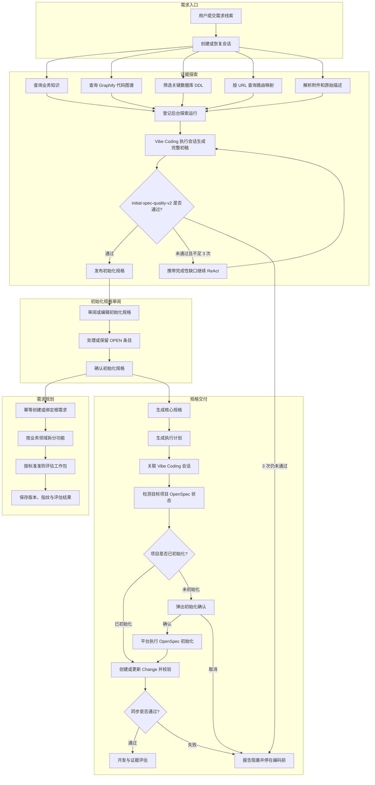
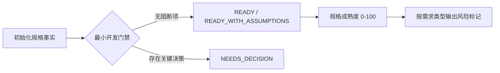

# PRD 探索式规格流程设计

> 将 PRD 澄清助手从“填写需求后直接提问”重构为证据驱动流程：先探索模块业务知识、代码图谱、关键 DDL 和路由，尽力消除可由现有证据确认的问题，再产出可直接审阅的初始化规格。

## 变更记录

| 版本 | 日期 | 修改人 | 变更内容摘要 |
|---|---|---|---|
| v13 | 2026-08-22 | Codex | 探索增加目标重构、复杂度审计、候选方案与证据化推荐，并升级初始化规格质量门禁 |
| v12 | 2026-08-22 | Codex | 规格到执行计划统一为后台直接生成，取消 TDD 回复式技术澄清，未决技术事项写入执行计划 |
| v11 | 2026-08-22 | Codex | 删除规格探索 `CHATTING` 前端状态，遗留 `CLARIFYING` 会话自动升级为后台探索 |
| v10 | 2026-08-22 | Codex | 统一失败重试与修订准备态：后台直接重生成初始化规格，不再短暂进入回复式澄清界面 |
| v9 | 2026-08-22 | Codex | 探索改为持久化后台任务，Vibe Coding 最多执行三轮并由固定准则验收 |
| v8 | 2026-08-22 | Codex | 初始化规格确认后自动同步需求中枢，并按版本化准则生成领域功能规划工时 |
| v7 | 2026-08-22 | Codex | 用户侧术语统一为“规格探索、规格库、初始化规格、核心规格、执行计划” |
| v6 | 2026-08-22 | Codex | 将需求录入页重构为 AI Discovery Canvas，弱化表单、步骤器和 PRD 库 |
| v5 | 2026-08-22 | Codex | 强化模块级知识检索、关键 DDL 证据和少提问约束 |
| v4 | 2026-08-22 | Codex | 取消回复式业务澄清，初始化规格确认后直接生成核心规格 |
| v3 | 2026-08-22 | Codex | 增加 OpenSpec 未初始化检测、平台确认弹窗与初始化后自动续跑 |
| v2 | 2026-08-22 | Codex | 增加 Vibe Coding 关联时的 OpenSpec 编码前同步门禁 |
| v1 | 2026-08-22 | Codex | 建立探索先行、初始化规格审阅和开放问题澄清流程 |

---

## 1. 目标与边界

- **要解决的问题**：现有 Graphify 和业务知识查询隐藏在澄清 Prompt 中，没有形成可审阅的探索成果；内嵌澄清与 Vibe Coding 澄清重复；用户仍需回答可从代码和知识库确认的问题。
- **本次目标**：把探索设为第一阶段，融合模块业务知识、Graphify、关键 DDL、URL 路由和附件证据，生成带稳定 ID、证据账本和少量开放问题的初始化规格；确认后自动同步需求中枢，形成面向业务负责人的领域功能拆分与规划工时。
- **不做什么**：不在探索阶段修改目标项目源码；不把 Graphify 输出单独当作实现事实；不自动替用户决定业务取舍；不改变执行计划、进度评估和交付中心的既有产物协议。
- **设计结论**：以独立 `INITIAL_SPEC` 产物承接探索结果；用户直接在规格中处理 `OPEN-*`，确认后生成核心规格，不再进入独立问答环节。
- **交互结论**：用户只需表达问题、想法或粘贴截图；标题、系统和模块降级为可选上下文，Forge 负责在探索阶段完成结构化和证据关联。

---

## 2. 核心流程



---

## 3. 核心业务规则

| 规则 | 说明 |
|---|---|
| 探索先行 | 新建正式会话先进入 `DISCOVERING`，不得直接生成澄清问题。 |
| 后台任务边界 | 浏览器只登记并轮询 `prd_discovery_run`；页面刷新、离开或网络闪断不取消 Vibe Coding 探索。应用重启后继续未终结运行。 |
| 完成性循环 | 每轮 Vibe Coding 输出由 `initial-spec-quality-v2` 确定性校验；不完整时把缺口和上次结果交给下一轮完整重写，最多 3 次。 |
| 证据穷尽 | 探索按项目和模块查询业务知识与 Graphify，并用两者的命中结果筛选 DDL 基线中的关键表、字段、索引和约束。 |
| 证据分级 | 业务知识用于业务语义，Graphify 用于结构导航，DDL 只证明数据库结构，URL 路由用于入口定位；未知事实必须进入 `OPEN-*`，不得补写为已确认规则。 |
| 目标先于做法 | 先从用户提出的功能或实现设想中提炼真实业务目标，再评估原做法；不得把用户给出的实现路径直接等同于需求。 |
| 复杂度审计 | 必须检查是否存在可复用能力、重复流程、非必要状态、过度配置、提前泛化和由错误假设造成的复杂度；没有发现时也要明确给出审计结论。 |
| 受控创造 | 至少形成一个 `OPT-*` 可行方案并给出一个 `REC-*` 明确推荐；默认优先最简单、可验证、可复用现有能力的方案，不为显得完整而堆砌选项。 |
| 事实建议隔离 | `FACT-*` 只承载可追溯证据，`ASSUMPTION-*` 标记待验证假设，`OPT-*` 是候选方案，`REC-*` 是 AI 推荐；推荐不得伪装成已确认业务规则。 |
| 纠偏不越权 | AI 应指出需求中的冲突、错误假设和非必要复杂度并说明影响，但涉及目标、范围、规则或验收结果的业务取舍仍写入 `OPEN-*` 由需求方决定。 |
| 少提问 | 可从证据确认的内容不得转成问题；`OPEN-*` 通常为 0–3 个、最多 5 个，只保留必须由用户决定且会改变目标、范围、规则或验收的事项。 |
| 初始化规格独立 | 探索结果写入 `INITIAL_SPEC` 产物，不复用 `PRD`，避免触发既有 `PRD` 产物的 `DONE` 投影。 |
| 用户审阅门禁 | 初始化规格生成后进入 `SPEC_REVIEW`；用户直接编辑待确定项，确认后才能生成核心规格。 |
| 自动规划联动 | 确认初始化规格后自动创建或绑定需求中枢根需求，并启动规划评估；评估失败不得阻断核心规格生成，但必须保存失败状态和可重试原因。 |
| 评估输入冻结 | 规划评估只使用本次确认的初始化规格全文和会话元数据，保存输入 SHA-256；不读取生成后可能变化的核心规格，保证同一输入可复跑对比。 |
| 业务能力拆分 | 拆分项按业务领域、业务结果和独立验收边界组织，不按 Controller、接口或表等纯技术任务拆分。 |
| 评估准则单一来源 | 规划工时使用版本化标准 `initial-spec-planning-v3`；工作包口径、上下限、共享成本去重、置信度缓冲和人日换算由代码固化，Prompt 只引用该标准生成结构化建议。 |
| 规划证据可追溯 | 确认初始化规格时冻结项目、模块、查询词以及业务知识、Graphify、DDL、路由映射四类来源的调用目标、调用状态和有界摘要；评估页可展开查看，用于区分“数据源缺失”“调用过但未命中或异常”和“未记录”。 |
| 确定性汇总 | 模型只输出领域功能、证据引用、风险、置信度和六类基础工作包区间；总工时、缓冲和人日由代码重新计算，模型输出不得直接作为总量落库。 |
| 可评测记录 | 每次运行保存准则版本、Prompt 版本、输入指纹、引擎、模型、原始结构化结果、归一化结果、开始及完成时间，后期可与实际工时对照。 |
| 双口径工时 | 初始化规格阶段产出“规划工时”；核心规格与执行计划完成后产出“交付工时”。两者独立展示，禁止后者静默覆盖前者。 |
| 单一澄清面 | `OPEN-*`、冲突和缺失验收口径统一在初始化规格中呈现，不再生成回复式业务澄清问题。 |
| 执行计划直接生成 | 核心规格确认后，规格工作台、需求中枢和交付中心都直接启动后台执行计划生成；不得先生成技术问题、展示题数或等待逐题回答。 |
| 技术未决项入文档 | 能从核心规格、Graphify 和项目上下文确认的技术事实直接采用；仍无法确认且会影响实现的决策写入执行计划“待确认技术事项”，禁止用回复式弹窗阻断生成。 |
| 重试语义一致 | 首次探索、失败重试和修订版重新探索均进入同一后台探索态；不得展示题数、问题生成进度或对话气泡。失败页只提供“重新后台探索”和“返回想法修改”。 |
| 稳定追踪 ID | 初始化规格使用 `GOAL/FACT/ASSUMPTION/OPT/REC/REQ/RULE/SCN/AC/CONSTRAINT/DECISION/OPEN/EVD` ID；核心规格沿用已有 ID，禁止无故重排。 |
| 单入口 | 移除“标准澄清”和“Vibe Coding 澄清”双入口，统一为“开始探索”；执行引擎仍可选择 Claude 或 Codex。 |
| Canvas 入口 | 第一屏以想法输入为视觉中心；Persona、引擎和人工系统模块关联放入轻量上下文，不与主输入争夺注意力。 |
| 安静导航 | 主流程显示为“想法 → 探索 → 成型”，不使用编号圆点；PRD 库桌面端默认折叠，需要时再展开。 |
| 统一术语 | 菜单称“规格探索”，历史资料称“规格库”，探索产物称“初始化规格”，确认后的行为契约称“核心规格”，编码方案称“执行计划”；`prd-*` 路由、字段、类型和历史文件仅作为内部兼容标识保留。 |
| 真实进度 | 不展示无证据支撑的需求清晰度百分比；以探索状态、证据来源和规格产物表达真实进度。 |
| 恢复路径 | `DISCOVERING`、`SPEC_REVIEW`、`GENERATING` 均可从历史会话恢复；错误状态依据已有产物回到最近稳定阶段。 |
| 兼容边界 | 已有 `CLARIFYING` 会话保留旧问答恢复能力，但新会话不再进入该状态；不迁移或重写历史 PRD 文件。 |
| OpenSpec 门禁 | 新建开发会话的首条指令必须先解析 OpenSpec root，调用可用的 OpenSpec command/plugin 或 CLI 更新 change，并通过 validate 后才编码。 |
| 手工关联同步 | 在已有 Vibe Coding 会话中手工关联 PRD 时，立即发送或排队 OpenSpec 同步任务；会话忙碌时不得丢弃。 |
| 初始化恢复 | 平台在发送编码任务前检测 OpenSpec；未初始化时展示目标目录和初始化命令，用户确认后执行 `openspec init . --tools <tool>`，成功后自动续跑原同步任务。 |
| 初始化授权 | OpenSpec 初始化会写入目标项目，只允许作用于已登记工作区或当前会话主目录；必须由用户显式确认，不允许 Agent 静默初始化。 |
| 失败显式阻断 | 用户取消、工具缺失、初始化失败或校验失败时必须保留原任务并停在编码前，提供重试或关闭路径，禁止静默跳过或假报成功。 |

---

## 4. 编码落点

```text
tools/tool-prd-clarify/src/main/java/com/exceptioncoder/toolbox/prdclarify/
├── api/
│   ├── PrdClarifyController.java                     [修改] 暴露探索、初始化规格读取保存和确认接口
│   └── dto/PrdDiscoveryRunView.java                  [新增] 返回后台阶段、尝试和可观测执行信息
├── domain/
│   ├── PrdArtifactType.java                          [修改] 新增 INITIAL_SPEC 产物类型
│   ├── PrdSession.java                               [修改] 增加 initialSpecPath
│   └── PrdDiscoveryRun.java                          [新增] 可恢复后台探索运行
├── repository/
│   ├── PrdSessionRepository.java                     [修改] 映射路径并持久化探索状态
│   └── PrdDiscoveryRunRepository.java                [新增] 持久化运行、阶段和校验结果
└── service/
    ├── PrdDiscoveryService.java                      [新增] 准备证据、调用 Vibe Coding 与发布产物
    ├── PrdDiscoveryTaskService.java                  [新增] 后台执行、恢复和三轮循环
    ├── PrdInitialSpecValidator.java                  [新增] 版本化完成性准则
    ├── PrdDdlContextService.java                     [新增] 从项目 DDL 基线筛选与需求最相关的结构证据
    ├── PrdRouteContextService.java                   [新增] 从已登记编码画像中按 URL 定位路由
    ├── PrdClarificationQuestionService.java          [兼容] 仅服务历史 CLARIFYING 会话
    ├── PrdDocumentGenerationService.java             [修改] 将初始化规格作为核心规格生成基线
    ├── PrdArtifactService.java                       [修改] 投影 INITIAL_SPEC 兼容路径
    └── PrdClarifyService.java                        [修改] 保留其他兼容流程，探索不再经 SSE 门面

tools/tool-prd-clarify/src/main/resources/db/
└── prd-schema.sql                                    [修改] 增加 initial_spec_path 与 prd_discovery_run

frontend/src/features/prd-clarify/
├── api.ts                                            [修改] 增加探索和初始化规格 API
├── types.ts                                          [修改] 增加状态与页面步骤
├── hooks/usePrdClarifySession.ts                     [修改] 驱动新状态机并删除双入口
├── components/StepBar.tsx                            [修改] 展示四阶段规格流程
├── components/panels/InputPanel.tsx                  [修改] 单一“开始探索”入口
├── components/panels/DiscoveryPanel.tsx              [新增] 轮询展示后台阶段、尝试次数与恢复动作
├── components/panels/InitialSpecReviewPanel.tsx      [新增] 审阅、编辑、确认初始化规格
└── pages/PrdClarifyPage.tsx                          [修改] 组合探索和规格审阅面板

界面增量：`InputPanel` 改为 Discovery Canvas；`StepBar` 改为无编号安静导航；`HistoryPanel` 增加桌面折叠态；探索与初始化规格文案同步证据优先流程。

frontend/src/features/claude-chat/
├── api.ts                                            [修改] 增加 OpenSpec 状态检测与初始化 API
├── components/OpenSpecInitializationDialog.tsx       [新增] 展示目录、命令、失败与恢复操作
├── components/PrdLinkPanel.tsx                       [修改] 手工关联后请求 OpenSpec 同步
└── pages/ChatPage.tsx                                [修改] 发送前检测、弹窗确认并在初始化后续跑

tools/tool-claude-chat/src/main/java/com/exceptioncoder/toolbox/claudechat/
├── api/OpenSpecProjectController.java                [新增] 暴露状态检测与初始化接口
└── service/
    ├── OpenSpecProjectService.java                   [新增] 校验项目边界并编排检测、初始化
    └── OpenSpecCliGateway.java                       [新增] 受超时与输出上限保护的 CLI 适配器

tools/tool-reqpool/src/main/java/com/exceptioncoder/toolbox/reqpool/
├── domain/ReqPlanningAssessment.java                 [新增] 规划评估运行与归一化结果
├── repository/ReqPlanningAssessmentRepository.java   [新增] 评估运行和最新结果查询
├── service/ReqPlanningAssessmentService.java         [新增] 根需求绑定、模型调用、校验和确定性汇总
└── api/dto/ReqPlanningAssessmentView.java            [新增] 需求中枢规划评估视图

toolbox-starter/src/main/java/com/exceptioncoder/toolbox/integration/
└── InitialSpecPlanningIntegration.java               [新增] 跨工具异步编排适配器
```

### 调用关系说明

- `PrdClarifyController` → `PrdClarifyService` → `PrdDiscoveryService` → 模块业务知识、Graphify、DDL、路由查询、Agent → `PrdArtifactService`。
- 前端确认初始化规格后直接启动核心规格生成；生成器读取已确认的初始化规格全文并沿用稳定 ID。
- `PrdDiscoveryService#confirm` → `InitialSpecPlanningGateway` → `toolbox-starter` 集成适配器 → `ReqPlanningAssessmentService`；工具模块之间不新增 Maven 依赖。
- `ReqPlanningAssessmentService` 先幂等绑定根需求并登记 `RUNNING`，再调用模型、校验拆分项、按标准确定性汇总并提交 `COMPLETED`；失败写入 `FAILED`。

---

## 5. 数据与依赖变更

| 类型 | 是否变化 | 说明 |
|---|---|---|
| 数据库表 / 字段 / 索引 | 有 | `prd_session` 新增 `initial_spec_path` 和来源需求 ID；`prd_artifact.type` 复用文本枚举存储 `INITIAL_SPEC`；需求中枢新增规划评估运行表。 |
| DTO / VO / 枚举 | 有 | 新增会话状态、页面步骤与 `INITIAL_SPEC` 产物类型。 |
| 下游接口 / 外部依赖 | 有 | 复用现有 Graphify CLI、业务知识查询、项目知识库 `impl/ddl-baseline.md` 和编码画像路由文件，不新增中间件。 |
| OpenSpec | 有 | 运行时调用目标项目 OpenSpec CLI；未初始化时经平台确认执行 `openspec init`，不新增 npm 依赖。 |
| 缓存 / 消息 / 锁 / 事务 | 有 | 不引入 MQ；使用 Spring 应用任务执行器异步评估，SQLite 唯一键保证同一规格指纹与准则版本幂等。 |

---

## 6. 风险与待确认

| 风险 / 待确认点 | 影响 | 处理方式 |
|---|---|---|
| 目标项目没有图谱或编码画像 | 初始化规格证据变少 | 明确记录数据源缺失，继续基于原始需求和附件生成，不阻断流程。 |
| DDL 基线缺失或未命中相关表 | 数据结构无法核验 | 记录基线路径或缺失原因，不输出猜测 DDL，也不把整库 DDL 塞入 Prompt。 |
| 路由映射过期 | 可能定位到旧入口 | 路由证据标记来源；Graphify 与用户输入冲突时写入 `OPEN-*`。 |
| 历史会话没有初始化规格 | 恢复时无法走新审阅步骤 | 仅新会话强制探索；历史状态保持兼容，不批量迁移。 |
| 初始化规格包含错误推断 | 错误传入最终规格 | 用户审阅门禁、证据等级和未知项规则共同阻断静默提升。 |
| 工作区已有在途改动 | 合并时覆盖用户修改 | 只在当前工作树上增量修改，逐文件核对差异，不重置文件。 |
| 目标项目没有 OpenSpec root | 无法落入项目规格账本 | 平台弹出初始化确认；确认后初始化并自动续跑，取消则停在编码前。 |
| 初始化目录越权或已失效 | 可能修改错误项目 | 后端只接受已登记工作区或当前会话主目录，并在执行前再次校验目录存在。 |
| 模型输出越界或漏项 | 工时不可比较 | 严格 JSON 校验、封闭枚举、工作包范围校验和代码重算；非法输出将运行标记为失败，不落伪造结果。 |
| 同一规格重复确认或重试 | 重复创建需求或重复计费 | 以 `prdSessionId + inputHash + criteriaVersion` 幂等复用运行；根需求按来源 ID 或规格会话 ID 绑定。 |

---

## 7. 验证要点

- **正常路径**：创建会话后依次进入探索、初始化规格审阅、生成和编辑。
- **异常路径**：Graphify、业务知识、DDL 或路由任一不可用时仍生成带缺失声明的初始化规格；Agent 失败可从探索阶段重新登记后台任务，需求方待判定内容直接写入新初始化规格，不恢复逐题问答。
- **证据质量**：模块知识优先于项目级降级结果；DDL 只输出与需求或图谱命中相关的有限片段，并携带基线路径。
- **方案质量**：规格必须区分原始做法与真实目标，包含复杂度审计、至少一个候选方案和一个明确推荐；推荐需说明收益、代价、风险和证据边界。
- **反过度设计**：当现有能力足以满足目标时，推荐优先复用和删减流程；当原始方案更优时，也必须明确说明保留理由，不强行创新。
- **边界条件**：未解决的 `OPEN-*` 可原样进入核心规格；历史 `CLARIFYING` 会话重新进入后台探索；历史 TDD 技术问答只读保留，不再恢复逐题流程；用户编辑初始化规格后生成新产物版本。
- **回归范围**：需求池跳入、历史 PRD、修订、拆分、执行计划、进度评估和交付中心状态投影。
- **开发交接**：新建会话和手工关联在发送前检测 OpenSpec；无 root 时弹出确认，初始化成功后自动续跑；取消、初始化失败或 validate 失败时不得继续编码。
- **规划联动**：确认初始化规格后需求中枢立即出现根需求和评估中状态；完成后展示领域功能、六类工作包、规划工时区间、置信度、依据和准则版本。
- **评测复现**：相同初始化规格和相同准则版本只能产生一条有效运行；保存输入指纹及归一化结果，可导出与实际工时做偏差评测。

---

## 8. 初始化规格开发准入与成熟度

需求中枢不得再用单一百分制决定能否开发。评估拆为三个互不替代的结果：



### 8.1 最小开发门禁

只有以下事项可以阻断完整实施：

1. 缺少明确意图或预期结果。
2. BUG 或存量模块调整无法定位到模块、页面或代码入口。
3. 缺少可观察的核心验收结果。
4. 数据、接口、权限、状态或核心业务规则明确标记为待需求方判定。

没有阻断项但仍有场景、边界或证据缺口时，状态为 `READY_WITH_ASSUMPTIONS`，允许生成执行计划并初始化开发。缺口写入规格假设与风险，不恢复回复式澄清。

### 8.2 规格成熟度

| 维度 | 权重 | 说明 |
|---|---:|---|
| 目标系统与实现边界 | 20 | 新模块允许模块待创建；存量变更需可定位。 |
| 意图与预期结果 | 20 | 说明要解决的问题和可观察目标。 |
| 核心场景与业务规则 | 20 | 至少覆盖主要触发者与核心路径；业务影响不作为开发门禁。 |
| 可验证验收示例 | 20 | 优先具体结果与行为示例，不强制所有结果量化。 |
| 关键约束、依赖与风险 | 15 | 未发现时允许形成显式假设；高影响决策单独进入门禁。 |
| 代码定位与补充证据 | 5 | 作为可信度增强项；仅在 BUG/存量调整中形成类型化风险。 |

成熟度仅表达后续增强空间：80 分以上为规格充分，60–79 为可开发仍可增强，40–59 为可初始化并持续收敛，40 分以下为关键事实不足。分数不直接映射开发准入。

### 8.3 类型化风险

- `NEW_MODULE`：URL、截图和日志可选，不因模块尚不存在扣除准入资格。
- `BUG_FIX`：缺少复现材料时允许登记和初始化，但实施前必须完成复现。
- `MODULE_ADJUST`：模块或页面定位属于最小门禁。
- 数据或接口变更：缺少兼容性、权限或迁移约束时输出高优先级风险；明确待判定时进入 `NEEDS_DECISION`。

### 8.4 领导规划视图与工时口径

- 默认只展示业务功能名称、用户可感知结果和人日区间；领域代码、工作包和技术理由折叠在“评估依据”中。
- 人日是主展示单位，小时仅作为换算依据；同一页面不得同时展示价值洞察粗估和规划评估两个工时结论。
- 规划准则升级为 `initial-spec-planning-v3`，按 AI Code Agent 主导实现、人负责审查验收的有效工时估算，并把规划时实际使用的证据调用轨迹固化到评估快照。
- 公共探索、基础设施、联调和回归成本只能归入一个主要功能，不得在每个功能重复累计。
- 单个业务功能基础工时上界为 60 小时，全部业务功能基础工时上界为 240 小时；超过上界视为拆分重复或需求需要重新切片，进入自动纠正。
- 历史 `v1` 结果保留可追溯性，但界面明确标记为旧口径并提供重新评估入口。
