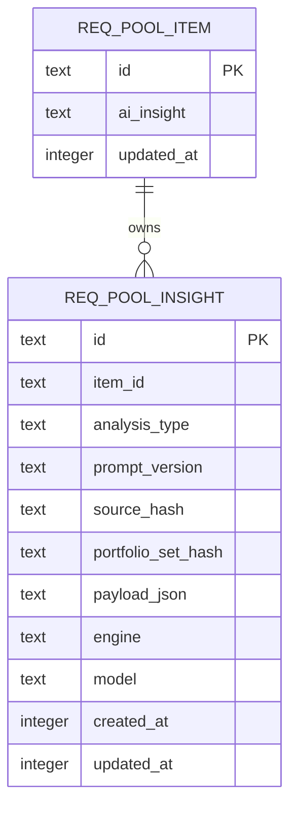
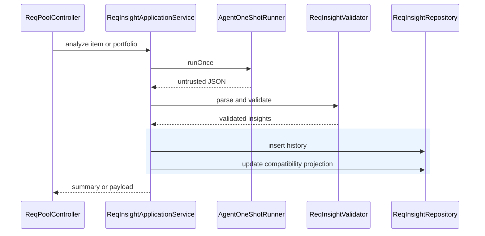

# ReqPool 洞察账本设计

## 1. 目标与范围

把 AI 洞察从 `req_pool_item.ai_insight` 的可变 JSON 升级为可追溯历史，同时保留该列作为兼容投影。本阶段只处理单条洞察和组合排序的可靠落库，不拆分 `ReqPoolController`，也不迁移提示词资源。

---

## 2. 已验证现状

- `ReqAnalysisService.analyze` 未校验模型 JSON 就写入当前列。
- `ReqAnalysisService.analyzePortfolio` 边遍历边更新，外来 ID、重复 ID、重复排名或缺项都可能造成部分写入。
- 需求标题、描述、项目或模块变化后，没有元数据说明旧洞察已经过期。
- `ReqItemView` 只返回 JSON，前端无法展示生成时间与失效原因。

---

## 3. 方案决策

### 3.1 兼容策略

新增 `req_pool_insight` 作为不可变历史表；每次成功分析在同一事务中插入历史并更新 `req_pool_item.ai_insight`。旧库没有历史时继续读取兼容列，至少保留一个发布周期。

### 3.2 新鲜度规则

- `source_hash` 由标题、描述、项目和模块的规范化值计算。
- 当前条目的 `source_hash` 与最新洞察不一致时，状态为 `SOURCE_CHANGED`。
- 组合洞察额外保存按条目 ID 与各自源哈希排序计算的 `portfolio_set_hash`；当前活跃根需求集合变化时，状态为 `PORTFOLIO_CHANGED`。
- 旧兼容列没有元数据时，返回 `LEGACY_UNVERIFIED`，不伪装成新鲜结果。

### 3.3 模型输出不变量

单条输出必须是对象，且优先级、ROI、星级、工时、文本和影响数组满足封闭约束。组合输出还必须满足：返回 ID 集合与输入集合完全相等、ID 唯一、排名为 `1..N` 且唯一。只有全量校验通过才允许写数据库。

---

## 4. 数据与事务

`ReqInsightApplicationService` 负责事务；`ReqInsightRepository` 只负责 SQL。组合分析流程为“调用模型 → 完整解析 → 全量校验 → 单事务批量插入与更新投影”，校验失败不产生任何写入。

---

## 5. 调用流程

---

## 6. 失败行为与验收

| 场景 | 预期行为 |
|---|---|
| 单条 JSON 非法 | 返回明确失败，不写历史和兼容列 |
| 组合结果含外来或缺失 ID | 整批拒绝，不产生部分写入 |
| 组合排名重复或越界 | 整批拒绝，不产生部分写入 |
| 需求事实发生变化 | API 返回 `stale=true` 与 `SOURCE_CHANGED` |
| 活跃组合集合变化 | 组合洞察返回 `PORTFOLIO_CHANGED` |
| 存量仅有 `ai_insight` | 保持可展示，并标记 `LEGACY_UNVERIFIED` |

验证包含临时 SQLite 集成测试、模型非法输出测试、事务回滚测试、前端状态映射测试以及模块构建。

---

## 7. 回滚与后续

新表为 additive DDL；回滚应用版本时旧代码仍读取 `ai_insight`。后续发布周期再评估停止旧列写入，并把 prompt 迁入版本化资源目录和统一 AI run 审计表。
