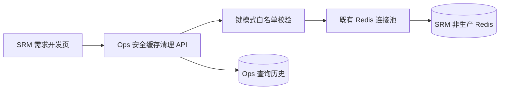

# SRM 菜单缓存一键重置

## 目标

在 SRM 需求开发页提供常用的菜单缓存重置操作，清除菜单初始化或授权变更后残留的 Redis 缓存，减少开发人员反复进入 Redis 控制台手工执行命令的成本。

## 范围与边界

- 复用“系统与中间件”中已登记的 SRM Redis 数据源，不在浏览器保存 Redis 密码。
- 快捷入口只展示非生产环境数据源，避免误清生产缓存。
- 固定清理 `system_menu:*`、`menu_role_ids:*`、`permission_menu_ids:*` 三类缓存。
- 执行前必须确认目标系统、环境和实例；执行后逐类展示删除数量，并提示退出 SRM、重新登录和强制刷新。
- 后端使用 `SCAN` 获取匹配键并分批 `DEL`，禁止 `KEYS`、`FLUSHDB` 和任意 Redis 命令透传。
- 本功能不修改数据库结构，不产生人工待执行 SQL。

## 架构设计

前端 `srm-dev` 负责业务语义和固定模式，`tool-ops` 负责数据源凭据、连接池、安全校验、执行和审计。两个功能模块通过 HTTP API 协作，不建立前端跨模块源码依赖或后端 Java 模块反向依赖。

## 安全设计

1. 服务端只接受一至十个模式。
2. 模式必须是至少四个安全字符组成的字面前缀加单个末尾 `*`，不接受 `*`、中间通配符、`?` 或字符集表达式。
3. 数据源必须为 Redis 类型。
4. 前端快捷入口过滤 `prod`、`production`、`生产`、`正式` 环境。
5. 所有执行结果写入既有 Ops 查询历史，记录模式、状态、删除总数与耗时。

## 验收标准

- 登记 SRM 非生产 Redis 后，页面可选择明确的数据源并一键重置。
- 删除前出现二次确认，确认内容包含目标环境、端点和三个固定模式。
- 成功后展示每个模式及合计删除数量。
- 无匹配键时仍成功返回，删除数量为零。
- 非 Redis 数据源、危险模式或连接异常返回清晰错误，不能执行宽范围删除。
- 没有可用数据源时提供前往“系统与中间件”登记的入口。

