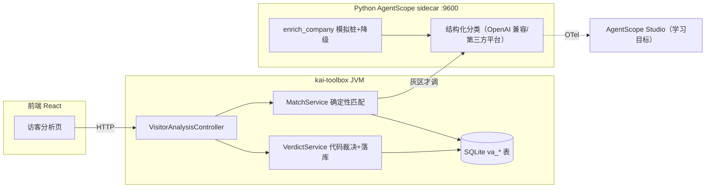

# 访客分析智能体 — 设计文档

> 状态：设计中（首版骨架已落地）。模块：`tools/tool-visitor-analysis`（Java）+ `python-services/visitor-analysis`（Python AgentScope sidecar）+ `frontend/src/features/visitor-analysis`。

## 1. 目标与本质

给前台/历史访客自动判别身份：**客户（新客/熟客/流失）/ 竞争对手 / 供应商 / 合作伙伴 / 求职者 / 政府监管媒体 / 无法识别**。

这本质是**实体解析 + 分类**问题，不是"把字段丢给大模型猜"：

- **新客/熟客是事实查询**（这个人/公司在不在我们的库里），必须查库，绝不交给 LLM。
- **竞争对手**一半是事实（命中竞品名单），一半是判断（没听过的公司是不是同行）。
- 所以遵循**确定性优先（deterministic-first, LLM-last）**：能查库/规则匹配的全用代码定论，LLM 只啃灰区，且输出当不可信入参由代码裁决（"LLM 提议，代码裁决"）。

## 2. 控制面 / 推理面 职责边界（架构原则）

| | 推理面（Python AgentScope sidecar） | 控制面 / 总控（Java Spring） |
|---|---|---|
| 负责 | 灰区单次结构化分类、企业数据增强、（学习目标）Studio 观测 | 数据归属、确定性匹配、代码裁决、落库、SSE、UI |
| 性质 | 概率性、模型相关 | 确定性、事务性、**系统真相** |

划边界的依据不是"谁来调度"，而是**确定性与真相归属**：确定的、要负责的归 Java；模糊的、模型相关的归 Python。这也是国内"Java 中台 + Python agent"双语言形态的缩影。

## 3. 拓扑

## 4. 判别流水（五阶段）

1. **归一化**（`Normalizer`，纯代码）：手机号去 +86/非数字；公司名全角转半角、去后缀。归一化键在 Java/Python/导入脚本间须一致。
2. **确定性匹配**（`MatchService`，查库）：竞品名单 > 客户库 > 访客台账自比对。命中即定论，高置信，**跳过 LLM**。
3. **数据增强**（sidecar `enrich_company`）：当前模拟桩，自动降级；真实接入换适配器签名不变。
4. **灰区分类**（sidecar）：仅当②无法定论时调用。一次结构化输出（非 ReActAgent 工具循环——第三方平台 function-calling 支持参差，且工具顺序本就固定）。
5. **代码裁决**（`VerdictService`）：枚举校验 + 置信度阈值（`review-threshold`，默认 0.7），低于阈值或 UNKNOWN/降级 → `needs_review=1` 进人工复核。

**关键决定**：确定性命中直接定论、不调 LLM，是最省也最准的路径。代价是确定性步骤不进 Studio。若要让确定性步骤也进 Studio 全链路，可将 `MatchService` 改为 sidecar 回调 Java `/internal/match` 的 AgentScope tool——本版未采用，作为演进选项。

## 5. 类别体系（正交两维）

- **身份 identity**：CUSTOMER / COMPETITOR / VENDOR / PARTNER / JOB_SEEKER / OFFICIAL / UNKNOWN
- **关系 relationship**（仅 CUSTOMER 有意义）：NEW / EXISTING / CHURNED / NONE
- 业务要压成三类只需折叠身份维度，不改数据结构。

## 6. 数据缺口与建议补充字段

- 当前业务库仅 名称/手机/公司/地址。真·新熟客判据来自**历史客户库**（`va_customer`，业务侧导入）；有 `last_deal_at`/`status` 才能区分熟客 vs 流失。
- 建议补充（按增益排序）：① 客户库/订单/合同 → ② 统一社会信用代码（企业唯一键） → ③ 企业邮箱域名 → ④ 来访目的/接待人 → ⑤ 职位/名片 OCR。
- 客户库未接入前，"熟客"口径退化为访客台账自比对的"曾来访"，结果需标注避免误读。

## 7. 表结构

见 `tools/tool-visitor-analysis/src/main/resources/db/visitor-analysis-schema.sql`：`va_visitor` / `va_customer` / `va_competitor` / `va_company_cache` / `va_verdict` / `va_feedback`。全部 `IF NOT EXISTS`（SchemaInitializer 每次启动幂等执行）。

## 8. 接口契约

前端：
- `POST /api/visitor-analysis/analyze` — 单条，SSE（stage* → done/error），前台"看判别过程"用。
- `POST /api/visitor-analysis/analyze-sync` — 单条同步返回 `VerdictView`（前端表单用）。
- `POST /api/visitor-analysis/batch` — 批量，SSE 进度 + 汇总。
- `GET /verdicts?limit` · `GET /reviews` · `POST /reviews/{id}/correct` · `GET/POST/DELETE /competitors` · `GET /sidecar-health`。

Java ↔ Python：
- `POST {sidecar}/analyze` — body 访客字段 + 匹配上下文；resp `{identity, relationship, confidence, rationale, evidence, model, degraded}`。
- `GET {sidecar}/health`。

## 9. 框架选型

- **Python AgentScope sidecar**（用户拍板的方案 b）：Python 是 AgentScope 旗舰 SDK，特性最全、更新最快，Studio/OTel 观测一并学。
- 模型走**第三方 OpenAI 兼容平台**，key 由 sidecar 持有（环境变量，不进仓库）。Java 侧不接模型。
- sidecar 不启动**不影响** Java 确定性判别，灰区降级为待人工确认。

## 10. 开发与运行

- Java：`mvn -pl tools/tool-visitor-analysis -am compile`（已验证 BUILD SUCCESS）。
- 前端：`npm run typecheck`（已验证通过）；`npm run dev` 走 :5173 代理。
- sidecar：`python-services/visitor-analysis/start.bat`（:9600），需设 `VA_LLM_BASE_URL/KEY/MODEL`。
- 运行红线：进程由用户自行启动；本设计的验证只到编译 + typecheck。
