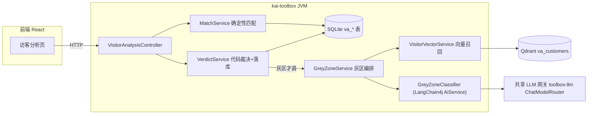

# 访客分析智能体 — 设计文档

> 状态：设计中（首版骨架已落地）。模块：`tools/tool-visitor-analysis`（Java，灰区分类 + 向量召回均在 JVM 内）+ `frontend/src/features/visitor-analysis`。
>
> **2026-06 变更**：灰区分类已从 Python AgentScope sidecar 迁回 Java，改用 **LangChain4j**——LLM 经共享网关 `toolbox-llm`（`ChatModelRouter`）按 tier 取得，向量召回用 `langchain4j-qdrant` + bge-m3。`python-services/visitor-analysis` 不再参与运行（保留代码备查，可删）。

## 1. 目标与本质

给前台/历史访客自动判别身份：**客户（新客/熟客/流失）/ 竞争对手 / 供应商 / 合作伙伴 / 求职者 / 政府监管媒体 / 无法识别**。

这本质是**实体解析 + 分类**问题，不是"把字段丢给大模型猜"：

- **新客/熟客是事实查询**（这个人/公司在不在我们的库里），必须查库，绝不交给 LLM。
- **竞争对手**一半是事实（命中竞品名单），一半是判断（没听过的公司是不是同行）。
- 所以遵循**确定性优先（deterministic-first, LLM-last）**：能查库/规则匹配的全用代码定论，LLM 只啃灰区，且输出当不可信入参由代码裁决（"LLM 提议，代码裁决"）。

## 2. 确定面 / 概率面 职责边界（架构原则）

| | 概率面（LangChain4j：灰区分类 + 向量召回） | 确定面 / 总控（Java Spring） |
|---|---|---|
| 负责 | 灰区单次结构化分类、向量语义召回、企业数据增强（桩） | 数据归属、确定性匹配、代码裁决、落库、SSE、UI |
| 性质 | 概率性、模型相关 | 确定性、事务性、**系统真相** |

划边界的依据不是"谁来调度"，而是**确定性与真相归属**：确定的、要负责的归代码定论；模糊的、模型相关的交 LLM 提议、再由代码裁决。两面现在都在同一 JVM 内（LangChain4j），不再跨进程桥接——少一跳网络、少一份 key 管理、少一个要单独拉起的进程。

## 3. 拓扑

## 4. 判别流水（五阶段）

1. **归一化**（`Normalizer`，纯代码）：手机号去 +86/非数字；公司名全角转半角、去后缀。归一化键在 Java/Python/导入脚本间须一致。
2. **确定性匹配**（`MatchService`，查库）：竞品名单 > 客户库 > 访客台账自比对。命中即定论，高置信，**跳过 LLM**。
3. **数据增强**（`GreyZoneService` 内桩）：当前模拟桩，恒标记 `degraded`；真实接入换适配器签名不变。
4. **灰区分类**（`GreyZoneService` → `VisitorVectorService` 召回 + `GreyZoneClassifier` 分类）：仅当②无法定论时调用。先向量召回历史相似客户作上下文，再一次结构化输出（LangChain4j `AiServices` 直接把 LLM 输出解析成 `ClassifyProposal` POJO，无工具循环）。
5. **代码裁决**（`VerdictService`）：枚举校验 + 置信度阈值（`review-threshold`，默认 0.7），低于阈值或 UNKNOWN/降级 → `needs_review=1` 进人工复核。

**关键决定**：确定性命中直接定论、不调 LLM，是最省也最准的路径。灰区 LLM 经共享网关 `toolbox-llm` 取模型——池化/限流/故障转移/计量对本模块透明，且默认回退本地 Ollama，零配置可跑；要用更强远端模型只需在 `toolbox.llm.models` 加一个 `tier: visitor` 成员。

## 5. 类别体系（正交两维）

- **身份 identity**：CUSTOMER / COMPETITOR / VENDOR / PARTNER / JOB_SEEKER / OFFICIAL / UNKNOWN
- **关系 relationship**（仅 CUSTOMER 有意义）：NEW / EXISTING / CHURNED / NONE
- 业务要压成三类只需折叠身份维度，不改数据结构。

## 6. 数据缺口与建议补充字段

- 当前业务库仅 名称/手机/公司/地址。真·新熟客判据来自**历史客户库**（`va_customer`，业务侧导入）；有 `last_deal_at`/`status` 才能区分熟客 vs 流失。
- 建议补充（按增益排序）：① 客户库/订单/合同 → ② 统一社会信用代码（企业唯一键） → ③ 企业邮箱域名 → ④ 来访目的/接待人 → ⑤ 职位/名片 OCR。
- 客户库未接入前，"熟客"口径退化为访客台账自比对的"曾来访"，结果需标注避免误读。

## 7. 表结构

见 `tools/tool-visitor-analysis/src/main/resources/db/visitor-analysis-schema.sql`：`va_visitor` / `va_customer` / `va_competitor` / `va_company_cache` / `va_verdict` / `va_feedback`。全部 `IF NOT EXISTS`（SchemaInitializer 每次启动幂等执行）。

## 8. 接口契约

前端：
- `POST /api/visitor-analysis/analyze` — 单条，SSE（stage* → done/error），前台"看判别过程"用。
- `POST /api/visitor-analysis/analyze-sync` — 单条同步返回 `VerdictView`（前端表单用）。
- `POST /api/visitor-analysis/batch` — 批量，SSE 进度 + 汇总。
- `GET /verdicts?limit&q&identity&needsReview` — 判别记录查询：`q`（姓名/公司模糊）、`identity`（身份枚举精确）、`needsReview`（true=仅待复核 / false=仅已确认）全可选且 AND；无条件等同最近 N 条。前端「判别记录」Tab 用。
- `GET /reviews` · `POST /reviews/{id}/correct` · `GET/POST/DELETE /competitors`。
- `GET /sidecar-health` — 路径保留以兼容前端；语义已改为「**向量召回是否就绪**」（`{online}`）。online=false 时灰区仍可判别，只是不带历史相似客户参考，非阻断。
- `POST /customer-refs/sync-vector` · `DELETE /vector/customers` — 客户底库 ↔ Qdrant 向量库的同步/清空。
- `GET /customer-refs` · `POST /customer-refs`（新增）· `PUT /customer-refs/{id}`（编辑）· `DELETE /customer-refs/{id}`（删除）· `POST /customer-refs/import`（CSV 批量）——客户去重底库的完整 CRUD。归一化键（name_norm/keyword_norm/addr_norm）一律由后端 Normalizer 现算，前端不传；编辑/删除后 synced_at 置空，提示重新「一键同步」。

内部（同 JVM，无跨进程协议）：
- 灰区分类 `GreyZoneClassifier.classify(userPrompt)` → `ClassifyProposal{identity, relationship, confidence, rationale, evidence}`（LangChain4j 结构化输出）。
- 向量召回 `VisitorVectorService.searchSimilar(...)` → `List<SimilarRecord>`。

ERP 对接（`/api/visitor-analysis/cust-add-audit`，按申请单维度，与前端 `VerdictView` 维度区分）：
- `POST /sync`（立即拉取登记）· `POST /analyze`（立即判别）· `GET /records`（台账列表）。
- `GET /verdict?flowApplyId=` 单条回查 · `GET /verdicts?flowApplyIds=1,2,3` 批量回查 → ERP 展示视图 `{found, result(PASS/REJECT/DOUBT), reason, confidence, identity, ...}`。**只读，ERP → 查**。
- `POST /feedback` — **ERP → 回写**：body `{flowApplyId, correct, reason?, correctedIdentity?, correctedRelationship?, operator?}`。按 `flowApplyId` 定位最新台账行，回写 `erp_feedback_*`；`correct=false` 且带正确结果时同步落一条 `va_feedback`（按 verdict_id），供后续规则/竞品名单沉淀。这是 ERP 反馈「AI 判定是否正确 + 不正确原因」的唯一入口；按申请单业务键定位，不要求 ERP 持有内部 verdict id。

## 9. 框架选型

- **LangChain4j（同 JVM）**：灰区分类与向量召回都在 Java 内完成，不再跨进程桥接 Python。
  - LLM 经共享网关 `toolbox-llm` 的 `ChatModelRouter.forTier(tier)` 取得，与 `tool-ai-secretary` 同套路：池化 / 限流 / 故障转移 / 计量内聚在网关，对本模块透明；未配置 `visitor` 档时回退默认（本地 Ollama），开箱即跑。
  - 向量召回用 `langchain4j-qdrant` + OpenAI 兼容 embedding（bge-m3），独立集合 `va_customers`，默认 `rag.enabled=false`（需 Qdrant + bge-m3 才开）。
- **为什么去掉 AgentScope sidecar**：灰区判别本质是「一次结构化分类 + 向量召回」，LangChain4j 完全覆盖；桥接 Python 多一跳网络、多一份 key/进程管理、多一个可挂的依赖，收益（Studio/OTel 观测）与本工具诉求不匹配。LLM 网关侧的 AgentScope Studio 观测（`toolbox-llm` 的 `AgentScopeStudioExporter`）是另一条独立链路，不受本次变更影响。

## 10. 开发与运行

- Java：`mvn -pl tools/tool-visitor-analysis -am compile`（已验证 BUILD SUCCESS）。
- 前端：`npm run typecheck`（已验证通过）；`npm run dev` 走 :5173 代理。
- 向量召回（可选）：① `ollama pull bge-m3` ② 启动 Qdrant（`docker run -p 6333:6333 -p 6334:6334 qdrant/qdrant`）③ 把 `toolbox.visitor-analysis.rag.enabled` 改 `true` 重启。关闭时灰区分类照常，只是不带历史召回上下文。
- 运行红线：进程由用户自行启动；本设计的验证只到编译 + typecheck。
