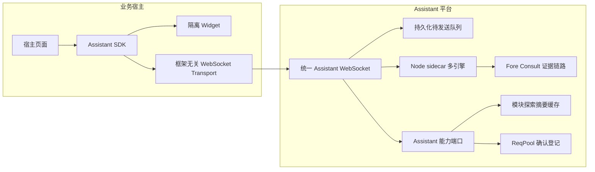
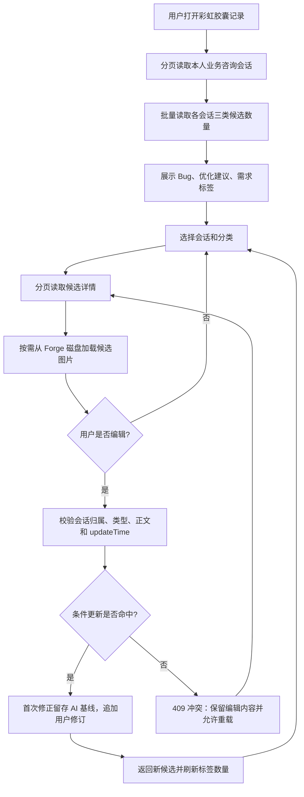
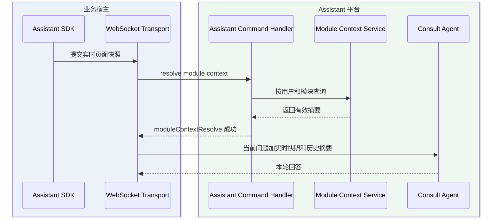
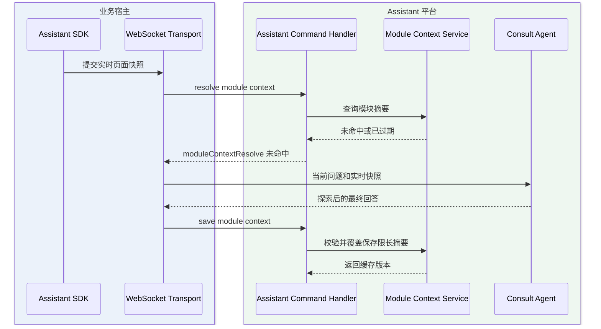
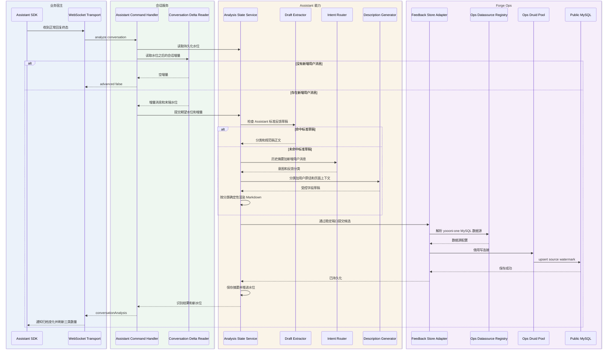
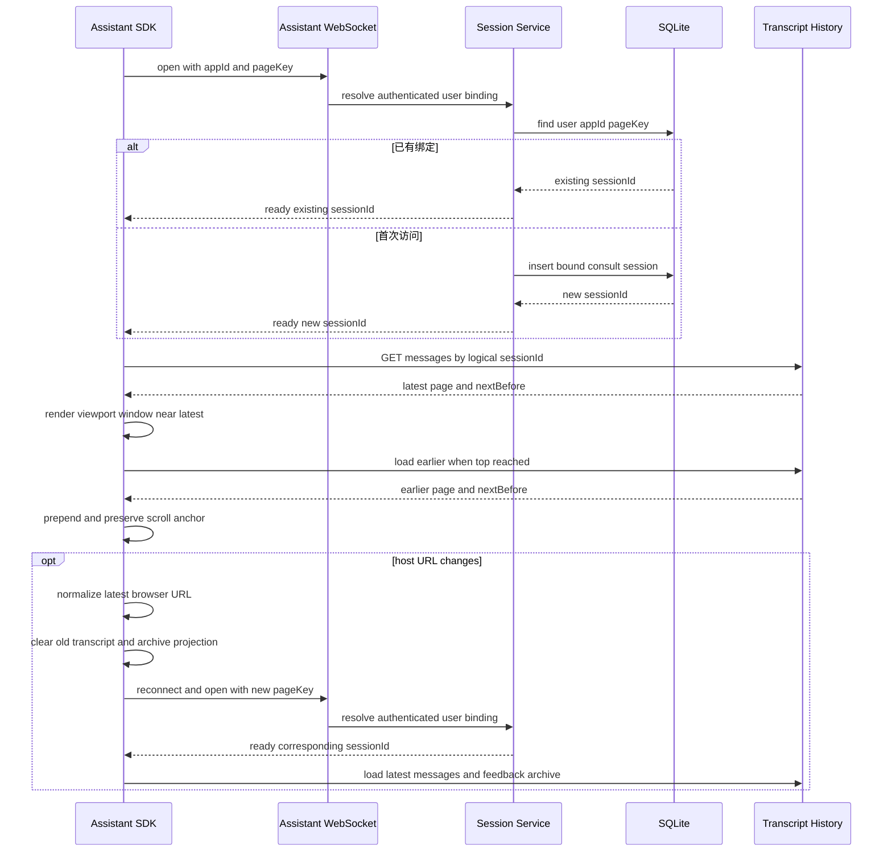
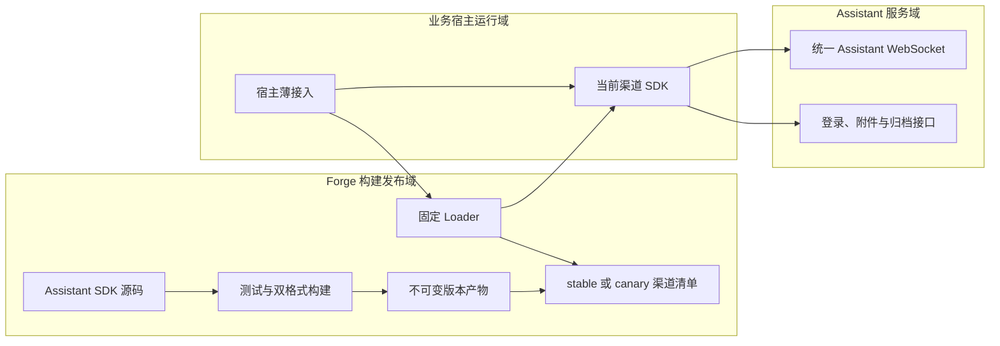
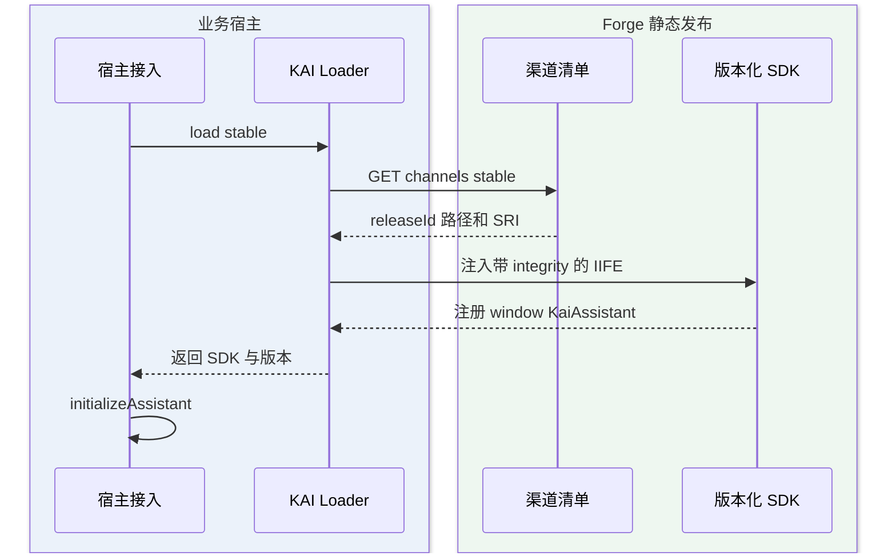
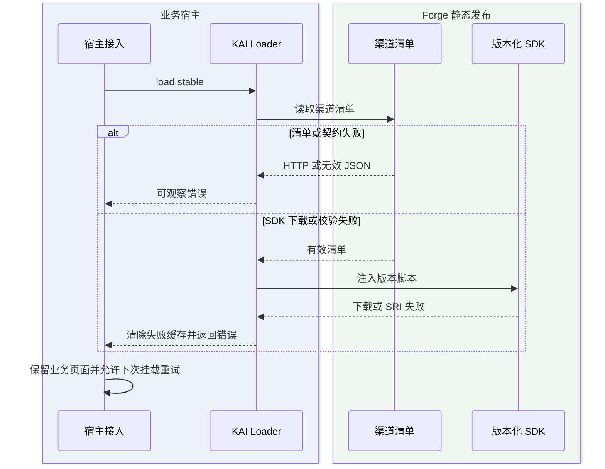

# 企业内部多 Web 系统统一嵌入式 AI 助手

> PRD Session：`81eed90c-2977-4a99-b46b-c750fbcadcf2`。本文固化 Phase 4 方案在代码定位后的实施基线；完整规格追踪、PLAN-001 至 PLAN-015、验证计划与风险表以已确认的 Phase 4 产出为准。

## 1. 实施范围

- 提供可独立分发的框架无关 Assistant SDK 和隔离样式 Widget，宿主不依赖 kai-toolbox React 代码。
- 复用 Claude Chat 的业务咨询 WebSocket、sidecar 多引擎、事件水位、重连恢复和待发送队列。
- 复用 Fore Consult 的系统链路、证据路由、只读查询和咨询归档能力。
- 以 ReqPool 作为 AI 需求中枢，确认登记后的初始状态为 `PENDING_EXECUTION`。
- 缓存同一用户对页面模块的首次探索摘要，新会话优先复用，动态页面状态仍按请求实时采集。
- V0.1 不修改 ERP、SCM、SRM 宿主仓库，但交付 ESM 与 IIFE 产物和最小接入契约。

## 2. 已确认架构决策



- 多标签页均可提交。会话处于运行、回复、待确认或恢复未稳定状态时，消息进入既有持久化队列；仅在服务端确认安全释放后按 FIFO 发送。
- Widget 按当前用户持久化最近一次 Assistant `sessionId`；刷新或多标签页首次提交先恢复该会话，失效或越权时清理旧标识并新建。
- 客户端 `appId`、`userId` 只属于上下文，认证身份以服务端登录态为准。
- 会话创建、Attach、查询、补拉和队列操作统一执行访问策略：普通用户仅访问本人会话，ADMIN 可访问任意用户会话。
- ADMIN 跨用户访问不放宽执行域隔离；业务咨询、评审分享和 Vibe Coding 通道仍只能绑定各自策略允许的会话。
- 草稿不产生正式需求；确认登记使用草稿级 `idempotencyKey`，重复提交返回首次结果。
- Assistant 失败不得阻塞宿主业务链路。
- 宿主只负责加载 SDK、提供上下文、更新上下文和配置 WebSocket 地址；咨询、诊断、队列和会话逻辑不得复制到宿主。
- `AssistantBridge` 仅作为 kai-toolbox 兼容适配器；公开 SDK 不得引用 React、Router、认证 Hook 或 feature 私有实现。
- 浏览器建立连接时通过 `getAccessToken` 动态取得短期 Assistant ACCESS token；同源代理也可在宿主后端完成身份映射。Token 不进入 SDK 本地存储，上下文 `user.id` 永远不参与授权。
- 为内部试用提供显式开启的 Forge 外部登录模式：宿主配置登录地址后，Widget 在缺少 Token 时展示 Forge 账号登录；登录接口只对白名单 Origin 开放，SDK 将 ACCESS Token 与绝对过期时间限制在当前标签页 `sessionStorage`，不保存密码或 REFRESH Token。
- 外部登录模式复用 Forge 账号和既有 ACCESS Token，不等同于跨域共享 Forge 页面的 `localStorage` 登录态；生产接入仍优先使用宿主后端换取短期、限域的 Assistant Token。
- Widget 可配置初始隐藏；默认以 `Ctrl/⌘ + Alt/Option + Shift + 0` 唤起本地密钥输入，验证后显示助手。采用无功能语义的数字四键组合，以避开常见截图、菜单、浏览器和编辑器快捷键；显示密钥只控制前端可见性，不承担身份认证或权限校验。
- 彩虹胶囊入口在桌面端和移动端均允许拖动，位置按 `appId + userId` 本地保存并始终约束在可视区域；对话框仅桌面端允许拖动，窄屏保持固定全屏布局。
- 用户发送后消息立即进入对话框，上下文采集和回复生成状态跟随当前回合显示在消息流中；准备、连接、回复、消息处理、后台处理和待确认期间禁止再次发送，终态或失败后恢复发送。
- 准备上下文、连接和回复执行期间展示“中止”动作：准备阶段中止本地 Provider 采集，已进入会话后复用既有 WebSocket `interrupt` 链路；中止不得销毁会话或丢弃服务端待发送列表。
- Widget 提供默认收起的调试面板，按时间展示上下文准备、WS 连接、协议发送/接收、中止和错误元数据；日志最多保留 200 条且仅存在当前页面内存，禁止记录密码、Token、Cookie、业务正文和完整上下文。
- Composer 支持从剪贴板一次粘贴最多 5 张 PNG、JPEG、GIF 或 WebP 图片，单张不超过 10MB、单次总量不超过 25MB；图片只在当前页面内存暂存并允许发送前预览、移除，不以 Base64、Blob 或对象 URL 写入本地存储和调试日志。
- 图片随消息提交时，Transport 必须先建立归属当前用户的会话，再携带同一短期 ACCESS Token 通过受控 AJAX 上传；上传成功后 WS 只发送服务端返回的 `name/path/mime` 引用。任何一张上传失败都不得静默降级为纯文本发送，必须移除本地乐观消息并恢复文本与图片草稿供用户重试。
- 用户消息必须保留附件投影：刚发送的图片以当前页面内存中的 File 即时生成缩略图；历史消息按 turnId 批量读取附件元数据并通过会话鉴权接口加载 Blob。图片可点击预览，非图片附件显示紧凑文件图标和名称。
- 附件上传 CORS 复用外部登录的精确 Origin 白名单，只开放上传路径的 `POST/OPTIONS` 和 `Authorization/Content-Type` 请求头；服务端同时执行登录校验、会话归属校验、文件类型、大小和路径沙箱校验。
- 第三方未配置 `wsUrl` 或自定义 Transport 时，首次提交必须立即返回可恢复的配置错误并写入调试日志，不得停留在“正在准备上下文”。
- 模块缓存键由 SDK 从 `page.routeName` 或规范化页面 URL 确定；服务端再按认证用户、`appId` 和 `moduleKey` 隔离，客户端 `user.id` 不参与缓存授权。
- 缓存摘要只作为历史分析线索，不替代本轮 Provider 快照、源码证据或运行数据；命中摘要时必须显式标记生成时间和证据版本。
- 首期只缓存同一认证用户的首次模块分析摘要，避免具体单据、角色和错误现场跨用户泄露；跨用户共享必须经过后续审核发布能力。
- 摘要最长 6000 字符，默认有效期 7 天；宿主提供 `sourceRevision` 时，版本不一致立即视为未命中。

## 3. PLAN-001 代码事实

| 能力 | 真实落点 | 决策 |
|---|---|---|
| 咨询 WebSocket | `ClaudeChatWebSocketConfig` 的 `/api/claude-chat/consult/ws` | 复用 |
| 会话恢复 | `ClaudeChatService#attach`、`replayBuffer`、`redeliverPending` | 扩展所有权，不另建协议 |
| 待发送队列 | `QueuedChatMessageService`、`QueuedChatMessageRepository` | 直接复用 |
| 多引擎执行 | `sidecar/claude-agent` | 直接复用 |
| 业务咨询 | `tool-fore-consult` | 直接复用公开接口和执行策略 |
| 需求中枢 | `tool-reqpool` | 新增 Assistant 登记端口 |
| 用户认证 | `toolbox-common` 的 `AuthContext`、握手拦截器 | 扩展为所有权策略 |
| 会话归属 | `claude_chat_session.user_id` | 新增并兼容旧会话；HTTP、WebSocket、队列和项目批量操作统一执行“ADMIN 全部可见、普通用户仅本人”策略 |
| 模块探索缓存 | `tool-assistant` 的 `assistant_module_context_cache` | 按认证用户、应用和模块覆盖保存限长摘要；不复用请求快照表 |

## 4. 发布边界

- 本阶段交付独立 SDK 分发层和统一 WS 基础协议，仍不宣称完成 ERP、SCM、SRM 生产接入。
- ESM 面向现代构建系统，IIFE 面向 JSP 与原生 HTML；两种产物复用同一源码和协议实现。
- OPEN 项保持配置化或明确未决，不自行设定准确率和正式生产权限阈值。
- DDL 必须幂等，由模块 SchemaInitializer 在应用启动时执行；不作为人工待执行 SQL 登记。
- 实现与 Phase 6 审查结论见[验收报告](企业内部多Web系统统一嵌入式AI助手-验收报告.md)。

## 5. 宿主接入契约

现代构建系统安装 ESM 产物后只需初始化一次：

```ts
import { initializeAssistant } from '@kai/assistant-sdk'

const assistant = initializeAssistant({
  appId: 'ERP',
  appName: 'ERP',
  sourceRevision: 'erp-2026.08',
  wsUrl: '/assistant-ws',
  getAccessToken: () => getAssistantAccessToken(),
  visibility: {
    initiallyHidden: true,
    activationKey: '由宿主配置的显示密钥',
  },
  draggable: true,
  user: { id: String(currentUser.id), displayName: currentUser.name },
  page: { url: location.pathname, routeName: 'sales-order-detail', title: document.title },
})
```

## 6. 会话归档反馈回顾与编辑

彩虹胶囊在标题栏提供“记录”入口，仅回顾当前认证用户的“业务咨询”会话。会话仍以 Forge SQLite `claude_chat_session` 为唯一归档事实，识别出的反馈仍以公网 MySQL `assistant_feedback_candidate` 为唯一候选事实，不新建第二套会话或反馈表。

- 归档列表按会话最后活跃时间做游标分页，每条记录固定展示 `Bug`、`优化建议`、`需求` 三个标签及数量，数量为零时仍保留标签，使分类语义稳定。
- 进入会话后按所选标签分页读取候选，不一次性加载无界历史。
- 用户可修改反馈正文，也可在三个反馈分类之间纠正类型；服务端根据新类型重新派生 `requirement_type`，不接受客户端直接修改派生字段。
- 用户首次修正前，同一 MySQL 事务先把当前 AI 分类、派生类型和原始描述写为 `AI` 基线版，再写入 `USER` 修订版并更新候选当前值。后续每次修正均追加新版本，不覆盖 AI 原稿或已有用户修订。
- 编辑仅更新候选，不直接创建 ReqPool 正式记录，不删除来源水位、置信度、识别原因、页面定位和检出时间。界面默认展示当前修订，并可展开查看 AI 原稿和历次修订。
- 更新请求必须携带已读取的 `updateTime`。公网 MySQL 使用“候选 ID + 会话 ID + 创建人 + 旧更新时间”做条件更新，冲突返回 `409`，界面保留用户输入并提供重新加载。
- 候选查询使用 `(creator_user_id, session_id, feedback_category, detected_at, id)` 索引；会话页和候选页均有服务端上限，禁止无界查询。
- 外部宿主通过 AJAX 回顾和编辑，复用短期 ACCESS Token 与精确 Origin 白名单；CORS 只增加归档路径所需的 `GET/PATCH/OPTIONS` 及 `Authorization/Content-Type`。
- 彩虹胶囊图片上传后立即写入 Forge 受控磁盘目录，SQLite 只保存附件 ID、会话归属、文件名、MIME、大小和相对存储键，禁止保存 Blob 或把绝对路径作为对外契约。
- 发送回合把附件 ID 与服务端 `turnId` 持久关联；增量分析从用户轮次结构化获取附件，公网 MySQL 只保存候选与逻辑附件 ID 及安全元数据的关联，不保存磁盘绝对路径。
- 归档图片通过“会话 + 候选 + 附件 ID”的受控下载接口加载，每次读取重新校验认证用户与会话归属并限定图片 MIME。磁盘文件不可用时保留元数据并显示可恢复错误，不返回任意文件路径。



### 6.1 编码落点

```text
toolbox-common/src/main/java/com/exceptioncoder/toolbox/common/assistant/
└── AssistantFeedbackStorePort.java                         [修改] 增加归档摘要、候选分页查询和乐观更新稳定端口

tools/tool-claude-chat/src/main/java/com/exceptioncoder/toolbox/claudechat/
├── api/AssistantFeedbackArchiveController.java             [新增] 会话归档反馈查询与编辑的 HTTP 协议适配
├── service/AssistantFeedbackArchiveService.java             [新增] 编排会话归属、SQLite 归档与 MySQL 候选
├── repository/ClaudeChatAttachmentRepository.java           [新增] 持久附件元数据和 turnId 关联
├── service/AttachmentStorageService.java                    [修改] 咨询附件改为受控目录落盘并按附件 ID 解析
├── service/ClaudeChatConversationDeltaReader.java           [修改] 把用户轮次附件结构化投影到增量分析
└── repository/ClaudeChatSessionRepository.java              [修改] 增加业务咨询会话游标分页

tools/tool-claude-chat/src/main/resources/db/
└── claude-chat-schema.sql                                   [修改] 增加附件元数据与轮次关联表

tools/tool-ops/src/main/
├── java/com/exceptioncoder/toolbox/ops/service/OpsAssistantFeedbackStoreAdapter.java [修改] 复用 Ops 连接池批量查询、分页及条件更新
└── resources/mysql/assistant-feedback-schema.sql            [修改] 补充查询索引、AI/用户修订版本和候选附件关联表

toolbox-common/src/main/java/com/exceptioncoder/toolbox/common/auth/config/
└── ExternalLoginCorsConfiguration.java                      [修改] 仅放行归档接口需要的精确方法和请求头

frontend/src/assistant-sdk/
├── types.ts                                                 [修改] 增加归档状态与 Transport 用例契约
├── AssistantWebSocketTransport.ts                           [修改] 复用 WS 域名与 ACCESS Token 调用归档 AJAX
├── assistantSdk.ts                                          [修改] 绑定记录查询、分类切换和候选保存事件
└── widget.ts                                                [修改] 增加记录入口、三标签分页、行内编辑与恢复态
```

JSP 或原生页面加载 `kai-assistant.iife.js` 后调用 `KaiAssistant.initialize(...)`，参数相同。宿主在路由或业务对象变化时调用 `updateContext`，在业务按钮中调用 `open('QUESTION' | 'BUG' | 'SUGGESTION' | 'DIAGNOSE')`；不得复制聊天、排队、重连、草稿或登记逻辑。

`visibility.initiallyHidden` 缺省为 `false`，保持既有接入兼容；`draggable` 缺省为 `true`。隐藏状态下快捷键只打开密钥输入层，输入错误保留在当前页面并可重试，取消后恢复完全隐藏。宿主主动调用 `assistant.open(...)` 视为可信页面动作，可直接显示。

V0.1 建议把宿主的 `/assistant-ws` 同源反向代理到 `/api/claude-chat/consult/ws`，代理必须支持 WebSocket Upgrade。`getAccessToken` 返回宿主后端交换得到的短期 Assistant Token；服务端生产配置必须将 `consultAllowedOriginPatterns` 收紧为宿主域名白名单。SDK 的 `user.id` 仅用于上下文和本地存储分区。

内部快速验证可显式配置 `externalLogin`，由 SDK 调用 Forge 专用 `/api/auth/external-login`。该接口复用现有账号认证和权限解析，但仅签发 ACCESS Token，不生成或返回 REFRESH Token。后端通过 `toolbox.auth.external-login.enabled` 和 `allowed-origins` 双重门禁开放该路径的 CORS；未配置白名单时保持跨域登录关闭。外部登录成功后 SDK 立即建立咨询 WebSocket；页面刷新或 SPA 重新挂载时恢复当前标签页内尚未过期的 Token，关闭标签页、到期或鉴权失败后清理并重新登录。

```ts
const assistant = initializeAssistant({
  appId: 'ERP',
  sourceRevision: 'erp-2026.08',
  wsUrl: 'wss://forge.company.internal/api/claude-chat/consult/ws',
  externalLogin: {
    loginUrl: 'https://forge.company.internal/api/auth/external-login',
  },
  user: { id: String(currentUser.id), displayName: currentUser.name },
  page: { url: location.pathname, routeName: 'sales-order-detail', title: document.title },
})
```

外部登录与 `getAccessToken` 二选一；同时提供时以宿主 `getAccessToken` 为准，不展示 Forge 登录表单。跨域白名单必须填写完整 Origin，不允许通过业务上下文中的 `appId`、`user.id` 或请求头自行声明可信来源。

## 7. 模块探索摘要复用

模块身份优先使用宿主提供的 `page.routeName`；缺失时，SDK 对 `page.url` 去除查询参数、片段和尾部数字/UUID 业务主键后生成稳定 `moduleKey`。无法得到稳定键时跳过缓存，不因缓存失败阻塞咨询。

缓存内容由首次未命中回合的最终助手回答压缩得到，不保存工具原始输出、完整对话或页面快照。压缩采用确定性限长：保留最终回答的有效文本，超过 6000 字符时保留开头与结尾，中间用省略标记替代。模型输出和客户端上报均视为不可信输入，服务端重新校验字段长度与归属后才写入。

### 7.1 缓存命中



### 7.2 首次探索与写回



缓存查询失败、响应超时或写回失败均降级为原有咨询链路，并通过调试面板记录不含正文的错误元数据。队列消息不等待缓存查询；同一会话已有上下文时继续复用会话历史，避免缓存准备改变既有 FIFO 行为。

## 8. 会话反馈增量识别

彩虹胶囊在每个正常回复终态后触发一次会话反馈分析。分析对象不是客户端重新拼装的全量聊天，而是服务端从该会话已持久化分析水位线之后读取的会话增量。新增 `user` 消息仍是反馈来源；紧随其后的 Assistant 回复只用于提取带固定分类标题的规范草稿，工具输出不作为反馈来源。

- 对话意图继续兼容 `BUG`、`SUGGESTION`、`QUESTION`、`DIAGNOSE`、`UNKNOWN`；需要持久化的反馈另以封闭枚举 `BUG`、`REQUIREMENT`、`OPTIMIZATION` 分类，分别映射需求类型 `BUG_FIX`、`NEW_MODULE`、`MODULE_ADJUST`。
- 每个会话、每个认证用户只保存一条当前分析状态：已分析水位、滚动反馈摘要和更新时间。
- Assistant 回复包含 `BUG 反馈草稿`、`需求反馈草稿` 或 `优化建议草稿` 时，服务端直接提取对应草稿正文并按前置用户消息水位归档，避免重复分类和二次生成造成超时或信息损失。
- 回复未提供标准草稿时，分类器只接收上次滚动摘要与本次增量用户消息；命中三类反馈后由独立描述生成器输出受控 JSON，服务端按分类固定章节确定性渲染 Markdown。
- 描述模型输出解析或校验失败时最多重试一次；仍失败则使用保留用户事实且明确标记“待补充”的确定性模板，不丢失该条反馈。
- 公网候选主表以 `source_content` 永久保存限长用户原话，以 `ai_optimized_content` 保存不可覆盖的 AI 首次规范稿，以可空的 `user_rewritten_content` 保存用户基于 AI 稿的最新改写；有效正文按“用户改写优先、否则 AI 稿”读取，修订表继续保存 AI 基线和每次用户改写的不可变审计历史。
- Bug、需求和优化识别结果先写入公网 MySQL 的 `assistant_feedback_candidate` 候选表，状态固定为 `DETECTED`；模型不得直接创建正式 ReqPool 记录。
- 持久化代码全部位于 Forge：`tool-ops` 按系统编码 `yoooni-one` 和环境解析已登记 MySQL 数据源，直接复用 `OpsDataSourcePool` 的 Druid 池写公网 MySQL；不调用 Yoooni One 项目接口。
- 只有分类、候选幂等落库、摘要处理全部成功后才推进 SQLite 水位；读取失败、分类器异常或公网 MySQL 落库失败均保持原水位，下一次终态从旧水位重试。
- 候选唯一键为 `source_system + session_id + source_watermark`。公网写入成功但本地水位提交失败时，重试使用 upsert，不生成重复反馈。
- 公网候选只保存单条用户反馈、提取出的标准草稿正文、分类、置信度、应用和页面定位等限长字段；不得保存 Token、Cookie、密码、完整上下文快照、完整助手回复或工具输出。
- 同一终态重复触发时，如果没有新增消息，返回 `advanced=false`，不得再次调用分类模型。
- 自动识别结果静默写入三类候选库，不在对话区弹提示、切换模式或开放“指定工程师 / 保存草稿 / 确认登记”动作；用户仅在“记录”归档中回顾并纠正候选。自动识别不得创建 `assistant_draft` 或 ReqPool 正式记录，既有草稿协议仅保留给兼容调用。



## 9. 页面会话稳定绑定与历史窗口化

彩虹胶囊的业务咨询会话以“认证用户 + 来源系统 `appId` + 规范化页面 URL”作为稳定绑定键。客户端声明的 `user.id` 只用于本地界面分区，不参与服务端归属判定；服务端始终使用 ACCESS Token 对应的认证用户 ID。

- 页面键从 `page.url` 生成：保留 Origin 与 Path，查询参数按键排序并过滤敏感参数，移除 Hash；同一业务 URL 的参数顺序变化不得创建新会话。
- `claude_chat_session` 保存 `assistant_app_id`、`assistant_page_key` 和仅用于诊断的 `assistant_page_url`。部分唯一索引保证同一认证用户、系统和页面最多绑定一个业务咨询会话。
- SDK 不再把整份历史消息作为恢复事实写入 `localStorage`；本地只保留未确认发送、事件水位和草稿幂等信息。首次连接携带页面绑定信息，服务端命中既有会话时直接 Attach，未命中时原子创建并绑定。
- 服务端 Ready 后，SDK 按逻辑 `sessionId` 请求最近 30 条消息；滚动到顶部后继续按 `before` 游标读取更早一页。历史读取执行会话归属和 `consult-readonly` 策略校验。
- 历史消息列表采用窗口化渲染：只挂载可视区域附近消息和上下占位，不因已加载页数增加而线性扩大 DOM；向前追加历史时保持用户当前阅读位置，贴底时才跟随流式回复。
- 历史接口失败时保留当前实时消息和输入草稿，提供顶部重试；transcript 缺失时明确说明记录不可恢复，但仍允许在已绑定会话中继续提问。
- 历史用户消息按稳定 turnId 批量关联 `claude_chat_turn_attachment`；接口只返回附件 ID、名称、MIME 和大小。Widget 仅为窗口化范围内的图片加载 Blob 缩略图，复用请求并在页面切换或销毁时释放对象 URL。
- 当前页面的反馈统计、记录列表和候选明细统一以 Ready 返回的逻辑 `sessionId` 为查询边界；不得把当前用户其他页面或历史咨询会话混入记录视图。
- 第三方宿主默认由 SDK 观察浏览器地址变化：`pushState`、`replaceState`、`popstate` 与 `hashchange` 统一触发页面身份重算。规范化 URL 变化后立即清空旧消息和旧归档投影，关闭旧连接，以新 `pageKey` 重新 Open；Ready 返回对应 `sessionId` 后再加载该会话的近期历史和三类归档。匹配新 `sessionId` 期间只展示“正在连接当前页面会话”，旧 Socket 的迟到错误不得覆盖当前页面状态；认证、协议和服务端明确终态错误仍正常展示。宿主可通过 `trackPageUrl=false` 关闭自动观察并自行调用 `updateContext`。
- 页面正在回复或存在未确认发送时，URL 变化先进入单槽待切换状态，当前回合终止后只应用最后一个页面 URL，避免中途关闭连接丢失回复；切换等待期间不得将新页面消息提交到旧会话。



## 10. 中心化 Loader 发布与宿主升级

彩虹胶囊运行时代码由 Forge 统一发布，宿主不再复制或打包 SDK 实现。宿主只保留一层薄接入代码：加载固定 Loader、选择发布渠道、在 Loader 返回 SDK 后调用既有 `initializeAssistant`。Loader 与 SDK 业务协议分离，Loader 不读取用户、页面或 Token，也不建立 WebSocket。



- 每次发布以 IIFE 内容 SHA-256 前缀生成不可变 `releaseId`，同一内容重复发布必须得到同一路径。
- `channels/stable.json` 与 `channels/canary.json` 是可回拨的轻量指针；版本产物使用一年 `immutable` 缓存，Loader 和渠道清单使用 `no-cache`。
- 渠道清单同时保存 IIFE、ESM 路径与 SHA-384 SRI。Loader 仅加载 IIFE，并对跨域脚本启用 `crossorigin=anonymous` 与 `integrity`。
- 静态 SDK 资源允许任意 Origin 执行只读 `GET/HEAD/OPTIONS`；这不放宽登录、WebSocket、附件或归档接口的精确 Origin 白名单。
- Loader 加载、渠道读取、契约校验或脚本执行失败时返回明确异常，不创建半初始化助手，不影响宿主业务页面。
- `stable` 是默认渠道；`canary` 只供测试宿主显式选择。回滚只修改渠道清单指向已保留版本，不覆盖不可变产物。
- Yoooni One 首批改为运行时 Loader 接入；原 vendor 目录暂时保留但不再进入依赖图，确认稳定后再单独清理。

### 10.1 正常加载



### 10.2 加载失败与重试



### 10.3 编码落点

```text
frontend/
├── src/assistant-loader/
│   ├── loader.ts                         [新增] 渠道解析、manifest 校验、SRI 脚本加载与全局入口
│   └── loader.test.ts                    [新增] 成功、失败、并发复用和重试契约
├── scripts/publish-assistant-release.mjs [新增] 生成内容寻址版本与渠道清单
├── vite.assistant-loader.config.ts       [新增] 构建固定 IIFE Loader
└── package.json                          [修改] 主构建自动产出 SDK 发布目录

toolbox-starter/src/main/java/com/exceptioncoder/toolbox/web/
└── SpaFallbackConfig.java                [修改] SDK 版本缓存、渠道缓存和静态跨域规则

yoooni-one/frontend/src/app/
├── assistantSdkLoader.ts                 [新增] 宿主侧一次性加载与最小运行时类型契约
├── assistantSdkLoader.test.ts            [新增] Loader 注入、失败和并发复用测试
└── AssistantIntegration.tsx              [修改] 从运行时 Loader 获取 SDK，不再动态 import vendor 包
```
