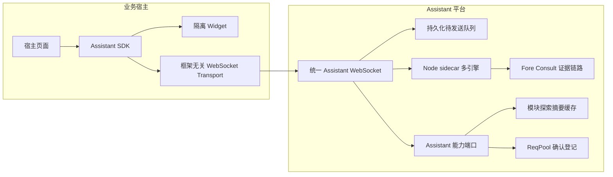
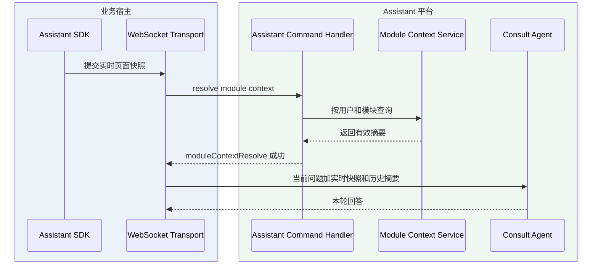
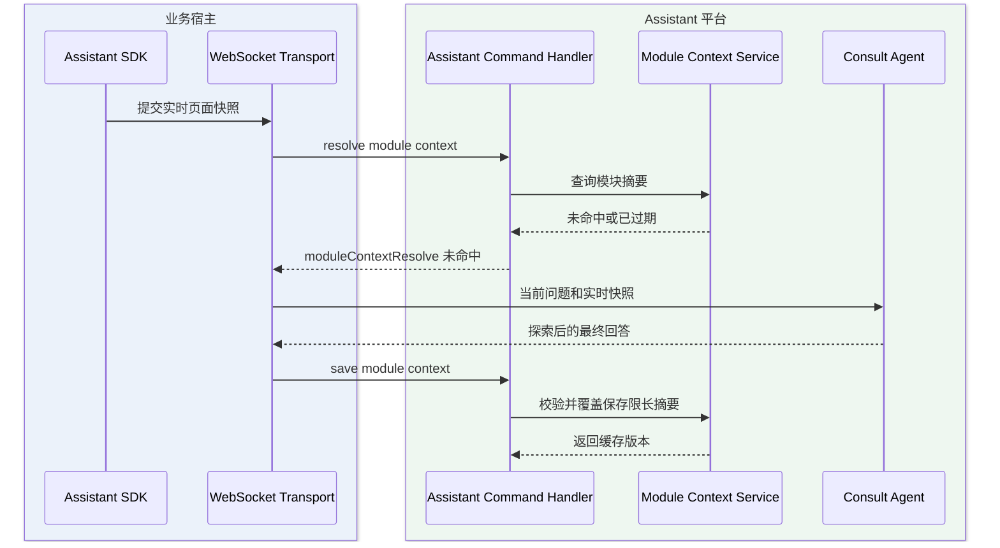

# 企业内部多 Web 系统统一嵌入式 AI 助手

> PRD Session：`81eed90c-2977-4a99-b46b-c750fbcadcf2`。本文固化 Phase 4 方案在代码定位后的实施基线；完整规格追踪、PLAN-001 至 PLAN-015、验证计划与风险表以已确认的 Phase 4 产出为准。

## 1. 实施范围

- 提供可独立分发的框架无关 Assistant SDK 和隔离样式 Widget，宿主不依赖 kai-toolbox React 代码。
- 复用 Claude Chat 的业务咨询 WebSocket、sidecar 多引擎、事件水位、重连恢复和待发送队列。
- 复用 Fore Consult 的系统链路、证据路由、只读查询和咨询归档能力。
- 以 ReqPool 作为 AI 需求中枢，确认登记后的初始状态为 `PENDING_EXECUTION`。
- 缓存同一用户对页面模块的首次探索摘要，新会话优先复用，动态页面状态仍按请求实时采集。
- V0.1 不修改 ERP、SCM、SRM 宿主仓库，但交付 ESM 与 IIFE 产物和最小接入契约。

## 2. 已确认架构决策



- 多标签页均可提交。会话处于运行、回复、待确认或恢复未稳定状态时，消息进入既有持久化队列；仅在服务端确认安全释放后按 FIFO 发送。
- Widget 按当前用户持久化最近一次 Assistant `sessionId`；刷新或多标签页首次提交先恢复该会话，失效或越权时清理旧标识并新建。
- 客户端 `appId`、`userId` 只属于上下文，认证身份以服务端登录态为准。
- 会话创建、Attach、查询、补拉和队列操作统一执行访问策略：普通用户仅访问本人会话，ADMIN 可访问任意用户会话。
- ADMIN 跨用户访问不放宽执行域隔离；业务咨询、评审分享和 Vibe Coding 通道仍只能绑定各自策略允许的会话。
- 草稿不产生正式需求；确认登记使用草稿级 `idempotencyKey`，重复提交返回首次结果。
- Assistant 失败不得阻塞宿主业务链路。
- 宿主只负责加载 SDK、提供上下文、更新上下文和配置 WebSocket 地址；咨询、诊断、队列和会话逻辑不得复制到宿主。
- `AssistantBridge` 仅作为 kai-toolbox 兼容适配器；公开 SDK 不得引用 React、Router、认证 Hook 或 feature 私有实现。
- 浏览器建立连接时通过 `getAccessToken` 动态取得短期 Assistant ACCESS token；同源代理也可在宿主后端完成身份映射。Token 不进入 SDK 本地存储，上下文 `user.id` 永远不参与授权。
- 为内部试用提供显式开启的 Forge 外部登录模式：宿主配置登录地址后，Widget 在缺少 Token 时展示 Forge 账号登录；登录接口只对白名单 Origin 开放，SDK 仅在当前实例内存中保存 ACCESS Token，不保存密码或 REFRESH Token。
- 外部登录模式复用 Forge 账号和既有 ACCESS Token，不等同于跨域共享 Forge 页面的 `localStorage` 登录态；生产接入仍优先使用宿主后端换取短期、限域的 Assistant Token。
- Widget 可配置初始隐藏；默认以 `Ctrl/⌘ + Alt/Option + Shift + 0` 唤起本地密钥输入，验证后显示助手。采用无功能语义的数字四键组合，以避开常见截图、菜单、浏览器和编辑器快捷键；显示密钥只控制前端可见性，不承担身份认证或权限校验。
- 彩虹胶囊入口在桌面端和移动端均允许拖动，位置按 `appId + userId` 本地保存并始终约束在可视区域；对话框仅桌面端允许拖动，窄屏保持固定全屏布局。
- 用户发送后消息立即进入对话框，上下文采集和回复生成状态跟随当前回合显示在消息流中；准备、连接、回复、消息处理、后台处理和待确认期间禁止再次发送，终态或失败后恢复发送。
- 准备上下文、连接和回复执行期间展示“中止”动作：准备阶段中止本地 Provider 采集，已进入会话后复用既有 WebSocket `interrupt` 链路；中止不得销毁会话或丢弃服务端待发送列表。
- Widget 提供默认收起的调试面板，按时间展示上下文准备、WS 连接、协议发送/接收、中止和错误元数据；日志最多保留 200 条且仅存在当前页面内存，禁止记录密码、Token、Cookie、业务正文和完整上下文。
- 第三方未配置 `wsUrl` 或自定义 Transport 时，首次提交必须立即返回可恢复的配置错误并写入调试日志，不得停留在“正在准备上下文”。
- 模块缓存键由 SDK 从 `page.routeName` 或规范化页面 URL 确定；服务端再按认证用户、`appId` 和 `moduleKey` 隔离，客户端 `user.id` 不参与缓存授权。
- 缓存摘要只作为历史分析线索，不替代本轮 Provider 快照、源码证据或运行数据；命中摘要时必须显式标记生成时间和证据版本。
- 首期只缓存同一认证用户的首次模块分析摘要，避免具体单据、角色和错误现场跨用户泄露；跨用户共享必须经过后续审核发布能力。
- 摘要最长 6000 字符，默认有效期 7 天；宿主提供 `sourceRevision` 时，版本不一致立即视为未命中。

## 3. PLAN-001 代码事实

| 能力 | 真实落点 | 决策 |
|---|---|---|
| 咨询 WebSocket | `ClaudeChatWebSocketConfig` 的 `/api/claude-chat/consult/ws` | 复用 |
| 会话恢复 | `ClaudeChatService#attach`、`replayBuffer`、`redeliverPending` | 扩展所有权，不另建协议 |
| 待发送队列 | `QueuedChatMessageService`、`QueuedChatMessageRepository` | 直接复用 |
| 多引擎执行 | `sidecar/claude-agent` | 直接复用 |
| 业务咨询 | `tool-fore-consult` | 直接复用公开接口和执行策略 |
| 需求中枢 | `tool-reqpool` | 新增 Assistant 登记端口 |
| 用户认证 | `toolbox-common` 的 `AuthContext`、握手拦截器 | 扩展为所有权策略 |
| 会话归属 | `claude_chat_session.user_id` | 新增并兼容旧会话；HTTP、WebSocket、队列和项目批量操作统一执行“ADMIN 全部可见、普通用户仅本人”策略 |
| 模块探索缓存 | `tool-assistant` 的 `assistant_module_context_cache` | 按认证用户、应用和模块覆盖保存限长摘要；不复用请求快照表 |

## 4. 发布边界

- 本阶段交付独立 SDK 分发层和统一 WS 基础协议，仍不宣称完成 ERP、SCM、SRM 生产接入。
- ESM 面向现代构建系统，IIFE 面向 JSP 与原生 HTML；两种产物复用同一源码和协议实现。
- OPEN 项保持配置化或明确未决，不自行设定准确率和正式生产权限阈值。
- DDL 必须幂等，由模块 SchemaInitializer 在应用启动时执行；不作为人工待执行 SQL 登记。
- 实现与 Phase 6 审查结论见[验收报告](企业内部多Web系统统一嵌入式AI助手-验收报告.md)。

## 5. 宿主接入契约

现代构建系统安装 ESM 产物后只需初始化一次：

```ts
import { initializeAssistant } from '@kai/assistant-sdk'

const assistant = initializeAssistant({
  appId: 'ERP',
  appName: 'ERP',
  sourceRevision: 'erp-2026.08',
  wsUrl: '/assistant-ws',
  getAccessToken: () => getAssistantAccessToken(),
  visibility: {
    initiallyHidden: true,
    activationKey: '由宿主配置的显示密钥',
  },
  draggable: true,
  user: { id: String(currentUser.id), displayName: currentUser.name },
  page: { url: location.pathname, routeName: 'sales-order-detail', title: document.title },
})
```

JSP 或原生页面加载 `kai-assistant.iife.js` 后调用 `KaiAssistant.initialize(...)`，参数相同。宿主在路由或业务对象变化时调用 `updateContext`，在业务按钮中调用 `open('QUESTION' | 'BUG' | 'SUGGESTION' | 'DIAGNOSE')`；不得复制聊天、排队、重连、草稿或登记逻辑。

`visibility.initiallyHidden` 缺省为 `false`，保持既有接入兼容；`draggable` 缺省为 `true`。隐藏状态下快捷键只打开密钥输入层，输入错误保留在当前页面并可重试，取消后恢复完全隐藏。宿主主动调用 `assistant.open(...)` 视为可信页面动作，可直接显示。

V0.1 建议把宿主的 `/assistant-ws` 同源反向代理到 `/api/claude-chat/consult/ws`，代理必须支持 WebSocket Upgrade。`getAccessToken` 返回宿主后端交换得到的短期 Assistant Token；服务端生产配置必须将 `consultAllowedOriginPatterns` 收紧为宿主域名白名单。SDK 的 `user.id` 仅用于上下文和本地存储分区。

内部快速验证可显式配置 `externalLogin`，由 SDK 调用 Forge 专用 `/api/auth/external-login`。该接口复用现有账号认证和权限解析，但仅签发 ACCESS Token，不生成或返回 REFRESH Token。后端通过 `toolbox.auth.external-login.enabled` 和 `allowed-origins` 双重门禁开放该路径的 CORS；未配置白名单时保持跨域登录关闭。外部登录成功后 SDK 立即建立咨询 WebSocket，页面刷新或实例销毁后内存 Token 失效。

```ts
const assistant = initializeAssistant({
  appId: 'ERP',
  sourceRevision: 'erp-2026.08',
  wsUrl: 'wss://forge.company.internal/api/claude-chat/consult/ws',
  externalLogin: {
    loginUrl: 'https://forge.company.internal/api/auth/external-login',
  },
  user: { id: String(currentUser.id), displayName: currentUser.name },
  page: { url: location.pathname, routeName: 'sales-order-detail', title: document.title },
})
```

外部登录与 `getAccessToken` 二选一；同时提供时以宿主 `getAccessToken` 为准，不展示 Forge 登录表单。跨域白名单必须填写完整 Origin，不允许通过业务上下文中的 `appId`、`user.id` 或请求头自行声明可信来源。

## 6. 模块探索摘要复用

模块身份优先使用宿主提供的 `page.routeName`；缺失时，SDK 对 `page.url` 去除查询参数、片段和尾部数字/UUID 业务主键后生成稳定 `moduleKey`。无法得到稳定键时跳过缓存，不因缓存失败阻塞咨询。

缓存内容由首次未命中回合的最终助手回答压缩得到，不保存工具原始输出、完整对话或页面快照。压缩采用确定性限长：保留最终回答的有效文本，超过 6000 字符时保留开头与结尾，中间用省略标记替代。模型输出和客户端上报均视为不可信输入，服务端重新校验字段长度与归属后才写入。

### 6.1 缓存命中



### 6.2 首次探索与写回



缓存查询失败、响应超时或写回失败均降级为原有咨询链路，并通过调试面板记录不含正文的错误元数据。队列消息不等待缓存查询；同一会话已有上下文时继续复用会话历史，避免缓存准备改变既有 FIFO 行为。
