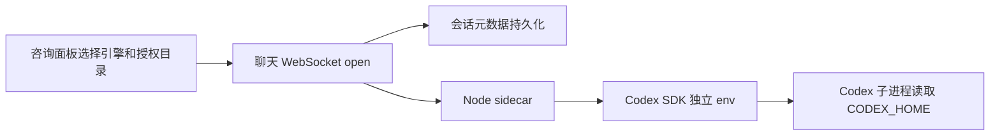

# 咨询引擎选择技术方案

业务咨询入口复用现有 Vibe Coding 会话能力，新增 Claude Code / Codex 两种引擎选择。Codex 官方登录允许为每个会话指定独立的 `CODEX_HOME`，以支持多个本地账号授权目录互不串用。

## 1. 目标与边界

- 默认仍为 Claude Code，兼容现有使用习惯。
- 新建咨询时可选 Codex；选择 Codex 后可填写授权目录，例如 `%USERPROFILE%\.codex-account-yx`。
- 授权目录是 Codex 配置根目录，不等于项目工作目录 `cwd`。
- 授权目录随底层聊天会话持久化，刷新、后端重启和续跑仍使用同一目录。
- 不在页面内执行 `codex login`，目录需由用户预先创建并登录。
- 第三方网关模式不读取本地 Codex 授权目录。

## 2. 核心流程

## 3. 设计决策

- `CODEX_HOME` 通过 `new Codex({ env })` 注入 SDK 子进程，不修改 sidecar 自身的全局 `process.env`。
- Codex 客户端缓存键包含授权目录和速度档位，防止不同账号复用同一客户端实例。
- 空授权目录表示沿用默认 `%USERPROFILE%\.codex`。
- 前端只在 Codex 模式显示授权目录输入，最近一次选择保存在浏览器本地，便于下一次咨询复用。

## 4. 验证要点

- Claude Code 咨询保持原行为。
- Codex 默认目录可正常启动。
- 两个不同 `CODEX_HOME` 新建的会话分别读取各自登录态。
- 刷新页面、切走后续跑、重启后端后仍保留原授权目录。
- 不存在或未登录的目录由 Codex 返回明确错误，不自动创建或静默回退到其他账号。
