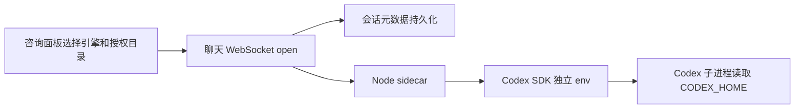
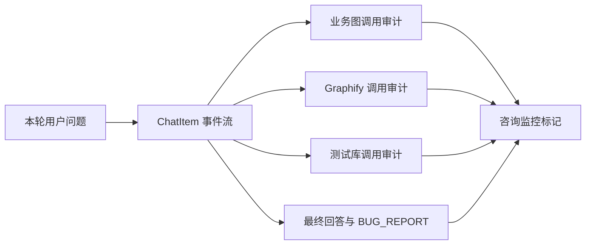
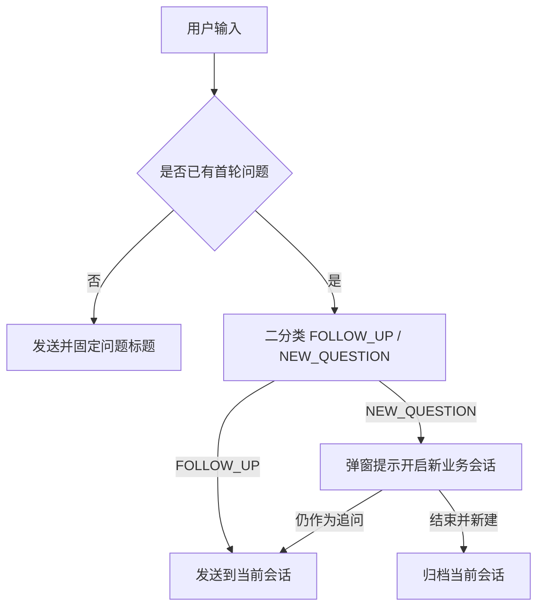

# 咨询引擎选择技术方案

业务咨询入口复用现有 Vibe Coding 会话能力，新增 Claude Code / Codex 两种引擎选择。Codex 官方登录允许为每个会话指定独立的 `CODEX_HOME`，以支持多个本地账号授权目录互不串用。

## 1. 目标与边界

- 默认仍为 Claude Code，兼容现有使用习惯。
- 新建咨询时可选 Codex；选择 Codex 后可填写授权目录，例如 `%USERPROFILE%\.codex-account-yx`。
- Vibe Coding 新建 Codex 官方会话时提供相同的授权目录选择，支持同一台电脑上的多个 Codex 登录账号按会话隔离。
- 授权目录是 Codex 配置根目录，不等于项目工作目录 `cwd`。
- 授权目录随底层聊天会话持久化，刷新、后端重启和续跑仍使用同一目录。
- 不在页面内执行 `codex login`，目录需由用户预先创建并登录。
- 第三方网关模式不读取本地 Codex 授权目录。

## 2. 核心流程

## 3. 设计决策

- `CODEX_HOME` 通过 `new Codex({ env })` 注入 SDK 子进程，不修改 sidecar 自身的全局 `process.env`。
- Codex 客户端缓存键包含授权目录和速度档位，防止不同账号复用同一客户端实例。
- 空授权目录表示沿用默认 `%USERPROFILE%\.codex`。
- 前端只在 Codex 模式显示授权目录输入，最近一次选择保存在浏览器本地，便于下一次咨询复用。
- Vibe Coding 与业务咨询使用同一份最近授权目录偏好；选择第三方网关时隐藏本地授权目录并且不向会话传递 `codexHome`。
- Vibe Coding 的 Codex 参数区只读展示当前会话绑定的授权目录；空值明确展示为默认 `%USERPROFILE%\.codex`，自定义目录展示完整路径提示。
- 授权目录属于会话创建时固定的运行环境，当前会话不提供原地切换入口；需要更换账号时新建会话。

## 4. 验证要点

- Claude Code 咨询保持原行为。
- Codex 默认目录可正常启动。
- 两个不同 `CODEX_HOME` 新建的会话分别读取各自登录态。
- Vibe Coding 使用两个不同授权目录新建并行会话时，各会话始终绑定创建时选择的账号。
- 切换两个 Codex 会话时，参数区显示的授权目录与各自会话元数据一致。
- 刷新页面、切走后续跑、重启后端后仍保留原授权目录。
- 不存在或未登录的目录由 Codex 返回明确错误，不自动创建或静默回退到其他账号。

## 5. 咨询执行审计

业务咨询提示词中的“查业务图、查代码图、评估 BUG、遵守测试库红线”属于行为要求，不能仅凭提示词存在就视为已经执行。咨询面板按每轮真实事件展示审计标记：

- 业务图：仅识别 `domain-knowledge`、`cross-topology` 的实际工具调用；展示工具名、查询输入和结果摘要。
- 代码图：仅识别 Graphify 工具调用，或 Bash/PowerShell 中实际执行的 `graphify query`；普通代码搜索不计为代码图。
- BUG 评估：回答完成后标记“已评估”；存在合法 `BUG_REPORT` 块时标记“确认缺陷”，否则标记“未判定为缺陷”；非法 JSON 单独告警。
- 数据库红线：识别 `erp_db`、`srm_db` 等测试库查询。用户明确说明数据来自测试环境时标记合规；用户带截图、单据号等生产数据线索且未说明测试环境却发生查库时标记疑似违规；没有查库时标记未触发。
- 引擎仍在运行时，对尚未完成的结论显示“评估中”，不提前判定未查图或非 BUG。

审计是可观测性能力，不替代执行侧安全控制。数据库违规标记采用保守规则，状态命名为“疑似违规”而不是断言，以避免仅凭文本启发式误判。

## 6. 单问题会话与归档标题

一个业务咨询会话只归档一个核心问题，后续允许围绕该问题追问：

- 发起咨询前必须选择业务系统；会话保存系统、模块、登录用户和首个明确问题。
- 第一条问题直接发送。已有首轮问题后，后续输入先与首个问题做语义分类，结果限定为 `FOLLOW_UP` 或 `NEW_QUESTION`。
- `FOLLOW_UP` 继续当前会话；`NEW_QUESTION` 不直接发送，弹窗提示用户结束当前咨询并开启新的业务会话，同时允许用户明确选择“仍作为追问发送”以处理误判。
- 分类调用失败时不阻断提问，按追问放行并在控制台记录错误。
- 会话问题标题由首个问题确定性生成：去除多余空白和引用样板，截取不超过 40 字；后续追问不得改写标题。
- 历史归档和评测数据均以 `session_id + system_name + user_id + question_title` 识别问题上下文，轮次仍由 `turn_index` 表达。

## 7. 多个进行中咨询

- 同一用户可以创建多个 `PENDING` 咨询，不要求先归档当前咨询。
- 新建咨询会切换当前展示和输入焦点，但不会归档或删除之前的进行中咨询。
- 页面一次只展示一个实时会话；用户可从历史咨询列表点击任意 `PENDING` 会话切换并继续追问。
- “一个会话只记录一个核心问题”的边界保持不变，并发能力只放宽会话数量，不把多个问题合并进同一会话。
