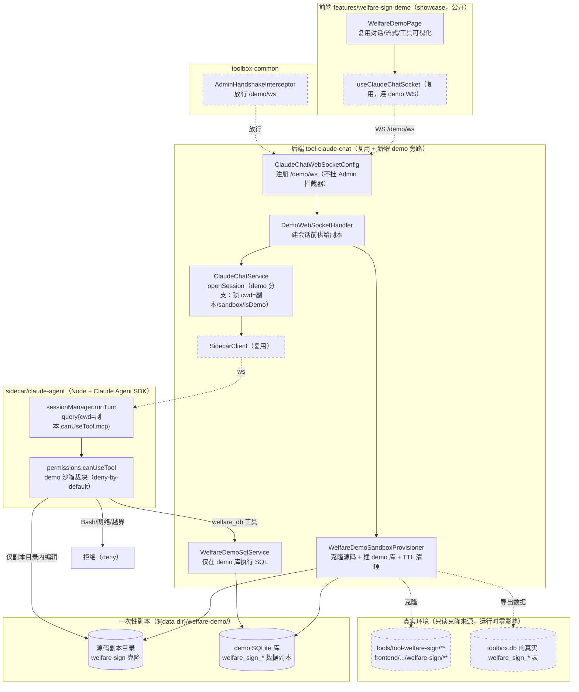
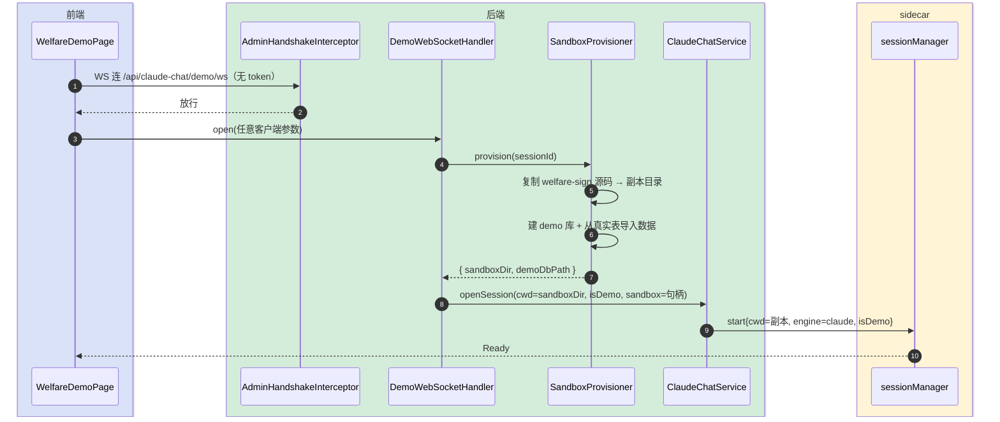
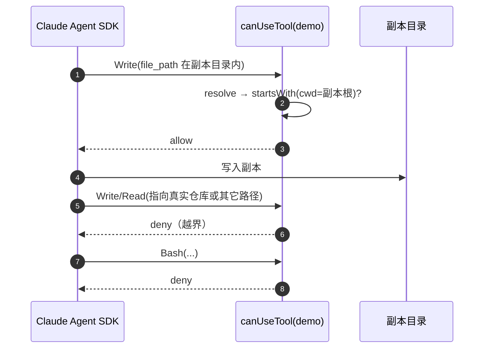
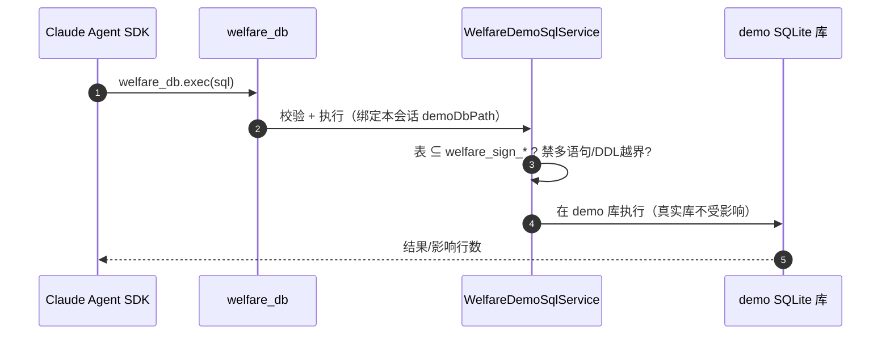
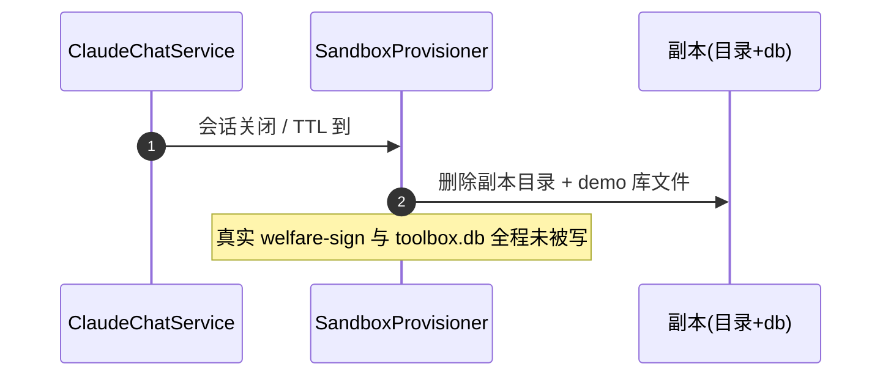

# 福利签收演示（受约束 Vibe coding · 一次性副本）技术方案

> **定位**：技术架构主导。复刻 Vibe coding（claude-chat / agent 模式）的能力做一个**免登录公开演示**，但 agent 只在一份**一次性副本沙箱**里折腾：源码是 welfare-sign 模块的克隆副本，数据是一份独立的 demo SQLite 库。**真实 welfare-sign 源码与真实 `welfare_sign_*` 表零影响**。演示会话结束/过期即销毁副本。
> **与 Vibe coding 的关系**：完全复用 claude-chat 的 sidecar + Claude Agent SDK + WebSocket 通道；新增「公开入口 + 一次性副本沙箱供给 + sidecar canUseTool 硬隔离」。
> **最后更新**：2026-06-24

## 变更记录

| 版本 | 日期 | 修改人 | 变更内容摘要 |
|------|------|--------|--------------|
| current | 2026-06-24 | AI | 初始版本：副本沙箱模型——克隆 welfare-sign 源码到独立目录 + 独立 demo SQLite 库；showcase 公开页 + demo 免鉴权 WS + 服务端固定约束会话 + canUseTool 硬隔离（cwd 锁沙箱 + 拒越界/Bash/网络）；真实模块零影响 |

---

## 1. 目标与边界

- **要解决的问题**：免登录对外演示「让 AI 直接改代码」，但绝不能让匿名访客动到真实仓库的任何文件、命令、中间件，**甚至连真实的 welfare-sign 模块和它的数据也不能动**。需要一份与真实环境隔离的一次性副本，演示完即弃。
- **本次目标（v1）**：
  1. 新增 showcase 公开页 `features/welfare-sign-demo`（`/showcase/welfare-sign-demo`），**免登录**复刻 claude-chat 的对话 / 流式 / 工具可视化体验。
  2. 新增 **demo 专用免鉴权 WebSocket**（`/api/claude-chat/demo/ws`），其创建的会话一律套服务端固定的「福利签收演示」约束档，客户端无法越权。
  3. **一次性副本沙箱供给**：每个 demo 会话开始时，把 welfare-sign 模块源码克隆进独立目录、把 `welfare_sign_*` 表数据导入一份独立的 demo SQLite 库；agent 的 cwd = 该副本目录。
  4. sidecar `canUseTool` 硬隔离（deny-by-default，不弹人工审批）：写/读限定在副本沙箱目录内；改数据只走 `welfare_db` 工具且仅作用于 demo 库；Bash / 命令 / 网络 / 其它一律 deny。
  5. 会话结束 / TTL 过期即销毁副本目录与 demo 库。
- **副本来源（克隆自，但运行时互不影响）**：
  - 源码：`tools/tool-welfare-sign/**`、`frontend/src/features/welfare-sign/**` → 复制到 `${data-dir}/welfare-demo/<sandboxId>/`
  - 数据：真实 `welfare_sign_*` 表 → 导出建表 + 数据，灌入 `${data-dir}/welfare-demo/<sandboxId>.db`
- **不做什么（v1）**：
  - **绝不**让 agent 触碰真实仓库文件、真实 toolbox.db 的任何表（含真实 `welfare_sign_*`）。
  - 不改 claude-chat 正式（登录）通道行为；demo 是旁路新增。
  - demo 固定 claude 引擎、禁第三方网关、禁 Bash / 任意命令 / 编译 / 跑测试。
  - 副本不回灌真实环境（演示是只读真实、读写副本；不提供「应用到真实模块」）。
- **设计结论（一句话）**：复用 claude-chat 全链路，新增「公开免鉴权 WS + 服务端固定约束档 + 每会话一次性副本沙箱（源码克隆目录 + 独立 demo SQLite 库）+ sidecar `canUseTool` 把可改面锁死在副本内」，真实 welfare-sign 模块与数据零影响、演示完即销毁。

---

## 2. 整体架构



---

## 3. 模块拆分与职责

### 3.1 WelfareDemoPage（前端 features/welfare-sign-demo）

- **定位**：showcase 公开页，复刻 Vibe coding 对话体验。
- **职责**：复用 `useClaudeChatSocket`（连 demo WS）；消息流 / 流式 / 工具调用可视化；顶部标注「演示模式 · 一次性副本 · 不影响真实数据」。隐藏会话管理 / 引擎/模型切换 / 权限模式切换。
- **关键设计点**：`layout:'showcase'`，天然脱离 RouteGuard、公开免登录；WS 连接不带 token。

### 3.2 DemoWebSocketHandler（后端，新增）

- **定位**：免鉴权 agent 通道入口。
- **职责**：握手成功后，先调 `WelfareDemoSandboxProvisioner` 供给一份副本，再以副本目录为 cwd 走 `ClaudeChatService` demo 分支建会话。
- **关键设计点**：丢弃客户端 `Open` 的 cwd/mode/engine/网关参数，全部用服务端约束档覆盖。

### 3.3 WelfareDemoSandboxProvisioner（后端，新增，核心）

- **定位**：一次性副本的生命周期管理。
- **职责**：
  - `provision(sessionId)`：在 `${data-dir}/welfare-demo/<sandboxId>/` 递归复制 welfare-sign 两处源码子树（保留可辨识的相对结构）；新建 `<sandboxId>.db`，按 `welfare-sign-schema.sql` 建表并从真实 `welfare_sign_*` 表导入数据；返回沙箱句柄（目录 + db 路径）。
  - `dispose(sandboxId)` / TTL 扫描：会话结束或超过 `ttlMinutes` 即删目录 + db 文件。
- **关键设计点**：复制源**只读**真实文件（不加锁、不改真实）；导数据走只读查询真实表 → 写 demo 库；沙箱根 `normalize()` 限定在 `${data-dir}/welfare-demo/` 下，防路径逃逸。

### 3.4 AdminHandshakeInterceptor（toolbox-common，改）

- **职责**：对 `/api/claude-chat/demo/ws` 跳过 ADMIN 直接放行；其它路径不变。硬编码 demo 路径前缀常量。

### 3.5 ClaudeChatService#openSession（demo 分支，改）

- **职责**：识别 demo 会话，强制 `cwd=副本目录`、`engine=claude`、网关空、标 `isDemo=true` 与 `sandbox` 句柄透传给 sidecar；demo 会话不入正式列表可写域。
- **关键设计点**：约束档是服务端单一事实源；副本目录由 Provisioner 提供，客户端不可指定。

### 3.6 sidecar permissions.canUseTool（demo 沙箱裁决，核心，改）

- **职责**：`isDemo` 会话忽略 permissionMode、不弹审批，deny-by-default：
  - `Edit/Write/MultiEdit/NotebookEdit`：目标路径 resolve 后必须在**副本沙箱目录**内，否则 deny；
  - `Read/Glob/Grep`：限副本目录内；
  - `welfare_db`：allow（仅作用于 demo 库，后端把关）；
  - `Bash/网络/任意其它/未知`：deny。
- **关键设计点**：cwd 即副本根，allowRoot = cwd；`path.resolve` 后 `startsWith(cwd)`，防 `..`/绝对路径逃逸。

### 3.7 welfare_db 工具 + WelfareDemoSqlService（后端，新增）

- **职责**：demo agent 改数据的唯一通道；SQL **只在该会话的 demo SQLite 库**执行（不连 toolbox.db）。仍做表白名单（`welfare_sign_*`）+ 禁多语句 + 禁 ATTACH/PRAGMA 的纵深防御。
- **关键设计点**：连接目标是 `<sandboxId>.db`，物理上就碰不到真实库；表校验是第二道闸。

---

## 4. 关键交互

### 4.1 公开建会话 + 供给副本



### 4.2 编辑放行 / 越界拒绝（基于副本根）



### 4.3 受限 SQL（仅 demo 库）



### 4.4 会话结束 / 过期销毁



---

## 5. 核心业务规则

| 规则 | 说明 |
|------|------|
| 真实零影响 | 供给副本时只读真实源码/真实表；运行期 agent 只读写副本目录与 demo 库；不提供回灌真实 |
| 公开免登录 | demo 页 showcase 不经 RouteGuard；demo WS 路径握手放行 |
| 服务端单一事实源 | cwd（副本目录）/engine/工具集由服务端约束档固定，客户端 Open 参数被丢弃 |
| 写/读限副本 | 所有文件工具目标 resolve 后必须在副本根（cwd）内，防 `..`/绝对路径逃逸 |
| SQL 限 demo 库 | `welfare_db` 连接本会话的 `<sandboxId>.db`；并做 `welfare_sign_*` 表白名单 + 禁多语句/DDL 越界 |
| deny-by-default | Bash/命令/网络/任意 MCP/未知工具一律拒，无人工审批兜底 |
| 引擎/网关锁定 | 固定 claude，禁第三方网关 |
| 一次性 | 会话结束 / 超 `ttlMinutes` 即删副本目录 + demo 库 |
| 会话隔离 | demo 会话 `isDemo=true`，不混入正式 claude-chat 列表 |
| 容量护栏 | 限制并发副本数 / 单副本大小，避免磁盘被刷爆（见 §8） |

---

## 6. 编码落点

```text
（后端 tool-claude-chat）
tools/tool-claude-chat/src/main/java/com/exceptioncoder/toolbox/claudechat/
├── config/
│   ├── ClaudeChatWebSocketConfig.java          [改] 注册 /api/claude-chat/demo/ws（不挂 Admin 拦截器）
│   ├── DemoWebSocketHandler.java               [新增] 供给副本 + demo 建会话
│   └── WelfareDemoProperties.java              [新增] 约束档：源码白名单、表前缀、ttl、并发上限、enabled
├── service/
│   ├── WelfareDemoSandboxProvisioner.java      [新增] 克隆源码 + 建 demo 库导数据 + dispose/TTL
│   ├── WelfareDemoSqlService.java              [新增] 在 demo 库执行受限 SQL
│   └── ClaudeChatService.java                  [改] openSession demo 分支（cwd=副本/isDemo/sandbox）
└── domain/ClaudeChatSession.java               [改] 增 isDemo / sandbox 标记列（迁移兜底）

toolbox-common/.../auth/web/AdminHandshakeInterceptor.java   [改] 放行 demo WS 路径

sidecar/claude-agent/src/
├── sessionManager.ts                           [改] demo 会话注入 cwd=副本 + mcp(welfare_db) + isDemo
├── permissions.ts                              [改] canUseTool demo 沙箱裁决（deny-by-default + cwd 内）
└── welfareDb.ts                                [新增] welfare_db 工具 → 后端 SQL 通道

tools/tool-claude-chat/src/main/resources/db/claude-chat-schema.sql   [改] 迁移补列 is_demo/sandbox（IF NOT EXISTS）

（前端 showcase 公开页）
frontend/src/features/welfare-sign-demo/
├── index.tsx                                   [新增] FeatureManifest（layout:'showcase'，/showcase/welfare-sign-demo）
└── pages/WelfareDemoPage.tsx                   [新增] 复用 claude-chat 对话组件，标注演示边界
```

### 调用关系说明

- 前端 demo 页 → `useClaudeChatSocket`(demo WS) → `DemoWebSocketHandler` →（`SandboxProvisioner.provision`）→ `ClaudeChatService.openSession`(demo) → `SidecarClient` → sidecar(cwd=副本)。
- sidecar `canUseTool`(demo)：编辑/读限副本根内；`welfare_db` → `WelfareDemoSqlService`(连 demo 库)；其它 deny。
- 会话关闭/TTL → `SandboxProvisioner.dispose` 删副本。

---

## 7. 数据与依赖变更

| 类型 | 是否变化 | 说明 |
|------|----------|------|
| 真实数据库表 | **无** | 真实 `welfare_sign_*` 与 toolbox.db 其它表运行期只读，不被 agent 写 |
| demo 数据 | 新增（临时） | 每会话独立 `<sandboxId>.db`，按 welfare-sign schema 建表并导入快照，销毁即删 |
| claude_chat_session | 有（轻微） | 增 `is_demo`、`sandbox` 列（迁移 bean 补列） |
| 文件系统 | 新增（临时） | `${data-dir}/welfare-demo/<sandboxId>/` 源码副本，销毁即删 |
| 对外接口 | 有 | WS `/api/claude-chat/demo/ws`（免鉴权）；内部 `welfare_db` SQL 通道（仅作用 demo 库） |
| 鉴权 | 有 | AdminHandshakeInterceptor 放行 demo WS |
| 中间件/MQ/锁 | 无 | 不引入 |

> WS 契约、约束档字段、canUseTool 规则、welfare_db 契约见 `福利签收演示-api-current.md`。

---

## 8. 风险与待确认

| 风险 / 待确认点 | 影响 | 处理方式 |
|----------------|------|----------|
| 副本逃逸（`..`/符号链接/绝对路径） | agent 写到副本外 | cwd=副本根，resolve 后 `startsWith(cwd)`；拒绝绝对路径与跳出；复制时不跟随符号链接 |
| SQL 误连真实库 | 改到真实数据 | `welfare_db` 连接句柄硬绑本会话 `<sandboxId>.db`；表白名单为第二闸；后端绝不把 toolbox.db 路径传给 demo 通道 |
| 磁盘被刷爆 | 大量并发演示创建副本 | `maxConcurrentSandboxes` 上限 + 单副本大小上限 + `ttlMinutes` 定时清理 + 启动时清残留 |
| 复制耗时 | welfare-sign 体量大时建会话慢 | 只复制源码子树（排除 target/node_modules）；导数据为快照查询，量小 |
| 公开 agent 滥用算力 | 匿名刷请求烧 token | enabled 走配置中心可随时关；建议不经公网 tunnel 暴露；可加单 IP 会话数/速率护栏（v2） |
| 关闭鉴权时 | 拦截器不存在 | demo 本就免鉴权，两种开关下行为一致 |
| SQL 通道实现（MCP vs HTTP） | 复杂度 | 默认后端 `WelfareDemoSqlService` + sidecar 经 127.0.0.1 内网调用；若复用已有 spring-ai MCP 更佳，编码期定 |

---

## 9. 验证要点

- **公开可用**：未登录访问 `/showcase/welfare-sign-demo`，建会话→对话→看到流式与工具调用。
- **真实零影响**：演示中让 agent 大改特改后，`git status` 真实 welfare-sign 源码无变更；真实 `welfare_sign_*` 表数据不变。
- **副本内放行**：改副本目录内文件 → 成功。
- **越界拒绝**：写副本外路径 / 真实仓库路径 / `..` 穿越 / Bash / 网络 → 全 deny。
- **SQL 隔离**：`welfare_db` 改 demo 库生效；查询/改动不落到真实库；非 `welfare_sign_*` 表或多语句 → 拒。
- **一次性**：会话结束 / 超 TTL 后副本目录与 demo 库被删；重启清残留。
- **隔离**：demo 会话不入正式 claude-chat 列表；正式通道与 welfare-sign 正式页不受影响。
