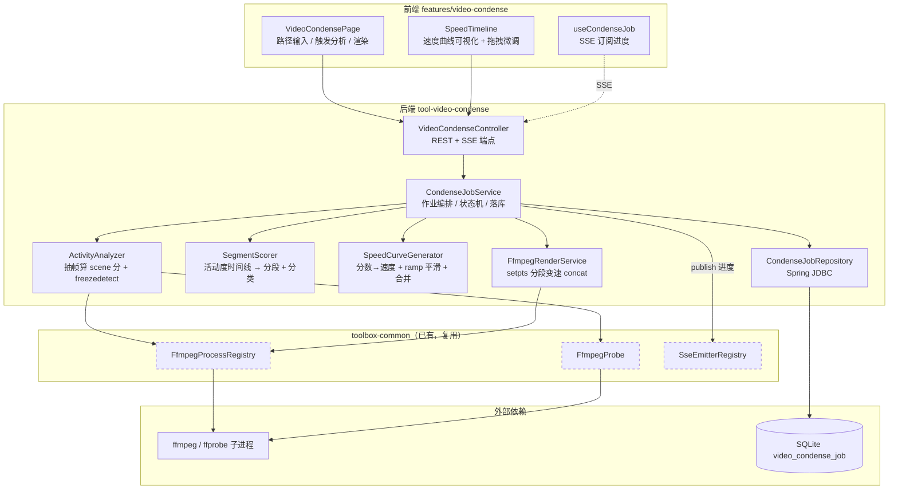
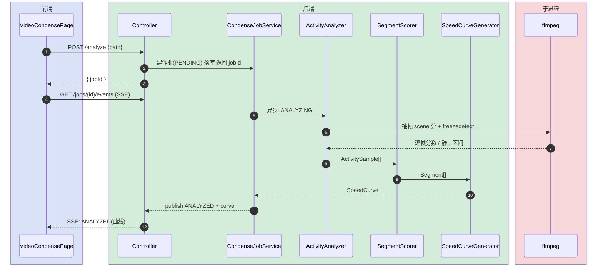
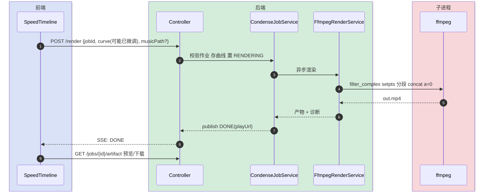
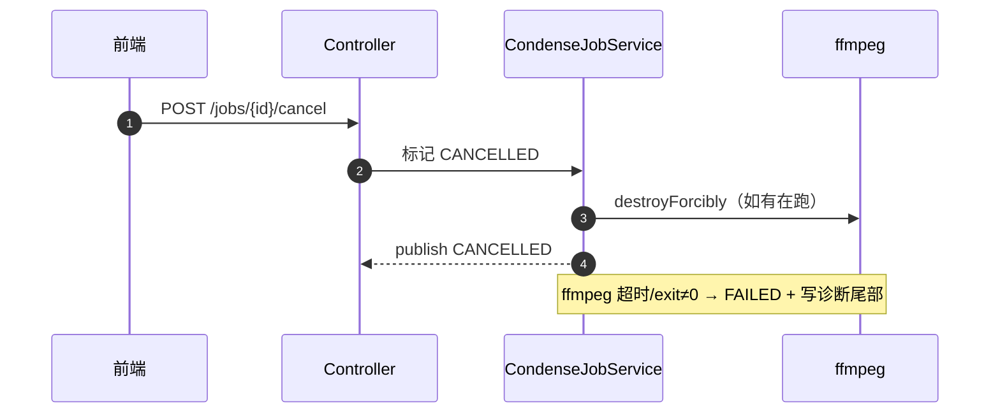

# 视频智能变速（录屏浓缩器）技术方案

> **定位**：技术架构主导。讲清模块边界、FFmpeg 流水拓扑、异步作业与 SSE 交互。
> **最后更新**：2026-06-02

## 变更记录

| 版本 | 日期 | 修改人 | 变更内容摘要 |
|------|------|--------|--------------|
| current | 2026-06-02 | AI | 初始版本：整帧活动度分析 + 速度曲线 + 丢原音渲染，前端可微调 |

---

## 1. 目标与边界

- **要解决的问题**：chatbox 编码录屏（vibe coding）里大量「AI 流式输出 / 等待加载 / 打字思考」是低信息密度时段，全片恒定倍速会把「成果出现」的高光也一起飞过去。需要按屏幕活动度生成**动态速度曲线**，无聊段高倍、关键段回到 1x，突出关键帧。
- **本次目标（v1）**：
  1. 输入本地视频路径 → 后端异步分析出**整帧活动度时间线** + 静止段。
  2. 按活动度生成**分段速度曲线**（含 ramp 平滑），前端时间轴可视化并**允许手动微调**每段速度/类型。
  3. FFmpeg 分段 `setpts` 变速 + concat 输出 mp4（**丢弃原始音频**，可选叠一条背景音乐），SSE 推进度。
- **不做什么（v1）**：
  - 不做区域级（终端/编辑器分区）帧差——留 v2。
  - 不做 ASR / 字幕密度 / LLM 判重要性——本场景音频常为空，性价比低，留 v2+。
  - 不做 atempo 同步变速原音——v1 固定「丢原音 + 可选配乐」，规避 atempo 链与音画对齐。
  - 不接入任务中心（tool-treesize 的 `TaskBroadcaster`）——v1 走自有 per-job SSE 频道，避免反向依赖；并入任务中心列为 v2 可选。
- **设计结论（一句话）**：新增独立模块 `tool-video-condense`，复用 `toolbox-common` 的 FFmpeg 进程基建，以「探测 → 整帧活动度分析 → 评分分段 → 速度曲线 → (用户微调) → setpts 分段渲染」五段异步流水产出浓缩视频。

---

## 2. 整体架构



---

## 3. 模块拆分与职责

### 3.1 VideoCondenseController（api/）

- **定位**：REST + SSE 入口，参数校验 + 路径穿越防护，不含业务逻辑。
- **职责**：
  - 受理 analyze / render / 查询 / 取消 / 产物下载 请求。
  - 暴露 per-job SSE 频道（转 `SseEmitterRegistry`）。
- **上游**：前端。**下游**：`CondenseJobService`。
- **关键设计点**：产物下载复用 ffmpeg-lab 的 `resolveArtifact` 式 `normalize().startsWith(dir)` 越权防护。

### 3.2 CondenseJobService（service/）

- **定位**：异步作业编排核心 + 状态机持有者。
- **职责**：
  - 编排五段流水；每段切换 `publish` 进度事件并落库。
  - 维护作业状态机（见 §5），支持取消（强杀子进程 + 标记 CANCELLED）。
- **上游**：Controller。**下游**：Analyzer / Scorer / Generator / Render / Repository / SSE。
- **关键设计点**：analyze 与 render 是**两个独立异步阶段**（用户中间会微调曲线），不是一条到底；virtual thread 跑 worker。

### 3.3 ActivityAnalyzer（service/）

- **定位**：把视频转成「按时间窗的活动度分数」时间线。
- **职责**：
  - fork 一次 ffmpeg：低分辨率低帧率抽帧（如 `fps=4,scale=160:90`），用 `select`/`scdet` 输出每帧 scene 变化分；并行 `freezedetect` 标记静止段。
  - 解析 stderr/metadata 输出为 `List<ActivitySample>`（time, score）。
- **上游**：JobService。**下游**：`FfmpegProbe`（拿时长/fps）、`FfmpegProcessRegistry`（spawn）。
- **关键设计点**：**严格遵循 ffmpeg 子进程编排铁律**——双虚拟线程 drain stdout/stderr + 主线程 `waitFor(timeout)` + `destroyForcibly`（见知识图谱场景卡）。整帧分析对 30~60min 录屏要有硬超时上界。

### 3.4 SegmentScorer（service/）

- **定位**：把逐帧/逐窗活动度聚合成「带类型的连续片段」。
- **职责**：
  - 按固定窗口（如 1s）归并 `ActivitySample` → 窗口活动度。
  - 相邻同档窗口合并成 `Segment`，套**最小段时长**防抖。
  - 给每段打 `SegmentType`（结合 freezedetect 区间）。
- **上游**：JobService。**下游**：无（纯计算）。
- **关键设计点**：分类与评分都是纯函数，便于单测；阈值进 `VideoCondenseProperties` 可调。

### 3.5 SpeedCurveGenerator（service/）

- **定位**：片段 → 速度曲线，并做 ramp 平滑。
- **职责**：
  - `score → speed` 映射（分档表，见 §5）。
  - 段边界做 ramp 过渡：把边界窗口拆成若干子段线性插值速度，避免硬切。
  - 输出 `SpeedCurve`（有序 `RenderSegment{start,end,speed}`）。
- **关键设计点**：曲线是**纯数据**，可被前端编辑后回传，render 直接吃回传曲线（不重算），保证「所见即所渲」。

### 3.6 FfmpegRenderService（service/）

- **定位**：按速度曲线生成 mp4。
- **职责**：
  - 构造 `filter_complex`：每段 `trim + setpts=PTS/{speed}`，再 `concat=n=N:v=1:a=0`。
  - **v1 丢原音**；若传了配乐路径，末尾 `-i music -shortest` 叠加。
  - 落产物到 `workDir/{jobId}/out.mp4`，回填诊断。
- **关键设计点**：纯 `setpts`、`a=0`，**无 atempo 链**——这是 v1 的核心简化。段数过多时 `filter_complex` 走 `-filter_complex_script` 文件避免命令行超长。

### 3.7 CondenseJobRepository（repository/）

- **定位**：作业持久化（Spring JDBC + SQLite）。
- **职责**：CRUD `video_condense_job`；曲线/段以 JSON 列存。
- **关键设计点**：DDL 走 `db/video-condense-schema.sql`，全部 `CREATE TABLE IF NOT EXISTS`。

---

## 4. 关键交互

### 4.1 分析阶段（analyze）

> 触发：用户输入路径点「分析」。参与方：前端、Controller、JobService、Analyzer、Scorer、Generator、ffmpeg。



### 4.2 渲染阶段（render，含用户微调）

> 触发：用户在时间轴微调后点「生成」。参与方：前端、Controller、JobService、Render、ffmpeg。



### 4.3 取消 / 失败

> 触发：用户取消，或 ffmpeg 超时/失败。



---

## 5. 核心业务规则

| 规则 | 说明 |
|------|------|
| 作业状态机 | `PENDING → ANALYZING → ANALYZED → RENDERING → DONE`；任意阶段可 `→ FAILED / CANCELLED` |
| 两阶段解耦 | analyze 产曲线后停在 ANALYZED 等用户；render 吃「回传曲线」直接渲，不重算分析 |
| score→speed 分档 | score≥0.7→1.0x；≥0.4→1.5x；≥0.2→3.0x；<0.2→6.0x（freeze 段可达 8x 或跳过）；阈值进 Properties |
| 段类型 | `NORMAL / TYPING / STREAMING / WAITING / KEY_MOMENT / FREEZE`；freezedetect 命中→FREEZE |
| 最小段时长 | 合并后每段 ≥ minSegmentSeconds（如 0.8s），防变速抖动 |
| ramp 平滑 | 相邻段速度差大时，边界 0.3~0.5s 拆子段线性过渡，不硬切 |
| 关键帧 | 活动度由低突升的边界标 KEY_MOMENT，强制降到 1.0x（v1 仅降速，v2 加推镜） |
| 音频 | v1 渲染恒定 `a=0` 丢原音；musicPath 非空才叠配乐，`-shortest` 对齐 |
| 进程卫生 | 所有 ffmpeg 走 `FfmpegProcessRegistry.spawn` + 双虚拟线程 drain + waitFor + destroyForcibly + 硬超时 |
| 曲线 gap | segments 未覆盖的区间视为「跳过」，不进输出（删段即剪掉）；区间不得重叠 |
| 产物生命周期 | DONE 产物落 `workDir/{jobId}/out.mp4`，过期由 cleanStaleWorkDirs 清理，不持久化、不加表列，重看需重渲 |
| 路径安全 | 输入路径与 `musicPath` 均 `normalize()` + `isRegularFile`；产物下载 `startsWith(jobDir)` 防穿越 |
| 幂等 DDL | schema.sql 全部 `CREATE TABLE/INDEX IF NOT EXISTS` |

---

## 6. 编码落点

```text
（父 pom 与 starter）
pom.xml                                          [修改] <modules> 增加 tools/tool-video-condense
toolbox-starter/pom.xml                          [修改] 增加 tool-video-condense 依赖

tools/tool-video-condense/
├── pom.xml                                       [新增] 模块定义，依赖 toolbox-common
└── src/main/
    ├── java/com/exceptioncoder/toolbox/videocondense/
    │   ├── api/
    │   │   ├── VideoCondenseController.java       [新增] REST + SSE 端点
    │   │   └── dto/
    │   │       ├── AnalyzeRequest.java            [新增] { path }
    │   │       ├── RenderRequest.java             [新增] { jobId, segments, musicPath? }
    │   │       ├── JobView.java                   [新增] 作业状态 + 曲线视图
    │   │       └── SegmentView.java               [新增] { start, end, speed, type, score }
    │   ├── domain/
    │   │   ├── CondenseJob.java                   [新增] 作业实体
    │   │   ├── JobStatus.java                     [新增] 状态枚举
    │   │   ├── SegmentType.java                   [新增] 片段类型枚举
    │   │   ├── ActivitySample.java                [新增] (time, score)
    │   │   ├── Segment.java                       [新增] 分段 + 类型 + 分数
    │   │   └── SpeedCurve.java                    [新增] 有序 RenderSegment 列表
    │   ├── service/
    │   │   ├── CondenseJobService.java            [新增] 异步编排 + 状态机
    │   │   ├── ActivityAnalyzer.java              [新增] 抽帧 scene 分 + freezedetect
    │   │   ├── SegmentScorer.java                 [新增] 活动度→分段+分类（纯函数）
    │   │   ├── SpeedCurveGenerator.java           [新增] 分数→速度 + ramp（纯函数）
    │   │   └── FfmpegRenderService.java           [新增] setpts 分段变速 concat
    │   ├── repository/
    │   │   └── CondenseJobRepository.java         [新增] Spring JDBC
    │   └── config/
    │       ├── VideoCondenseToolDescriptor.java   [新增] 后端工具注册
    │       └── VideoCondenseProperties.java       [新增] workDir/超时/阈值/分档
    └── resources/db/
        └── video-condense-schema.sql             [新增] video_condense_job 表

frontend/src/features/video-condense/
├── index.tsx                                     [新增] FeatureManifest（icon: Gauge）
├── pages/VideoCondensePage.tsx                   [新增] 主页：路径输入 / 分析 / 渲染 / 预览
├── components/
│   ├── SpeedTimeline.tsx                          [新增] 速度曲线可视化 + 拖拽微调
│   └── SegmentRow.tsx                             [新增] 单段速度/类型编辑
├── hooks/useCondenseJob.ts                       [新增] SSE 订阅作业进度
├── api.ts                                         [新增] REST 客户端
└── types.ts                                       [新增] 前端类型
```

### 调用关系说明

- `Controller.analyze` → `JobService`（虚拟线程）→ `ActivityAnalyzer` → `SegmentScorer` → `SpeedCurveGenerator` → 落库 + SSE。
- `Controller.render` → `JobService` → `FfmpegRenderService` → 产物 + SSE。

---

## 7. 数据与依赖变更

| 类型 | 是否变化 | 说明 |
|------|----------|------|
| 数据库表 / 字段 / 索引 | 有 | 新增 `video_condense_job`（id, input_path, status, duration_sec, curve_json, error, created_at, updated_at），`idx` on status |
| DTO / VO / 枚举 | 有 | 新增 `JobStatus / SegmentType` 等（见 §6），均模块内自有 |
| 下游接口 / 外部依赖 | 有 | 依赖 ffmpeg/ffprobe（已有 `toolbox.ffmpeg.*` 配置）；复用 common 的 Probe/Registry/SSE |
| 缓存 / 消息 / 锁 / 事务 | 无 | 不引入 MQ/锁；并发由 Registry 的 Semaphore 兜 |

> 接口字段级契约见 `视频智能变速-api-current.md`。

---

## 8. 风险与待确认

| 风险 / 待确认点 | 影响 | 处理方式 |
|----------------|------|----------|
| 整帧 scene 分对「纯文字滚动」可能区分度低 | 流式输出段可能误判为高活动 | v1 用阈值 + freezedetect 兜底；区分度不足时 v2 上区域帧差 |
| 长录屏（60min）分析耗时 | 抽帧 ffmpeg 跑得久 | 低分辨率低 fps 抽帧 + 硬超时；进度按已处理时长推 SSE |
| `filter_complex` 段数过多命令超长 | Windows 命令行长度限制 | 段数超阈值改 `-filter_complex_script` 文件 |
| ramp 拆子段使段数膨胀 | 同上 + 渲染变慢 | ramp 仅在速度差≥阈值的边界生成，且限制子段数 |
| 任务中心未接入 | 该作业不在 /tools/tasks 列表 | v1 接受，v2 走 TaskAssembler.from(CondenseJob) |
| 关键帧推镜未做 | v1 高光仅降速、无视觉强调 | 文档已标 v2；v1 先验证变速主链路 |

---

## 9. 验证要点

- **正常路径**：分析出曲线 → 微调一段速度 → 渲染 → 产物时长明显短于原片、关键段保持 1x。
- **异常路径**：损坏视频/ffmpeg 卡死 → 硬超时 destroyForcibly → FAILED + stderr 尾部；中途取消 → 子进程被杀 + CANCELLED。
- **边界条件**：极短视频（<5s）；全程静止（应大段 6~8x）；全程高活动（应近似 1x）；段数极多（filter script 路径）。
- **回归范围**：仅新增模块 + starter 依赖 + 前端新 feature；不触碰 ffmpeg-lab / 视频库 既有逻辑。
