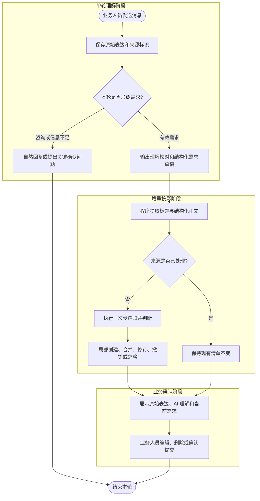

# 计划评审需求表达与纠偏设计

本方案把公开计划评审定位为业务理解校对工具：保留业务人员原始表达和评审依据，每个有效需求轮次只形成一次增量草稿；只有新证据确实修订同一需求时才局部归并，最终清单由业务人员确认后提交。

## 变更记录

| 版本 | 日期 | 修改人 | 变更内容摘要 |
|---|---|---|---|
| v1 | 2026-08-22 | Codex | 建立单轮增量整理、理解校对和受控归并基线 |

---

## 1. 目标与边界

- **要解决的问题**：同一需求轮次先由评审助手结构化回复，再由独立模型重复改写，增加延迟、成本和语义漂移；业务人员也不容易区分原始表达、AI 理解和已确认结论。
- **本次目标**：让评审助手帮助业务人员补全表达、指出与当前规格或既有事实的差异，并以可追溯增量更新需求清单。
- **不做什么**：不让模型在每条咨询或回复后重写全部需求；不自动把待确认内容升级为事实；不改变最终反馈提交接口和数据库结构。
- **设计结论**：主评审回复是单轮需求草稿的唯一语义来源，程序确定性提取该草稿，新来源只执行一次受控归并，最终提交仍以业务人员确认的清单快照为准。

---

## 2. 核心流程



---

## 3. 核心业务规则

| 规则 | 说明 |
|---|---|
| 原始表达不可变 | 用户消息、附件来源和稳定来源 ID 始终保留，不由摘要覆盖 |
| 单轮只整理一次 | 主评审回复形成结构化草稿，回复结束后由代码解析，不再调用独立改写模型 |
| 理解差异先展示 | 回复必须区分已确认理解、与规格或既有事实的差异、缺少依据的判断和待确认项 |
| 一问一答 | 结论先行且只回答本轮问题；一轮最多追问一个真正阻塞结论的问题，不寒暄、不复述、不堆叠建议 |
| 短结构 | 需求回复各小节不重复，理解校对与验收场景最多三点、待确认项最多一个；咨询以“结论”为主，仅按需补依据或确认项 |
| 上下文优先 | 分享规格、系统现状、核心索引和完整对话能够消除歧义时直接采用，不要求业务人员重复确认 |
| 明确目标直接成立 | 功能目标或期望结果明确时直接形成可验收需求；缺少技术实现细节或当前系统尚不支持，不构成拒绝或追问理由 |
| 追问门槛 | 仅当不同答案会改变需求对象、范围、业务规则或验收结果，且上下文无法消除分歧时，才追问一个问题 |
| 咨询不进入清单 | `CONSULTATION` 和尚未完成的 `PENDING` 轮次不创建需求 |
| UNKNOWN 不伪装事实 | 无法确认是否为需求时先澄清；兼容历史消息时只能形成显式待确认草稿 |
| 新来源只归并一次 | 稳定来源 ID 已处理时直接跳过，重载和重复同步不得再次改写需求 |
| 只局部更新 | 归并器只能操作一个目标需求，不得重写整个需求列表 |
| 模型提议、代码裁决 | 操作枚举、目标 ID、标题和正文必须经过代码校验；失败时保留独立草稿 |
| 最终提交由人确认 | 清单拼接、快照指纹和提交幂等均由程序完成，内容变化后才允许再次提交 |

---

## 4. 编码落点

```text
tools/tool-claude-chat/src/main/java/com/exceptioncoder/toolbox/claudechat/
├── ai/
│   └── ReviewRequirementCompiler.java        [重命名] 仅保留新来源与当前清单的受控归并能力
└── service/
    ├── ReviewIntentService.java              [修改] 从本轮结构化回复确定性生成增量草稿
    ├── ReviewRequirementService.java         [不变] 校验来源幂等并局部应用归并动作
    └── ReviewSpaceService.java               [修改] 强化理解校对、证据差异和待确认表达协议

tools/tool-claude-chat/src/test/java/com/exceptioncoder/toolbox/claudechat/service/
└── ReviewIntentServiceTest.java              [修改] 验证无二次改写、结构化提取和安全降级
```

### 调用关系说明

- `ClaudeChatService#startTurnAdmitted` → `ReviewIntentService#classifyBeforeReply` → 主评审回复。
- `ClaudeChatService#onResult` → `ReviewIntentService#validateAfterReply` → 前端需求草稿投影。
- `useReviewRequirements` 只同步缺失来源 → `ReviewRequirementService#synchronize` → 单来源受控归并。

---

## 5. 数据与依赖变更

| 类型 | 是否变化 | 说明 |
|---|---|---|
| 数据库表 / 字段 / 索引 | 无 | 沿用评审意图、需求、来源和汇总覆盖关系 |
| DTO / VO / 枚举 | 无 | 沿用现有需求草稿与归并操作契约 |
| 下游接口 / 外部依赖 | 无 | 不新增模型、接口或中间件 |
| 缓存 / 消息 / 锁 / 事务 | 无 | 来源幂等和需求归并继续在现有事务内完成 |

---

## 6. 风险与待确认

| 风险 / 待确认点 | 影响 | 处理方式 |
|---|---|---|
| 主回复未遵守结构 | 无法可靠提取完整草稿 | 只使用用户原始诉求生成待确认草稿，不复制过程性回复 |
| 归并模型误判目标 | 可能错误修订既有需求 | 校验真实目标 ID；非法输出降级为独立需求，保留来源证据 |
| 业务人员尚未确认差异 | 错误理解可能进入候选清单 | 在理解校对和待确认项中显式展示，并允许编辑或删除后再提交 |

---

## 7. 验证要点

- **正常路径**：结构化需求回复直接生成标题和正文，不调用独立需求改写器；新来源只归并一次。
- **异常路径**：回复格式缺失时使用原始诉求形成待确认草稿；归并输出非法时创建独立需求。
- **边界条件**：咨询、未完成回复、内部汇总请求、重复来源均不新增或改写需求。
- **回归范围**：意图判定、公开消息投影、需求清单同步、人工编辑删除和最终汇总提交。
