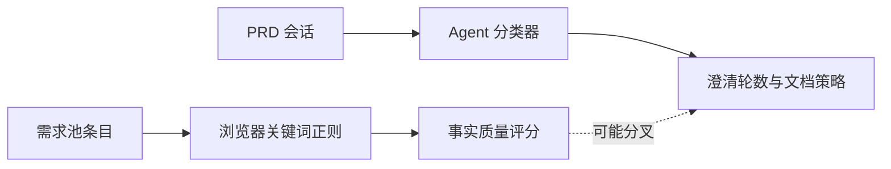
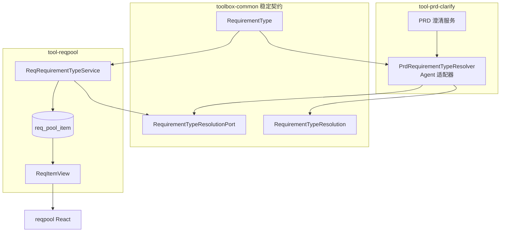
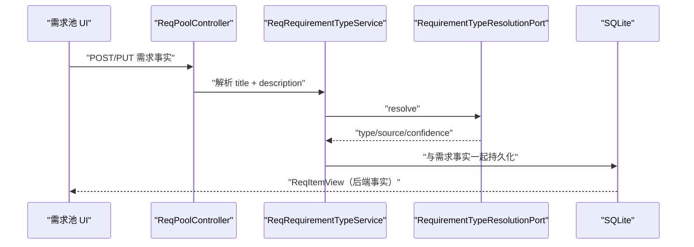
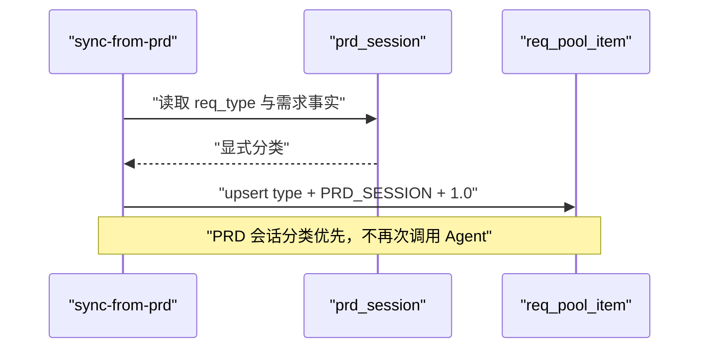

# 需求类型单一事实源设计

## 1. 背景与目标

需求池当前在浏览器中用关键词正则推断 `reqType`，PRD 澄清模块则通过 Agent 判定。同一需求因入口不同可能得到不同类型，进而影响事实质量评分和澄清策略。

本阶段建立稳定的跨模块需求类型契约，让后端成为唯一事实源，并保持现有 API 路径、PRD 澄清流程和 SQLite 数据兼容。

目标：

- `RequirementType` 只定义一次，包含 `BUG_FIX`、`MODULE_ADJUST`、`NEW_MODULE`、`UNKNOWN`。
- PRD 的 Agent 分类器实现公共端口，需求池不依赖 PRD 模块实现包。
- 需求池持久化类型、来源、置信度，API 原样返回。
- 前端不再根据标题、描述或标签猜测类型。
- 分类失败时需求池显示“待判定”，PRD 仍按既有规则降级到 `NEW_MODULE`。

非目标：本阶段不拆分 `ReqPoolController`，不改 AI insight 历史模型，不迁移 PRD 表中的既有 `req_type` 列。

## 2. 现状与问题

前端推断既没有模型语义，也没有来源和置信度；当 PRD 会话不存在时，任何未命中关键词的需求都会被默认为新增模块。这会把未知事实包装成确定结论。

## 3. 目标架构

依赖方向固定为工具模块指向 `toolbox-common`。需求池只依赖端口，不直接引用 `tool-prd-clarify` 类或查询其实现细节。

## 4. 核心契约

`RequirementTypeResolution` 包含：

| 字段 | 含义 | 约束 |
|------|------|------|
| `type` | AI 澄清策略分类 | 固定枚举；无法可靠判断时为 `UNKNOWN` |
| `source` | 事实来源 | `EXPLICIT`、`AI`、`PRD_SESSION`、`UNKNOWN` |
| `confidence` | 分类置信度 | `0.0..1.0`；未知为 `0` |

`business_requirement_type` 是业务侧原始分类，不与本契约混用。

## 5. 关键流程

### 5.1 独立创建或编辑需求

创建时始终解析。编辑时仅在标题或描述实际变化时重新解析，避免无关状态更新触发 LLM。

### 5.2 PRD 镜像同步

## 6. 数据迁移与兼容

在 `req_pool_item` 增加三个可空列：

- `req_type TEXT`
- `req_type_source TEXT`
- `req_type_confidence REAL`

SQLite 启动迁移沿用项目现有的幂等容错机制。存量数据不做关键词回填：无可靠来源的旧记录读取为 `UNKNOWN/UNKNOWN/0`。后续编辑或 PRD 同步时自然补齐。

API 只增加响应字段，不删除或重命名旧字段。旧客户端可继续工作。

## 7. 失败与降级

- 模型返回非法 JSON、未知枚举或越界置信度：公共结果为 `UNKNOWN/UNKNOWN/0`。
- 需求池保存失败：整个请求失败，不返回未持久化的分类。
- PRD 使用公共结果时若为 `UNKNOWN`：在 PRD 内部转换为 `NEW_MODULE` 和 8 轮，保持既有行为。
- UI 对 `UNKNOWN` 显示“待判定”，评分不享受新增模块的位置豁免。

## 8. 测试与验收

- 公共枚举只接受固定代码，未知输入不会隐式变成 `NEW_MODULE`。
- resolver 校验模型输出、置信度和降级；PRD 旧测试继续通过。
- 需求池创建、事实编辑和 PRD 同步分别验证来源与持久化字段。
- 前端测试证明无后端类型时显示“待判定”，且不会触发新增模块豁免。
- 运行 `mvn -pl tools/tool-reqpool,tools/tool-prd-clarify -am test`、前端测试、类型检查与构建。

## 9. 演进方向

后续 Controller 分层时，类型解析逻辑整体迁入 `ReqItemCommandService`；公共端口和 API 契约保持不变。本设计仅取代《AI 交付链路模块优化改造方案》中 reqType 前端推断相关部分。
