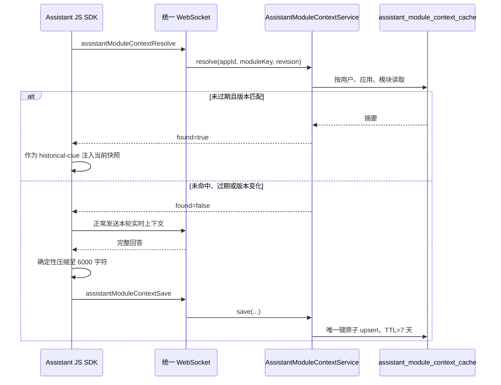

# Assistant 模块探索摘要缓存

## 场景目标

同一用户再次从同一 Web 应用模块发起咨询时，复用首次会话形成的关键探索摘要，减少重复页面探索；当前页面快照仍是本轮事实来源。

## 读写顺序

## 核心约束

- 隔离键为 `creator_user_id + app_id + module_key`，不跨用户共享模型输出。
- `source_revision` 非空且变化时视为未命中；未传版本时仅按 TTL 判断。
- 摘要最长 6000 字符，有效期 7 天；读取超时或命令失败只降级为实时探索。
- 中断或失败的回答不回写缓存；缓存内容标记为 `historical-clue`，不能覆盖当前页面事实。

## 代码坐标

- 前端键生成、压缩与注入：`frontend/src/assistant-sdk/moduleContext.ts`、`AssistantWebSocketTransport.ts`
- WS 契约：`ClientMessage.AssistantModuleContextResolve`、`AssistantModuleContextSave`
- 应用服务：`AssistantModuleContextService`
- 持久化：`AssistantModuleContextRepository`、`assistant-schema.sql`
