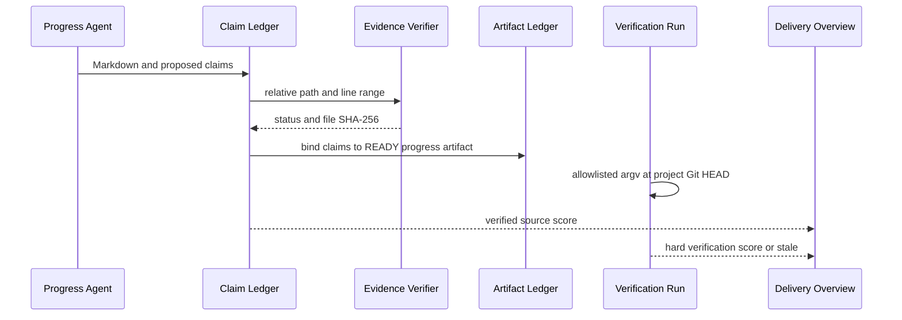

# Delivery 结构化证据与白名单验证

## 已验证事实

- Progress Agent 在 Markdown 中附带固定 marker 包围的 claim JSON；模型只提出状态和源码坐标。
- 服务端限定项目真实根目录，校验相对路径、文件、行范围并计算 SHA-256。
- `COMPLETED` 没有任一 `VERIFIED` 证据时必须降为 `PARTIAL`。
- 旧 Markdown 仅作展示，`TEST_SCORING` 不再参与权威评分与实现风险裁决。
- 验证 API 只接受 `commandId`；argv、超时和 cwd 由服务端白名单与项目解析器决定。
- 权威总进度为 PRD 10 + TDD 10 + verified source 60 + 同 Git HEAD 硬验证 20。

## 核心链路

## 回归约束

- 修改 claim marker 或状态时，同步 Prompt 资源、Parser、状态索引和解析测试。
- 修改证据字段时，同步 DDL、显式 Repository 映射、项目根边界和临时文件测试。
- 修改白名单命令时，不得把 executable、args 或 cwd 移到请求体。
- 新增评分口径时，只修改 `DeliveryMetrics` 与后端投影，前端不得重建公式。
