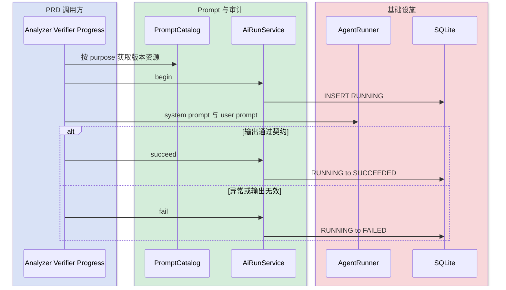
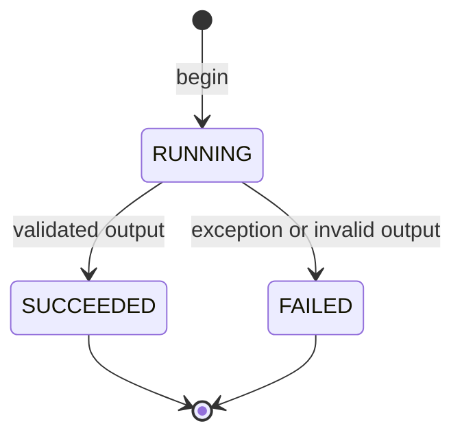

# PRD Prompt 版本与 AI Run 审计

## 已验证事实

- Analyzer、Verifier、Progress 的系统 Prompt 由 `PrdPromptCatalog` 从不可变类路径资源读取。
- Catalog 返回 purpose、version、正文和正文 SHA-256；文档变更候选快照包含 Analyzer/Verifier 的组合指纹。
- 每次真实模型调用先插入 `RUNNING`，输出通过调用方契约后转 `SUCCEEDED`，异常或非法输出转 `FAILED`。
- 账本只保存 Prompt、输入、输出哈希与非敏感运行元数据，不保存正文、API Base URL、Token 或 Codex Home。
- Analyzer/Verifier 在候选落库后绑定 `candidate_id`；Progress 在产物 READY 后绑定 `artifact_id`。

## 核心链路

## 状态机

## 表操作

| 步骤 | 表 | 操作 | 失败行为 |
|---|---|---|---|
| 调用前登记 | `prd_ai_run` | INSERT | 阻止模型调用，禁止无审计降级 |
| 运行终结 | `prd_ai_run` | UPDATE with `status='RUNNING'` | 重复终结返回失败，不覆盖首个结论 |
| 候选绑定 | `prd_ai_run` | UPDATE `candidate_id` | 保留已完成运行，异常交由调用链处理 |
| 产物绑定 | `prd_ai_run` | UPDATE `artifact_id` | AI Run 成功与产物写入失败分别表达 |

## 回归约束

- Prompt 内容变化必须升版本；旧资源不得覆盖。
- Analyzer 解析失败不执行 Verifier，因此只产生一条失败 run。
- LLM 调用不得进入数据库长事务。
- 新增 purpose 时同步 Catalog、状态反向索引、资源测试和调用链测试。
