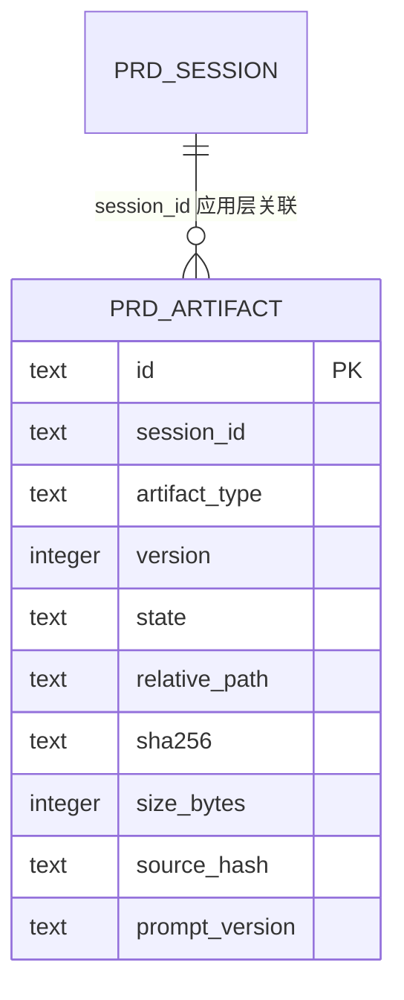
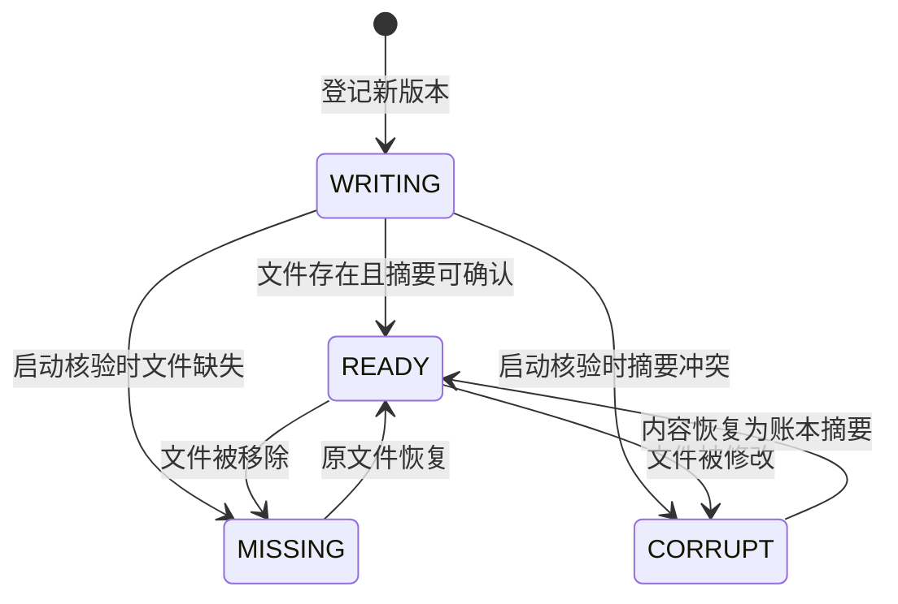

# PRD 产物写入与启动恢复

## 场景边界

本场景覆盖 PRD、开发文档和进度报告三类文件的新写入、兼容主文件投影，以及应用启动后的账本核验。旧文件回填、API 读切换和旧字段删除不在当前实现范围内。

## 已验证事实

1. `PrdClarifyService` 将生成、手工保存、修订和恢复产生的内容交给 `PrdArtifactService`。
2. 写入服务按 `session_id + artifact_type` 串行分配版本，先插入 `WRITING` 记录。
3. 不可变文件写入 `.artifacts/<session>/<type>/vN.md`，同目录临时文件通过原子移动替换目标。
4. 文件写入完成后，账本保存 SHA-256 和字节数并进入 `READY`。
5. 兼容主文件在账本就绪后刷新，`prd_session` 的旧路径和生成时间继续更新。
6. 启动核验器按磁盘事实把账本收敛为 `READY`、`MISSING` 或 `CORRUPT`，只报告孤儿文件，不删除或导入。

## 数据关系

当前 DDL 未声明外键；会话与账本的关系由应用服务维护，删除策略尚未进入本阶段。

## 状态流转

## SQL 原子能力

| 能力 | 输入 | 输出或副作用 | 失败行为 |
|---|---|---|---|
| 查询下一版本 | 会话、产物类型 | 当前最大版本加一 | 并发冲突由唯一键兜底 |
| 登记写入中版本 | 完整账本记录 | 插入 `WRITING` | 插入失败时不写文件 |
| 更新核验状态 | ID、状态、摘要、大小、错误 | 更新一条账本记录 | 更新失败向上抛出 |
| 查询待核验记录 | 无 | 全部账本记录 | 启动核验记录告警并允许应用继续启动 |

## 故障语义

- 不可变文件写入失败：账本保留 `WRITING` 和错误，兼容主文件不变。
- 文件已写入而 `READY` 更新失败：启动核验重新计算摘要并恢复为 `READY`。
- 兼容主文件或旧字段更新失败：不可变账本仍是事实记录；调用方收到失败，兼容投影不会被误报为成功。
- 文件缺失：严格账本读取抛出异常；旧读取接口暂时保留原兼容语义。

## 证据坐标

- 表与索引：`tools/tool-prd-clarify/src/main/resources/db/prd-schema.sql:119`
- 写入编排：`tools/tool-prd-clarify/src/main/java/com/exceptioncoder/toolbox/prdclarify/service/PrdArtifactService.java:46`
- 启动核验：`tools/tool-prd-clarify/src/main/java/com/exceptioncoder/toolbox/prdclarify/service/PrdArtifactReconciler.java:48`
- 文件原子写入：`tools/tool-prd-clarify/src/main/java/com/exceptioncoder/toolbox/prdclarify/service/PrdFileStore.java`
- 外部主文件捕获：`tools/tool-prd-clarify/src/main/java/com/exceptioncoder/toolbox/prdclarify/api/PrdClarifyController.java:312`

