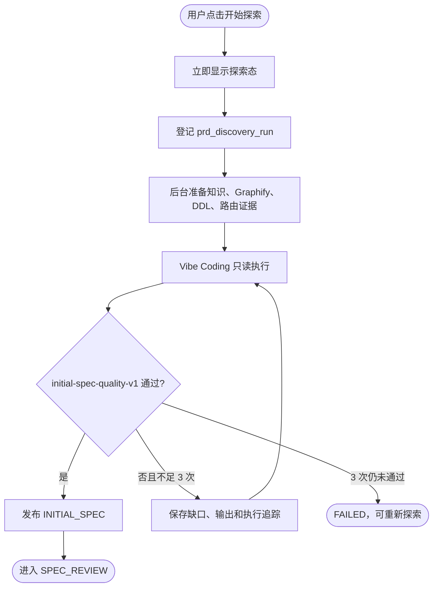

# 初始化规格后台探索

## 已验证事实

- `POST /api/prd-clarify/sessions/{id}/discover` 只登记 `prd_discovery_run` 并返回 `202`；证据查询和 Agent 执行不占用浏览器请求生命周期。
- `PrdDiscoveryTaskService` 使用应用任务执行器运行，并在应用启动后恢复 `RUNNING` 记录；同一会话由部分唯一索引限制为一条活动运行。
- `PrdDiscoveryService` 先查询模块业务知识、Graphify、关键 DDL 和路由，再通过 Vibe Coding `AgentOneShotRunner#runObserved` 启动只读执行；执行会话 ID 和 trace ID 回写运行记录。
- `PrdInitialSpecValidator` 以 `initial-spec-quality-v1` 检查正文长度、固定章节、稳定 ID 和开放问题上限；不完整结果会携带缺口与上次正文重新生成完整规格，最多 3 次。
- 只有通过完成性检查的正文才写入 `INITIAL_SPEC`；三次均失败时运行进入 `FAILED`、会话进入 `ERROR`，前端保留重试入口。

---

## 执行链路

---

## 修改约束

- 不得重新把探索改为 SSE 长连接或让增量消费者控制 Agent 取消。
- 修改质量标准时必须升级 `criteria_version`，同步测试、运行视图和设计文档。
- 修改尝试上限、阶段或终态时必须同步 DDL 唯一索引、Repository 条件更新、前端轮询与恢复测试。
- `last_output` 只用于受限修复和诊断，不通过运行查询 API 返回正文；用户只能消费通过校验并发布的产物。
