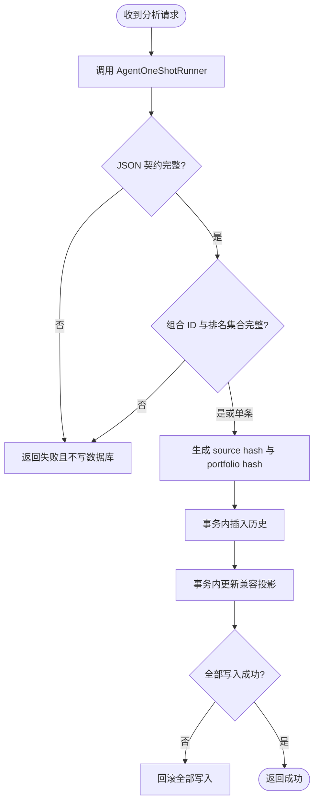

# ReqPool 洞察校验与原子提交

## 已验证事实

- 单条与组合入口位于 `ReqPoolController.java:329` 和 `ReqPoolController.java:344`。
- `ReqInsightApplicationService` 只在模型返回后调用确定性校验器。
- `ReqInsightPersistenceService.saveAll` 是最终短事务边界；历史插入或任一兼容投影更新失败都会整批回滚。
- `req_pool_item.ai_insight` 继续作为兼容投影，`req_pool_insight` 是新增的不可变历史事实源。

---

## 状态与失败流

---

## 原子 SQL 能力

| 能力 | 参数 | 结果语义 |
|---|---|---|
| 插入历史 | `ReqInsight` 全字段 | 每次成功分析新增一条不可变记录 |
| 更新兼容投影 | `itemId, payloadJson, updatedAt` | 必须精确更新一条需求，否则抛错触发回滚 |
| 批量读取最新历史 | 需求 ID 集合 | 按 `created_at DESC, id DESC` 为每个条目选择第一条 |
| 删除需求历史 | `itemId` | 与需求删除处于同一 Controller 事务，避免孤儿历史 |

---

## 新鲜度决策

`source_hash` 不一致优先判定 `SOURCE_CHANGED`。来源未变化时，组合洞察的 `portfolio_set_hash` 与当前活跃根需求集合不一致判定 `PORTFOLIO_CHANGED`。只有旧兼容列而没有历史时判定 `LEGACY_UNVERIFIED`；这些状态均不得参与前端权威排名。
