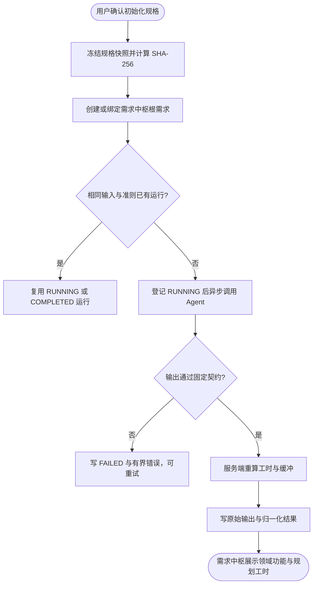

# 初始化规格规划评估

## 已验证事实

- 初始化规格在 `PrdDiscoveryService#confirm` 确认后，通过 `InitialSpecPlanningGateway` 发出稳定请求；规划登记失败只记录告警，不阻断核心规格生成。
- `InitialSpecPlanningIntegration` 位于 `toolbox-starter`，负责连接彼此独立的 `tool-prd-clarify` 与 `tool-reqpool` 模块。
- `ReqPlanningAssessmentService#prepare` 先绑定或创建需求中枢根需求，再按“规格会话 + 输入 SHA-256 + 准则版本”幂等登记运行。
- 模型只提出领域能力和基础工作包区间；`ReqPlanningAssessmentNormalizer` 校验完整性，并由服务端重算缓冲、总工时和人日。
- 原始模型输出与归一化结果分别保存，且同时记录输入快照、输入摘要、准则版本和 Prompt 版本，支持后续离线评测与版本对比。

---

## 执行链路

---

## 固定评估准则 `initial-spec-planning-v2`

| 工作包 | 基础工时范围 |
|---|---:|
| `DISCOVERY_DESIGN` | 0–8h |
| `BACKEND` | 0–24h |
| `FRONTEND` | 0–20h |
| `DATA` | 0–12h |
| `INTEGRATION` | 0–12h |
| `TEST_VERIFICATION` | 0–12h |

每项业务功能必须完整返回六类工作包，未使用的工作包填 0。共享的探索、基础设施、联调和回归成本只能归属一次，单项业务功能基础工时上界为 60 小时，全部功能基础工时上界为 240 小时。置信度缓冲由服务端固定为 `HIGH=10%`、`MEDIUM=25%`、`LOW=40%`，并以 6 个 AI 有效工作小时/人日换算；模型返回的总计字段不作为事实。

---

## 失败与幂等语义

- `RUNNING` 只允许条件更新为 `COMPLETED` 或 `FAILED`，后到终结结果不能覆盖先到结果。
- 相同输入摘要和准则版本的活动/成功运行由部分唯一索引去重。
- 规划失败不改变规格生成状态；需求详情保留失败原因和重试入口。
- 需求删除时同步删除规划历史，避免孤儿记录。
