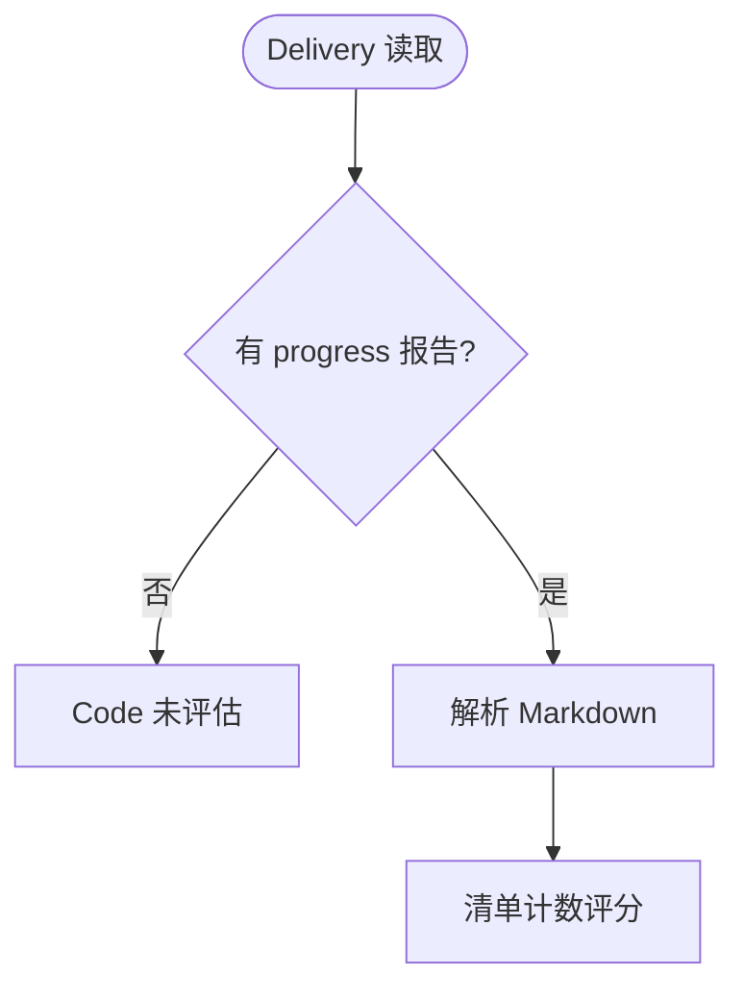

# Delivery 证据链 AI 速查索引

> 对应梳理文档：`Delivery证据链-现状梳理.md`

## 1. 场景决策树



## 2. 文件索引

| 文件 | 类 | 职责 | 行数 |
|---|---|---|---:|
| `delivery/DeliveryOverviewService.java` | `DeliveryOverviewService` | 聚合投影 | 684 |
| `delivery/ProgressReportParser.java` | `ProgressReportParser` | Markdown 解析 | 318 |
| `delivery/DeliveryMetrics.java` | `DeliveryMetrics` | 评分规则 | 159 |
| `api/dto/DeliveryOverviewView.java` | `DeliveryOverviewView` | API 投影 | 173 |
| `api/PrdDeliveryController.java` | `PrdDeliveryController` | GET 入口 | 40 |
| `service/PrdClarifyService.java` | `PrdClarifyService` | 进度 API 兼容门面 | 2005 |
| `service/PrdProgressEvaluationService.java` | `PrdProgressEvaluationService` | 进度生成与版本维护 | 555 |

## 3. 方法索引

| 方法 | 文件 | 行 | 入参 | 出参 | 场景 |
|---|---|---:|---|---|---|
| `evaluateProgress` | `PrdClarifyService.java` | 1598 | sessionId/context/emitter | SSE | 委托 |
| `evaluate` | `PrdProgressEvaluationService.java` | 84 | sessionId/context/emitter | SSE | 生成 |
| `listVersions` | `PrdProgressEvaluationService.java` | 125 | sessionId | 版本摘要 | 读取 |
| `parse` | `ProgressReportParser.java` | 31 | markdown | report | 解析 |
| `project` | `DeliveryOverviewService.java` | 99 | session/warnings | projection | 投影 |
| `codeProgress` | `DeliveryMetrics.java` | 22 | counts | percent | 代码分 |
| `overallProgress` | `DeliveryMetrics.java` | 34 | prd/tdd/code | percent | 整体分 |

## 4. 调用链索引

```text
生成: PrdClarifyController -> PrdClarifyService.evaluateProgress:1598 -> PrdProgressEvaluationService.evaluate:84 -> AgentOneShotRunner -> PrdArtifactService
读取: PrdDeliveryController.overview:31 -> DeliveryOverviewService.project:99 -> ProgressReportParser.parse:31 -> DeliveryMetrics
```

## 5. 表操作索引

| 表 | 生成 | 读取 | 验证 |
|---|---|---|---|
| `prd_session` | U | S | - |
| `prd_artifact` | I/U | S | - |

## 6. 状态扭转索引

当前无 Delivery 专用持久化状态机；仅 `prd_artifact` 的 `WRITING -> READY/MISSING/CORRUPT`。

## 7. 业务规则索引

| 规则 | 公式/条件 | 代码 |
|---|---|---|
| 代码分 | `completed + partial * 0.5` | `DeliveryMetrics.java:22` |
| 整体分 | `PRD10 + TDD10 + Code80` | `DeliveryMetrics.java:34` |
| 测试排除 | Markdown marker | `ProgressReportParser.java:41` |
| 证据存在 | 字符串非空 | `DeliveryOverviewService.java:124` |
