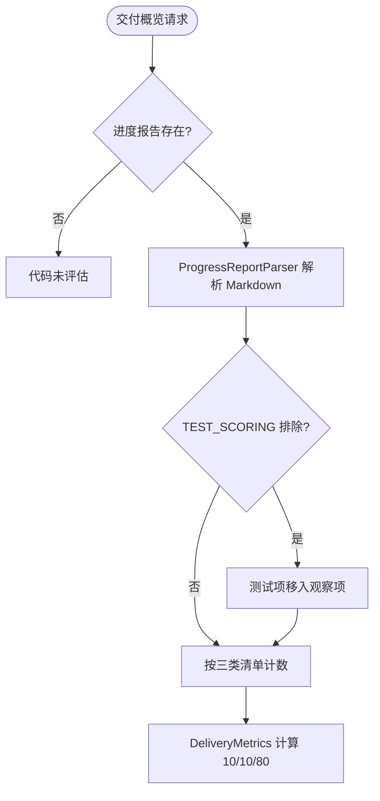
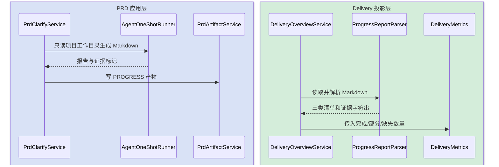
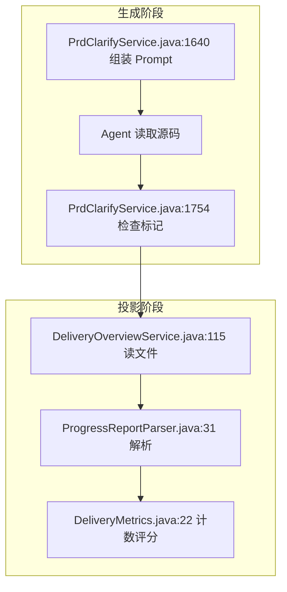
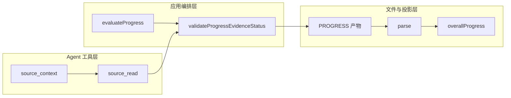
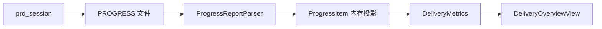

# Delivery 证据链现状梳理

> 本文档固化代码改造前的交付评分、Markdown 证据解析与测试计分链路，用于结构化证据与可验证运行重构。

## 快速导航

- [场景总览](#1-场景总览矩阵)
- [核心代码](#2-核心代码索引)
- [详细链路](#3-各场景详细分析)
- [数据与状态](#b1-数据库与状态现状)
- [回归检查](#7-回归测试检查表)

---

## 1. 场景总览矩阵

| # | 输入 | 服务端裁决 | 计分结果 | 图组 |
|---|---|---|---|---|
| 1 | Agent 输出 Markdown 进度报告 | 仅检查顶层证据标记 | 按清单完成/部分/缺失数量计分 | A |
| 2 | `证据：` 自然语言字符串 | 不校验路径、行号、符号和哈希 | 有字符串即视为有证据 | B |
| 3 | `TEST_SCORING` HTML 标记 | Parser 将测试项移到 excluded | 报告内容可改变权威计分口径 | C |
| 4 | 构建/测试结果 | 尚无手动验证运行模型 | 测试与运行阶段主要为报告投影 | C |

---

## 2. 核心代码索引

| 层 | 文件 | 核心类 | 行数 | 职责 |
|---|---|---|---:|---|
| API | `api/PrdDeliveryController.java` | `PrdDeliveryController` | 40 | 只读概览入口 |
| Projection | `delivery/DeliveryOverviewService.java` | `DeliveryOverviewService` | 684 | 汇总报告、评分、风险 |
| Parser | `delivery/ProgressReportParser.java` | `ProgressReportParser` | 318 | Markdown 转清单及证据字符串 |
| Domain rule | `delivery/DeliveryMetrics.java` | `DeliveryMetrics` | 159 | 代码进度、整体进度、可信度和健康度 |
| Generation | `service/PrdClarifyService.java` | `PrdClarifyService` | 2300+ | 调用 Agent 生成进度报告并写产物 |
| DTO | `api/dto/DeliveryOverviewView.java` | `DeliveryOverviewView` | 173 | 交付看板协议 |
| Frontend | `frontend/src/features/delivery-center/viewModel.ts` | 纯函数 | 82 | 重复计算 10/10/80 进度 |

### 2.1 关键方法

| 方法 | 文件 | 行 | 场景 |
|---|---|---:|---|
| `evaluateProgress()` | `PrdClarifyService.java` | 1615 | Agent 生成报告 |
| `validateProgressEvidenceStatus()` | `PrdClarifyService.java` | 1754 | 顶层证据标记门禁 |
| `parse()` | `ProgressReportParser.java` | 31 | Markdown 解析 |
| `addItem()` | `ProgressReportParser.java` | 129 | 测试项排除和状态归类 |
| `project()` | `DeliveryOverviewService.java` | 99 | 单需求评分投影 |
| `overallProgress()` | `DeliveryMetrics.java` | 34 | 固定权重计分 |
| `requirementProgress()` | `viewModel.ts` | 19 | 前端重复计分 |

---

## 3. 各场景详细分析

### 3.1 场景 A：报告生成与计分

### 3.2 场景 B：证据字符串

`ProgressReportParser.MutableProgressItem#addDetail` 仅截取“证据：”后文本。它不知道项目根，也不校验文件、行号、符号或 SHA-256。因此“已完成且有文本”不等于“已完成且证据可重放”。

### 3.3 场景 C：测试计分与运行证据

`ProgressReportParser.java:41` 读取报告内 HTML 标记，`addItem():137` 据此把测试功能点移到 excluded。目前没有独立的构建/测试运行实体，也没有 `gitHead` 与源码变更后的过期判定。

---

## 4. 知识图谱

---

## 5. 业务规则速查表

| 规则 | 现状 | 代码位置 |
|---|---|---|
| 代码分 | `(completed + partial * 0.5) / total` | `DeliveryMetrics.java:22` |
| 整体分 | PRD 10% + TDD 10% + Code 80% | `DeliveryMetrics.java:34` |
| 证据存在 | `evidence` 列表非空 | `DeliveryOverviewService.java:124` |
| 测试排除 | 报告 HTML marker 决定 | `ProgressReportParser.java:41` |
| 前端进度 | 再次实现 10/10/80 | `viewModel.ts:19` |

---

## 6. 代码核实差异说明

| # | 原方案判断 | 实际代码 | 结论 |
|---|---|---|---|
| 1 | 前端重新判定 health/HIGH | 前端只消费服务端结果 | 该项已集中服务端 |
| 2 | 10/10/80 权重重复 | 前后端都存在 | 仍需消除 |
| 3 | 硬证据不足 | 仅有字符串与报告 marker | 判断成立 |

---

## 7. 回归测试检查表

- [ ] 旧 Markdown 报告仍可展示，但不伪装为已验证 claim。
- [ ] 路径越界、文件缺失、行号越界均不能计为有效证据。
- [ ] 报告中 `TEST_SCORING` 不再影响权威评分。
- [ ] 验证命令只能由服务端白名单 ID 选择。
- [ ] 源码 Git HEAD 变化后，旧验证运行自动标记过期。

---

## B1. 数据库与状态现状

当前只有 `prd_session.progress_path/progress_generated_at/progress_history` 和 `prd_artifact(PROGRESS)`；没有 claim/evidence 账本，没有 verification run 表。

---

## B2. 表操作矩阵

| 场景 | `prd_session` | `prd_artifact` | claim 账本 | verification run |
|---|---|---|---|---|
| 生成进度报告 | U | I | - | - |
| 读取交付概览 | S | 间接 | - | - |
| 运行构建/测试 | - | - | - | - |

---

## B3. 事务、SQL 与并发

- 进度文件、产物账本、历史与 session 投影不在同一数据库事务中。
- 交付概览是只读投影，每次读取文件并重新解析。
- 未存在手动验证运行的并发防重、超时和输出截断规则。
