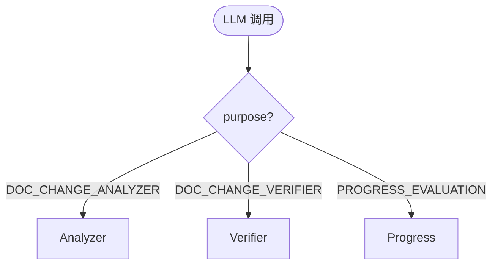

# PRD Prompt 执行链 AI 速查索引

> 对应：[PRD Prompt 执行链现状梳理](PRD-Prompt执行链-现状梳理.md)

## 1. 场景决策树



## 2. 文件索引

| 文件 | 类 | 职责 | 行数 |
|---|---|---|---:|
| `service/PrdDocChangeAgentAnalyzer.java` | `PrdDocChangeAgentAnalyzer` | 分析与校验 | 248 |
| `service/PrdDocChangeAgentVerifier.java` | `PrdDocChangeAgentVerifier` | 独立复核 | 145 |
| `service/PrdDocChangeAnalysisService.java` | `PrdDocChangeAnalysisService` | 双阶段编排 | 587 |
| `service/PrdClarifyService.java` | `PrdClarifyService` | Progress 兼容入口 | 2371 |
| `resources/db/prd-schema.sql` | DDL | PRD 数据基线 | 208 |

## 3. 方法索引

| 方法 | 文件:行 | 入参 | 出参 | 场景 |
|---|---|---|---|---|
| `analyze` | `PrdDocChangeAgentAnalyzer.java:104` | evidence bundle | analysis result | Analyzer |
| `verify` | `PrdDocChangeAgentVerifier.java:52` | evidence + analysis | verification result | Verifier |
| `analyzeEvidence` | `PrdDocChangeAnalysisService.java:225` | evidence + snapshot | final analysis | 编排 |
| `evaluateProgress` | `PrdClarifyService.java:1657` | session + context + SSE | void | Progress |

## 4. 调用链索引

```text
文档变更：Controller -> PrdDocChangeAnalysisService -> Analyzer -> AgentOneShotRunner -> Verifier -> CandidateRepository
进度评估：Controller -> PrdClarifyService -> AgentOneShotRunner -> PrdArtifactService -> SQLite + Markdown
```

## 5. 表操作索引

| 表 | Analyzer/Verifier | Progress |
|---|---|---|
| `prd_doc_change_candidate` | I/U/S | - |
| `prd_artifact` | - | I/U/S |

## 6. 状态扭转索引

| 表.字段 | 原值 | 新值 | 触发 |
|---|---|---|---|
| `prd_artifact.state` | `WRITING` | `READY` | 文件原子写入并校验成功 |

## 7. 业务规则索引

| 规则 | 代码 |
|---|---|
| Analyzer 失败不执行 Verifier | `PrdDocChangeAgentVerifier.java:54` |
| Progress 必须验证证据状态 | `PrdClarifyService.java:1698` |
| Progress 使用只读工具策略 | `PrdClarifyService.java:1691` |
