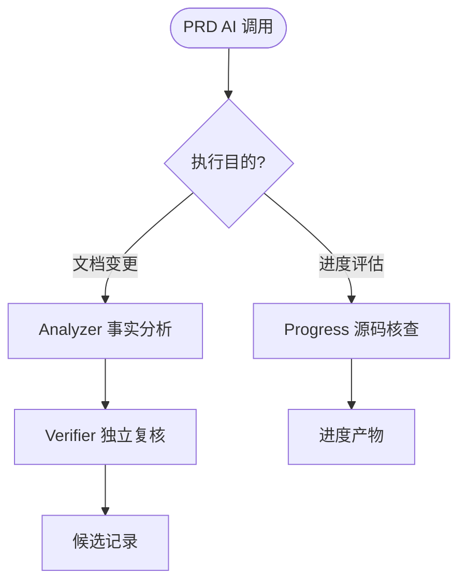
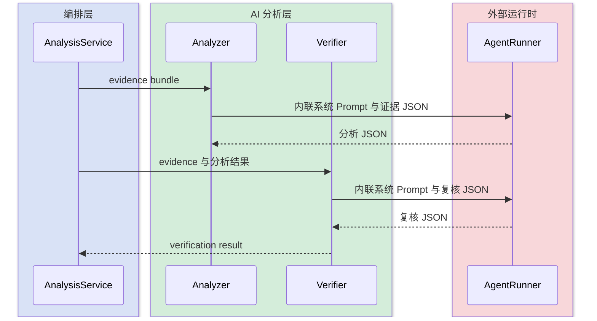
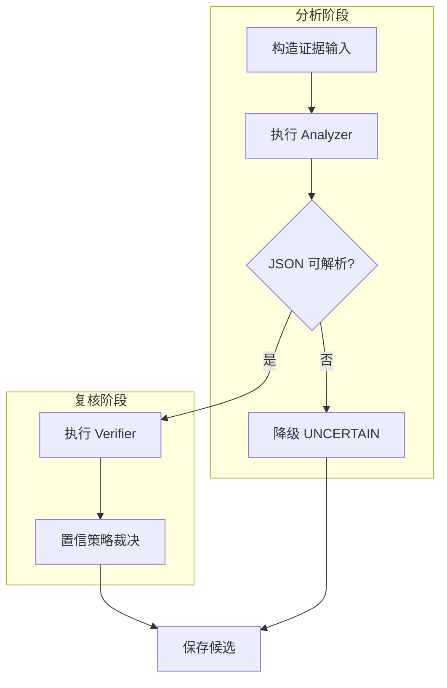
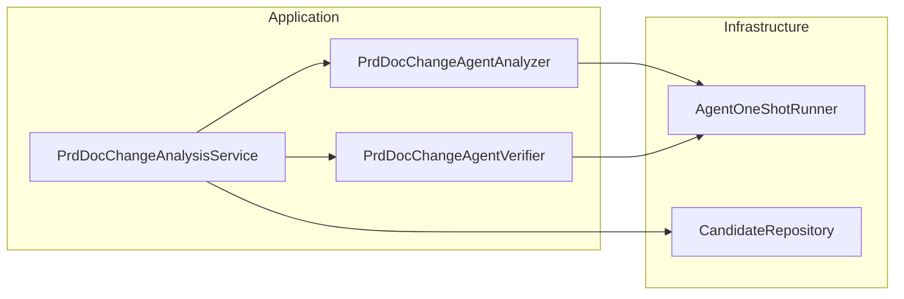
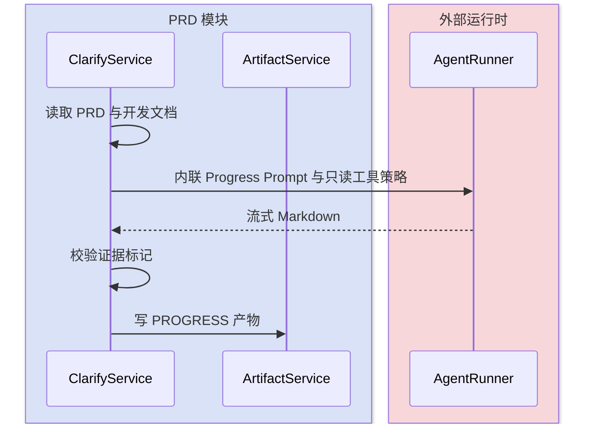
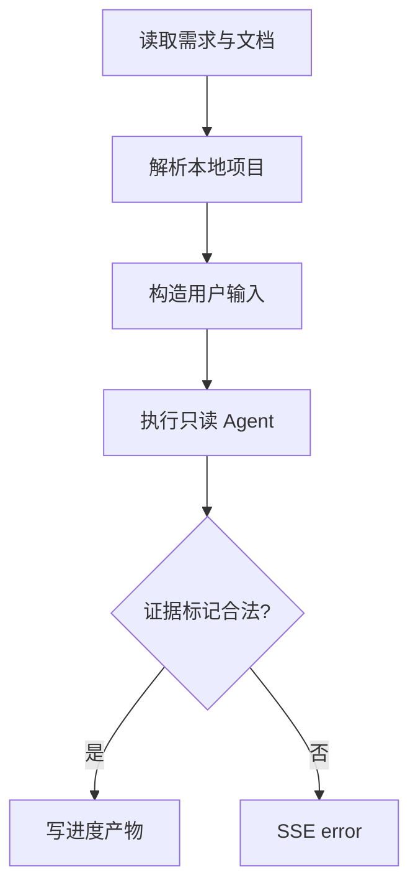
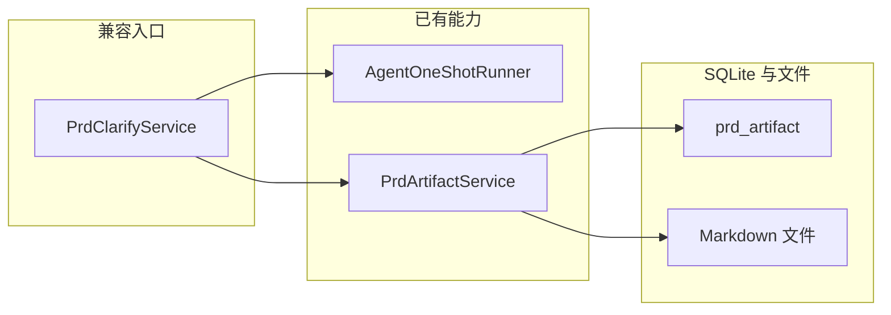
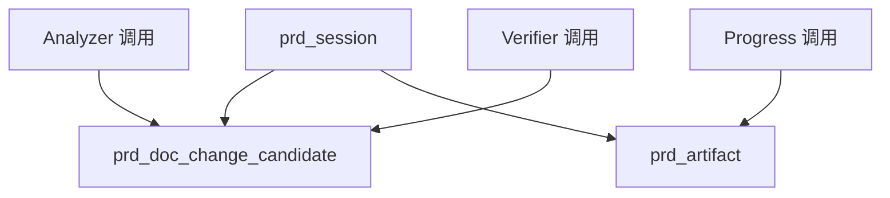

# PRD Prompt 执行链现状梳理

本文以 2026-08-14 工作区代码为事实基线，覆盖文档变更 Analyzer、Verifier 与进度评估三条 LLM 执行链，为 Prompt 资源化和运行审计重构提供回归锚点。

## 快速导航

- [场景总览](#1-场景总览矩阵)
- [核心代码](#2-核心代码索引)
- [执行链](#3-各场景详细分析)
- [数据事实](#b1-数据库表清单与-er-关系)
- [回归检查](#7-回归测试检查表)

---

## 1. 场景总览矩阵

| 场景组 | 入口 | Prompt 现状 | 输出 | 持久化 |
|---|---|---|---|---|
| A 文档变更分析 | `PrdDocChangeAnalysisService#analyze` | Analyzer 内联且有 `v3-plain-questions`；Verifier 内联且无版本 | 两阶段结构化结果 | 只保存聚合后的候选，未保存阶段 Prompt 哈希 |
| B 进度评估 | `PrdClarifyService#evaluateProgress` | 2371 行服务中的内联常量，无独立版本 | Markdown 报告 | 写 `prd_artifact`，但元数据当前为空 |

---

## 2. 核心代码索引

| 层 | 文件 | 核心类 | 行数 | 职责 |
|---|---|---|---:|---|
| Application | `service/PrdDocChangeAnalysisService.java` | `PrdDocChangeAnalysisService` | 587 | 证据、双阶段分析、候选编排 |
| Application | `service/PrdDocChangeAgentAnalyzer.java` | `PrdDocChangeAgentAnalyzer` | 248 | 第一阶段结构化分析 |
| Application | `service/PrdDocChangeAgentVerifier.java` | `PrdDocChangeAgentVerifier` | 145 | 第二阶段独立复核 |
| Legacy facade | `service/PrdClarifyService.java` | `PrdClarifyService` | 2371 | 进度 Prompt、流式调用和产物写入 |
| Infrastructure | `service/PrdArtifactService.java` | `PrdArtifactService` | 148 | 不可变产物账本 |
| Infrastructure | `resources/db/prd-schema.sql` | PRD DDL | 208 | 候选与产物表结构 |

| 方法 | 文件:行 | 作用 |
|---|---|---|
| `analyze()` | `PrdDocChangeAgentAnalyzer.java:104` | 运行 Analyzer 并校验 JSON |
| `verify()` | `PrdDocChangeAgentVerifier.java:52` | 运行 Verifier 并校验 JSON |
| `analyzeEvidence()` | `PrdDocChangeAnalysisService.java:225` | 串联 Analyzer、Verifier 与置信策略 |
| `evaluateProgress()` | `PrdClarifyService.java:1657` | 流式评估并写进度产物 |
| `write()` | `PrdArtifactService.java:46` | 写不可变文件和兼容投影 |

---

## 3. 各场景详细分析

### 3.1 场景 A：文档变更双阶段分析

### 3.2 场景 B：进度报告生成

---

## 4. 知识图谱

当前没有独立 AI Run 实体，因此阶段调用与候选/产物之间的关系只能推断，不能查询。

---

## 5. 业务规则速查表

| 规则 | 描述 | 代码位置 | 场景 |
|---|---|---|---|
| 双阶段约束 | Analyzer 解析失败时不消耗 Verifier 调用 | `PrdDocChangeAgentVerifier.java:54` | A |
| 工具策略 | Analyzer/Verifier 禁用工具；Progress 只允许咨询式只读工具 | `AgentOneShotRunner.java:20` | A、B |
| 输出裁决 | LLM 输出必须经过 Java 结构或证据标记校验 | Analyzer `parse`、Verifier `parse`、Progress 校验方法 | A、B |
| 产物不可变 | Progress 每次生成写入新账本版本 | `PrdArtifactService.java:70` | B |

---

## 6. 代码核实差异说明

| 预期 | 实际 | 影响 |
|---|---|---|
| 所有 Prompt 均有显式版本 | 仅 Analyzer 有版本，Verifier 与 Progress 无版本 | 无法稳定复现所有阶段 |
| 产物可追溯到调用 | `prd_artifact.prompt_version` 预留但 Progress 写空 | 产物只能追溯文件，不能追溯 Prompt |
| 双阶段分别审计 | 候选只保存聚合结果 | 无法定位 Analyzer 或 Verifier 的版本差异 |

---

## 7. 回归测试检查表

- [ ] Analyzer、Verifier 输出契约保持不变。
- [ ] Analyzer 解析失败仍跳过 Verifier。
- [ ] Progress SSE 的 `chunk/done/error` 语义保持不变。
- [ ] Prompt 资源缺失或哈希不符时快速失败，不静默回退内联字符串。
- [ ] Agent 成功、失败均留下可查询运行记录。
- [ ] Progress 产物记录关联同一次 AI Run。

---

## B1. 数据库表清单与 ER 关系

| 表 | 操作 | 当前语义 |
|---|---|---|
| `prd_doc_change_candidate` | INSERT/UPDATE/SELECT | 聚合后的文档变更候选 |
| `prd_artifact` | INSERT/UPDATE/SELECT | PRD、TDD、Progress 不可变产物 |

目标重构需要新增 `prd_ai_run`，不修改既有表契约。

---

## B2. 表操作矩阵

| 步骤 | 候选表 | 产物表 |
|---|---|---|
| Analyzer/Verifier | 最终写聚合候选 | - |
| Progress | - | 写 `WRITING` 后更新为 `READY` |

---

## B3. 表状态扭转明细

`prd_artifact.state` 维持 `WRITING -> READY`，失败时保留 `WRITING/last_error`；本轮不改变其状态机。

---

## B4. 事务边界与并发控制

| 范围 | 当前行为 | 风险 |
|---|---|---|
| LLM 调用 | 不在数据库事务内 | 正确，避免长事务 |
| 候选保存 | 调用完成后独立写入 | 阶段调用缺少审计身份 |
| 产物写入 | 条带锁内写账本与文件 | 可复用，不把 AI Run 生命周期塞入该锁 |

---

## B5. SQL 与查询清单

当前不存在 AI Run SQL；新增表必须显式列字段，按 `purpose, created_at` 和关联身份建立不超过 5 个索引。
