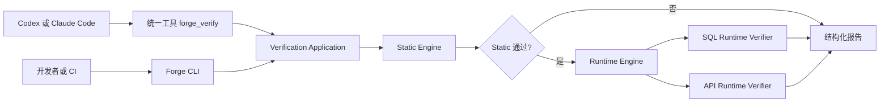
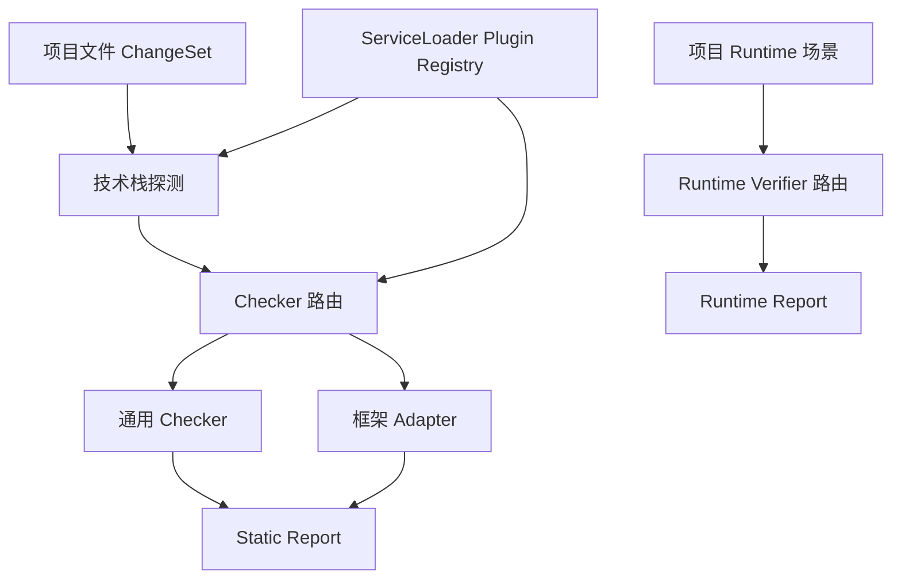

# Forge Verification

Forge Verification 是一套供 Codex、Claude Code、开发者与 CI 共用的代码验证模块。它把低成本的静态检查与真实环境运行验证组合为一个确定性入口，并通过插件适配不同语言、持久化框架、数据库和前端技术栈。

## 快速导航

- **第一次了解模块** → [工作原理](#2-工作原理)
- **查看已经具备的能力** → [当前能力](#4-当前能力)
- **开发者本地执行** → [CLI 使用方式](#6-cli-使用方式)
- **接入 Codex 或 Claude Code** → [MCP 与 Agent Tool](#7-mcp-与-agent-tool)
- **配置真实环境验证** → [项目配置](#8-项目配置)
- **解释验证结果** → [结果判定](#9-结果判定)

---

## 1. 解决什么问题

AI 修改代码后，仅凭源码推理不能证明改动真的可用。Forge Verification 将验证拆成职责严格分离的两层：

| 层次 | 回答的问题 | 资产来源 | 特点 |
|---|---|---|---|
| Static Gate | 从代码结构看，是否存在明显错误 | 通用规则与技术栈插件 | 快速、无环境依赖、适合前置拦截 |
| Runtime Verification | 在真实数据库或服务中，是否实际运行成功 | 项目业务场景 | 接近真实事实、成本更高、依赖测试环境 |

完整验证默认先执行 Static。Static 失败时不会连接数据库或调用 API，Runtime 状态为 `SKIPPED`。

---

## 2. 工作原理



CLI 和 MCP 都是薄适配器，共同调用 Application 层，不各自复制验证逻辑。Core 只认识 ChangeSet、Checker、Plugin 和 Report，不依赖 MyBatis、JPA 或具体数据库。

插件发现与执行关系如下：



---

## 3. 模块结构

```text
forge-quality/
├── forge-quality-core/          通用模型、Plugin SPI、Checker 路由和静态报告
├── forge-quality-plugin-java/   Java 技术栈探测与 MyBatis 静态规则
├── forge-quality-runtime/       SQL、API Runtime SPI 与执行器
├── forge-quality-application/   Static-first 编排和统一 VerificationReport
├── forge-quality-cli/           开发者与 CI 的命令行适配器
└── forge-quality-mcp/           Codex、Claude Code 的 stdio MCP 适配器
```

主要依赖方向：

```text
CLI ─┐
     ├──> Application ───> Core
MCP ─┘          └────────> Runtime

Java Plugin ─────────────> Core
```

新增 JPA、Prisma、Vue 等插件时，不需要修改 Core。

---

## 4. 当前能力

### 4.1 技术栈探测

当前 Java 插件可以从 Maven 文件和项目源码中识别：

- Java、Maven、Spring Boot。
- JPA、MyBatis、MyBatis-Plus。
- Flyway、Liquibase。
- Oracle、MySQL、PostgreSQL。

探测结果包含证据文件。探测到某项能力不代表对应 Checker 已经实现或执行，最终必须查看 `executedCheckers`。

### 4.2 Static Gate

当前实现的框架规则：

| Rule ID | 能力 | 说明 |
|---|---|---|
| `MYBATIS-001` | MyBatis 参数绑定 | 检查 Mapper XML 的 `#{...}` 根参数是否能在 Mapper 方法参数、`@Param` 或单对象属性中解析 |

当前规则只覆盖确定性的根参数绑定，不宣称实现完整 Java 类型系统或 OGNL 语义。不能可靠判断的情况应产生 `WARNING`，确定错误产生 `ERROR`。

### 4.3 Runtime Verification

| Rule ID | 场景类型 | 验证内容 |
|---|---|---|
| `SQL-RUNTIME-001` | `sql` | 真实 JDBC 连接、prepare、参数绑定和查询执行 |
| `API-RUNTIME-001` | `api` | 真实 HTTP 请求、状态码和必要 JSON 路径检查 |

Runtime SQL 仅允许单条只读 `SELECT`、`WITH` 或 `EXPLAIN`，禁止 DML、DDL、存储过程和多语句脚本。SQL 使用 `PreparedStatement`，连接设为只读并在结束时回滚。

API Runtime 当前不会自动启动应用，目标服务需要预先由开发脚本或 CI Fixture 启动。

---

## 5. 构建

在仓库根目录运行：

```powershell
mvn -pl forge-quality/forge-quality-cli,forge-quality/forge-quality-mcp -am clean package
```

生成两个可执行 Jar：

```text
forge-quality/forge-quality-cli/target/forge-quality-cli.jar
forge-quality/forge-quality-mcp/target/forge-quality-mcp.jar
```

运行全部 Forge 测试：

```powershell
mvn -pl forge-quality/forge-quality-cli,forge-quality/forge-quality-mcp -am test
```

---

## 6. CLI 使用方式

推荐使用仓库脚本，首次调用时会自动构建 CLI Jar：

```powershell
# 探测项目技术栈
./scripts/forge-quality.ps1 detect -Project . -Format json

# 初始化项目配置
./scripts/forge-quality.ps1 init -Project .

# 只执行 Static
./scripts/forge-quality.ps1 verify -Phase static -Project . -Format json

# 只执行 Runtime
./scripts/forge-quality.ps1 verify -Phase runtime -Project . -Format json

# 完整验证，默认 Static 通过后再执行 Runtime
./scripts/forge-quality.ps1 verify -Project . -Format json
```

也可以直接执行 Jar：

```powershell
java -jar forge-quality/forge-quality-cli/target/forge-quality-cli.jar verify all --project . --format json
```

CLI 退出码：

| 退出码 | 含义 |
|---:|---|
| `0` | 验证通过 |
| `1` | 验证已执行，但存在阻断问题 |
| `2` | 命令参数、项目路径或配置错误 |

---

## 7. MCP 与 Agent Tool

### 7.1 三个概念的关系

```text
CLI Tool
└── 由 Agent 通过 Shell 执行，适合 CI 和降级调用

MCP Server
└── forge-quality-mcp.jar，由 Codex 或 Claude Code 按配置启动
    └── Agent Tool
        └── forge_verify，模型实际看到并调用的统一工具
```

MCP Server 使用 stdio 协议，不监听 HTTP 端口。Codex 或 Claude Code 不会扫描本机进程；必须先把 Server 的启动命令注册到引擎。引擎随后负责启动子进程、完成 MCP 握手并通过 `tools/list` 发现 `forge_verify`。

### 7.2 注册到 Codex

先完成 MCP Jar 构建，然后运行：

```powershell
codex mcp add forge-quality -- java -jar D:/Users/zhang/myWork/kai-toolbox/forge-quality/forge-quality-mcp/target/forge-quality-mcp.jar
```

### 7.3 注册到 Claude Code

```powershell
claude mcp add --scope project forge-quality -- java -jar D:/Users/zhang/myWork/kai-toolbox/forge-quality/forge-quality-mcp/target/forge-quality-mcp.jar
```

### 7.4 调用统一工具

Agent 看到的工具调用参数为：

```json
{
  "project": "D:/Users/zhang/myWork/kai-toolbox",
  "phase": "all"
}
```

字段说明：

| 字段 | 必填 | 可选值 | 说明 |
|---|---|---|---|
| `project` | 是 | 有效目录路径 | 被验证项目的绝对或相对路径 |
| `phase` | 否 | `static`、`runtime`、`all` | 默认 `all` |

推荐 Agent 使用 `phase=all`。只有定位特定问题或环境暂不可用时，才单独执行某一阶段。

---

## 8. 项目配置

### 8.1 静态能力配置

`forge quality init` 会生成 `.forge/quality.yml`。当前配置用 capability 列表限制启用的技术栈能力：

```yaml
quality:
  version: 1
  capabilities:
    - language.java
    - build.maven
    - persistence.mybatis
  gates:
    failOn: ERROR
```

未配置 `.forge/quality.yml` 时，Static Engine 使用自动探测结果路由 Checker。

### 8.2 Runtime 场景配置

Runtime 场景位于 `.forge/verify.yml`。这是项目业务事实，不应进入通用插件：

```yaml
runtime:
  scenarios:
    - id: select-supplier-quote
      type: sql
      jdbcUrl: jdbc:postgresql://localhost:5432/srm_test
      usernameEnv: FORGE_DB_USERNAME
      passwordEnv: FORGE_DB_PASSWORD
      sql: SELECT quote_price FROM supplier_quote WHERE supplier_id = ?
      params:
        - 10001
      timeoutSeconds: 10

    - id: query-tools
      type: api
      url: http://localhost:8080/api/tools
      method: GET
      expectStatus: 200
      requiredJsonPaths: []
      timeoutSeconds: 15
```

凭据只填写环境变量名：

```powershell
$env:FORGE_DB_USERNAME = "test_user"
$env:FORGE_DB_PASSWORD = "test_password"
```

敏感 HTTP Header 也必须引用环境变量：

```yaml
headers:
  Authorization: ${FORGE_API_AUTHORIZATION}
```

不要把密码、Token 或 Cookie 明文写入配置。

---

## 9. 结果判定

统一报告将 Static 和 Runtime 保持为两个独立部分：

```json
{
  "status": "FAILED",
  "staticStatus": "PASSED",
  "runtimeStatus": "FAILED",
  "staticVerification": {
    "executedCheckers": []
  },
  "runtimeVerification": {
    "executedVerifiers": [
      "API-RUNTIME-001"
    ]
  },
  "issues": [
    {
      "phase": "runtime",
      "ruleId": "API-RUNTIME-001",
      "scenarioId": "query-tools",
      "message": "HTTP request failed: connection refused"
    }
  ]
}
```

判定规则：

- `status=PASSED`：本次实际执行的阶段全部通过。
- `status=FAILED`：验证正常完成，但发现静态或运行问题。
- MCP `isError=true`：工具参数、项目路径或配置无法读取，不是质量结论。
- `executedCheckers` 或 `executedVerifiers` 中不存在的检查器没有执行，不能宣称它已通过。
- `runtimeStatus=SKIPPED`：完整验证因 Static 失败而短路，或本次只要求 Static。

CLI 使用 JSON `status` 和进程退出码共同裁决；MCP 使用结构化结果中的 `status`、阶段状态、实际执行器和 `issues` 裁决。

---

## 10. 扩展方式

新增静态技术栈能力时，实现并注册：

```text
QualityPlugin
├── StackDetector
└── QualityChecker
```

新增运行验证类型时，实现并注册：

```text
RuntimeVerifier
└── supports scenario type
```

两类插件都通过 `META-INF/services` 加载。技术栈规则使用独立命名空间，例如 `MYBATIS-*`、`JPA-*`；通用 SQL 规则使用 `SQL-*`，不得把框架专属检查混入通用 Gate。

计划中的扩展方向包括 JPA Entity 映射、JPQL、Projection、N+1、通用 SQL Schema 校验、OpenAPI 契约以及前端 Adapter。README 只描述已实现能力；计划项不应被报告为已通过的 Checker。

---

## 11. 设计资料

- [完整设计](../docs/design/ForgeQualityGate/ForgeQualityGate-current.md)
- [编码摘要](../docs/design/ForgeQualityGate/ForgeQualityGate-coding.md)
- [项目 Agent 规则](../AGENTS.md)
