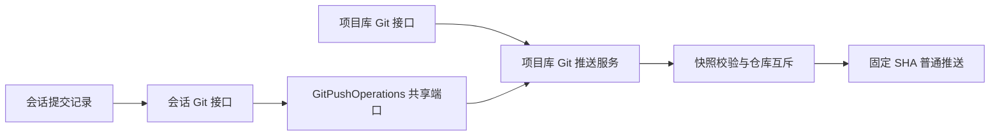

# 会话提交记录推送设计

## 对象与边界

主对象为会话工作目录下选定的 Git 仓库，身份由 sessionId 与直接子仓库名解析，不接受任意客户端路径或远端命令。用户点击确认推送当前分支截至预览 HEAD 的全部待推送提交；列表中某个提交的 diff 不代表只推送该单个提交。

复用项目库的 ProjectGitWorkspaceService，新增 common GitPushOperations 与脱敏 GitPushPreview 契约；项目库实现该端口。两入口的 canonical path 共用同一互斥表、快照 token、固定 SHA 和目标校验。tool-claude-chat 不依赖 tool-projects。全局排除政策在会话动作入口核对。

## 交互与产品原则

适用 OBJ-01、NAV-01、CTX-01、DENS-01、FEED-01、CTRL-01、IDEM-01，无例外。动作依附现有提交记录覆盖层，不增加导航或第二套仓库列表。先显示分支、目标及数量，点击推送后原位展开脱敏地址和确认动作。

加载失败提供刷新；不具备 upstream、detached、落后上游等状态显示已有恢复原因。失败及超时提示核对远端状态；自动刷新预览不自动重试推送。成功保留结果，即使后续刷新失败也不将推送成功改成失败。推送期间禁用重复动作、关闭、Escape、背景关闭和切仓；没有持久后台任务，不允许丢失唯一结果入口。固定 SHA 普通推送的重试不制造第二份提交，过期 token 拒绝。

覆盖层使用 Radix Dialog 提供焦点约束与 Escape 行为。桌面维持提交列表/详情，移动端操作行换行、长地址折行、限高滚动，关闭和末行按钮保持可达。测试用临时 bare 远端；浏览器使用模拟接口验证桌面、窄屏、失败和 pending，不向真实远端推送。

## 验证与上线

专项 Java 测试覆盖会话路径边界、全局排除与共享快照推送；前端覆盖确认、待完成、失败与切仓迟到响应。检查 TypeScript、前端构建、宿主装配与 OpenSpec。受管服务更新必须按 AGENTS.md 单独取得本次重启确认；旧服务质量门禁不作为新版验收。
