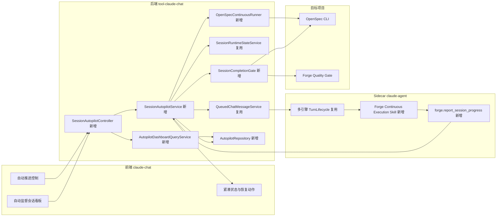
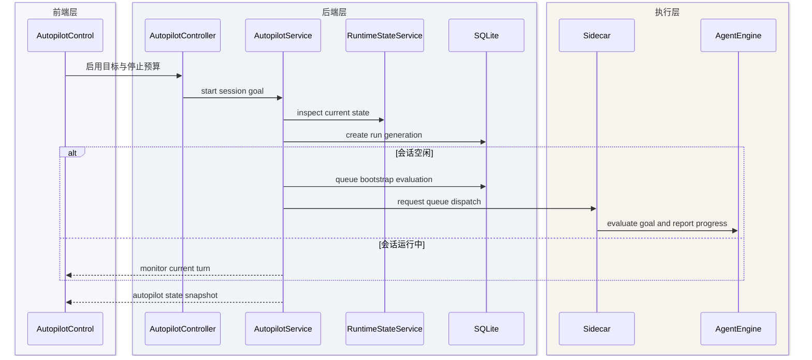
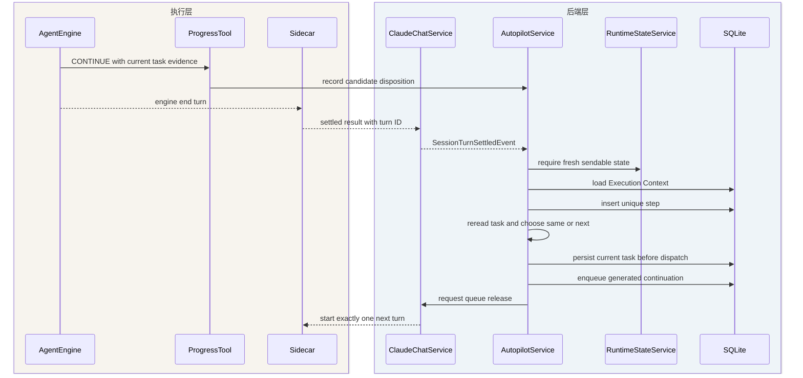
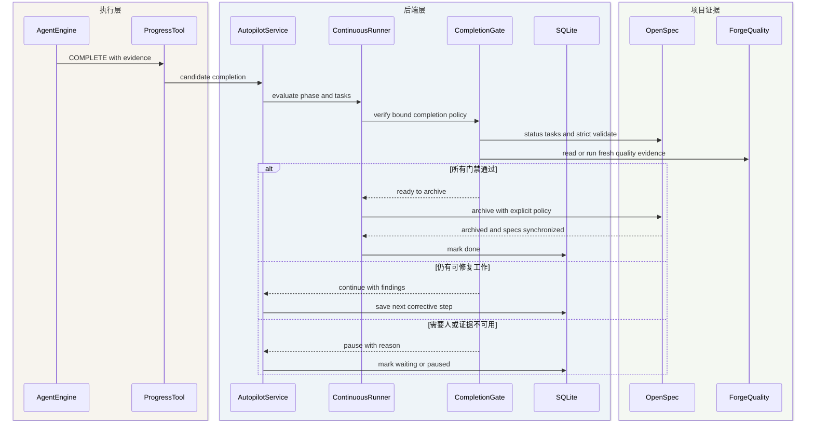
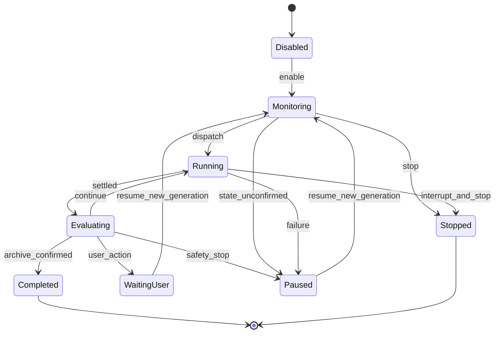
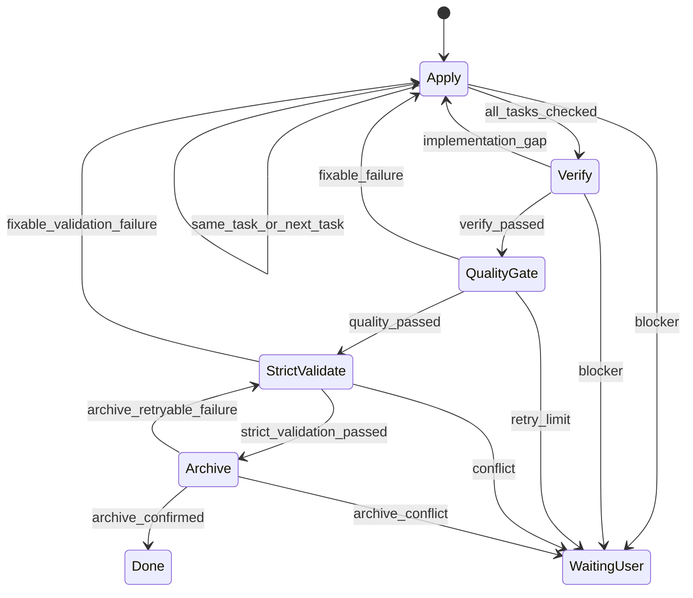

## Context

本设计实现 proposal 与 `session-autopilot` delta spec 中的会话自动推进能力。它是跨前端、Spring Boot、SQLite 和 Node Sidecar 的技术变更，按完整档处理。

当前可复用事实如下：

| 当前能力 | 代码证据 | 结论 |
|---|---|---|
| 成功终态释放持久队列 | `ClaudeChatService#completeTurn`、`#dispatchNextQueuedMessage` | 已有安全发送门禁可复用，但现有队列没有目标完成判定 |
| 聚合会话真实状态 | `SessionRuntimeStateService#assess`、`#canReleaseQueue` | 已能拒绝状态过期、Sidecar 不可达和跨层状态不一致 |
| Sidecar 完整收口后发布结果 | `Session#runTurn` 在 `TurnLifecycle.finish` 后发布 settled result | 自动推进必须消费 settled result，不消费原始引擎 `end_turn` |
| 多引擎终态归一 | `codexEngine.ts` 与 `codexAppServer.ts` 将 Codex 终态归一为 result | Claude 与 Codex 可共用上层监督状态机 |
| 前端运行态和待确认态 | `useClaudeChatSocket.ts` 消费 result、pending 和 backgroundTasks | UI 可展示状态，但不能作为离线调度器 |
| OpenSpec 项目探测 | `OpenSpecProjectService` 与 `OpenSpecCliGateway` | 可扩展为绑定 change 的只读完成证据提供者 |
| OpenSpec Skill 初始化检查 | `BusinessOpenSpecService` 检测 Claude 与 Codex 的 `openspec-*` Skill | 当前只确认 OpenSpec 基础 Skill，没有 Forge 连续执行 Skill，也没有会话到 change/current task 的持久绑定 |

Graphify 查询于 2026-09-02 用于定位上述链路；`useClaudeChatSocket.ts`、`ClaudeChatService.java`、`sessionManager.ts` 和 `codexEngine.ts` 当时存在工作区修改，因此最终判断以本次定向源码读取为准，不把旧图谱提升为运行事实。

外部实践也支持事件驱动、显式停止原因和确定性工作流状态：Claude 文档将 session 的 `idle`、`running` 与 `terminated` 分离，并要求调用方根据 `stop_reason` 决定继续、重试或暂停；OpenSpec 官方工作流把 apply、verify 和 archive 作为不同阶段，CLI 提供 status、instructions 和可回滚 archive，而不是把 Agent 一次自然语言回复当作 change 完成。参考 [Claude session operations](https://platform.claude.com/docs/en/managed-agents/session-operations)、[Claude stop reasons](https://platform.claude.com/docs/en/build-with-claude/handling-stop-reasons)、[OpenSpec workflows](https://github.com/Fission-AI/OpenSpec/blob/main/docs/workflows.md) 与 [OpenSpec CLI](https://github.com/Fission-AI/OpenSpec/blob/main/docs/cli.md)。

---

## Goals / Non-Goals

**Goals:**

- 在浏览器关闭后继续监督一个用户明确启用的标准开发会话。
- 将“本轮结束”与“目标完成”拆成不同协议，并以可验证门禁决定是否继续。
- 复用已有状态聚合、Sidecar、多引擎和持久队列，不建立通用调度平台。
- 让每次自动继续都幂等、可回放、可解释且可由用户接管。
- 对绑定 OpenSpec change 的运行提供严格完成证据。
- 让 Forge 显式持有会话到 change/current task 的执行身份，并在当前会话和监督看板中可见。
- 以 Agent Skill 降低提前结束概率，以 Forge Runtime 对提前结束做确定性恢复。

**Non-Goals:**

- 不支持跨会话工作图、多 Agent 项目调度或定时任务产品化。
- 不自动提升权限、不回答用户问题、不输入凭据、不自动提交、推送、合并或发布。
- 不把模型自然语言中的“已完成”作为机器契约。
- 不通过自然语言分析推断 current task、next task 或 change 完成状态。
- 不复制 OpenSpec task 清单为第二份 YAML/JSON 权威数据。
- 不保证非 OpenSpec 目标拥有与严格 OpenSpec 模式同等级别的完成证明。

---

## Architecture and Decisions

### Overall architecture

### Decision 1: server-side supervisor instead of a frontend timer

`SessionAutopilotService` owns the state machine and persists every transition. `ClaudeChatService` publishes a narrow `SessionTurnSettledEvent` after the authoritative result has been accepted; the supervisor evaluates it asynchronously and may add one internal continuation to the existing persistent queue. A bounded reconciler runs on application start and at a low fixed delay only while active runs exist.

This keeps browser reconnects, tab closure and HMR out of the correctness path. The alternative of a React interval calling `send("继续")` was rejected because it loses ownership on page close and races with pending questions, user messages and duplicated WebSocket events.

### Decision 2: structured progress tool instead of parsing assistant text

Extend the existing session-bound `forge` MCP surface for both Claude and Codex with `report_session_progress`. The tool receives only disposition data:

- `disposition`: `CONTINUE`, `COMPLETE`, `WAITING_USER`, `BLOCKED` or `FAILED`.
- `summary`: progress made in this turn.
- `nextAction`: required for `CONTINUE`.
- `remainingWork`: stable, concise unfinished work items.
- `evidence`: commands, artifact paths or checks supporting completion.
- `reason`: required for a paused or failed disposition.

Session ID, active run ID, generation and turn ID are bound by the server-side MCP configuration and MUST NOT be trusted from model input. The tool only records a candidate disposition; it cannot start another turn or mark a run complete by itself. It is safe to call without a separate permission prompt because it only records local orchestration metadata and grants no execution capability.

The alternative of requiring a suffix such as `[DONE]` was rejected because Markdown, quoted source and model prose make it ambiguous. A second LLM judge is deferred because it doubles cost and still cannot independently prove build or OpenSpec state.

### Decision 3: deterministic gates before every automatic turn

The supervisor may queue a continuation only when all of these facts hold:

1. The run is `ACTIVE` and the generation still matches.
2. The preceding turn has a successful settled result and has not been handled before.
3. `SessionRuntimeStateService` reports a fresh, consistent, sendable state.
4. There is no pending question, permission request, background task or user-authored queued message.
5. Strict OpenSpec mode resolves an executable same-task, next-task or phase action from authoritative project state; general mode requires `CONTINUE` with a non-empty next action.
6. The next step remains inside the turn and time budgets and does not trip no-progress detection.

The continuation is saved with an ID derived from run, generation and predecessor turn. A unique step record makes terminal replay and restart idempotent. User-authored input has priority: manual send, steer or enqueue first pauses the active run with `USER_TAKEOVER`.

### Decision 4: completion policy follows available evidence

The first version supports one completion policy:

| Policy | Selection | Completion evidence |
|---|---|---|
| `OPEN_SPEC_STRICT` | Default when the user binds a project root and change | Change exists; all tasks are complete; implementation verify passes; fresh Forge Quality Gate evidence passes; strict validation succeeds; authorized archive is confirmed |

If a strict project has no usable verifier, the run pauses as `VERIFIER_UNAVAILABLE` instead of silently downgrading. A quality result is reusable only when its project path, Git HEAD and working-tree fingerprint still match.

### Decision 5: separate current state from append-only step evidence

Add two claude-chat-owned SQLite structures through the existing idempotent startup schema:

| Structure | Responsibility | Key constraints |
|---|---|---|
| `claude_chat_autopilot_run` | Current goal, policy, limits, Execution Context, phase, generation, counters, deadline and latest reason | One current row per session; explicit project/change/current task; optimistic version for control races |
| `claude_chat_autopilot_step` | One row per observed turn and disposition, including message ID, evidence and fingerprints | Unique run ID plus generation plus predecessor turn ID |

No credentials, raw tool results or complete transcripts are stored. Evidence is bounded and sanitized. Existing queue rows remain the delivery mechanism, avoiding a second message scheduler.

### Decision 6: narrow interfaces and one-way dependencies

- Presentation: `SessionAutopilotController` exposes read, configure and state-action endpoints; WebSocket adds a replace-semantics `autopilotState` snapshot.
- Application: `SessionAutopilotService` owns use-case orchestration; `SessionAutopilotReconciler` only finds recoverable runs and delegates decisions.
- Domain: `SessionAutopilotRun`, `AutopilotState`, `AutopilotDisposition` and transition rules contain invariants without Spring or JDBC types.
- Infrastructure: `SessionAutopilotRepository` persists run and step data; `OpenSpecCompletionEvidenceProvider` and `ForgeQualityEvidenceProvider` adapt external checks.
- Existing `ClaudeChatService` publishes settled-turn facts and exposes a focused request to release a queued continuation; it does not absorb completion rules.

The frontend feature continues importing only shared UI primitives and its own claude-chat public surface. No tool module queries another tool's tables.

### Decision 7: the supervision dashboard is a bounded read model

The “自动监督会话看板” is a first-class claude-chat work view, addressed as `/tools/claude-chat?view=supervision`, rather than another card inside the existing session drawer. The drawer remains optimized for navigating all conversations; the dashboard is optimized for supervising only autopilot runs and recovering exceptional ones. Opening a row navigates to the existing session URL and preserves the normal session runtime.

`AutopilotDashboardQueryService` returns one server-side projection that combines the current autopilot run with the minimum session metadata required by the board. The frontend MUST NOT call the per-session autopilot or runtime-state endpoints once per listed row. The query applies the current-user session access policy before projection, uses cursor pagination, and returns aggregate counts plus a snapshot timestamp.

The authoritative data path is REST. After an autopilot transition, the existing authenticated chat WebSocket emits a lightweight `autopilotDashboardChanged` revision hint; visible dashboard clients invalidate and refetch their query. A low-frequency visibility-aware refetch is retained only as reconnect fallback, not as the scheduler. This avoids introducing another SSE channel or general notification infrastructure.

The initial read model is supported by an index over current run state and update time. Query performance remains runtime evidence: repository integration tests MUST cover pagination and access filtering, and a representative SQLite query-plan or latency check MUST run before the endpoint is reported as verified.

### Decision 8: persist an explicit Execution Context, not a guessed association

Enabling strict OpenSpec supervision requires an explicit binding selected from `openspec list --json` under the session's validated project root. `SessionAutopilotService` persists the following identity as one versioned Execution Context:

| Field | Source and role |
|---|---|
| `sessionId` | Existing Forge session identity; ownership and navigation anchor |
| `projectRoot` and `repositoryIdentity` | Canonical validated path and repository identity used for every OpenSpec command |
| `branchAtStart` and `workspaceFingerprint` | Drift detection and verification evidence binding; not treated as permanent branch truth |
| `changeId` and `changeRevision` | Explicitly selected active change plus a fingerprint of its current planning inputs |
| `currentTaskId` and `currentTaskOrdinal` | Human checklist key such as `6.4` plus the OpenSpec apply-list ordinal; written with change revision before dispatch and cleared only after rereading evidence that the task is checked |
| `phase` | `APPLY`, `VERIFY`, `QUALITY_GATE`, `STRICT_VALIDATE`, `ARCHIVE` or `DONE` |
| `agentSessionRef` | Existing engine session reference used to resume the same Claude or Codex context |
| `generation` and `version` | Reject stale callbacks and concurrent control updates |

The current task is never inferred from assistant prose. If the current task remains unchecked after a settled turn and no allowed blocker exists, the runner resumes that same task. Only after rereading OpenSpec and observing it checked does Forge clear it and select another task. A project, branch, change deletion or unexpected change revision drift pauses as `EXECUTION_CONTEXT_DRIFT` with rebind or stop actions.

The DB is authoritative. A `.forge/runtime/openspec-session.json` mirror is deliberately not part of the first version because it creates a second writable state source and cross-tab/restart races. A later read-only diagnostic export may be added without participating in decisions.

### Decision 9: two independent continuation layers share one contract

Layer 1 is a Forge-managed, versioned `forge-openspec-continuous-execution` Skill activated for both Claude and Codex when a strict run starts. It receives the bound change, current task, phase, stop budget and Done Condition from code. The Skill requires the Agent to continue all locally executable steps, reread OpenSpec after each task, avoid final-completion language while work remains, and call `report_session_progress` before yielding. Capability discovery records whether the expected Skill version was actually loaded; prompt text alone is not reported as successful activation.

Forge owns one canonical Skill asset in `tool-claude-chat` resources and provisions managed copies to the target project's Claude and Codex project-skill locations. It never edits OpenSpec-generated `openspec-*` Skills. Provisioning writes atomically and only replaces a copy carrying Forge ownership metadata; a user-owned name collision pauses setup instead of overwriting it. The Sidecar reports the loaded Skill path, version and content fingerprint so the Runtime can distinguish “file written” from “engine actually loaded”.

Layer 2 is `OpenSpecContinuousRunner` in Forge Runtime. It does not trust Skill compliance or parse the final answer. On every authoritative settled-turn event it loads the persisted Execution Context, calls OpenSpec through bounded argv-based commands, compares current task and phase evidence, and deterministically chooses `RESUME_SAME_TASK`, `DISPATCH_NEXT_TASK`, `ADVANCE_PHASE`, `WAITING_USER`, `PAUSE_SAFETY` or `DONE`. An engine `end_turn` while work remains is therefore a turn boundary, not a run boundary.

The two layers are intentionally redundant but not co-authoritative: the Skill improves in-turn continuity and evidence quality; only Runtime may mutate the run state, dispatch the next turn or declare `DONE`. If the Agent omits or contradicts its progress report, Runtime follows OpenSpec and runtime evidence, records `SKILL_CONTRACT_VIOLATION`, and continues or pauses according to deterministic gates.

### Decision 10: OpenSpec remains the task source of truth

Forge obtains current operation context from `openspec status` and `openspec instructions apply --json`, then reads the bound `tasks.md` path returned by OpenSpec. Current CLI output uses an apply-list ordinal while the checkbox text carries the human task key such as `6.4`; the adapter preserves both and binds them to `changeRevision` so task insertion cannot silently retarget an in-flight run. Forge stores only that dispatched identity, attempt and observed checkbox snapshot for audit. It does not create a parallel `tasks.yaml` because OpenSpec generation, verification and archive would not update that file atomically.

The initial selector is deterministic: resume an unchecked `currentTaskId`; otherwise choose the first unchecked task in OpenSpec apply order. OpenSpec task-generation guidance already requires dependency order. If a future OpenSpec version exposes machine-readable dependency metadata, the selector can consume it through an adapter; until then Forge does not invent dependencies from text or silently skip an earlier pending task. A genuine dependency blocker is reported structurally and enters `WAITING_USER` or a bounded corrective run.

---

## Key Interactions

### Enable and establish the first structured outcome

When enabled on an already-running turn, that turn did not receive the progress-tool instruction. A successful terminal without a report therefore permits exactly one bootstrap evaluation turn. After that, a missing report records a Skill contract violation and resumes the same authoritative task only within the retry budget; repeated missing evidence pauses with `OUTCOME_MISSING`.

### Continue after a settled turn

The engine receives the full goal, bound change, phase, current task, last progress, remaining work, next action and a requirement to call the progress tool once. The visible message uses the existing `displayText` field to show a restrained label such as “自动推进 3/8 · task 6.4 · 运行专项测试”, so the transcript remains auditable without exposing orchestration boilerplate. If the Agent ends with text such as “下一阶段可以继续 6.4” while task 6.4 is unchecked, the turn remains visible but is labeled as an intermediate settled turn and Runtime resumes task 6.4.

### Complete or pause safely

---

## State Model and Contracts

### Run state machine

Resume creates a new generation while preserving the same run audit history. That makes a user-authorized budget increase explicit and prevents a stale callback from an older generation from restarting work.

### OpenSpec phase machine

For `OPEN_SPEC_STRICT`, only `Done` permits the final completion response. Archive is authorized as part of the user's explicit autopilot start configuration and runs only after all prior barriers pass. If auto-archive was not authorized, the run stops at `WAITING_USER` with `ARCHIVE_APPROVAL_REQUIRED`; it does not mislabel “ready to archive” as complete.

### HTTP and WebSocket surface

The implementation adds the following contract shapes without changing the existing send protocol:

| Method | Path | Purpose |
|---|---|---|
| `GET` | `/api/claude-chat/autopilot/runs?scope={active|attention|paused|recent}&query=&cursor=&limit=` | Read bounded cross-session dashboard counts and rows without per-session fan-out |
| `GET` | `/api/claude-chat/sessions/{sessionId}/openspec/changes` | List validated active changes and binding previews for the session project |
| `GET` | `/api/claude-chat/sessions/{sessionId}/autopilot` | Read configuration, Execution Context, bound specs, current task, phase, budget use, evidence level and recovery actions |
| `PUT` | `/api/claude-chat/sessions/{sessionId}/autopilot` | Start a new run or replace configuration while no run is active, including explicit project/change binding and archive policy |
| `POST` | `/api/claude-chat/sessions/{sessionId}/autopilot/actions` | Apply `PAUSE`, `RESUME` or `STOP` with optimistic version checking |

The existing WebSocket server adds per-session `autopilotState` with replace semantics and global `autopilotDashboardChanged` revision hints. REST remains authoritative for reads and control so reconnecting tabs can recover from snapshots. Requests use the existing application authentication and session ownership rules; the public review and consult channels cannot read or control automatic development execution.

### Supervision dashboard information hierarchy

The default scope is `active`, meaning `MONITORING`, `RUNNING` and `EVALUATING`. A compact count strip exposes `监督中`, `待处理` and `已暂停`; `WAITING_USER` and safety or recovery pauses with a user action are grouped under `attention`. Recently completed or stopped runs are available through `recent` but never inflate the active count.

Desktop uses a dense row-oriented table rather than a grid of cards. Each row prioritizes session title and project, engine, bound OpenSpec change or target summary, current phase, automatic-turn and elapsed-time budget, latest progress, last activity time and attention reason. Row actions are limited to “进入会话” plus state-valid pause, resume or stop actions. Mobile collapses the same fields into a two-line list with secondary detail disclosure; it does not hide the state, budget or recovery action.

The board provides server-backed text search and scope filtering. An empty active scope explains that no session is currently supervised and offers navigation to the conversation list. A failed or stale snapshot keeps the last successful rows visible when available, marks the snapshot time, and offers retry. Mutation conflicts discard optimistic state and refetch the affected row so two tabs cannot silently overwrite a newer generation.

### Current session binding presentation

The conversation header uses one quiet inline status: `OpenSpec · <change> · <task or phase>`. It does not add another large card to the transcript. Activating it opens a focused detail panel with project, branch snapshot, change, affected delta-spec capabilities and files, current task title, checked/total task count, current phase, Skill activation version, Runtime supervision state, last refresh and any drift reason.

The bound spec list is resolved from the selected change and returned by the server as sanitized repository-relative paths. The UI can reveal a local file through the existing session file capability but does not construct or trust arbitrary absolute paths. No binding shows “未绑定 OpenSpec” with an action to select an active change; unreadable or drifted bindings preserve the last snapshot, show that it is stale, and offer rebind, retry or stop.

### Default limits

- Maximum automatic turns: 8.
- Maximum elapsed time: 4 hours.
- No-progress stop: 3 consecutive identical progress and next-action fingerprints.
- Premature-settled or fix retry stop: 3 consecutive attempts for the same task or failing barrier without new evidence.
- At most one bootstrap outcome-evaluation turn.
- Evidence and reason fields are length-limited before persistence and broadcast.
- Strict mode presents `AUTO_AFTER_BARRIERS` as the visible default archive policy before enable; opting out changes the terminal pre-archive state to `ARCHIVE_APPROVAL_REQUIRED`.

Users may choose smaller values before or during a run. Increasing a limit requires a paused run and explicit resume, which creates a new generation.

---

## Risks / Trade-offs

- **A model can incorrectly report completion** -> Strict OpenSpec mode independently checks change presence, remaining tasks, strict validation and fresh quality evidence.
- **Automatic continuation can repeat destructive work** -> Existing permission boundaries remain authoritative, every predecessor turn is unique, and replay cannot create a second continuation. The continuation prompt instructs the Agent to inspect existing evidence before changing state.
- **A restart can duplicate a message** -> Persist the step before queue dispatch and use a deterministic message ID; recovery reconciles the stored turn ID and runtime state before release.
- **Manual and automatic inputs can race** -> Manual input atomically pauses the run before normal send or queue admission; stale-generation callbacks are ignored.
- **Verification can be expensive** -> Reuse only fingerprint-matching successful evidence; otherwise run verification once at a `COMPLETE` candidate, not after every turn.
- **OpenSpec tasks can be dishonestly checked** -> Strict validation and project verification reduce but do not eliminate this risk; stored command summaries and fingerprints make the evidence reviewable.
- **Background jobs may never clear** -> Existing background task snapshots block continuation; time limits eventually pause with a recovery action.
- **Adding a local reconciler resembles general scheduling infrastructure** -> Scope it to active autopilot rows inside tool-claude-chat and do not expose cron or generic job APIs.
- **More protocol surface across Java and Node** -> Use a versioned progress payload and capability detection; enabling is rejected if the connected Sidecar lacks the reporter.
- **A dashboard can create N+1 runtime checks or unbounded scans** -> Build a bounded server-side projection over indexed current-run state, paginate with a cursor, and never fan out per-session runtime requests from React.
- **A dashboard event can be lost during disconnect** -> Treat WebSocket messages only as invalidation hints; REST snapshot timestamps and visibility-aware fallback refetch restore convergence.
- **The Skill can be ignored or unavailable** -> Capability-check its version, treat its report as untrusted input, and let Runtime independently reread OpenSpec and continue or pause.
- **Provisioning a project Skill can overwrite user content** -> Use a separate Forge namespace, atomic writes and ownership metadata; never replace an unowned collision or an OpenSpec-generated Skill.
- **Forge can select the wrong task after a turn** -> Persist current task before dispatch and resume it until OpenSpec proves it checked; never derive task identity from assistant text.
- **A parallel task manifest can drift from OpenSpec** -> Do not create one; keep task truth in OpenSpec and persist only execution identity plus audit snapshots.
- **Branch or change files can move during a run** -> Fingerprint Execution Context and pause on drift instead of running commands against a newly inferred location.
- **Automatic archive can merge specs unexpectedly** -> Capture archive authorization when enabling, require every prior barrier, use OpenSpec's validating rollback-capable archive command, and pause on conflicts.

---

## Migration Plan and Open Questions

### Migration plan

1. Add domain transition and Execution Context tests plus idempotent SQLite structures without enabling any run.
2. Add and version the Forge continuous execution Skill for Claude and Codex, then expose actual activation in capability snapshots.
3. Add the Sidecar progress tool and protocol tests for Claude SDK, Codex SDK fallback and Codex App Server.
4. Add backend repository, OpenSpec task adapter, phase runner, completion evidence providers, supervisor, recovery reconciler and API tests.
5. Wire settled-turn events and manual-takeover hooks into `ClaudeChatService`; preserve existing user queue behavior when no run is active.
6. Add the compact frontend control, binding detail panel, state strip and `/tools/claude-chat?view=supervision` dashboard, including narrow-screen and keyboard interaction tests.
7. Add representative dashboard pagination, access-filtering and SQLite query-performance verification before treating the aggregate endpoint as verified.
8. Run focused Node, Java and React tests, then frontend typecheck/build, the module build, OpenSpec strict validation and Forge Quality Gate.
9. Keep all existing sessions disabled by default; enable only through the new explicit user action.

### Rollback

Set the autopilot feature property off, transition active runs to `PAUSED`, and remove UI entry points before reverting runtime wiring. The new tables can remain because no existing query depends on them; the existing send, pending-decision and persistent queue flows continue unchanged.

### Open questions

No blocking questions remain for the first version. Cost-denominated budgets and an independent evaluator can be considered later after engine usage fields are normalized; neither is required for the bounded, user-controlled first release.
