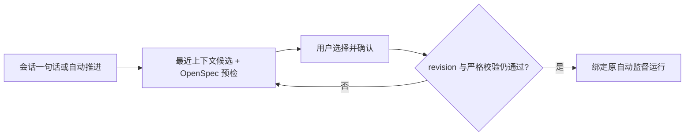

# Design

主对象是当前开发会话，绑定目标是该项目内唯一 OpenSpec change ID。适用 OBJ-01、NAV-01、CTX-01、FEED-01、AI-01、EVID-01、CTRL-01、IDEM-01：沿用会话顶部动作，通过受控弹层选择，不增加导航或平行规格列表。

“推进”页签总览用户可访问且规划未锁定的受监督会话，按全部、监督中、待处理、暂停和最近结束筛选。当前会话最近文本匹配到同项目 change ID 时，只给对应运行标记“推荐”并在当前页提前排列；这只是定位线索，不改变服务端任务顺序或自动启动。点击运行切到该运行所属会话的推进详情，显示原运行记录的目标、状态、阶段、预算、最新报告以及 OpenSpec 实时任务清单；详情可返回全部。旧全局“监督”入口只作为该页签的快捷入口，旧深链接保持兼容。未绑定时展示回到对话发起绑定的恢复动作。任务读取失败保留运行摘要与重试入口；移动端列表每条只显示单行会话名、进度和状态，完整原因与控制操作在详情可见，整个面板可滚动，页签与控制支持键盘焦点。复用同一查询键和现有暂停、恢复、停止接口，不生成独立推进会话。

规划已过期而锁定的会话不进入看板查询；在 SQL 筛选时排除，避免占据分页位置或计入状态数量。解锁后仍读取同一运行记录。这里仅调整浏览列表，不修改自动监督执行状态或历史。

输入一句明确的推进命令或点击“自动推进”后，前端请求候选。服务端读取该会话最近 30 条用户/助手文本及标题，只对 OpenSpec ID 做确定性相关性排序；相关性是推荐线索，不是语义正确性的证明。列表最多展示 10 个候选；选中时才读取任务并运行 strict validation，失败原因可见且禁用确认。用户可重新探索、切换候选、编辑目标和归档选项。

当前 OpenSpec CLI 的 `list --json` 不提供分页。Forge 提供自己的只读 change 目录查询接口：在会话所属仓库内定位最近的 `openspec/changes`，仅读取活动 change 目录名和本页 `tasks.md` 进度，支持关键词、offset 和 limit；自动推进只取最近上下文相关的前 10 项。目录进度仅供定位展示，不是规格有效性或完成证据。选中和启动时仍由 OpenSpec CLI 读取任务、执行 strict validation 并复核 revision。目录读取失败应显示错误，不得呈现成“没有活动规格”或引导创建重复 change。HTTP 不推送 CLI 的完整列表。

候选为空或所选规格未通过预检时，弹层主动说明缺口并询问是否补齐。用户确认后，当前会话发送仅补齐 OpenSpec 的指令；Agent 核对最近上下文、现有规格和任务，补齐并严格校验，遇到不可推断的业务歧义仍等待用户。该轮结束后自动重新探索并预检：只有唯一且可绑定的候选才自动启动监督；存在多个候选或预检仍未通过时保留选择弹层，让用户决定或继续修正。补齐阶段不执行代码任务，避免与自动监督重复执行。适用 FEED-01、AI-01、EVID-01、CTRL-01、IDEM-01。

确认时提交 change ID 与预览的 revision。启动端再次读取 tasks、复核 revision 和 strict validation，再写入原有运行记录并派发。规格变化、无待执行 task、校验失败时拒绝启动并保留弹层和草稿；已在监督相同 change 的会话复用运行状态，其他活动绑定拒绝替换。关闭弹层恢复原触发点，键盘焦点由 Radix Dialog 管理；移动端使用相同顶部入口及可滚动弹层。执行后仍由原 Forge Runtime 与 Continuous Execution Skill 监督。

自动监督绑定与 Sidecar 的代码写入执行绑定分开：前者由会话和已确认的 change、阶段、预算唯一确定，后者按具体文件范围和影响评估取得写入权。适用 AI-01、EVID-01、CTRL-01。Runtime 从持久运行记录向 Agent 注入 run ID、change、阶段和 task；Sidecar `session_init.execution` 为空只表示写入执行尚未建立，工具自身也说明此边界。续跑时应复用当前 change，先只读定位精确文件范围，再走 `resolve_execution_context`、`discover_execution`、`assess_execution`；取得许可后才改文件。门禁拒绝或证据不足时向 Runtime 上报具体原因并暂停，不允许把空写入绑定解释为“没有监督任务”，也不允许跳过写入门禁。恢复暂停运行时重新部署 Forge 拥有的 Skill 并更新指纹，避免旧指令继续生效。原会话仍是唯一对象，不增加页面或用户选择步骤；运行状态与恢复动作继续由既有推进页签显示（CTX-01、FEED-01、IDEM-01）。

源码、构建和测试可以先验证；新版本后端运行验收遵守仓库的逐次重启确认规则。

## 会话语义推荐与多规格批次

自动监督的外部验证阻塞按 FEED-01、EVID-01、CTRL-01 处理：Agent 将尚未执行的 MySQL/MariaDB 实测列入 `remainingWork`，保留当前 OpenSpec task 未勾选，继续同一任务内可独立完成的代码、静态检查与打包。只有没有可执行步骤或需要用户决策时进入 `WAITING_USER`。若同一活动轮次后来找到明确下一步，且状态快照确认无待用户决策，结构化 `CONTINUE` 可把运行恢复到 `ACTIVE` 并保留未验证证据；其他状态冲突返回 409，附当前版本及既有 resume 入口。Sidecar 写入范围冲突保留门禁，同时返回占用会话、执行 ID 和范围；本会话旧绑定需审计中止，工作文件不自动删除。该边界不授予额外写入权，也不证明数据库 SQL 已通过。

受监督任务的执行 Skill 和 Runtime handoff 要求避开 Docker、WSL 和隐式 Testcontainers 测试；Claude SDK 工具授权及 Forge 验证入口额外拒绝显式容器命令（AI-01、CTRL-01）。Codex App Server 完全访问模式的命令不都经过授权回调，间接启动容器的脚本也不能仅凭命令文本拦截，故项目容器测试需默认跳过、显式启用。主对象仍是原受监督会话，不新增用户操作或页面（OBJ-01、NAV-01）；拒绝时返回可见原因，用户仍可在原任务继续 H2 或独立测试库验证（FEED-01、CTX-01）。刷新和续跑复用同一持久 run ID、每轮重新注入约束，不产生新任务（IDEM-01）。此改动不影响弹层焦点或窄屏布局；专项测试覆盖显式拒绝与非容器命令放行，运行验收须在获准重启后完成。优先使用项目已有 H2 MySQL 模式检查兼容的迁移脚本与接线，同时记录 H2 与目标库各自的证据边界；OpenSpec 若仍要求 MySQL/MariaDB，任务继续未完成，除非规格负责人明确修改验收条件。已确认 Yoooni One 的 V091 可由 H2 MySQL 模式直接执行，但其结果不能推定目标库通过（EVID-01）。

主对象仍是当前会话（OBJ-01、NAV-01、CTX-01）。目录候选先返回，独立的只读一次性 Agent 依据最近会话和最多 30 个现有 change 的 proposal 摘要运行 `forge-openspec-spec-recommendation` Skill；返回的 ID 必须属于该目录，最多五项。AI 查询失败或超时仅失去推荐排序，不阻断人工选择。AI 不执行规格、不修改文件；候选真实身份、任务和严格校验仍由 Forge/OpenSpec 裁决（AI-01、EVID-01）。

弹层支持勾选多个 change，按勾选顺序显示已选数量；不另建导航。每个选中项独立预检，所有 revision、待执行任务和 strict validation 均通过后才允许确认。确认时服务端重新核对全部项并一次写入同会话批次、各项确认时的 revision 与首个运行；任何一项变化则整体拒绝且保留草稿（FEED-01、IDEM-01）。既有单规格请求兼容。批次共用原运行的轮次和时间预算；默认轮次按每项 60 轮累计并限制到 200，默认时间按每项 8 小时累计并限制到 24 小时，显式设置仍优先。当前项完成并归档后再预检下一项、复核当初确认的 revision、更新持久索引并派发；下一项不合格或修订变化时保留批次，停在待处理，不跳过或误报整体完成。恢复仍按当前 change 读取状态；用户可从顶部看到当前第几项。批次按顺序执行，避免同一会话多个运行互相覆盖。

弹层关闭恢复触发器；候选先显示，AI 排序异步更新，用户手动勾选后不覆盖选择。窄屏内容区滚动，确认栏可达。验证包括推荐失败降级、多选全部预检、启动前修订漂移、完成切换、刷新后批次索引和原单规格兼容。

批次遇到真实前置依赖时按 FEED-01、EVID-01、CTRL-01 暂留当前项的问题，不把它标记完成，也不允许 Agent 自行切换 change 或混合提交。Runtime 只在成功终态后检查尚未暂留的已选规格，逐项复核确认时的 revision、待执行任务与 strict validation；有合格项时事务性调整批次顺序、保存待回复原因并派发，全部待处理时停止续跑。被暂留项重新轮到时保持 `WAITING_USER`，用户在原会话回复并恢复运行后复核原项。待回复原因在原推进详情渐进显示，不增加导航或弹层；手机端自动换行，键盘和焦点行为沿用详情（OBJ-01、NAV-01、CTX-01、IDEM-01）。此机制只重排用户已确认的批次，不跨规格授予写入权，不代替人工确定业务歧义；缺失的 V090 前置提交仍须在其合法写入范围内独立完成。验证覆盖持久顺序、预检失败跳过、待回复回访及重复 settled 幂等。
