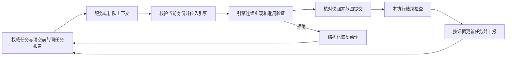

# 任务检查点与隔离交付

## 控制点

复用执行记录、项目控制及监督报告，不新增状态库。适用产品原则 OBJ-01、AI-01、EVID-01、CTRL-01、IDEM-01，无 UI 入口和覆盖层变化。

### 提交与结束分离

普通 BEFORE_COMMIT 保留全暂存区检查，防止无范围的 Git 提交混入他人文件。新增 commit_execution：先核对会话、执行、HEAD、范围指纹和真实验证；只暂存本执行变化，以 git commit --only 提交，其他暂存内容保留。使用现有 Git 身份和 hooks，不传跳过 hooks 选项、不推送。

提交前取得验证输入的 Git blob；提交后核对父提交、实际变更路径和输入 blob，同时重查执行与工作区验证指纹。Hook 拒绝保持失败；Hook 改写或并发改变结果时明确 COMMIT_RESULT_UNCERTAIN，保留现场，禁止盲目重试。成功记录请求摘要和提交 SHA，同请求重复返回原结果。Git 调用不持有 Forge 存储锁，避免 hooks 回调死锁；Git 自身负责提交索引/引用互斥。提交命令有 120 秒上限、取消信号与 10 秒进度通知；MCP 使用受限长调用预算，普通工具超时不放宽。输入 blob 以批量索引/树读取，避免逐文件启动 Git。

STOP、回收及 finish 不再以全仓暂存清单代表当前执行成果；仍验证本执行证据、相关暂存一致性、真实范围提交和干净范围。普通提交边界保持严格。外部 hooks 若另有独立全仓规则仍须协调，不绕过它们。

### 明确的规格依赖

discover_execution 与 resolve_specs 可提交非空 specDependencies，含共享权限、状态等正式规格路径；这份列表属于具名影响审阅，不由关键词自动认定完整。记录各文件摘要（包括尚不存在的目标路径），相关文件修改、删除或出现均使证据失效。所引用正式规格和确认 capability 必须包含在清单内，执行增补不能收缩已登记依赖。

未登记依赖的旧记录保持原全局基线。迁移通过原会话 discover/assess update 或 resolve/confirm，保留审计，不能手改内部文件。无关正式规格更新不使已登记且未变化的依赖失效；索引结构与 Delta 一致性仍校验。此能力不等于自动证明业务依赖完整，也不豁免相关新规则的审阅。

### 有界续跑

Runtime 从已有 latestSummary、remainingWork、evidence、nextAction 和当前权威任务投影 JSON 检查点。保留来源时间和“上轮报告、待核对归属”的标识，避免切换 task 后把上轮声明视为当前验收。字段限长、列表限项，截断和异常显式提示读取原记录。模型不能通过报告绕过任务勾选或门禁。

正常轮次结束先消费旧 disposition 并清空下一轮状态中的报告；生成交接时显式传入清空前的记录。只有同 run/session/project/repository/branch/workspace/change/revision/generation/phase/task（含 ordinal）的报告才带入，不继承旧 COMPLETE 判定。无报告照常交接当前权威验收，不虚构证据、不新增暂停。

排队消息增加只供服务器使用的 `server_context` 可空列，以保存生成时的检查点。公开队列不能使用 `autopilot:` ID 或写入该字段，JSON 不向客户端投影它。内部领取核对当前运行、会话、代次、任务、轮数及预算；旧消息无服务端上下文时从当前规格重建，绝不把旧客户端 `developerInstructions` 提升为控制指令。过期控制消息丢弃后由现有巡检重派，不能反复回到队首；发送失败仍保留原队列信息供恢复。幂等消息 ID 沿用 run/generation/phase/task/turn，不创建第二份运行；补列迁移成功前不启动监督巡检。

Java 将核验后的 Runtime 指令与既有项目上下文合入 `sessionContext`；Sidecar 普通编码路径只采纳该服务端字段，继续忽略客户端 `developerInstructions`。Codex 的 App Server 与 SDK 共用配置构建器，每轮保留已经筛选的上下文；受限咨询/评审路径仍使用自身策略，原生 thread 与 resume 不改变。

普通续跑消息明确 change、task 和验收摘要。引擎负责单轮内的连续编码、工具调用和必要验证，Forge 只在轮次结束后检查持久任务及派发下一步；不在每次编辑后重新指导或强制整套测试。已确认 Skill 的正常派发不再附大段通用恢复步骤，指定错误时才提供；取消常驻建议“先改 tasks 增加 VERIFY_GROUP”，保留显式登记的分组。检查点只投影数据，验证节奏在一处说明，不自动删测试或更改验收。

错误统一返回 recovery.category、nextTool、action、retry、automaticRetry=false。范围增补、规格重评估、验证补项与提交对账分别指向具体入口。恢复动作仍需满足原身份/版本/权限约束；这一版本提供恢复契约，不声称实现所有跨进程自动修复。

### 空闲续推与基础版收口

Forge 在引擎空闲、无待确认及后台工作时才恢复推进。先读取当前权威任务；开发项已结束时，复用真实收轮的状态保存与批次切换。空闲恢复保留轮数、不伪造收轮事件；门禁关闭保留未验证交接，门禁开启进入既有 VERIFY 阶段。巡检的纯决策入口不能运行质量门禁或归档，避免配置变化把低频轮询变成重复测试。

保存仍使用版本比较。成功后只删除此前捕获的旧内部队列 ID，再发布状态及必要的下一项消息；冲突时不清队列、不发布成功。用户消息及并发产生的新消息保留，多 change 沿原顺序和预检规则推进。若恢复期间重新开启门禁，下一规格进入待预检状态，巡检不代替开发者执行校验。

基础版以当前明确验收为边界：高频主流程可用、关键权限与数据正确、必要验证通过；合理划分扩展边界，可选增强后置，不预造框架或漏掉明确要求。默认直接完成当前任务，已有显式验证组仍可使用，无须为合并测试先编辑规格。执行 Skill 源资源更新为 1.0.11，由现有部署入口处理，未手改业务项目的生成文件。

## 验收与上线

测试覆盖其他任务已暂存、本执行提交/重试/结束、Git hook 拒绝、过期快照、依赖变化与旧记录、恢复字段、报告缺失/异常。依赖与 UI 无变化，使用受影响 Sidecar 与 Java 专项及项目质量门禁。新版服务需明确重启授权后验收；旧服务 HTTP PASS 不证明新路径上线。
