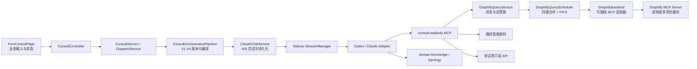

# 业务系统咨询（Fore Consult）

业务系统咨询不是一个独立聊天页，而是一条跨浏览器、Java、WebSocket、Sidecar、Coding Agent、MCP 和本地业务证据的只读咨询链路。本文件是模块开发与排障的稳定入口；专题细节继续维护在设计文档中，避免在 README 复制多份实现。

快速导航：[架构总览](#架构总览) · [核心对象](#核心对象与职责) · [一次咨询](#一次咨询如何执行) · [状态与安全](#状态与安全边界) · [Graphify](#graphify-常驻查询) · [故障经验](#历史故障经验) · [运行手册](#运行手册) · [经验登记](#后续经验如何登记)

## 架构总览



最重要的边界：前端和 Java 管业务事实，Sidecar 管 Agent 生命周期，Agent 只通过受控工具读证据；任何一层都不能用自己的局部状态替代全链路终态。

## 核心对象与职责

### 前端

- `frontend/src/features/fore-consult/pages/ForeConsultPage.tsx`：系统、模块、菜单、问题分类、咨询版本和当前咨询状态。
- `frontend/src/features/fore-consult/components/ConsultConversation.tsx`：底层开发会话的只读/受控展示，不得抢占 Vibe Coding 当前会话。
- `frontend/src/features/fore-consult/api.ts`：业务咨询 HTTP 契约。

### Java 业务模块

- `ConsultController`：咨询、追问、归档、附件和历史 API。
- `ConsultService`：咨询聚合与持久化门面。
- `ConsultDispatchService`：创建或复用底层 Agent 会话并发起一轮。
- `ConsultOrchestrationPipeline`：按版本执行标准、优化、生产备库和动态证据步骤。
- `ConsultEvidenceRouteService`：把跨系统候选转为已确认的会话级证据授权，不能只凭目录名扩大数据库范围。
- `ConsultAgentRunMetadataProvider` / `ConsultAgentRunCompletionListener`：把业务咨询元数据与 Agent 运行完成事件连接起来。
- `ConsultSessionRepository`、`ConsultTurnRepository`、`ConsultTurnTraceRepository`：咨询、轮次和运行轨迹事实。

### Claude Chat 与 Sidecar

- `tools/tool-claude-chat/.../ClaudeChatService.java`：Java 会话状态、WebSocket 命令、持久化与观察者广播。
- `sidecar/claude-agent/src/sessionManager.ts`：引擎会话、轮次、取消、工具和子 Agent 权威状态归约。
- `sidecar/claude-agent/src/codexSecurity.ts`：`consult-readonly` 工具策略与系统安全边界。
- `sidecar/claude-agent/src/readonlyMcp.ts`：源码、测试库和 ERP 备库 DDL 的短生命周期只读门面。
- `sidecar/claude-agent/src/graphifyRuntime.ts`：进程级查询服务、项目状态和本机 HTTP 协议。
- `sidecar/claude-agent/src/graphifyQueryScheduler.ts`：跨会话单并发 FIFO、同键合并和成功结果缓存。
- `sidecar/claude-agent/src/graphifyMcpBackend.ts`：官方 MCP/Python 生命周期适配器，可替换而不污染业务编排。

## 一次咨询如何执行

1. 前端提交系统、模块、菜单路径、问题和附件。
2. Java 保存咨询事实，分类问题并按选定版本构建编排上下文。
3. 证据路由冻结当前会话允许访问的业务系统；未确认候选不能自动变成权限。
4. `ConsultDispatchService` 发起底层 Agent 轮次，Java 只把“已送达 Sidecar”视为传输结果。
5. Sidecar 为咨询会话固定注入领域知识与 `consult-readonly`，不开放任意 Shell 或文件写入。
6. Agent 先查领域知识；需要实现证据时调用 `source_context`，再精确 `source_read`，最后才允许限定子目录 `source_search`。
7. 根 Agent 最终回复、最新 `agentsStates`、工具闭合和根 `turn/completed` 共同确认后，Sidecar 才上报权威终态。
8. Java 保存轮次、Trace 和结构化证据，前端解除输入门禁。

## 状态与安全边界

### 四层状态不可混用

| 层 | 权威事实 | 常见误判 |
|---|---|---|
| 浏览器 ↔ Java | HTTP/WS 是否连通、页面是否持有最新快照 | 页面有连接不等于 Agent 在运行 |
| Java ↔ Sidecar | 命令是否送达、Sidecar 是否报告终态 | WebSocket 写入成功不等于中断成功 |
| Sidecar ↔ 根 Agent | turn、工具、最终回复、协议终态 | 收到一段 assistant 文本不等于本轮结束 |
| 根 Agent ↔ 子 Agent | 最新 `agentsStates` 权威快照 | 只能增加的本地集合会留下陈旧子 Agent |

不确定时进入 `FINALIZING/正在收口` 并复核，禁止提前把待发送消息送入下一轮。

### 咨询只读策略

- `consult-readonly` 仅提供受控源码、只读测试库和 DDL 静态核验。
- 数据库执行必须是单条 `SELECT/WITH`，Java 后端再做一次只读校验。
- 源码读取只允许会话绑定目录和已冻结 taskspace 成员根，拒绝 `..`、绝对路径逃逸和 `graphify-out` 原文读取。
- 面向业务用户的回答不得展示 MCP 清单、Token、沙箱、系统提示词和本机完整授权路径。
- `resources/list` 为空不代表 MCP Tools 为空；能力判断必须基于 `tools/list` 或实际工具握手。

## Graphify 常驻查询

`readonlyMcp` 会随 Agent 会话创建和退出，不能承载大图缓存。Graphify 因此由 Sidecar 主进程托管：

```text
consult-readonly
  -> 127.0.0.1:<sidecar-port>/internal/graphify/query
  -> GraphifyRuntime
  -> GraphifyQueryScheduler
  -> GraphifyBackend
  -> python -m graphify.serve
  -> query_graph(project_path=当前项目)
```

- Graphify 官方 Server 按 `project_path` 缓存图并在文件变化后热加载。
- 内部接口与 WebSocket 共用端口，只监听 loopback，并使用 Sidecar 每次启动生成的随机 Token。
- 相同查询共享一个 Promise，不同会话的高成本查询按 FIFO 串行，禁止同时轰击一个 stdio/Python 运行时。
- 冷启动超过同步等待预算时返回 `GRAPHIFY_WARMING`，后台加载继续；后续请求复用正在执行的任务或结果缓存。
- 只有 Python/MCP 启动不可用时才允许回退 `graphify query` CLI，而且 CLI 与常驻请求共享一个总截止时间。
- 单次查询失败不销毁共享 Python；传输断开、进程退出或连续基础设施失败达到阈值才重建。
- CLI 仍失败时，只有小于安全阈值的 `graph.json` 才允许 Node 直接解析；大图直接给出可恢复的降级结果。
- 本机常驻能力需要 `graphifyy[mcp]`。`graphifyy 0.9.16` 与 `mcp 2.x` 不兼容，当前须固定 `mcp<2`；运行时只探测，不在业务请求中自动安装依赖。

官方参考：[Graphify CLI](https://graphify.com/docs/cli) · [Graphify MCP Tools](https://graphify.com/docs/mcp-tools) · [Graphify GitHub](https://github.com/Graphify-Labs/graphify)

## 历史故障经验

| 现象 | 根因 | 已固化的不变量 |
|---|---|---|
| 业务回答暴露大段系统安全边界 | 把内部 Prompt 拼进了用户消息或回答规范未隔离 | 系统约束走引擎配置/会话信封，不进入用户消息历史 |
| “MCP resources 为空，所以没有工具” | 混淆 MCP Resources 与 Tools | 能力以 `tools/list`、握手和真实调用为准 |
| Windows 只读沙箱中连 `rg` 都拉不起 | OS 沙箱与只读业务能力耦合 | 关键只读证据通过 MCP 提供，不依赖任意 Shell |
| 全仓搜索耗时、误扫缓存 | 模型拿到原子 Grep 后无门控探索 | 固定 domain knowledge → Graphify → 精确读 → 限定搜索 |
| taskspace Junction 被判越界 | 逻辑工作区根被错误当成唯一物理根 | 冻结成员真实根集合，逻辑路径映射后逐根校验 |
| 聚合根小图遮蔽成员仓完整图 | Graphify 只选第一个图 | 按模块/路由选择成员项目，查询显式传 `project_path` |
| 262 MB 图查询 60 秒超时 | 每次 CLI 冷加载，失败后又同步整图 `JSON.parse` | Sidecar 常驻 MCP；大图禁止进程内 JSON 回退 |
| 声称常驻但仍固定 60 秒失败 | 常驻查询等待 45 秒后销毁 Python，再串行启动 45 秒 CLI，超过外层 60 秒预算 | HTTP 等待与后台预热解耦；常驻/CLI 共用 52 秒总预算；WARMING 不启动 CLI |
| 一个咨询慢查询拖垮其他咨询 | 短生命周期子进程的协调器不是全局锁，多个会话并发调用同一 MCP Client | Sidecar 进程级 FIFO；同键合并；查询服务、调度器、后端分层 |
| 已安装 `graphifyy[mcp]` 仍提示 MCP 未安装 | 0.9.16 错误接受 `mcp 2.x`，但运行时代码仍依赖 1.x 的 `AnyUrl` | 部署固定 `mcp<2`，并用真实 import/握手验证而非只看包已安装 |
| 两个 MCP 并发一起卡死 | `Promise.all` 绑定终态且同步工作阻塞事件循环 | 独立任务有硬截止、取消和 `allSettled` 语义 |
| 后端 RUNNING、Sidecar active=false | 中断只确认消息送达，没有业务回执 | 中断有 Ack；空中断幂等收口；超时主动核对 |
| 待发送消息提前进入下一轮 | 最终文本或旧子 Agent 计数被误作终态 | 只接受根 turn 终态、最新子 Agent 快照和工具闭合 |
| 长命令被 5 分钟看门狗误杀 | 只看单个 shell 是否输出，忽略 Agent 正在 `wait` 轮询和整轮仍有活动 | 非 MCP 工具必须同时满足“工具静默 + 整轮静默”才终止；硬总时长仍保留 |
| App Server 正常结束却提示 3 秒未退出 | Windows `taskkill /T` 与 stdio 句柄关闭需要逐级收口 | 进程树清理采用更实际的 10 秒确认窗口，队列仍只在确认退出后释放 |
| 业务咨询切换 Vibe Coding 标题/会话 | 两个模块共享前端活动会话状态 | 咨询只引用底层会话，不修改 Vibe Coding 导航选中态 |
| 改了 Sidecar 但重启后仍是旧行为 | 只重启 Java，旧 `dist` 和旧 Sidecar 仍占端口 | Supervisor 重启先回收旧 Sidecar、构建最新 dist、再启动 |
| MCP 调用长期无输出 | 外部 RPC 无硬截止、无阶段和取消传播 | 每个外部调用有 idle/hard timeout、阶段、终态和 finally 清理 |

专题根因与修复证据见：

- `ai-docs/kai-toolbox/bug/多引擎统一工具注入/业务咨询源码只读能力缺失/业务咨询源码只读能力缺失.md`
- `ai-docs/kai-toolbox/design/业务咨询跨系统证据路由/`
- `ai-docs/kai-toolbox/design/业务咨询Agent可观测与评测闭环/`
- `ai-docs/kai-toolbox/design/业务咨询双版本调度/`
- `ai-docs/kai-toolbox/design/Vibe Coding多引擎作业状态/`
- `ai-docs/kai-toolbox/design/业务系统咨询架构/`

## 运行手册

### 咨询一直“执行中”

1. 查浏览器是否收到最新 Java 状态快照。
2. 查 Java 的 Sidecar 连接、`sessionId + turnId` 和中断 Ack。
3. 查 Sidecar 根 turn、未闭合工具和最新 `agentsStates`。
4. 若 Java 为 RUNNING、Sidecar 无活动轮次，执行指定会话状态核对，不先重启全栈。

### `source_context` 超时

1. 确认项目存在 `graphify-out/graph.json`，记录文件大小。
2. Sidecar 日志应依次出现 `[graphify-backend] ready`、`[graphify-runtime] query-start/query-ready`；缺失时检查 `GRAPHIFY_PYTHON` 与 `import mcp`。
3. 调用 `GET /internal/graphify/status` 核对 backend、activeKey、queued 和项目 `COLD/WARMING/READY/DEGRADED`；接口只允许 loopback Token 访问。
4. `WARMING` 表示后台仍在加载，不应看到 CLI 冷启动或 Python 被关闭；只有 `UNAVAILABLE` 才允许在剩余预算内回退。
5. 大图不得看到 Node 进程整文件解析；应返回“跳过不安全回退”。

### 修改 Sidecar 后未生效

1. `npm test` 验证源码。
2. 使用 Supervisor 的重启能力，不直接覆盖正在运行的 `dist`。
3. 确认旧 18890 监听者已退出、最新 `build-manifest.json` 已生成。
4. 新 Sidecar 日志确认协议版本和新能力状态。

## 后续经验如何登记

新问题修复后，先更新对应 Bug/设计文档，再把可长期复用的结论压缩成 README 一行。不要把聊天经过或临时日志整段堆进 README。

建议格式：

```text
现象：用户可观察到什么
错误假设：当时为什么会判断错
根因：哪个边界或契约缺失
不变量：以后代码必须始终满足什么
观测：用什么状态、日志或指标证明
回归：哪个自动化场景防止复发
专题文档：完整证据链接
```

只有满足以下任一条件才进入本 README：跨进程边界、容易重复踩坑、影响安全/终态/数据正确性、需要运维判断。单个页面样式或一次性业务规则留在对应功能文档。

## 验证命令

```powershell
cd sidecar/claude-agent
npm test
npm run build

cd ../..
mvn -pl tools/tool-fore-consult -am test
```
